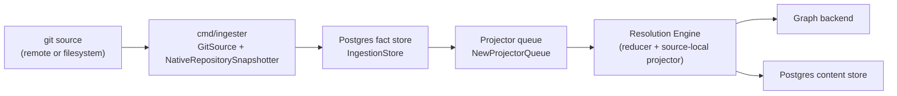
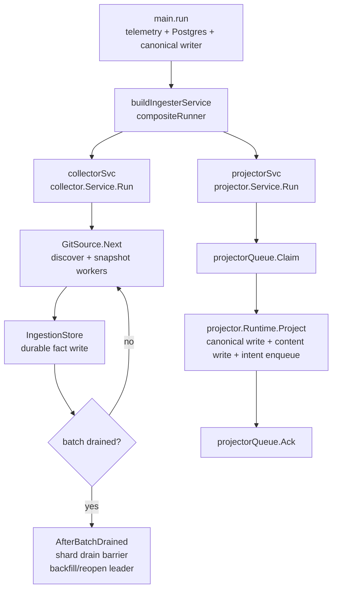

# cmd/ingester

## Purpose

`cmd/ingester` is the long-running binary (`eshu-ingester`) that owns
repository sync, parsing, fact emission, and source-local projection into the
configured graph backend. It runs as a `StatefulSet` in Kubernetes and is the
only runtime that mounts the shared workspace PVC. Cross-domain materialization
belongs to the reducer; HTTP reads belong to the API and MCP server; schema DDL
belongs to `eshu-bootstrap-data-plane`.

## Where this fits in the pipeline

## Internal flow

## Lifecycle / workflow

`main.run` bootstraps OTEL telemetry via `telemetry.NewBootstrap("ingester")`
and `telemetry.NewProviders`, opens Postgres through `runtimecfg.OpenPostgres`,
and builds the canonical graph writer (`sourcecypher.NewCanonicalNodeWriter`
backed by the adapter selected via `ESHU_GRAPH_BACKEND`). It then calls
`buildIngesterService`, which assembles a `compositeRunner` through
`newCompositeRunner` so `collector.Service` and `projector.Service` run
concurrently. Transient per-unit faults are owned by each service's own Run loop
(durable dead-letter replay) and do not tear down the peer. Only a *fatal* error
from either service cancels the other; the composite runner then waits a bounded
drain grace for the sibling to finish its in-flight unit and joins every
terminal error (see
`docs/internal/design/3501-ingester-composite-runner-failure-isolation.md`).

`signal.NotifyContext` on `SIGINT` and `SIGTERM` propagates cancellation through
`compositeRunner.Run`. `app.NewHostedWithStatusServer` mounts `/healthz`,
`/readyz`, `/metrics`, `/admin/status`, and `/admin/recovery` alongside the
composite runner.

When `ESHU_WEBHOOK_TRIGGER_HANDOFF_ENABLED` is true, the ingester wraps the
normal repository selector with a webhook-trigger selector. Accepted queued
GitHub, GitLab, and Bitbucket triggers are claimed first, synced as targeted
repositories, then handed to the same snapshot and fact-emission path as
scheduled polling. Unsupported provider triggers are marked failed instead of
being routed through a guessed clone path.

Set `ESHU_REPO_SCHEDULED_SYNC_ENABLED=false` when the ingester should only
process queued webhook refresh triggers and must not fall back to broad
scheduled repository selection. This mode requires
`ESHU_WEBHOOK_TRIGGER_HANDOFF_ENABLED=true`; startup fails if scheduled sync is
disabled without a trigger handoff path.

Git-backed repository selection uses the same runtime logger as the rest of the
ingester. During first startup or webhook-triggered sync, clone/fetch emits
structured `git repository sync started`, `git repository sync progress`,
`git repository sync completed`, and `git repository sync failed` records before
snapshot workers start. The fields are bounded for hosted operators: operation,
provider kind, repository id, repository ordinal/count, elapsed seconds, branch
when known, and failure class. Credential-bearing URLs are redacted and full
local checkout paths are not logged.

Hosted fetch refreshes parse `git ls-remote --symref` HEAD output as a
two-field symbolic ref, so `ref: refs/heads/main` resolves to `main` instead of
the invalid `ref:` branch. When a managed shallow checkout reports an old
`.git/shallow.lock` created by an interrupted fetch, the ingester removes only
that stale lock under the managed repo and retries the fetch once.

No-Regression Evidence: `go test ./internal/collector -run
'TestUpdateRepositoryParsesSymrefHeadBranchFromLsRemote|TestUpdateRepositoryRecoversOldShallowLockAndRetriesFetch'
-count=1` covers hosted HEAD parsing and stale shallow-lock recovery without
changing clone/fetch progress logging semantics.

Observability Evidence: existing `git repository sync failed` and `git
repository sync completed` logs still surface operation, repository ordinal,
branch, elapsed time, and failure class; the retry path keeps the original fetch
progress writer so a repeated failure remains visible.

After each full collector batch drain, `AfterBatchDrained` records the shard's
arrival in `deferred_maintenance_barriers` /
`deferred_maintenance_barrier_arrivals`. Multi-shard ingesters wait until every
`ESHU_REPO_SHARD_INDEX` for the current epoch has arrived; the completing shard
becomes the maintenance leader. The leader transaction takes an exclusive
Postgres advisory lock before running `BackfillAllRelationshipEvidence` and
`ReopenDeploymentMappingWorkItems`; normal source fact commits take the matching
shared transaction-level lock. This preserves the Phase 1 → Phase 3 bootstrap
ordering described in `CLAUDE.md`, waits for all shards to drain their source
batch, and blocks next-cycle commits until relationship evidence is backfilled
and `deployment_mapping` work is reopened. A failure exits the ingester to
prevent partial maintenance state.
For `ESHU_REPO_SHARD_COUNT > 1`, empty selected batches also participate in the
barrier so shards that own no repositories in a cycle cannot block the fleet.
Changing shard count while an epoch is open fails closed; operators should let
the current epoch complete before scaling charted ingester replicas.

No-Regression Evidence: `go test ./internal/storage/postgres -run
'TestIngestionStore(CommitScopeGenerationTakesSharedMaintenanceBarrier|RunDeferredRelationshipMaintenanceTakesExclusiveBarrier|ShardDrainBarrier)'
-count=1` covers the shared commit barrier, exclusive deferred-maintenance
barrier, and multi-shard drain rendezvous. `go test ./cmd/ingester -run
'TestBuildIngesterCollectorService(DefersRelationshipBackfillToBatchDrain|RunsDrainHookForEmptyShardedBatches)|TestBuildIngesterServiceProducesCompositeRunner'
-count=1` covers the batch-drain hook wiring and empty-shard participation.

No-Regression Evidence: #3073 keeps the barrier transaction order but closes the
latest-epoch `Rows` before inserting a new barrier epoch, preventing a Postgres
driver from executing the insert while the transaction still has an active
cursor. `go test ./internal/storage/postgres -run
'Test(IngestionStoreShardDrainBarrier|EnsureDeferredMaintenanceBarrierEpoch|BootstrapDefinitionsIncludeDeferredMaintenanceBarrier)'
-count=1` failed before the cursor was closed and passes after the fix.

No-Observability-Change: #3073 adds no metric, label, span, log field, worker,
queue, lease, runtime knob, or graph write. Operators still diagnose this path
through existing barrier wait/completion logs, `deferred_relationship_maintenance_failure`
errors, and Postgres query instrumentation.

Observability Evidence: source commits log a
`deferred_maintenance_shared_barrier` commit stage, and the existing Postgres
instrumentation emits query duration for the advisory-lock statements. Deferred
maintenance barrier wait/completion logs report epoch, shard count, arrived
shard count, and leader shard index. Failures continue to exit the ingester with
a structured `deferred_relationship_maintenance_failure` failure class.

The collector service also wires the shared collector generation dead-letter
store. Commit failures before projector work exists are surfaced through
`/admin/status` and can be marked for source-level replay through
`/admin/replay-collector-generations` after the commit failure is fixed.

The projector service runs in the same process and drains the projector queue
filled by the collector. Worker count defaults to `min(NumCPU, 8)`; on
`local_authoritative` + NornicDB it defaults to the developer or host CPU count
so the local authoritative path matches the production-proven concurrency
profile. The NornicDB phase-group executor keeps canonical retractions outside
matching upsert groups so slow cleanup and normal entity writes are timed and
reported as separate phases. Directory and file writes remain separate bounded
phases, while entity containment is folded into row-scoped entity upserts by
default for NornicDB after high-cardinality Java proof runs showed the older
file-scoped shape over-fragmented canonical writes.

Positive list-seeded canonical retract statements are split into 25-key chunks
inside the NornicDB phase-group executor before execution. Negative `NOT IN`
cleanup statements stay intact because splitting a keep-list would make each
chunk delete valid current files from other chunks.

No-Regression Evidence: `go test ./cmd/ingester -run
'TestNornicDBPhaseGroupExecutor.*RetractFilePaths' -count=1` proves positive
retract file-path chunks split while negative keep-list cleanup remains one
statement.

Observability Evidence: phase-group retract errors now include the original
statement ordinal and chunk part (`part x/y`) while preserving the sanitized
statement summary used in queue failure details.

## Exported surface

`cmd/ingester` is a `main` package. There is no exported Go API. The contract
is the process interface: environment variables, signal handling, direct
`eshu-ingester --version` / `eshu-ingester -v` probes, and the admin HTTP surface
listed above. Version probes run through `buildinfo.PrintVersionFlag` before
telemetry, Postgres, or graph setup begins.

## Environment variables

| Variable | Default | Purpose |
| --- | --- | --- |
| ESHU_POSTGRES_DSN | required | Postgres connection string |
| ESHU_GRAPH_BACKEND | nornicdb | neo4j or nornicdb |
| NEO4J_URI | required | Bolt URI |
| NEO4J_USERNAME | required | Bolt auth username |
| NEO4J_PASSWORD | required | Bolt auth password |
| ESHU_SNAPSHOT_WORKERS | min(NumCPU,8) | Concurrent snapshot goroutines |
| ESHU_PARSE_WORKERS | min(NumCPU,8) | Concurrent file-parse workers per snapshot |
| ESHU_LARGE_REPO_FILE_THRESHOLD | 1000 | File-count threshold for large-repo semaphore |
| ESHU_LARGE_REPO_MAX_CONCURRENT | 2 | Max concurrent large-repo snapshots |
| ESHU_PROJECTOR_WORKERS | min(NumCPU,8); local_authoritative NornicDB: NumCPU | Projector worker count |
| ESHU_REDUCER_ADMISSION_HIGH_WATER_MARK | 10000; set 0 to disable | Reducer queue depth threshold where ingester source-local projection defers new reducer intent enqueues |
| ESHU_REDUCER_ADMISSION_RETRYING_HIGH_WATER_MARK | 500; set 0 to disable | Graph-write backpressure: defers reducer intent enqueues once the count of reducer rows retrying with `failure_class=graph_write_timeout` reaches this value. Scoped to the graph-write-timeout class so readiness-not-ready retry backlogs (`secrets_iam_endpoint_not_ready` and other `*_n` classes) never false-throttle admission |
| ESHU_REDUCER_ADMISSION_RETRYING_LOW_WATER_MARK | 100 | Hysteresis floor; admission resumes only after the graph-write-timeout retrying depth falls below this value. Must be less than the retrying high-water mark |
| ESHU_REDUCER_ADMISSION_POLL_INTERVAL | 1s | Reducer queue depth recheck interval while admission is deferring |
| ESHU_LARGE_GEN_THRESHOLD | 10000 | Fact-count threshold for large-generation semaphore |
| ESHU_LARGE_GEN_MAX_CONCURRENT | 2 | Max concurrent large-generation projections |
| ESHU_CANONICAL_WRITE_TIMEOUT | 30s | Graph write timeout |
| ESHU_NEO4J_PROFILE_GROUP_STATEMENTS | false | Opt-in Neo4j grouped-write statement attempt logs for performance diagnostics |
| ESHU_NORNICDB_CANONICAL_GROUPED_WRITES | false | Conformance toggle; on NornicDB it commits per dependency phase — whole-materialization atomic is unsupported (#4027) |
| ESHU_NORNICDB_BATCHED_ENTITY_CONTAINMENT | true | Fold entity containment into row-scoped entity upserts; set false only for fallback comparisons |
| ESHU_NORNICDB_PHASE_GROUP_STATEMENTS | 500 | NornicDB phase group statement cap |
| ESHU_NORNICDB_ENTITY_BATCH_SIZE | 100 | Entity upsert row cap |
| ESHU_NORNICDB_ENTITY_PHASE_CONCURRENCY | NumCPU clamped to 16 | Parallel chunk dispatch for canonical entity phases. Clamped to 16. Set to 1 to keep serial dispatch. |
| ESHU_QUERY_PROFILE | — | local_lightweight or local_authoritative |
| ESHU_DISABLE_NEO4J | — | Force local-lightweight writer when true |
| SCIP_INDEXER | true | Enable external SCIP indexers when the selected language binary is available; set false/0/no/off for native-only parsing |
| SCIP_LANGUAGES | python,typescript,javascript,go,rust,java,cpp,c | Languages eligible for SCIP indexing |
| SCIP_WORKERS | 4 | Bounded concurrent SCIP language/subtree indexer processes across concurrent repository snapshots |
| ESHU_PROJECTOR_RETRY_ONCE_SCOPE_GENERATION | — | Fault-injection: scope generation ID for one-shot retry |
| ESHU_WEBHOOK_TRIGGER_HANDOFF_ENABLED | false | Check queued webhook refresh triggers before scheduled repository polling |
| ESHU_WEBHOOK_TRIGGER_HANDOFF_OWNER | ingester | Lease owner written when claiming queued webhook triggers |
| ESHU_WEBHOOK_TRIGGER_CLAIM_LIMIT | 100 | Max webhook triggers claimed per selector pass |
| ESHU_REPO_SCHEDULED_SYNC_ENABLED | true | Enable broad scheduled repository selection when no webhook triggers are queued |
| ESHU_REPO_SHARD_COUNT | 1 | Deterministic repository shard count. Helm sets this from `ingester.replicas` when replicas are greater than one. |
| ESHU_REPO_SHARD_INDEX | 0 | Deterministic zero-based repository shard index. Helm sets this from the StatefulSet pod ordinal when replicas are greater than one. |
| ESHU_PPROF_ADDR | unset (disabled) | Opt-in `net/http/pprof` endpoint via `runtime.NewPprofServer`; port-only inputs bind to `127.0.0.1` |

Per-label NornicDB tuning knobs (ESHU_NORNICDB_ENTITY_LABEL_BATCH_SIZES,
ESHU_NORNICDB_ENTITY_LABEL_PHASE_GROUP_STATEMENTS, and the file/function/struct
batch overrides) are documented in `docs/public/reference/nornicdb-tuning.md`.

## Dependencies

- `internal/collector` — `collector.Service`, `GitSource`,
  `NativeRepositorySelector`, `NativeRepositorySnapshotter`
- `internal/projector` — `projector.Service`, `projector.Runtime`,
  `projector.CanonicalWriter`, `projector.RetryInjector`
- `internal/storage/postgres` — `IngestionStore`, `NewProjectorQueue`,
  `NewReducerQueue`, `NewFactStore`, `NewContentWriter`, queue observers
- `internal/storage/cypher` — `sourcecypher.NewCanonicalNodeWriter`
- `internal/runtime` — `OpenPostgres`, `LoadGraphBackend`, `OpenNeo4jDriver`,
  `ConfigureMemoryLimit`, `LoadRetryPolicyConfig`
- `internal/app` — `app.NewHostedWithStatusServer`, `app.Runner`
- `internal/telemetry` — bootstrap, providers, instruments
- `internal/recovery` — `recovery.NewHandler` for the `/admin/recovery` route

## Telemetry

The ingester inherits collector and projector telemetry. Key signals:

- `eshu_dp_repo_snapshot_duration_seconds` — per-repo snapshot time; elevated
  values point to large or slow-to-parse repositories
- `eshu_dp_repos_snapshotted_total{status="failed"}` — snapshot errors
- `eshu_dp_facts_emitted_total` vs `eshu_dp_facts_committed_total` — a growing
  gap signals `IngestionStore` write pressure
- `eshu_dp_large_repo_semaphore_wait_seconds` — contention for the large-repo
  semaphore; raise ESHU_LARGE_REPO_MAX_CONCURRENT cautiously with memory in view
- `eshu_dp_projections_completed_total{status="failed"}` — projector failures;
  check `failure_class` in structured logs
- `eshu_dp_projector_stage_duration_seconds{stage="canonical_write"}` — graph
  write bottleneck
- Compose metrics endpoint: `http://localhost:19465/metrics`
- `git repository sync *` structured logs — clone/fetch lifecycle and progress
  during hosted repository sync before snapshot and parse stages begin

## Operational notes

- The ingester is the only runtime that should hold the workspace PVC in
  Kubernetes. Do not attach the volume to other workloads.
- Env-driven repository sharding filters repository selection before clone or
  snapshot work by `ESHU_REPO_SHARD_COUNT` and `ESHU_REPO_SHARD_INDEX`.
  Charted horizontal ingesters set shard count from `ingester.replicas` and
  shard index from the StatefulSet `apps.kubernetes.io/pod-index` label. Keep
  the default `volumeClaimTemplates` shape so each shard owns one workspace PVC;
  the chart rejects shared `existingClaim` storage and static shard env
  overrides for multi-replica ingesters.
- Version probes are pre-startup checks. Keep `buildinfo.PrintVersionFlag` at
  the top of `main` so container images can report their build without
  requiring database credentials.
- Align ESHU_SNAPSHOT_WORKERS and ESHU_PARSE_WORKERS with CPU requests to avoid
  CPU throttling under concurrent parsing load. The local-authoritative owner
  sets both to the developer machine's CPU count unless explicit env vars are
  already present.
- If the projector queue age (`eshu_dp_queue_oldest_age_seconds{queue="projector"}`)
  rises while `eshu_dp_repos_snapshotted_total` grows, the projector cannot drain
  as fast as the collector fills. Check projector worker count and graph write
  latency before raising snapshot workers.
- Reducer admission is enabled by default at a 10000-row high-water mark. Set
  ESHU_REDUCER_ADMISSION_HIGH_WATER_MARK=0 to disable it, or set a positive
  value to tune the threshold. The gate wraps only the ingester's source-local
  reducer intent writer, reads reducer queue depth before enqueue, and waits
  outside SQL transactions before rechecking. Bootstrap projection, recovery
  replay, admin reopen, and reducer follow-up lanes bypass this gate so
  freshness-critical repair paths continue.
- Graph-write backpressure (#3560) adds a second admission gate keyed on the
  count of reducer rows retrying with `failure_class=graph_write_timeout`, the
  backend-neutral signal that canonical graph writes are timing out (a bounded
  write that exceeds `ESHU_CANONICAL_WRITE_TIMEOUT` requeues into `retrying` with
  the self-classified `graph_write_timeout` failure class). The signal is scoped
  to that class so a reducer readiness backlog (`secrets_iam_endpoint_not_ready`
  and other `*_n` not-ready classes that also persist as `retrying`) can never be
  mistaken for graph-write pressure and false-throttle unrelated admission. It
  defers at
  ESHU_REDUCER_ADMISSION_RETRYING_HIGH_WATER_MARK (default 500) and resumes only
  below ESHU_REDUCER_ADMISSION_RETRYING_LOW_WATER_MARK (default 100); the gap is
  hysteresis that stops the producer from flapping. Set the high-water mark to 0
  to disable it. This slows the producer so recoverable work stays in the
  retrying bucket instead of exhausting its attempt budget and dead-lettering as
  `retry_exhausted` — it is bounded admission, not worker serialization. See
  `docs/public/reference/nornicdb-tuning.md` for the root-cause writeup.

No-Regression Evidence: the default changes admission from disabled to an
enabled 10000-row backlog threshold without changing reducer worker counts,
claim batch size, queue schema, graph writes, or transaction scope. Below the
threshold, each source-local reducer enqueue performs one bounded queue-depth
read through `QueueObserverStore` and then calls the same `ReducerQueue.Enqueue`
path. At or above the threshold, it waits outside SQL transactions and rechecks
before enqueueing. Verified by
`go test ./cmd/ingester -run 'TestLoadReducerAdmissionConfigDefaultsToEnabledHighWaterMark|TestReducerIntentWriterWithAdmissionUsesDefaultHighWaterMark|TestReducerAdmissionDefaultConfigDefersAtDefaultHighWaterAndResumesBelow' -count=1`
and `go test ./cmd/ingester -run 'TestReducerAdmission|TestLoadReducerAdmissionConfig|TestReducerIntentWriterWithAdmission' -count=1`.
Focused benchmark on Apple M4 Pro with one source-local reducer intent and
synthetic queue depth below the threshold:
`go test ./cmd/ingester -run '^$' -bench 'BenchmarkReducerAdmission(Disabled|BelowHighWater|DefaultBelowHighWater|OneDeferral)$' -benchtime=1000x -count=1`
reported disabled 3.417 ns/op, manually enabled below high-water 49.25 ns/op,
default-active below high-water 39.29 ns/op, and one no-op deferral 87.96
ns/op; all four paths reported 0 allocs/op.

No-Regression Evidence (graph-write backpressure, #3560): the gate is failure-class
scoped and adds a second admission condition without changing reducer worker
counts, claim batch size, queue schema, graph writes, or transaction scope. When
the gate is disabled (retrying high-water mark 0) or the graph-write-timeout depth
is below the marks, the loop performs one bounded depth read and calls the
unchanged `ReducerQueue.Enqueue`. Verified by `go test ./cmd/ingester
./internal/storage/cypher ./internal/storage/postgres -count=1 -race`: a readiness
backlog of 800 `*_not_ready` retrying rows with zero graph-write-timeout depth
does NOT throttle (`TestReducerAdmissionReadinessBacklogDoesNotThrottle`), while a
graph-write-timeout backlog above the high-water mark does
(`TestReducerAdmissionGraphWriteTimeoutBacklogThrottles`), holds through the
high/low hysteresis gap, resumes on recovery, records the `graph_write_timeout`
failure class on the deferral
(`TestReducerAdmissionGraphWritePressureRecordsFailureClass`), and loses no intents
under 16 concurrent producers
(`TestReducerAdmissionGraphWritePressureConcurrentEnqueueShareState`). The reducer
queue preserves `graph_write_timeout` on the retrying row
(`TestReducerQueueFailRetriesGraphWriteTimeoutWithinAttemptBudget`) while a
readiness miss keeps its own class
(`TestReducerQueueFailRetriesReadinessBacklogKeepsOwnFailureClass`), and the scoped
depth query excludes `reducer_retryable` and readiness classes
(`TestReducerGraphWriteTimeoutDepthFiltersFailureClass`). The existing benchmarks
still cover the disabled and below-high-water fast paths.

Observability Evidence (graph-write backpressure, #3560): producer deferrals reuse
the existing `eshu_dp_reducer_admission_deferrals_total` counter and now carry a
`reason` attribute value (`graph_write_pressure` when the scoped graph-write-timeout
depth tripped the gate, `high_water` when total outstanding depth tripped the
original gate) plus a `failure_class` attribute naming the class that drove a
graph-write-pressure deferral (`graph_write_timeout`). This lets an operator
confirm at 3 AM that graph writes are timing out rather than a readiness backlog
piling up. The deferral log was promoted from `Debug` to `Warn` and names
`reason`, `failure_class`, `queue_depth`, `high_water_mark`,
`retrying_high_water_mark`, `retrying_low_water_mark`, and `poll_interval`. The
graph-write-timeout retrying depth is exposed by
`QueueObserverStore.ReducerGraphWriteTimeoutDepth`; no counter or span name,
worker, queue domain, or runtime surface is removed.
- The `local_lightweight` profile (ESHU_QUERY_PROFILE=local_lightweight or
  ESHU_DISABLE_NEO4J=true) skips canonical graph writes entirely; useful for
  laptop code-search workflows where the graph backend is not running.
- The recovery route (`/admin/recovery`) mounts only when
  `NewRecoveryHandler` resolves the API key from the environment. A
  missing route means the key is absent, not that recovery is broken.

## Extension points

- Add a new graph backend by adding a `wiring_<backend>_*.go` file following
  the NornicDB pattern and handling the new ESHU_GRAPH_BACKEND value in
  `openIngesterCanonicalWriter`. The `compositeRunner` and projector wiring do
  not change.
- ESHU_PROJECTOR_RETRY_ONCE_SCOPE_GENERATION wires `NewRetryOnceInjector`
  for bounded fault-injection testing; do not use in production.

## Gotchas / invariants

- `compositeRunner` isolates transient faults and only cancels the peer on a
  *fatal* error, then drains the sibling within a bounded grace and joins every
  terminal error with `errors.Join` (see
  `docs/internal/design/3501-ingester-composite-runner-failure-isolation.md`). A
  projector shutdown logged alongside a collector shutdown does not mean both
  failed independently; inspect the joined error and the
  `composite_runner_fatal` / `composite_runner_drain_timeout` log fields to see
  which runner failed and whether the drain was forced.
- `IngestionStore.SkipRelationshipBackfill = true` suppresses per-commit
  backfill; `AfterBatchDrained` handles global relationship maintenance after
  each full drain instead (`wiring.go:195-222`).
- NornicDB grouped writes remain disabled by default. The toggle is
  conformance-only; on NornicDB both states commit per dependency phase, because
  whole-materialization atomic canonical writes silently drop files nested under a
  directory — an UNWIND-driven MATCH cannot see a same-transaction MERGE (#4027).
  Whole-materialization atomic applies only to a same-transaction read-your-writes
  backend (Neo4j).
- NornicDB entity containment is batched into entity upserts by default
  (`wiring_nornicdb_env.go:38-47`). Set
  ESHU_NORNICDB_BATCHED_ENTITY_CONTAINMENT=false only for measured fallback
  comparisons against the older file-scoped shape.
- NornicDB phase grouping keeps canonical retraction statements outside
  matching upsert groups. Grouping a REMOVE-style retract with same-label
  UNWIND upserts can produce a Cypher shape that NornicDB rejects during
  rollback validation.
- ESHU_PROJECTOR_WORKERS defaults to NumCPU when
  ESHU_QUERY_PROFILE=local_authoritative and ESHU_GRAPH_BACKEND=nornicdb. The
  local-authoritative owner also injects that value for normal `eshu graph
  start` runs (`wiring.go:287-292`).
- The NornicDB canonical entity phases dispatch grouped chunks across the
  worker pool sized by ESHU_NORNICDB_ENTITY_PHASE_CONCURRENCY. When the
  configured concurrency is greater than one the dispatch uses
  `executeEntityPhaseGroupStreaming` in
  `wiring_nornicdb_phase_group_streaming.go`: the pool stays open for one
  entity-phase call and pulls chunks from a long-lived channel as the
  producer buffers them, so the slowest chunk in one batch no longer stalls
  workers that have already finished their share. Within an entity label the
  chunks MERGE on disjoint entity_id keys so parallel commit is safe;
  retracts, singletons, and label transitions still synchronize the in-flight
  pool before sequencing dependent work. When concurrency is at most one the
  executor falls back to `executeEntityPhaseGroup` (the prior per-flush wave
  path) so callers without an opt-in see no behavior change.

## Related docs

- `docs/public/architecture.md` — ingester ownership and pipeline
- `docs/public/deployment/service-runtimes.md` — StatefulSet shape, metrics port, env vars
- `docs/public/reference/local-testing.md` — local verification gates
- `docs/public/reference/telemetry/index.md` — metric and span reference
- `docs/public/reference/nornicdb-tuning.md` — NornicDB knobs
- `go/internal/collector/README.md` — collector pipeline detail
- `go/internal/projector/README.md` — projector pipeline detail
