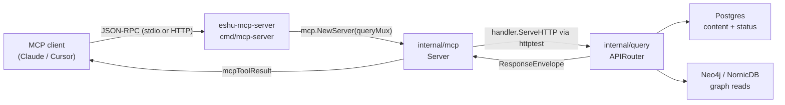
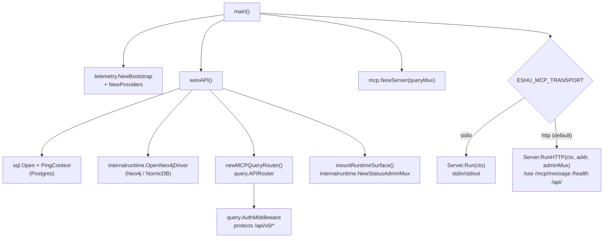

# cmd/mcp-server

`eshu-mcp-server` boots the Eshu MCP tool transport over stdio or HTTP. It wires
the same query layer used by `eshu-api` and dispatches MCP tool calls through
`internal/mcp`. In HTTP mode it composes the shared runtime admin surface
alongside the MCP-specific transport endpoints.

## Where this fits in the pipeline

## Internal flow

## Lifecycle

1. `main` calls `telemetry.NewBootstrap("mcp-server")` and initialises OTEL
   providers. On failure it logs with `telemetry.EventAttr` and exits 1.
2. `wireAPI` validates query profile, graph backend, API key, optional semantic
   provider profile metadata, optional semantic extraction policy, and the
   semantic-search embedder selector before datastore connections.
   It then opens Postgres via `sql.Open("pgx", pgDSN)`
   and calls `PingContext`. If `ESHU_QUERY_PROFILE` is not `ProfileLocalLightweight` and
   `ESHU_DISABLE_NEO4J` is not `true`, it also dials Neo4j via
   `internalruntime.OpenNeo4jDriver`.
3. `newMCPQueryRouter` wires the MCP-backed `query` handlers
   (`RepositoryHandler`, `EntityHandler`, `CodeHandler`, `ContentHandler`,
   `InfraHandler`, `IaCHandler`, `ImpactHandler`, `EvidenceHandler`,
   `PackageRegistryHandler`, `CICDHandler`, `SupplyChainHandler`,
   `IncidentHandler`, `WorkItemHandler`, `StatusHandler`,
   `ComponentExtensionsHandler`, `CompareHandler`) into a `query.APIRouter` and
   mounts it. Component-extension routes read the configured component registry
   only when `ESHU_COMPONENT_HOME` is set; otherwise they return an unavailable
   envelope.
4. The mounted handler is wrapped by `query.AuthMiddleware`.
5. `mountRuntimeSurface` creates a shared admin mux via
   `internalruntime.NewStatusAdminMux` exposing `/healthz`, `/readyz`,
   `/metrics`, and `/admin/status`. The admin mux and mounted `/api/v0/status/*`
   routes share the same status reader so semantic provider profile rows are
   redacted consistently.
6. `mcp.NewServer` is called with the authed query handler.
7. Transport selection reads `ESHU_MCP_TRANSPORT`:
   - `stdio` — `Server.Run` reads newline-delimited JSON-RPC from stdin;
     no HTTP listener starts.
   - `http` — `Server.RunHTTP` listens on `ESHU_MCP_ADDR` (default `:8080`).
8. Shutdown is driven by `signal.NotifyContext` on `SIGINT`/`SIGTERM`.
   Telemetry providers shut down on a fresh `context.Background()` so
   in-flight traces are not cut short.

## Exported surface

This package is a binary entry point; it exports no Go identifiers.
The direct process contract includes `eshu-mcp-server --version` and
`eshu-mcp-server -v`. Both flags print the build-time version through
`printMCPServerVersionFlag`, which wraps `buildinfo.PrintVersionFlag`, before
MCP transport, telemetry, or datastore setup begins.

The compile-time interface assertions confirm that `query.Neo4jReader`
satisfies `query.GraphQuery` and `query.ContentReader` satisfies
`query.ContentStore` (`wiring.go:22-23`).

## Configuration

| Variable | Default | Notes |
|---|---|---|
| `ESHU_MCP_TRANSPORT` | `http` | `http` or `stdio` |
| `ESHU_MCP_ADDR` | `:8080` | HTTP listen address |
| `ESHU_POSTGRES_DSN` | — | falls back to `ESHU_CONTENT_STORE_DSN` |
| `ESHU_GRAPH_BACKEND` | — | parsed by `query.ParseGraphBackend`; defaults to NornicDB |
| `ESHU_QUERY_PROFILE` | `production` | `loadQueryProfile` defaults to `query.ProfileProduction` |
| `ESHU_DISABLE_NEO4J` | — | `true` skips Neo4j dial |
| `ESHU_SEMANTIC_PROVIDER_PROFILES_JSON` | unset | Optional semantic provider profile registry. It carries profile metadata, `embedding_dimensions`, endpoint profile ids, and credential handles only. A governed `search_documents` profile can supply query embeddings when the local override is unset. |
| `ESHU_SEMANTIC_EXTRACTION_POLICY_JSON` | unset | Optional hosted semantic extraction and search-embedding allowlist by provider profile id, source class, source scope, source selector, limit, redaction mode, and retention posture. Without it, source policy remains disabled. |
| `ESHU_SEMANTIC_SEARCH_LOCAL_EMBEDDER` | unset | Optional deterministic no-network or auto-local semantic-search selector for `search_semantic_context`. `hash` and `local_hash` force ready persisted local vector rows; `auto_hash` selects one governed `search_documents` provider profile when configured and otherwise falls back to local hash query embeddings. Unset allows provider-only auto-selection. |
| `ESHU_SEMANTIC_SEARCH_PROVIDER_PROFILE_ID` | unset | Optional selector when more than one governed `search_documents` provider profile is configured. |
| `ESHU_GOVERNANCE_*` | unset | Optional safe metadata for `get_hosted_governance_status`, including governance mode, state, source kind, revision hash, auth mode, tenancy/workspace mode, egress, redaction, retention, audit, extension posture, aggregate counts, and reason codes. Do not put raw policy, tenant, workspace, source, credential, endpoint, prompt, response, path, or token values in these keys. |
| `ESHU_COMPONENT_HOME` | unset | Optional local component registry readback for `list_component_extensions` and `get_component_extension_diagnostics`; unset returns unavailable. |
| `ESHU_COMPONENT_TRUST_MODE`, `ESHU_COMPONENT_ALLOW_IDS`, `ESHU_COMPONENT_ALLOW_PUBLISHERS`, `ESHU_COMPONENT_REVOKE_IDS`, `ESHU_COMPONENT_REVOKE_PUBLISHERS`, `ESHU_COMPONENT_CORE_VERSION`, `ESHU_COMPONENT_PROVENANCE_CERTIFICATE_IDENTITY`, `ESHU_COMPONENT_PROVENANCE_OIDC_ISSUER`, `ESHU_COMPONENT_PROVENANCE_PREDICATE_TYPE`, `ESHU_COMPONENT_COSIGN_BINARY` | unset | Optional read-only policy diagnostics for component-extension MCP tools. Strict mode uses the provenance and Cosign settings to verify signed digest-pinned artifacts. |
| `DEFAULT_DATABASE` | `neo4j` | Neo4j database name |
| `ESHU_PPROF_ADDR` | unset (disabled) | Opt-in `net/http/pprof` endpoint via `runtime.NewPprofServer`; port-only inputs bind to `127.0.0.1` |

## Telemetry

`telemetry.NewBootstrap("mcp-server")` names the service. Lifecycle events use
`telemetry.EventAttr` with keys `runtime.startup.failed`,
`runtime.shutdown.failed`, `runtime.postgres.connected`, and
`runtime.neo4j.connected`. The admin mux emits the `eshu_runtime_info` gauge.
Per-request metrics and spans come from the `internal/query` handlers that
`internal/mcp` dispatches into — this binary does not emit its own metrics
or spans beyond the startup/connection events.

## Operational notes

- Validation errors (bad API key, bad profile, bad backend, malformed semantic
  provider profile JSON, or malformed semantic extraction policy JSON) are
  returned before any datastore connection. `wireAPI` calls the config
  validators before opening any connection (`wiring.go:32-52`).
- `stdio` mode does not start an HTTP listener. The admin surface (`/healthz`,
  `/readyz`, `/metrics`) is not available in stdio mode.
- The query API mounted under `/api/` is protected by `query.AuthMiddleware`,
  not by the MCP transport auth.
- `loadGraphBackend` with an empty `ESHU_GRAPH_BACKEND` defaults to
  `query.GraphBackendNornicDB`.

## Extension points

- Add a new query handler: add it to `newMCPQueryRouter` in `wiring.go`,
  assert it in `wiring_test.go`, and define the matching tool in
  `internal/mcp/dispatch.go`.
- Add a new transport mode: add a case to the `switch transport` in `main.go`
  and implement a corresponding `Server` method in `internal/mcp/server.go`.

## Gotchas / invariants

- `wireAPI` requires `ESHU_POSTGRES_DSN` or `ESHU_CONTENT_STORE_DSN` to be
  non-empty; it returns an error before the Neo4j dial if either is missing
  (`wiring.go:55-59`).
- Version probes are pre-startup checks. Keep `printMCPServerVersionFlag` at
  the top of `main` so MCP clients and containers can inspect the binary safely.
- `IaCHandler.Reachability` and `IaCHandler.Management` must be non-nil;
  `newMCPQueryRouter` always sets them to the Postgres-backed adapters
  (`wiring.go:146`).
- `CICDHandler.Correlations`, `SupplyChainHandler.SBOMAttachments`,
  `SupplyChainHandler.AdvisoryEvidence`, `SupplyChainHandler.ImpactFindings`,
  `SupplyChainHandler.ImpactExplanations`, and
  `SupplyChainHandler.SecurityAlerts` must be non-nil because MCP exposes read
  tools for those routes.
- `EvidenceHandler.AdmissionDecisions` must be non-nil because MCP exposes the
  `list_admission_decisions` readback tool.
- `IncidentHandler.Context` and `WorkItemHandler.Evidence` must be non-nil
  because MCP exposes incident context and ticket-first work-item evidence tools.

## Related docs

- `docs/public/deployment/service-runtimes.md` — MCP server runtime lane
- `docs/public/guides/mcp-guide.md` — client setup and usage
- `docs/public/run-locally/docker-compose.md` — Compose topology
- `go/internal/mcp/README.md` — tool dispatch and MCP protocol implementation
- `go/internal/query/` — HTTP handlers that back every MCP tool call
