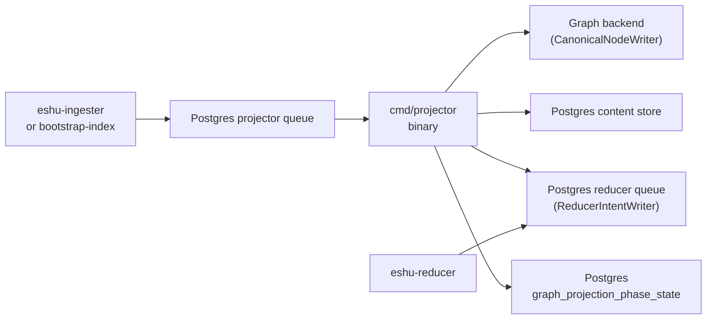
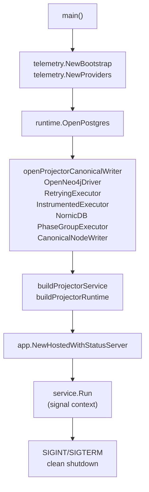

# Projector Binary

## Purpose

`cmd/projector` is the local verification runtime for source-local projection.
It claims projector queue items from Postgres, runs `projector.Runtime` to
write canonical graph nodes and content store rows, and enqueues reducer intents
for shared-domain follow-up. In the full deployed stack this work runs inside
`eshu-ingester`; this binary exists for focused local verification and Compose
debugging.

## Where this fits in the pipeline

## Internal flow

## Lifecycle / workflow

`main` bootstraps OTEL telemetry via `telemetry.NewBootstrap("projector")` and
`telemetry.NewProviders`, then calls `run`. Inside `run`, Postgres is opened
via `runtimecfg.OpenPostgres` and the canonical graph writer is opened via
`openProjectorCanonicalWriter` — this creates a Neo4j session executor wrapped
in `sourcecypher.RetryingExecutor` and `sourcecypher.InstrumentedExecutor`. For
NornicDB, the same path is also bounded by `sourcecypher.TimeoutExecutor` using
`ESHU_CANONICAL_WRITE_TIMEOUT` so the standalone projector matches the
retryable graph-write contract used by bootstrap and ingester. NornicDB writes
then route through the shared NornicDB phase-group executor: dependency
phases commit separately, entity chunks retain configured parallel fan-out,
and the canonical graph-write gate wraps each inner transaction. The adapter
does not expose the backend-neutral whole-group interface, preventing the unsupported whole-materialization
atomic route. The same timeout is sent as a server-side Bolt transaction limit
as well as a client deadline. NornicDB may finish a bounded phase after the
client deadline, so phase writes stay idempotent and overlapping same-identity
retries require the backend's exact-key transaction lock. The function returns a
`sourcecypher.CanonicalNodeWriter`. `buildProjectorService` wires a
`postgres.ProjectorQueue` as `WorkSource`, `WorkSink`, and `Heartbeater`, a
`postgres.FactStore` for fact loading, and `buildProjectorRuntime` for
projection execution. The assembled `projector.Service` is hosted through
`app.NewHostedWithStatusServer` which mounts `/healthz`, `/readyz`, `/metrics`,
and `/admin/status`. A signal-notified context (`SIGINT`/`SIGTERM`) triggers
clean shutdown with a per-ack timeout on in-flight work.

## Exported surface

This package defines `main` only; no exported types or functions. All projection
logic lives in `internal/projector`. Wiring lives in `runtime_wiring.go`.
The direct process contract includes `eshu-projector --version` and
`eshu-projector -v`, handled through `buildinfo.PrintVersionFlag` before runtime
setup begins.

See `doc.go` for the package comment.

## Dependencies

- `internal/projector` — `projector.Service`, `projector.Runtime`,
  `projector.CanonicalWriter`, `projector.ReducerIntentWriter`; the projection
  engine this binary drives
- `internal/app` — `app.NewHostedWithStatusServer`; hosts the service with the
  shared admin surface
- `internal/runtime` — `runtimecfg.OpenPostgres`, `runtimecfg.OpenNeo4jDriver`,
  `runtimecfg.LoadRetryPolicyConfig`; standard config and connection helpers
- `internal/storage/cypher` — `sourcecypher.RetryingExecutor`,
  `sourcecypher.InstrumentedExecutor`, `sourcecypher.TimeoutExecutor`,
  `sourcecypher.CanonicalNodeWriter`; backend-neutral graph write surface
- `internal/storage/nornicdb` — shared phase-group executor, production
  NornicDB defaults, bounded retract contract, and canonical writer shape
- `internal/storage/postgres` — `postgres.ProjectorQueue`, `postgres.FactStore`,
  `postgres.NewContentWriter`, `postgres.NewGraphProjectionPhaseStateStore`,
  `postgres.NewGraphProjectionPhaseRepairQueueStore`, `postgres.NewReducerQueue`;
  Postgres-backed implementations of every projector port
- `internal/content` — `content.LoadWriterConfig`; content writer batch-size
  config
- `internal/telemetry` — `telemetry.NewBootstrap`, `telemetry.NewProviders`,
  `telemetry.NewInstruments`; OTEL bootstrap
- `internal/status` — `statuspkg.WithRetryPolicies`, `statuspkg.DefaultRetryPolicies`;
  retry policy wiring for the admin status reader

## Telemetry

OTEL setup uses `telemetry.NewBootstrap("projector")` and `telemetry.NewProviders`.
The Prometheus exporter is always active; OTLP export activates when the
OTEL endpoint env var is set. The canonical writer is wrapped with
`sourcecypher.RetryingExecutor` so retryable NornicDB MERGE unique conflicts
are absorbed inside the graph-write layer, then with
`sourcecypher.InstrumentedExecutor` to emit `eshu_dp_neo4j_query_duration_seconds`
spans per Cypher statement. The shared admin surface exposes `/metrics` alongside
`eshu_runtime_*` gauges. Logger scope and component are both `projector`.

All projection-specific metrics and spans (e.g. `eshu_dp_projector_run_duration_seconds`,
`telemetry.SpanProjectorRun`) are emitted by `internal/projector`; see that
package's telemetry section.

## Operational notes

- Run with `go run ./cmd/projector` from `go/` for local verification. Set the
  Postgres DSN via the standard Postgres env contract and the Neo4j vars before
  starting.
- Version probes are pre-startup checks. Keep `buildinfo.PrintVersionFlag` at
  the top of `main` so `eshu-projector --version` does not open queues or graph
  drivers.
- `/admin/status` reports live stage, backlog, and failure state through the
  shared admin contract. Check this before restarting the binary.
- `ESHU_NEO4J_BATCH_SIZE` controls how many Cypher statements the canonical node
  writer groups per write round. The default (0) defers to the writer's built-in
  default. Raising this without watching `eshu_dp_canonical_write_duration_seconds`
  can hit Neo4j transaction size limits.
- `ESHU_CANONICAL_WRITE_TIMEOUT` bounds NornicDB canonical graph writes in the
  standalone projector on both the client and server transaction. Empty or
  invalid values use the built-in `30s` default.
  Retryable MERGE unique conflicts are handled before a queue failure is
  recorded; persistent failures still surface through projector queue metadata.
- `ESHU_NORNICDB_PHASE_GROUP_STATEMENTS`,
  `ESHU_NORNICDB_FILE_PHASE_GROUP_STATEMENTS`,
  `ESHU_NORNICDB_ENTITY_PHASE_GROUP_STATEMENTS`,
  `ESHU_NORNICDB_ENTITY_LABEL_PHASE_GROUP_STATEMENTS`, and
  `ESHU_NORNICDB_ENTITY_PHASE_CONCURRENCY` tune the same bounded phase-group
  adapter used by the ingester. Empty values use the measured defaults;
  malformed or non-positive values fail startup. Entity concurrency remains
  capped at 16.
- `ESHU_NORNICDB_FILE_BATCH_SIZE`, `ESHU_NORNICDB_ENTITY_BATCH_SIZE`, and
  `ESHU_NORNICDB_ENTITY_LABEL_BATCH_SIZES` tune canonical statement row caps.
  `ESHU_NORNICDB_BATCHED_ENTITY_CONTAINMENT` defaults to `true`, keeping
  containment in row-scoped entity upserts. Invalid values fail startup.
- `ESHU_NORNICDB_CANONICAL_GROUPED_WRITES=true` is accepted only for
  conformance diagnostics and logs a warning; NornicDB still commits by
  dependency phase because whole-materialization atomic writes are unsupported.
- `ESHU_CANONICAL_RETRACT_BATCH` bounds NornicDB full-refresh delete steps;
  empty values use 2000, values above 10000 clamp to 10000, and invalid values
  fail startup.
- The projector lease duration for queue claims is one minute
  (`postgres.NewProjectorQueue(database, "projector", time.Minute)`). The
  service heartbeats each claimed row before lease expiry so large source-local
  projections do not get re-claimed while the graph write is still running.
- `ESHU_PROJECTOR_WORKERS` controls standalone projector worker count. Empty or
  invalid values default to a CPU-derived cap of eight workers.
- Shutdown is signal-driven. In-flight acks use a 5-second timeout via
  `projectorAckContext` in `internal/projector/service.go`; claims in progress
  at shutdown are logged as `shutdown_canceled` and left for re-claim, not
  re-queued by this binary.

## Extension points

- `buildProjectorRuntime` in `runtime_wiring.go` is the single wiring point for
  substituting the canonical writer, content writer, intent writer, phase
  publisher, or repair queue. Add new implementations behind the relevant
  `internal/projector` interface rather than changing the `projector.Runtime`
  struct.
- Retry policy is loaded via `runtimecfg.LoadRetryPolicyConfig(getenv, "PROJECTOR")`
  and threaded through `postgres.ProjectorQueue`; change queue retry behavior
  there, not in the binary's main loop. `LoadRetryPolicyConfig` also supplies
  `MaxRetryDelay` (`ESHU_PROJECTOR_MAX_RETRY_DELAY`, default `1h`) and
  `JitterFraction` (`ESHU_PROJECTOR_RETRY_JITTER_FRACTION`, default `0.1`), set
  on `ProjectorQueue` in `buildProjectorService` alongside `RetryDelay`/
  `MaxAttempts`. `ProjectorQueue.Fail` schedules retries with exponential
  backoff plus jitter, not a fixed delay, so many work items failing at the
  same instant do not reconverge on one `visible_at` and self-reinforce into a
  retry storm (#4450); `eshu_dp_projector_retry_surge_total` tracks the
  scheduled-retry rate by `failure_class`.

## Gotchas / invariants

- Claims go to the `projector` queue; intents go to the `reducer` queue via a
  separate `postgres.NewReducerQueue` handle. The two queue handles have the
  same one-minute lease duration, set in `buildProjectorService`.
- `ESHU_PROJECTOR_RETRY_ONCE_SCOPE_GENERATION` is a fault-injection env var, not
  a production retry knob. Leaving it set causes one forced failure per matching
  scope-generation key and should not appear in any non-test deployment.
- The binary does not start the resolution engine or ingester. It only drains
  existing projector queue items and writes graph/content output. Empty queues
  produce no errors; the binary polls indefinitely.

No-Regression Evidence: `go test ./cmd/projector -run
'TestBuildProjectorService(HeartbeatsLongRunningClaims|UsesWorkerCountFromEnv|WiresRetryPolicyFromEnv)'
-count=1` covers standalone projector lease renewal, worker tuning, and
retry-policy wiring. `go test ./cmd/projector -run
'TestProjectorCanonicalExecutor' -count=1` proves NornicDB graph writes use the
retrying executor and canonical-write timeout wrapper while Neo4j keeps the
plain grouped executor path. Remote E2E Compose now starts this runtime after
bootstrap indexing so hosted collector `source_local/projector` rows have an
always-on claimer. Clean full-corpus run
`vulnerability-targets-20260524T050624Z` observed NornicDB package
unique-conflict retries from the standalone projector and still reached
queue-zero with no dead-letter rows.

Observability Evidence: the standalone projector now wires the same projector spans, metrics, structured logs, runtime memory gauge, `/metrics`, `/admin/status`, and optional pprof startup log used by hosted data-plane workers.

## Related docs

- `docs/public/deployment/service-runtimes.md` — local verification runtime lanes
- `docs/public/reference/local-testing.md` — verification gates and test commands
- `go/internal/projector/README.md` — projection logic, telemetry, and invariants
- `go/internal/storage/cypher/README.md` — canonical node writer and executor
  contract
