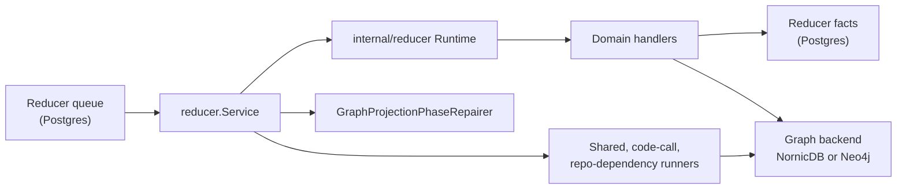

# cmd/reducer

## Purpose

`cmd/reducer` builds `eshu-reducer`, the deployed `resolution-engine`
runtime. It drains reducer intents from Postgres, executes
`internal/reducer` domain handlers, materializes reducer-owned truth, writes
shared graph edges through the configured graph backend, and hosts the shared
admin surface.

## Ownership boundary

This package owns process startup and wiring only. Domain behavior, truth
contracts, shared projection, repair, and reducer-owned fact publication live
in `internal/reducer`. Graph writes go through `internal/storage/cypher`
adapters; handlers must not branch on raw Neo4j or NornicDB driver types.

Runtime shape:



Startup order:

1. `--version` or `-v` prints build info and exits before telemetry, storage,
   graph, or HTTP setup.
2. `telemetry.NewBootstrap("reducer")` and `telemetry.NewProviders` create
   logger, tracer, meter, and Prometheus handler.
3. `runtimecfg.NewPprofServer` starts only when `ESHU_PPROF_ADDR` is set.
4. `runtimecfg.OpenPostgres` opens the Postgres store.
5. `telemetry.RegisterObservableGauges` registers queue-depth gauges.
6. `openReducerNeo4jAdapters` opens the configured graph backend. Invalid
   `ESHU_GRAPH_BACKEND` values fail startup.
7. `buildReducerService` wires stores, graph adapters, domain handlers, runners,
   queue policy, claim gates, and telemetry.
8. `app.NewHostedWithStatusServer` mounts `/healthz`, `/readyz`, `/metrics`,
   and `/admin/status`.
9. `service.Run(ctx)` runs until `SIGINT` or `SIGTERM`, then drains through the
   hosted runtime.

## Configuration

All env vars parsed in `config.go` and `neo4j_wiring.go`.

`buildReducerService` wires the drift adapters, AWS runtime drift writer,
container-image identity writer, CI/CD correlation writer, service-catalog
correlation writer, SBOM/attestation attachment writer, supply-chain impact
writer, shared projection runners, code-call runner, repo-dependency runner,
graph phase repairer, and reducer queue. Domain contracts live in
`internal/reducer`; this command only provides the process wiring.

Queue and retry:

| Variable | Default | Purpose |
| --- | --- | --- |
| `ESHU_REDUCER_RETRY_DELAY` | `30s` | Delay before a failed intent becomes re-claimable. |
| `ESHU_REDUCER_MAX_ATTEMPTS` | `3` | Terminal failure threshold. |
| `ESHU_REDUCER_WORKERS` | `NumCPU` on NornicDB, `min(NumCPU,4)` on Neo4j | Concurrent intent workers. |
| `ESHU_REDUCER_BATCH_CLAIM_SIZE` | worker count on NornicDB, `workers*4` capped at `64` on Neo4j | Intents claimed per batch. |
| `ESHU_REDUCER_CLAIM_DOMAIN` | unset | Legacy single-domain claim filter. |
| `ESHU_REDUCER_CLAIM_DOMAINS` | unset | Comma-separated claim allowlist for lane-specific reducer deployments. |

Set only one claim-domain variable. Startup fails when both are present.

Claim gates:

| Variable | Default | Purpose |
| --- | --- | --- |
| `ESHU_QUERY_PROFILE` | default query profile | With `ESHU_GRAPH_BACKEND=nornicdb`, `local_authoritative` enables the source-local projector drain gate. |
| `ESHU_REDUCER_EXPECTED_SOURCE_LOCAL_PROJECTORS` | `0` | Semantic-entity claims wait until this many source-local projectors have published. |
| `ESHU_REDUCER_SEMANTIC_ENTITY_CLAIM_LIMIT` | `1` on NornicDB, unlimited otherwise | Cap on concurrent semantic-entity claims. |

Shared projection:

| Variable | Default | Purpose |
| --- | --- | --- |
| `ESHU_SHARED_PROJECTION_PARTITION_COUNT` | `8` | Partitions per shared domain. |
| `ESHU_SHARED_PROJECTION_BATCH_LIMIT` | `100` | Intents per batch. |
| `ESHU_SHARED_PROJECTION_POLL_INTERVAL` | `500ms` | Base poll interval. |
| `ESHU_SHARED_PROJECTION_LEASE_TTL` | `60s` | Partition lease TTL. |
| `ESHU_SHARED_PROJECTION_WORKERS` | `min(NumCPU,4)` | Concurrent partition workers. |

Code-call projection:

| Variable | Default |
| --- | --- |
| `ESHU_CODE_CALL_PROJECTION_POLL_INTERVAL` | `500ms` |
| `ESHU_CODE_CALL_PROJECTION_LEASE_TTL` | `60s` |
| `ESHU_CODE_CALL_PROJECTION_BATCH_LIMIT` | `100` |
| `ESHU_CODE_CALL_PROJECTION_ACCEPTANCE_SCAN_LIMIT` | `250000` |
| `ESHU_CODE_CALL_PROJECTION_LEASE_OWNER` | `code-call-projection-runner` |

Repo-dependency projection:

| Variable | Default |
| --- | --- |
| `ESHU_REPO_DEPENDENCY_PROJECTION_POLL_INTERVAL` | `500ms` |
| `ESHU_REPO_DEPENDENCY_PROJECTION_LEASE_TTL` | `60s` |
| `ESHU_REPO_DEPENDENCY_PROJECTION_BATCH_LIMIT` | `100` |

Edge writers:

| Variable | Default | Purpose |
| --- | --- | --- |
| `ESHU_CODE_CALL_EDGE_BATCH_SIZE` | `1000` | Code-call edge rows per graph write. |
| `ESHU_CODE_CALL_EDGE_GROUP_BATCH_SIZE` | `1` | Code-call grouped-write batch. |
| `ESHU_INHERITANCE_EDGE_GROUP_BATCH_SIZE` | `1` | Inheritance grouped-write batch. |
| `ESHU_SQL_RELATIONSHIP_EDGE_GROUP_BATCH_SIZE` | `1` | SQL relationship grouped-write batch. |

Repair and drift:

| Variable | Default | Purpose |
| --- | --- | --- |
| `ESHU_GRAPH_PROJECTION_REPAIR_POLL_INTERVAL` | `1s` | Repair queue poll interval. |
| `ESHU_GRAPH_PROJECTION_REPAIR_BATCH_LIMIT` | `100` | Repair rows per cycle. |
| `ESHU_GRAPH_PROJECTION_REPAIR_RETRY_DELAY` | `1m` | Delay after failed repair publication. |
| `ESHU_DRIFT_PRIOR_CONFIG_DEPTH` | `10` effective default | Prior generations walked for Terraform config-vs-state `removed_from_config`; empty or `0` uses the loader default, invalid or negative input logs `failure_class=env_parse` and falls back to that default. |

NornicDB seam:

| Variable | Purpose |
| --- | --- |
| `ESHU_CANONICAL_WRITE_TIMEOUT` | Per-write timeout for NornicDB canonical writes, default `30s`. |
| `ESHU_NORNICDB_CANONICAL_GROUPED_WRITES` | Conformance-only grouped-write switch; do not promote to production default without evidence. |
| `ESHU_NORNICDB_SEMANTIC_ENTITY_LABEL_BATCH_SIZES` | Label-specific semantic entity batch sizes for NornicDB. |

Profiling:

| Variable | Purpose |
| --- | --- |
| `ESHU_PPROF_ADDR` | Opt-in `net/http/pprof`; port-only values such as `:6060` bind to `127.0.0.1`. |

## Exported surface

The command package exports no API. `buildReducerService` is unexported and
returns `reducer.Service` for tests and process wiring. `neo4j_wiring.go`
contains unexported executor adapters used inside this package only.

## Dependencies

- `internal/reducer` for `Service`, `DefaultHandlers`, domain handlers, shared
  projection, code-call projection, repo-dependency projection, and graph phase
  repair.
- `internal/storage/postgres` for reducer queues, facts, relationship stores,
  shared intents, readiness state, repair queues, status, and graph-drain
  checks.
- `internal/storage/cypher` for instrumented graph execution and edge writes.
- `internal/runtime` for Postgres, graph backend selection, retry policy, and
  pprof setup.
- `internal/query` for graph query ports and query-profile parsing.
- `internal/app` for the hosted admin/status server.
- `internal/telemetry` for bootstrap, providers, instruments, spans, metrics,
  and structured log attributes.

## Telemetry

Reducer diagnostics use:

- logger scope `reducer`, component `reducer`
- tracer `telemetry.DefaultSignalName`
- `SpanReducerRun` around domain execution
- `SpanReducerDriftEvidenceLoad` and
  `SpanReducerAWSRuntimeDriftEvidenceLoad` for drift loaders
- `postgres.InstrumentedDB{StoreName: "reducer"}` for Postgres timing
- `sourcecypher.InstrumentedExecutor` for graph timing
- queue-depth gauges through `postgres.NewQueueObserverStore`
- reducer run, queue wait, shared projection, repair, and domain-specific
  counters from `telemetry.Instruments`
- `/healthz`, `/readyz`, `/metrics`, and `/admin/status`

When the reducer is slow, classify the stage first: fact load, relationship
extraction, intent upsert, graph write, phase publication, shared projection,
repair, Postgres pressure, or backend pressure.

## Gotchas / invariants

- Invalid `ESHU_GRAPH_BACKEND` values fail startup.
- NornicDB reducer workers default to host CPU count; lower worker counts only
  with queue, conflict-key, and graph-write evidence. Serialization is not a
  fix for a non-idempotent write path.
- NornicDB batch claim size defaults to worker count so claimed work starts
  heartbeat-protected execution promptly.
- Worker heartbeats run at `LeaseDuration / 2`; a retry delay shorter than the
  lease TTL can churn claims.
- The NornicDB `local_authoritative` profile delays semantic-entity claims
  until source-local projectors have drained.
- In that same profile, `CodeCallProjectionRunner` uses `NewReducerGraphDrain`
  so code-call edge projection waits for reducer-owned graph domains to drain.
  Keep this as scheduling, not a graph-truth shortcut.
- Graph writes and `graph_projection_phase_state` publication are not atomic.
  Keep `GraphProjectionPhaseRepairer` wired so committed graph writes can
  retry exact readiness publication.
- `ESHU_NORNICDB_CANONICAL_GROUPED_WRITES=true` is for conformance validation
  only.
- Handler code must not add backend-specific branches outside documented
  storage/cypher or command wiring seams.

## Verification

```bash
cd go
go test ./cmd/reducer ./internal/reducer -count=1
go run ./cmd/eshu docs verify ../go/cmd/reducer --limit 1200 \
  --fail-on contradicted,missing_evidence
```

Run broader storage, telemetry, query, MCP, or runtime gates when a reducer
change alters persisted facts, graph writes, API read models, tool routing,
metrics, or deployment behavior.

## Related docs

- [Service Runtimes](../../../docs/public/deployment/service-runtimes.md)
- [NornicDB Tuning](../../../docs/public/reference/nornicdb-tuning.md)
- [Collector And Reducer Readiness](../../../docs/public/reference/collector-reducer-readiness.md)
- [Telemetry Overview](../../../docs/public/reference/telemetry/index.md)
- [Local Testing](../../../docs/public/reference/local-testing.md)
- [internal/reducer](../../internal/reducer/README.md)
