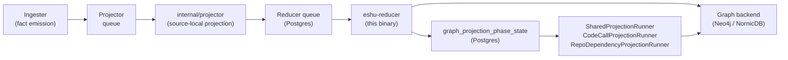
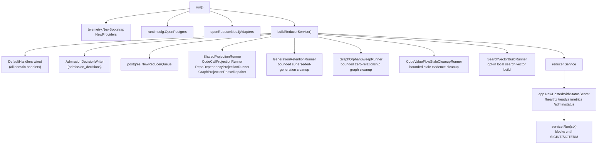

# cmd/reducer

`cmd/reducer` builds the `eshu-reducer` binary — the long-running
`resolution-engine` runtime that drains the reducer fact-work queue,
executes domain handlers, materializes cross-domain truth, and writes
shared edges into the configured graph backend. The deployed service
identity is `resolution-engine`.

## Where this fits in the pipeline

## Internal flow

## Startup sequence

1. `telemetry.NewBootstrap("reducer")` + `telemetry.NewProviders` — OTEL
   logger, tracer, meter, Prometheus handler.
2. `runtimecfg.OpenPostgres` — Postgres connection from ESHU_POSTGRES_DSN.
3. `postgres.NewQueueObserverStore` + `telemetry.RegisterObservableGauges`
   — queue-depth observable gauges.
4. `openReducerNeo4jAdapters` — opens graph-backend driver; backend is
   chosen by ESHU_GRAPH_BACKEND (default `nornicdb`). Invalid values fail
   at startup.
5. `buildReducerService` — loads all config, wires `DefaultHandlers`
   (including the Terraform config-vs-state drift adapters
   `TerraformBackendResolver`, `DriftEvidenceLoader`, and `DriftLogger`
   activated for chunk #163; the evidence loader carries the runtime
   `Tracer`, `Logger`, and `Instruments` so its four-query join opens
   `SpanReducerDriftEvidenceLoad`, surfaces decode-failure WARN logs,
   and increments
   `eshu_dp_drift_unresolved_module_calls_total` per unresolvable
   `module {}` source per the issue #169 module-aware join; the AWS runtime
   drift adapters `PostgresAWSCloudRuntimeDriftEvidenceLoader` and
   `PostgresAWSCloudRuntimeDriftWriter` are wired for issue #39 so
   `aws_resource` reducer intents can publish durable orphan/unmanaged
   findings after the bounded ARN join; the SBOM/attestation attachment
   writer publishes digest-subject attachment facts; the service-catalog
   correlation writer publishes repository-evidence-gated catalog correlation
   facts; the supply-chain impact writer publishes reducer-owned
   vulnerability impact facts without graph writes; the security-alert
   reconciliation writer publishes provider-alert comparison facts without
   promoting provider alert state into impact truth; and the PagerDuty
   incident-routing evidence loader plus graph writer materialize exact
   `IncidentRoutingEvidence` rows only; the RDS posture node writer stamps
   reducer-owned posture fields onto existing RDS CloudResource nodes; the EC2
   internet-exposure writer derives conservative exposed / not_exposed / unknown
   properties from EC2 posture, ENI, and security-group evidence onto existing
   EC2 `CloudResource` nodes only; the service-scoped incident evidence loader
   resolves PagerDuty provider service ids to catalog service ids through active
   exact/derived reducer correlations for the incidents service-evidence family;
   and the S3 internet-exposure writer derives
   bounded exposed / not_exposed / unknown properties from `s3_bucket_posture`
   onto existing S3 `CloudResource` nodes only; the value-flow fixpoint projector
   writes post-persist function-summary/source/graph-id findings and graph-backed
   cloud sink targets as a distinct `TAINT_FLOWS_TO` evidence source while
   reusing durable value-flow component results across reducer restarts),
   `SharedProjectionRunner`, `CodeCallProjectionRunner`,
   `RepoDependencyProjectionRunner`, `GraphProjectionPhaseRepairer`, the
   generation retention cleanup runner, the graph orphan cleanup runner, the
   value-flow stale evidence cleanup runner, the shared admission-decision
   writer for mapped reducer admission outcomes, the opt-in local
   search-vector build runner, and the
   `postgres.NewReducerQueue`.
6. `app.NewHostedWithStatusServer` — mounts the shared admin surface.
7. `signal.NotifyContext` for `os.Interrupt` / `syscall.SIGTERM`.
8. `service.Run(ctx)` — blocks until the context is canceled; hosted
   runtime drains in-flight work before returning.

## Default handler wiring evidence

No-Regression Evidence: #2983 splits `reducer.DefaultHandlers` into embedded
adapter groups and moves those group definitions into
`internal/reducer/defaults_handlers.go`; it does not add a reducer domain,
queue claim path, graph writer, worker, lease, runtime flag, batch setting, or
Cypher statement. Baseline and after shape are the same production wiring from
`buildReducerService`: one `DefaultHandlers` value is passed to
`reducer.NewDefaultRuntime`, and the promoted embedded fields still feed the
same registry checks and handler constructors. Backend/version: local Go tests
with no live graph or Postgres backend because the changed path is struct
wiring only. Input shape: the production reducer default handler literal plus
the existing focused default-wiring tests for Kubernetes, incident routing,
secrets/IAM, code evidence, and function-summary materialization. Terminal
queue or row counts: unchanged and not exercised, because the refactor creates
no queue rows and changes no store or graph write path. Verification:
`go test ./internal/reducer ./cmd/reducer -count=1`.

No-Observability-Change: #2983 adds no metric instrument, metric label, span
name, structured log field, status field, route, runtime knob, worker, lease,
queue domain, graph write route, or Cypher. Operators continue to diagnose
reducer startup and execution through the existing hosted runtime
`/healthz`, `/readyz`, `/metrics`, `/admin/status`, reducer execution
spans/counters, graph/Postgres instrumentation, and the existing handler-specific
completion logs listed in `internal/reducer`.

## Configuration reference

All env vars parsed in `config.go` and `neo4j_wiring.go`.

### Queue and retry

| Variable | Default | Purpose |
| --- | --- | --- |
| `ESHU_REDUCER_RETRY_DELAY` | `30s` | Delay before a failed intent becomes re-claimable |
| `ESHU_REDUCER_MAX_ATTEMPTS` | `5` | Terminal failure threshold |
| `ESHU_REDUCER_WORKERS` | `NumCPU` NornicDB / `min(NumCPU,4)` Neo4j | Concurrent intent workers |
| `ESHU_REDUCER_BATCH_CLAIM_SIZE` | `workers` NornicDB / `workers×4 (max 64)` Neo4j | Items per claim batch |
| `ESHU_REDUCER_CLAIM_DOMAIN` | `""` (all domains) | Restrict claims to one `Domain`; kept for older single-lane deployments |
| `ESHU_REDUCER_CLAIM_DOMAINS` | `""` (all domains) | Comma-separated `Domain` allowlist for a domain-specific reducer lane |

Set only one claim-domain variable. The reducer fails startup when both are
present so a global legacy value cannot silently override a Helm lane allowlist.

### Claim gating

| Variable | Purpose |
| --- | --- |
| `ESHU_QUERY_PROFILE` | With ESHU_GRAPH_BACKEND=nornicdb, `local-authoritative` enables the projector drain gate |
| `ESHU_REDUCER_EXPECTED_SOURCE_LOCAL_PROJECTORS` | Semantic-entity claims wait until this many source-local projectors have published |
| `ESHU_REDUCER_SEMANTIC_ENTITY_CLAIM_LIMIT` | Optional cap on cross-scope semantic-entity claims; unset keeps the cap disabled |

### Shared projection

Parsed by `LoadSharedProjectionConfig` in `internal/reducer`.

| Variable | Default | Purpose |
| --- | --- | --- |
| ESHU_SHARED_PROJECTION_PARTITION_COUNT | `8` | Partitions per domain |
| ESHU_SHARED_PROJECTION_BATCH_LIMIT | `100` | Intents per batch |
| ESHU_SHARED_PROJECTION_POLL_INTERVAL | `500ms` | Base poll interval |
| ESHU_SHARED_PROJECTION_LEASE_TTL | `60s` | Partition lease TTL |
| ESHU_SHARED_PROJECTION_WORKERS | `min(NumCPU,4)` | Concurrent partition workers |

### Symbol→runtime presence gate (#2809, #2855)

| Variable | Default | Purpose |
| --- | --- | --- |
| `ESHU_REDUCER_HANDLES_ROUTE_PRESENCE_GATE_ENABLED` | `true` | Gate the symbol→runtime edges on their target having committed, so they cannot drop on a cold first generation: `Function-[:HANDLES_ROUTE]->Endpoint` on the target `(repo_id, path)` `:Endpoint` (#2809), and `Function-[:RUNS_IN]->Workload` on the repo having a committed `:Workload` (#2855). Set to a false value (`false`, `0`) to restore pre-gate behavior for both. |

Both gates share one presence store and this one flag — they are the same
symbol→runtime concern, published by the workload materializer. The flag is wired
independently of `ESHU_REDUCER_SECRETS_IAM_GRAPH_PROJECTION_ENABLED`: disabling
secrets/IAM never disables these gates, and this kill switch never widens the
secrets/IAM uid presence writes onto the cloud/Kubernetes materializers. A
phase-ready row whose target never materializes (a route-only repo with no
endpoint, or a repo with no workload) is drained with no edge — reported as
`terminal_no_endpoint` with its `domain` in the shared projection cycle log —
never deferred, so the backlog cannot stall.

### Code-call projection

| Variable | Default |
| --- | --- |
| `ESHU_CODE_CALL_PROJECTION_POLL_INTERVAL` | `500ms` |
| `ESHU_CODE_CALL_PROJECTION_LEASE_TTL` | `60s` |
| `ESHU_CODE_CALL_PROJECTION_BATCH_LIMIT` | `100` |
| `ESHU_CODE_CALL_PROJECTION_ACCEPTANCE_SCAN_LIMIT` | `250000` |
| `ESHU_CODE_CALL_PROJECTION_LEASE_OWNER` | `code-call-projection-runner` |
| `ESHU_CODE_CALL_PROJECTION_PARTITION_COUNT` | `8` |
| `ESHU_CODE_CALL_PROJECTION_WORKERS` | `4` |

### Repo-dependency projection

| Variable | Default |
| --- | --- |
| `ESHU_REPO_DEPENDENCY_PROJECTION_POLL_INTERVAL` | `500ms` |
| `ESHU_REPO_DEPENDENCY_PROJECTION_LEASE_TTL` | `60s` |
| `ESHU_REPO_DEPENDENCY_PROJECTION_BATCH_LIMIT` | `100` |

### Edge writers

| Variable | Default | Purpose |
| --- | --- | --- |
| `ESHU_CODE_CALL_EDGE_BATCH_SIZE` | `1000` | Code-call edge rows per graph write |
| `ESHU_CODE_CALL_EDGE_GROUP_BATCH_SIZE` | `1` | Code-call grouped-write batch |
| `ESHU_INHERITANCE_EDGE_GROUP_BATCH_SIZE` | `1` | Inheritance grouped-write batch |
| `ESHU_SQL_RELATIONSHIP_EDGE_GROUP_BATCH_SIZE` | `1` | SQL relationship grouped-write batch |

### Repair runner

| Variable | Default |
| --- | --- |
| `ESHU_GRAPH_PROJECTION_REPAIR_POLL_INTERVAL` | `1s` |
| `ESHU_GRAPH_PROJECTION_REPAIR_BATCH_LIMIT` | `100` |
| `ESHU_GRAPH_PROJECTION_REPAIR_RETRY_DELAY` | `1m` |

### Generation retention

| Variable | Default | Purpose |
| --- | --- | --- |
| `ESHU_GENERATION_RETENTION_ENABLED` | `true` | Run the bounded superseded-generation cleanup loop beside reducer work. `false` requires an explicit local `ESHU_QUERY_PROFILE`; production/default binaries and Helm renders reject disabled retention. |
| `ESHU_GENERATION_RETENTION_POLL_INTERVAL` | `1h` | Delay between empty or failed cleanup cycles |
| `ESHU_GENERATION_RETENTION_MIN_SUPERSEDED_GENERATIONS` | `24` | Minimum superseded generations retained per scope after the active one |
| `ESHU_GENERATION_RETENTION_MAX_SUPERSEDED_AGE` | `168h` | Superseded generations newer than this remain retained |
| `ESHU_GENERATION_RETENTION_BATCH_GENERATION_LIMIT` | `100` | Maximum candidate generations selected per cleanup transaction |
| `ESHU_GENERATION_RETENTION_BATCH_ROW_LIMIT` | `100000` | Maximum estimated dependent rows, including content cleanup rows, pruned per cleanup transaction |
| `ESHU_GENERATION_RETENTION_POLICY_SCOPE` | `global` | Safe policy source recorded in retention events |
| `ESHU_GENERATION_RETENTION_POLICY_REVISION` | `global-default-v1` | Policy revision recorded with hashed scope/generation retention events |

### Graph orphan sweep

| Variable | Default | Purpose |
| --- | --- | --- |
| `ESHU_GRAPH_ORPHAN_SWEEP_ENABLED` | `true` | Run the bounded zero-relationship graph cleanup loop beside reducer work |
| `ESHU_GRAPH_ORPHAN_SWEEP_POLL_INTERVAL` | `1h` | Delay between empty or failed graph orphan sweep cycles |
| `ESHU_GRAPH_ORPHAN_SWEEP_LEASE_OWNER` | unique per process | Owner token for the single graph orphan sweep lease |
| `ESHU_GRAPH_ORPHAN_SWEEP_LEASE_TTL` | `5m` | TTL for the single graph orphan sweep lease |
| `ESHU_GRAPH_ORPHAN_SWEEP_TTL` | `168h` | Minimum time a zero-relationship node marker must age before deletion |
| `ESHU_GRAPH_ORPHAN_SWEEP_BATCH_LIMIT` | `100` | Maximum nodes marked or deleted per label in one sweep cycle |
| `ESHU_GRAPH_ORPHAN_SWEEP_COUNT_LIMIT` | `10000` | Maximum nodes counted per label for the observable orphan gauge |

### Value-flow stale cleanup

| Variable | Default | Purpose |
| --- | --- | --- |
| `ESHU_CODE_VALUE_FLOW_STALE_CLEANUP_ENABLED` | `true` | Run the bounded reducer-owned cleanup loop that removes stale `CodeTaintEvidence` nodes and `TAINT_FLOWS_TO` edges from generations older than each active repository scope |
| `ESHU_CODE_VALUE_FLOW_STALE_CLEANUP_POLL_INTERVAL` | `1h` | Delay between empty or failed value-flow cleanup cycles |
| `ESHU_CODE_VALUE_FLOW_STALE_CLEANUP_LEASE_OWNER` | unique per process | Owner token for the single value-flow stale cleanup lease |
| `ESHU_CODE_VALUE_FLOW_STALE_CLEANUP_LEASE_TTL` | `5m` | TTL for the single value-flow stale cleanup lease |
| `ESHU_CODE_VALUE_FLOW_STALE_CLEANUP_SCOPE_BATCH_LIMIT` | `100` | Active repository scopes scanned per cleanup cycle |
| `ESHU_CODE_VALUE_FLOW_STALE_CLEANUP_DELETE_BATCH_LIMIT` | `500` | Maximum stale evidence nodes or edges deleted per scope and evidence family in one Cypher statement |

### Semantic search vectors

| Variable | Default | Purpose |
| --- | --- | --- |
| `ESHU_SEMANTIC_PROVIDER_PROFILES_JSON` | unset | Optional governed provider profiles. A single eligible `search_documents` profile with `embedding_dimensions` can enable provider-backed vector builds when the local override is unset. |
| `ESHU_SEMANTIC_SEARCH_LOCAL_EMBEDDER` | unset | `hash` or `local_hash` force the reducer side runner to build deterministic no-network vector sidecar rows for active curated search documents; `auto_hash` does the same only when no governed `search_documents` provider profile is configured. |
| `ESHU_SEMANTIC_SEARCH_PROVIDER_PROFILE_ID` | unset | Required when more than one governed `search_documents` profile is eligible. |

`SearchVectorBuildRunner` scans active repository scopes whose
`reducer_eshu_search_document` facts do not have complete ready sidecar vector
rows, then calls the shared search-vector builder with the selected embedder.
It writes only Postgres metadata/value rows keyed by provider profile id, source
class, model id, content hash, vector index version, scope, generation, and
document id. It does not write graph truth or mark an external vector store
ready. API, MCP, and reducer must share the same selected provider profile or
local override before reads can claim vector participation.

Default wiring guard: `go test ./cmd/reducer -run
TestProductionWiringConsumesCapabilityDefaults -count=1` asserts that
production config consumes capability-owned defaults instead of duplicating
them silently. It currently covers graph orphan sweep labels from
`storage/cypher.DefaultOrphanSweepLabels()` and generation retention policy from
`postgres.DefaultGenerationRetentionPolicy()`. Intentional divergence must use
an explicit tested override case with a reason.

No-Regression Evidence: `go test ./cmd/reducer -run
'TestProductionWiringConsumesCapabilityDefaults|TestLoadGraphOrphanSweepConfigDefaults|TestGraphOrphanSweepRunnerForConfig'
-count=1` failed before the graph orphan sweep config hardcoded only
`Repository`, `Platform`, and `EvidenceArtifact`, then passed after the reducer
default consumed the storage/cypher closed label set, including `File`,
`Directory`, and `Module`.

Observability Evidence: the wiring change adds no metric, span, log key,
worker, lease, or graph query shape. It routes the already documented `File`,
`Directory`, and `Module` label values through the existing
`eshu_dp_graph_orphan_nodes{node_label=...}` observer and runner completion
logs, whose `node_label` value space is the bounded closed sweep label set.

No-Regression Evidence: `go test ./cmd/reducer -run
'TestHandlesRouteEndpointPresenceGateEnabledDefaultsOn|TestEndpointPresenceWiringNilWhenDisabled|TestNewEndpointPresenceWiringsGatesIndependently'
-count=1` failed before the handles_route (`repo_id`, `path`) presence wiring
(#2809) was split from the secrets/IAM uid presence wiring (#1380), then passed.
`newEndpointPresenceWirings` now gates each pair from its own flag, so the
secrets/IAM uid writer is never handed to the workload materialization handler
and the handles_route kill switch never widens uid writes onto the cloud
materializers; with secrets/IAM off and the default gate on, only the
handles_route pair is non-nil.

No-Observability-Change: the wiring split adds no metric, span, log key, worker,
lease, runtime knob, or graph query shape in `cmd/reducer`. The handles_route gate
the wiring feeds emits its operator-facing `terminal_no_endpoint` log key in
`internal/reducer` (documented in that package's `AGENTS.md`); this binary only
chooses which presence store each consumer receives.

### Terraform drift

| Variable | Default | Purpose |
| --- | --- | --- |
| `ESHU_DRIFT_PRIOR_CONFIG_DEPTH` | `10` | Number of prior repo-snapshot generations the drift loader walks to detect `removed_from_config`. `0` means use the default (10). Invalid or non-positive input falls back to `0` with a structured WARN log and the env key `failure_class=env_parse`. Parsed by `parsePriorConfigDepth` in `config.go:311` and stored in `PostgresDriftEvidenceLoader.PriorConfigDepth`. |

### NornicDB knobs (narrow seam)

| Variable | Purpose |
| --- | --- |
| `ESHU_CANONICAL_WRITE_TIMEOUT` | Per-write timeout for NornicDB canonical writes (default `30s`) |
| `ESHU_NORNICDB_CANONICAL_GROUPED_WRITES` | Enable NornicDB semantic grouped writes for conformance testing |
| `ESHU_NORNICDB_SEMANTIC_ENTITY_LABEL_BATCH_SIZES` | Override label batch sizes for NornicDB semantic entity writes |

### Profiling

| Variable | Purpose |
| --- | --- |
| `ESHU_PPROF_ADDR` | Opt-in `net/http/pprof` endpoint via `runtime.NewPprofServer`; unset disables; port-only inputs (`:6060`) bind to `127.0.0.1` |

## Exported surface

`buildReducerService` (unexported) returns a `reducer.Service` value. The
binary itself exports nothing; all domain logic is owned by
`internal/reducer`. Wiring-level adapters in `neo4j_wiring.go` expose
unexported executor adapters (`reducerNeo4jExecutor`,
`reducerCypherExecutor`) used only inside this package.

The direct process contract includes `eshu-reducer --version` and
`eshu-reducer -v`. Both flags print the build-time version through
`buildinfo.PrintVersionFlag` before telemetry, Postgres, or graph setup begins.

## Dependencies

- `internal/reducer` — `Service`, `DefaultHandlers`, all domain handler
  types, `SharedProjectionRunner`, `CodeCallProjectionRunner`,
  `RepoDependencyProjectionRunner`, `GraphProjectionPhaseRepairer`,
  `GraphOrphanSweepRunner`, `SearchVectorBuildRunner`
- `internal/storage/postgres` — `NewReducerQueue`, `InstrumentedDB`,
  `NewSharedIntentStore`, `NewGraphProjectionPhaseStateStore`,
  `NewGraphProjectionPhaseRepairQueueStore`, `NewGenerationRetentionStore`,
  `NewAdmissionDecisionStore`, `NewReducerGraphDrain`,
  `NewEshuSearchVectorPendingStore`, all fact/relationship stores
- `internal/storage/cypher` — `InstrumentedExecutor`, `NewEdgeWriter`,
  `NewOrphanSweepStore`
- `internal/runtime` — `OpenPostgres`, `LoadGraphBackend`, retry policy
- `internal/query` — `GraphQuery` port, `ParseQueryProfile`
- `internal/app` — `NewHostedWithStatusServer`
- `internal/telemetry` — bootstrap, providers, instruments

Graph writes flow through `storage/cypher.EdgeWriter` and
`storage/cypher.InstrumentedExecutor`, never through a raw driver.

The graph backend is selected via ESHU_GRAPH_BACKEND (default `nornicdb`).
Invalid values fail at startup. The Postgres DSN is configured via
ESHU_POSTGRES_DSN.

## Telemetry

- Logger scope: `reducer`, component `reducer`.
- Tracer: `providers.TracerProvider.Tracer(telemetry.DefaultSignalName)`.
- Postgres instrumentation: `postgres.InstrumentedDB{StoreName: "reducer"}`.
- Graph instrumentation: `sourcecypher.InstrumentedExecutor`.
- Queue depth: `postgres.NewQueueObserverStore` → `telemetry.RegisterObservableGauges`.
- Generation retention: bounded cleanup cycles emit generation, row, skip-reason,
  duration, batch-size, oldest-eligible-age, and failure metrics without raw
  scope or generation identifiers.
- Graph orphan sweep: `eshu_dp_graph_orphan_nodes` reports bounded
  zero-relationship node counts by closed `node_label`; cycle logs include
  lease acquisition, counts, marks, deletes, duration, and failure class.
- Search vector build: opt-in local vector build cycles log scanned scopes,
  attempted scopes, document counts, vector counts, failed documents, duration,
  and `failure_class=search_vector_build_error` on build or pending scan
  failures.
- Admission decisions: mapped reducer domains persist bounded explainability
  rows in `admission_decisions` after their existing canonical writers succeed;
  the path adds no raw provider locators or graph writes.
- Admin surface: `/healthz`, `/readyz`, `/metrics`, `/admin/status` via
  `app.NewHostedWithStatusServer`.

## Operational notes

- Scale the `resolution-engine` Deployment when queue age rises and workers
  remain busy. Do not scale it to fix Postgres saturation — fix database
  pressure first.
- Version probes are pre-startup checks. Keep `buildinfo.PrintVersionFlag` at
  the top of `main` so operators can inspect the reducer binary without opening
  queues or graph drivers.
- In Kubernetes, size the Postgres connection pool to accommodate
  `ESHU_REDUCER_WORKERS × replica_count` concurrent connections.
- On NornicDB, the default reducer worker count now matches host CPU count.
  Lower it only when queue, conflict-key, and graph-write telemetry show
  backend saturation or unsafe overlap.
- Worker leases renew at `LeaseDuration / 2`; a retry delay shorter than
  the lease TTL causes claims to churn.
- The projector drain gate (ESHU_QUERY_PROFILE=local-authoritative +
  ESHU_GRAPH_BACKEND=nornicdb) delays semantic-entity claims until
  source-local projectors have finished.
- Local semantic/hybrid search needs the reducer build flag and API/MCP read
  flag enabled independently. Enabling the reducer flag alone builds ready
  sidecar rows but does not change public route behavior.
- In that same local-authoritative NornicDB profile, `CodeCallProjectionRunner`
  is wired with `NewReducerGraphDrain` so code-call edge projection waits until
  reducer-owned graph domains have drained. Keep this as a scheduling gate, not
  a graph-truth shortcut.

## Gotchas / invariants

- Invalid ESHU_GRAPH_BACKEND values fail at startup via
  `runtimecfg.LoadGraphBackend`.
- ESHU_NORNICDB_CANONICAL_GROUPED_WRITES=true is only for conformance
  validation; grouped canonical writes on NornicDB are not promoted to
  production default.
- Handler code must not branch on graph backend type directly; backend
  differences belong in `storage/cypher` narrow seams only.
- Handlers depend on `graph_projection_phase_state` rows published by the
  projector; missing phase publications cause edge domains to block.

## Related docs

- [Service runtimes — Resolution Engine](../../../docs/public/deployment/service-runtimes.md#resolution-engine)
- [NornicDB tuning](../../../docs/public/reference/nornicdb-tuning.md)
- [Telemetry overview](../../../docs/public/reference/telemetry/index.md)
- `go/internal/reducer/README.md`
