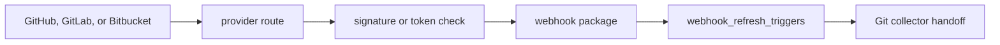

# Webhook Listener Command

`eshu-webhook-listener` is the public intake runtime for provider webhooks. It
accepts GitHub, GitLab, and Bitbucket HTTP deliveries, verifies the provider
secret, normalizes the payload with `go/internal/webhook`, and persists a
durable refresh trigger in Postgres.

The command requires a provider delivery identifier before normalization. It
does not clone repositories, parse files, emit facts, or connect to the graph
backend. Repository truth still flows through the Git collector and the normal
projector/reducer path. For GitLab, delivery identity prefers `Idempotency-Key`
before provider UUID headers so retries dedupe against the same durable trigger
row. For Bitbucket, delivery identity prefers `X-Request-UUID` before
`X-Hook-UUID`.

## Runtime Flow

## Environment

- `ESHU_WEBHOOK_GITHUB_SECRET` enables `/webhooks/github`.
- `ESHU_WEBHOOK_GITLAB_TOKEN` enables `/webhooks/gitlab`.
- `ESHU_WEBHOOK_BITBUCKET_SECRET` enables `/webhooks/bitbucket`.
- `ESHU_WEBHOOK_GITHUB_PATH` overrides the GitHub route.
- `ESHU_WEBHOOK_GITLAB_PATH` overrides the GitLab route.
- `ESHU_WEBHOOK_BITBUCKET_PATH` overrides the Bitbucket route.
- `ESHU_WEBHOOK_MAX_BODY_BYTES` bounds request bodies and defaults to 1 MiB.
- `ESHU_WEBHOOK_DEFAULT_BRANCH` is a fallback only when provider payloads omit
  repository default-branch data.

GitHub uses `X-Hub-Signature-256`, GitLab uses `X-Gitlab-Token`, and
Bitbucket uses `X-Hub-Signature` for provider authentication.
Requests over `ESHU_WEBHOOK_MAX_BODY_BYTES` return 413; malformed or interrupted
body reads return 400 so operators do not confuse transport errors with size
limits.

## Operational Notes

The runtime mounts `/healthz`, `/readyz`, `/metrics`, and `/admin/status` using
the shared runtime mux. In Kubernetes, only provider webhook paths should be
publicly routed; admin and metrics paths should stay internal unless explicitly
protected by the operator.

Provider intake emits bounded OTEL metrics and spans. Labels cover provider,
event kind, decision, status, outcome, and reason; repository names, delivery
IDs, and commit SHAs stay out of metric labels.

| Signal | Type | What it tells operators |
| --- | --- | --- |
| `eshu_dp_webhook_requests_total` | Counter | Request volume by provider, outcome, and rejection or success reason. |
| `eshu_dp_webhook_trigger_decisions_total` | Counter | Normalized trigger decisions that reached durable storage, by provider, event kind, decision, reason, and status. |
| `eshu_dp_webhook_store_operations_total` | Counter | Trigger-store upsert attempts by provider, outcome, and stored status. |
| `eshu_dp_webhook_request_duration_seconds` | Histogram | End-to-end provider route latency, including body read, auth verification, normalization, and store handoff. |
| `eshu_dp_webhook_store_duration_seconds` | Histogram | Durable trigger-store latency for the Postgres upsert path. |
| `webhook.handle` | Span | Provider route handling for one delivery. |
| `webhook.store` | Span | The durable trigger storage substep inside an accepted route. |
