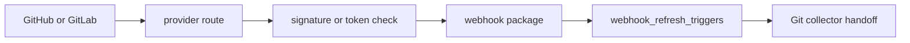

# Webhook Listener Command

`eshu-webhook-listener` is the public intake runtime for provider webhooks. It
accepts GitHub and GitLab HTTP deliveries, verifies the provider secret,
normalizes the payload with `go/internal/webhook`, and persists a durable
refresh trigger in Postgres.

The command requires a provider delivery identifier before normalization. It
does not clone repositories, parse files, emit facts, or connect to the graph
backend. Repository truth still flows through the Git collector and the normal
projector/reducer path. For GitLab, delivery identity prefers `Idempotency-Key`
before provider UUID headers so retries dedupe against the same durable trigger
row.

## Runtime Flow

## Environment

- `ESHU_WEBHOOK_GITHUB_SECRET` enables `/webhooks/github`.
- `ESHU_WEBHOOK_GITLAB_TOKEN` enables `/webhooks/gitlab`.
- `ESHU_WEBHOOK_GITHUB_PATH` overrides the GitHub route.
- `ESHU_WEBHOOK_GITLAB_PATH` overrides the GitLab route.
- `ESHU_WEBHOOK_MAX_BODY_BYTES` bounds request bodies and defaults to 1 MiB.
- `ESHU_WEBHOOK_DEFAULT_BRANCH` is a fallback only when provider payloads omit
  repository default-branch data.

## Operational Notes

The runtime mounts `/healthz`, `/readyz`, `/metrics`, and `/admin/status` using
the shared runtime mux. In Kubernetes, only provider webhook paths should be
publicly routed; admin and metrics paths should stay internal unless explicitly
protected by the operator.
