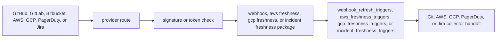

# Webhook Listener Command

`eshu-webhook-listener` is the public intake runtime for provider webhooks. It
accepts GitHub, GitLab, Bitbucket, AWS EventBridge/AWS Config, GCP Cloud Asset
Inventory (CAI) Pub/Sub push, PagerDuty, and Jira HTTP
deliveries, verifies the configured shared secret or token, normalizes the
payload, and persists a durable refresh trigger in Postgres. GitHub `ping`
deliveries are accepted as verified no-op handshakes and do not create refresh
triggers.

The command requires a provider delivery identifier before normalization. It
does not clone repositories, parse files, emit facts, or connect to the graph
backend. Repository truth still flows through the Git collector and the normal
projector/reducer path. For GitLab, delivery identity prefers `Idempotency-Key`
before provider UUID headers so retries dedupe against the same durable trigger
row. For Bitbucket, delivery identity prefers `X-Request-UUID` before
`X-Hook-UUID`.

## Runtime Flow

## Environment

- `ESHU_WEBHOOK_GITHUB_SECRET` enables `/webhooks/github`.
- `ESHU_WEBHOOK_GITLAB_TOKEN` enables `/webhooks/gitlab`.
- `ESHU_WEBHOOK_BITBUCKET_SECRET` enables `/webhooks/bitbucket`.
- `ESHU_AWS_FRESHNESS_TOKEN` enables `/webhooks/aws/eventbridge`.
- `ESHU_GCP_FRESHNESS_TOKEN` enables `/webhook/gcp-freshness`. Default-off:
  the route is not mounted until this token is configured, and until the
  epic's dedicated security-review child approves the push endpoint for
  broader rollout.
- `ESHU_WEBHOOK_PAGERDUTY_SECRET` enables `/webhooks/pagerduty`.
- `ESHU_WEBHOOK_JIRA_SECRET` enables `/webhooks/jira`.
- `ESHU_WEBHOOK_GITHUB_PATH` overrides the GitHub route.
- `ESHU_WEBHOOK_GITLAB_PATH` overrides the GitLab route.
- `ESHU_WEBHOOK_BITBUCKET_PATH` overrides the Bitbucket route.
- `ESHU_AWS_FRESHNESS_PATH` overrides the AWS freshness route.
- `ESHU_GCP_FRESHNESS_PATH` overrides the GCP freshness route.
- `ESHU_WEBHOOK_PAGERDUTY_PATH` overrides the PagerDuty route.
- `ESHU_WEBHOOK_JIRA_PATH` overrides the Jira route.
- `ESHU_WEBHOOK_PAGERDUTY_SCOPE_ID` names the configured PagerDuty collector
  target the webhook route is allowed to wake up.
- `ESHU_WEBHOOK_JIRA_SCOPE_ID` names the configured Jira collector target the
  webhook route is allowed to wake up.
- `ESHU_WEBHOOK_MAX_BODY_BYTES` bounds request bodies and defaults to 1 MiB.
- `ESHU_WEBHOOK_DEFAULT_BRANCH` is a fallback only when provider payloads omit
  repository default-branch data.

GitHub uses `X-Hub-Signature-256`, GitLab uses `X-Gitlab-Token`, and
Bitbucket uses `X-Hub-Signature` for provider authentication.
AWS freshness intake accepts either `Authorization: Bearer <token>` or
`X-Eshu-AWS-Freshness-Token: <token>` and stores only the normalized
`(account_id, region, service_kind)` wake-up trigger.
GCP freshness intake accepts either `Authorization: Bearer <token>` or
`X-Eshu-GCP-Freshness-Token: <token>` as the sole required auth mechanism and
fails closed with no anonymous or partially-authenticated path; it stores
only the normalized `(parent_scope_kind, parent_scope_id, asset_type,
location)` wake-up trigger decoded from the base64 Cloud Asset Inventory
`TemporalAsset` in the Pub/Sub push envelope. The first delivery to a new CAI
feed subscription is a bare-string welcome message, not a `TemporalAsset`;
the route acknowledges it (202, `reason=welcome_message`) without storing a
trigger. Real Pub/Sub push OIDC token verification (audience + service
account allowlist) is tracked as a second accepted auth path in #4339 and is
not implemented yet.
PagerDuty incident freshness intake uses `X-PagerDuty-Signature` and a delivery
identifier from the payload `event.id`, `X-Webhook-Id`, or `X-Request-Id`; Jira
intake uses `X-Hub-Signature` and a delivery identifier from
`X-Atlassian-Webhook-Identifier` or `X-Request-Id`. PagerDuty and Jira routes
store only bounded source, event, scope, and resource identifiers; the provider
payload remains a wake-up signal and is not a fact source. Jira intake accepts
only issue created, updated, and deleted events as collector wake-ups; other
Jira webhook families are rejected with `reason=unsupported_event`.
Requests over `ESHU_WEBHOOK_MAX_BODY_BYTES` return 413; malformed or interrupted
body reads return 400 so operators do not confuse transport errors with size
limits.

## Operational Notes

The runtime mounts `/healthz`, `/readyz`, `/metrics`, and `/admin/status` using
the shared runtime mux. When `ESHU_METRICS_ADDR` differs from
`ESHU_LISTEN_ADDR`, `/metrics` is also served on the dedicated metrics address
for Prometheus scraping. In Kubernetes, only provider webhook paths should be
publicly routed; admin and metrics paths should stay internal unless explicitly
protected by the operator.

Provider intake emits bounded structured logs, OTEL metrics, and spans. Labels
and request-outcome log fields cover provider, event kind, decision, status,
outcome, and reason; repository names, delivery IDs, and commit SHAs stay out
of metric labels and request-outcome logs.

| Signal | Type | What it tells operators |
| --- | --- | --- |
| `eshu_dp_webhook_requests_total` | Counter | Request volume by provider, outcome, and rejection or success reason. |
| `eshu_dp_webhook_trigger_decisions_total` | Counter | Normalized repository or incident trigger decisions that reached durable storage, by provider, event kind, decision, reason, and status. |
| `eshu_dp_webhook_store_operations_total` | Counter | Trigger-store upsert attempts by provider, outcome, and stored status. |
| `eshu_dp_aws_freshness_events_total` | Counter | AWS Config/EventBridge intake and coordinator handoff events by bounded kind and action. |
| `eshu_dp_gcp_freshness_events_total` | Counter | GCP Cloud Asset Inventory feed intake and coordinator handoff events by bounded kind and action. |
| `eshu_dp_webhook_request_duration_seconds` | Histogram | End-to-end provider route latency, including body read, auth verification, normalization, and store handoff. |
| `eshu_dp_webhook_store_duration_seconds` | Histogram | Durable trigger-store latency for the Postgres upsert path. |
| `webhook.handle` | Span | Provider route handling for one delivery. |
| `webhook.store` | Span | The durable trigger storage substep inside an accepted route. |

No-Regression Evidence: incident freshness is queued through
`incident_freshness_triggers` and the workflow coordinator hands it to the
existing PagerDuty or Jira collector claim path. The listener still emits no
facts and polling remains the authoritative backfill path for missed, dropped,
or rejected webhooks.

Observability Evidence: signature failures, missing delivery IDs, malformed
payloads, unsupported Jira event families, durable-store failures,
duplicate/coalesced triggers, and accepted freshness triggers use the existing
webhook request, decision, store, and span signals with bounded provider, event
kind, status, outcome, and reason labels.
