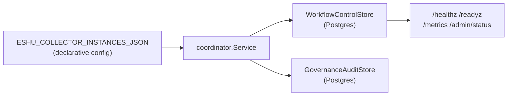
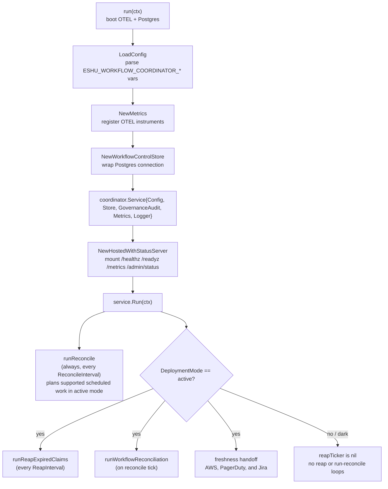

# workflow-coordinator

## Purpose

`eshu-workflow-coordinator` reconciles the declarative set of collector
instances against the durable store and, in active mode, reaps expired
work-item claims, hands off authorized freshness triggers, plans supported
collector work, and recomputes workflow-run state. It exposes the shared
admin/status contract during its dark rollout so
operators can validate the control plane before active mode is enabled.
Trigger normalization is not part of this binary; provider-trigger truth is
still owned by source-specific components.

## Where this fits in the pipeline



The binary does not touch the canonical graph backend and does not call the
reducer or projector queues directly. Its only durable surface is Postgres via
`NewWorkflowControlStore`.

## Internal flow



## Lifecycle

1. `run` calls `NewBootstrap("workflow-coordinator")` and `NewProviders` to
   bring up OTEL tracing, metrics, and the Prometheus handler.
2. `OpenPostgres(parent, os.Getenv)` opens the Postgres connection using
   the standard Postgres environment variables.
3. `LoadConfig(os.Getenv)` parses all ESHU_WORKFLOW_COORDINATOR_* and
   ESHU_COLLECTOR_INSTANCES_JSON env vars and validates the resulting `Config`.
4. `NewMetrics` registers OTEL instruments against the
   `eshu_dp_workflow_coordinator_` prefix.
5. `NewWorkflowControlStore` wraps the connection as the `Store`
   implementation. `NewGovernanceAuditStore` wraps the same Postgres
   connection through an instrumented `governance_audit` store and ensures the
   private audit sink schema exists.
6. `coordinator.Service` is wired with all dependencies, including
   Terraform-state, OCI registry (`oci/registry`), package registry,
   vulnerability installed
   advisory target readers, the `cicd/run` planner (aliased as `cicdrun`),
   `security/alert`, `sbom/attestation`, `scanner/worker` (aliased as
   `scannerworker`), `gcp`, `grafana`,
   `loki`, `jira`, `pagerduty`, `metrics`,
   `tempo`, `vault/live` (aliased as `coordinatorvaultlive`), and `extension`
   planners,
   scheduled AWS and AWS freshness planners, plus freshness trigger stores,
   and handed to
   `NewHostedWithStatusServer`, which mounts the admin surface.
7. `NotifyContext` installs SIGINT/SIGTERM shutdown; `Service.Run` blocks
   until the context is cancelled.

## Configuration

All variables are parsed by `LoadConfig`. See `internal/coordinator/config.go`
for the full list. Key env vars:

- ESHU_WORKFLOW_COORDINATOR_DEPLOYMENT_MODE — `dark` (default) or `active`
- ESHU_WORKFLOW_COORDINATOR_CLAIMS_ENABLED — must be `true` for active mode;
  default `false`; also accepted as ESHU_WORKFLOW_COORDINATOR_ENABLE_CLAIMS
- ESHU_WORKFLOW_COORDINATOR_RECONCILE_INTERVAL — collector-instance reconcile
  and scheduled-work planning cadence; default `30s`. One collector instance
  can widen its own scheduled-scan bucket with `scan_interval` (below); the
  global value stays the floor.
- ESHU_WORKFLOW_COORDINATOR_RUN_RECONCILE_INTERVAL — workflow-run status and
  completeness reconcile cadence; default `30s`
- ESHU_WORKFLOW_COORDINATOR_REAP_INTERVAL — expired-claim reap cadence
  (active mode only); default `20s`
- ESHU_WORKFLOW_COORDINATOR_CLAIM_LEASE_TTL — claim lease TTL; default `60s`
- ESHU_WORKFLOW_COORDINATOR_HEARTBEAT_INTERVAL — must be strictly less than
  the lease TTL; default `20s`
- ESHU_WORKFLOW_COORDINATOR_EXPIRED_CLAIM_LIMIT — max claims reaped per pass;
  default `100`
- ESHU_WORKFLOW_COORDINATOR_EXPIRED_CLAIM_REQUEUE_DELAY — visibility delay
  after reap; default `5s`
- ESHU_HOSTED_COLLECTOR_EGRESS_POLICY_JSON — optional hosted collector egress
  policy; restricted mode requires per-kind allow rules before planning
- ESHU_HOSTED_EXTENSION_EGRESS_POLICY_JSON — optional hosted extension egress
  policy; missing policy denies component-extension claim planning, restricted
  mode requires component allow rules, deny wins, and broad mode is explicit
- ESHU_WORKFLOW_COORDINATOR_TENANT_BOUNDARY_JSON — optional hosted tenant
  boundary with opaque `tenant_id`, `workspace_id`, `subject_class`, and
  `policy_revision_hash`; when set, planned work must intersect an active
  tenant scope grant before any claimable row is created
- ESHU_COLLECTOR_INSTANCES_JSON — JSON array of collector instance objects
- ESHU_SEMANTIC_PROVIDER_WORKER_ENABLED — turns the egress-gated
  semantic-provider execution worker claim loop on; default `false` (no-op when
  unset)
- ESHU_SEMANTIC_PROVIDER_EXECUTION_ENABLED — explicit, default-OFF flag that
  permits real outbound provider traffic; only effective with a concrete enabled
  provider client (a future security-reviewed PR). The shipped build wires the
  no-network `semantic.DisabledProviderClient`, so egress-allowed claims still
  make no provider call and terminate as `provider_execution_not_enabled`
- ESHU_SEMANTIC_PROVIDER_WORKER_SCOPE_IDS_JSON — JSON array of queue scope ids to
  drain; required when the worker is enabled
- ESHU_SEMANTIC_PROVIDER_WORKER_LEASE_TTL — semantic claim lease TTL; default
  `1m`
- ESHU_SEMANTIC_PROVIDER_WORKER_MAX_CLAIMS_PER_PASS — max semantic jobs drained
  per scope per pass; default `32`
- ESHU_SEMANTIC_PROVIDER_WORKER_LEASE_OWNER — lease owner id for the semantic
  worker; default `svc:semantic-provider-worker`
- ESHU_SEMANTIC_EXTRACTION_POLICY_JSON — the existing semantic extraction policy
  contract; the worker re-checks egress against it at claim time and fails
  closed when it is missing

Compose exposes the optional metrics port `19469`. Helm keeps deployment mode
`dark` and claims disabled by default. The semantic-provider execution worker is
off by default and ships no live provider traffic.

### Per-instance scan interval

Every periodic scheduled planner (AWS, GCP, Terraform state, OCI registry,
package registry, vulnerability intelligence, SBOM attestation, security alert,
scanner worker, CI/CD run, Grafana, Loki, Prometheus/Mimir, Tempo, Jira,
PagerDuty, Vault, component extension) buckets its plan key by truncating the
wall clock to an interval. By default that interval is the global
`ESHU_WORKFLOW_COORDINATOR_RECONCILE_INTERVAL`. A collector instance may set
`scan_interval` inside its `configuration` object to use a wider bucket of its
own, so one heavy collector can re-plan its full scope every 12 hours while
the rest of the fleet keeps the 30-second default:

```json
[{
  "instance_id": "aws-ops-prod",
  "collector_kind": "aws",
  "mode": "continuous",
  "enabled": true,
  "claims_enabled": true,
  "configuration": {
    "scheduled_scan_enabled": true,
    "scan_interval": "12h",
    "target_scopes": [{"account_id": "123456789012", "allowed_regions": ["us-east-1"], "allowed_services": ["ec2"]}]
  }
}]
```

Rules, enforced by `Config.Validate` at startup and again at the reconcile
that reads the value:

- Unset or blank keeps today's behavior: the instance buckets on the global
  reconcile interval. A `configuration` that is valid JSON but not an object
  (for example `[]` on a generic collector) has no `scan_interval` and is
  treated as unset, not rejected.
- The value is a Go duration string (`30s`, `90m`, `12h`). Anything else
  fails startup, a number or an explicit `null` included; a key that is
  present must carry a string. A blank string is treated as unset.
- It must be at least `1s`, must not be shorter than the global reconcile
  interval, and must be an integer multiple of it (`12h` over the `30s`
  default is; `45s` is not). The reconcile ticker fires at the global rate, so
  a narrower bucket could not be visited as often as it promises, and a
  non-multiple bucket would put consecutive ticks in consecutive buckets every
  other cycle and plan scans at uneven spacing. With a multiple, each bucket
  holds exactly that many ticks and consecutive scans are planned one
  interval apart once the first partial bucket has passed.
- Buckets are fixed multiples of the interval measured from Go's zero time
  (`time.Truncate`), not from when the coordinator started. Any interval that
  divides 24h therefore lands on fixed UTC wall-clock boundaries: a `12h`
  instance turns over at 00:00 and 12:00 UTC. The first bucket after a restart
  may be shorter than the configured interval. Derived-target rotation for
  package-registry and vulnerability-intelligence instances indexes the same
  truncated bucket, so the page of targets and the plan key change together.
- Freshness-triggered (webhook) planners never read this field, and
  bootstrap instances ignore it: their plan key is the fixed `bootstrap` and
  their derived-target rotation stays on the global reconcile interval. The
  value is still parsed and floor-checked at startup on a bootstrap instance,
  so a bad value fails fast, but it is not logged as an override. A
  package-registry or vulnerability-intelligence instance whose derivation
  uses `planning_mode: single_pass` is already pinned to one plan key, so
  `scan_interval` is accepted there but changes nothing.
- A wider bucket is also a wider retry window. The store skips a plan whose
  run is already `complete` or `failed`, so a scan that fails early in a `12h`
  bucket is not re-planned until the next bucket turns over, and a run that
  never reaches a terminal status (a stuck or dead-lettered work item) blocks
  the same targets in the next bucket too. Watch `workflow_runs.status` and
  `workflow_work_items.status` for that instance before assuming a quiet
  instance is healthy.

The coordinator still calls every scheduled planner on each global tick. A
widened instance produces the same plan key, and so the same run and work-item
identifiers, on every tick inside its bucket, and the store's open-target
guard admits that plan once. At startup the coordinator logs one
`workflow coordinator collector instance sets scan interval`
line per enabled, claim-enabled, non-bootstrap instance that sets the field,
with `scan_interval` and `reconcile_interval`. The line says the value was
read and validated and is the bucket that instance's planner will use, if
its kind has one; it does not evaluate kind-specific gates (a kind with no
scheduled planner, an AWS instance with `scheduled_scan_enabled: false`, or a
`single_pass` derivation sets a bucket nothing consumes). The ground truth
for the cadence in effect is the plan-key
suffix of the run IDs the instance produces, for example
`aws:aws-ops-prod:schedule:continuous-20260520T120000Z`.

## Exported surface

This binary is a thin wiring layer. Its own identifiers are `main` and `run`
in `main.go`. All coordinator behavior lives in `internal/coordinator` and
`internal/workflow`.

The direct process contract includes `eshu-workflow-coordinator --version` and
`eshu-workflow-coordinator -v`. Both flags print the build-time version through
`buildinfo.PrintVersionFlag` before telemetry or Postgres setup begins.

## Dependencies

- `internal/coordinator` — `Service`, `LoadConfig`, `NewMetrics`, `Store`;
  the coordinator loop and config parsing
- `internal/coordinator/cicd/run` — concrete CI/CD run planner wiring
- `internal/coordinator/planner/component/extension` — concrete scheduler
  wiring for generic component-extension activation targets
- `internal/coordinator/planner/gcp` — concrete scheduler wiring for GCP Cloud
  Asset Inventory targets
- `internal/coordinator/planner/grafana` — concrete scheduler wiring for Grafana
  observability targets
- `internal/coordinator/planner/pagerduty` — concrete PagerDuty scheduled and
  webhook-freshness planner wiring
- `internal/coordinator/planner/jira` — concrete Jira scheduled and
  webhook-freshness planner wiring
- `internal/coordinator/security/alert` — concrete provider security-alert
  planner wiring
- `internal/coordinator/sbom/attestation` — concrete scheduler wiring for hosted
  SBOM and attestation targets
- `internal/coordinator/planner/loki` — concrete scheduler wiring for Grafana
  Loki observability targets
- `internal/coordinator/planner/prometheus` — concrete scheduler wiring for
  Prometheus and Grafana Mimir metric-metadata targets
- `internal/coordinator/planner/tempo` — concrete scheduler wiring for Grafana
  Tempo trace-signal targets
- `internal/coordinator/planner/tfstate` — concrete scheduler wiring for
  Terraform-state drift targets
- `internal/coordinator/oci/registry` — concrete scheduler wiring for OCI
  registry repository targets
- `internal/coordinator/vault/live` — concrete scheduler wiring for Vault
  metadata targets
- `internal/workflow` — type contracts consumed by `coordinator.Service`
- `internal/storage/postgres` — `NewWorkflowControlStore`, `NewStatusStore`;
  `NewGovernanceAuditStore`; Postgres-backed store implementations
- `internal/app` — `NewHostedWithStatusServer`; hosts the service with the
  shared admin surface
- `internal/runtime` — `OpenPostgres`, `WithPrometheusHandler`; Postgres
  connection and Prometheus handler helpers
- `internal/telemetry` — `NewBootstrap`, `NewProviders`, `NewLogger`;
  OTEL bootstrap

## Telemetry

- OTEL setup: `NewBootstrap("workflow-coordinator")` + `NewProviders`
- Logger scope and component: `workflow-coordinator`
- Domain metrics from `NewMetrics` (see `internal/coordinator/README.md` for
  the full metric list)
- Admin surface: `/healthz`, `/readyz`, `/metrics`, `/admin/status` mounted by
  `NewHostedWithStatusServer`

## Operational notes

- Deployment mode `dark` is the default. The reconcile loop runs; the reap and
  run-reconciliation loops do not. Use the admin surface to confirm the binary
  is live and reconciling before enabling active mode.
- Version probes are pre-startup checks. Keep `buildinfo.PrintVersionFlag` at
  the top of `main` so deployment checks do not need database credentials.
- To enable active mode, set ESHU_WORKFLOW_COORDINATOR_DEPLOYMENT_MODE=active,
  ESHU_WORKFLOW_COORDINATOR_CLAIMS_ENABLED=true, and supply at least one
  enabled claim-capable collector instance in ESHU_COLLECTOR_INSTANCES_JSON.
  `Config.Validate` rejects active mode without these conditions.
- When `ESHU_HOSTED_COLLECTOR_EGRESS_POLICY_JSON` is set, the coordinator
  filters enabled claim-capable collector instances before scheduled or
  freshness work is planned. Denied collectors create no claimable rows and
  append validation-safe governance audit events when the private sink is
  available.
- Component-extension claim planning also requires
  `ESHU_HOSTED_EXTENSION_EGRESS_POLICY_JSON`. Missing policy or a restricted
  policy without a matching component allow rule creates no claimable rows;
  broad mode is the explicit operator opt-in. Missing or denied extension
  egress decisions append validation-safe governance audit events.
- Active mode plans Terraform-state, OCI registry, package registry,
  scanner-worker, vulnerability-intelligence installed advisory target work,
  CI/CD run target work, and opt-in scheduled AWS work today. AWS, PagerDuty,
  and Jira freshness webhooks create targeted collector work only after the
  configured `scope_id` is authorized against durable collector instances.
- The binary does not reconcile canonical graph truth. It is a control plane on
  top of `eshu-reducer` and `eshu-ingester`.
- Shutdown is signal-driven (SIGINT or SIGTERM). `NewHostedWithStatusServer`
  drains the hosted service cleanly before exit.
- `eshu_dp_workflow_coordinator_collector_instance_drift` rising in Prometheus
  or structured log warnings mean the desired and durable collector-instance
  sets disagree.

## Extension points

- `Store` — the binary wires `NewWorkflowControlStore`; any type implementing
  `coordinator.Store` can be substituted in tests or future backends.
- `Metrics` — `NewMetrics` is the production implementation; a recording stub
  works for unit testing.

## Gotchas / invariants

- Active mode without claims enabled and at least one enabled claim-capable
  collector instance fails `Config.Validate` at startup.
- Heartbeat interval must be strictly less than claim lease TTL; violated
  configurations exit with a validation error.
- The coordinator plans Terraform-state and OCI registry work in active mode,
  but it still does not permanently own claims. Claim ownership stays with the
  collectors that heartbeat and complete the claimed work items.

## Related docs

- [Service runtimes — Workflow Coordinator](../../../docs/public/deployment/service-runtimes.md#workflow-coordinator)
- [Helm deployment](../../../docs/public/deploy/kubernetes/index.md)
- [Docker Compose deployment](../../../docs/public/run-locally/docker-compose.md)
- `internal/coordinator/README.md`
- `internal/workflow/README.md`
