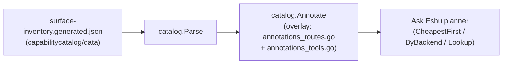

# internal/ask/catalog

## Purpose

`internal/ask/catalog` is Ask Eshu's self-knowledge of every implemented API
route and MCP tool it can call to answer a question. It bridges the canonical
surface inventory (generated and drift-gated on every surface change) with a
curated annotation overlay that records each surface's backend and cost class,
enabling the Ask Eshu planner to prefer the cheapest correct retrieval path.

## Where this fits in the pipeline



The package is **pure**: it reads the committed inventory artifact from disk and
never queries Postgres, the graph backend, or any live runtime state.

## Files

| File | Role |
|------|------|
| `catalog.go` | Core types (`Backend`, `CostClass`, `SurfaceKind`, `Entry`, `Catalog`), `Parse`, `Annotate`, `Unannotated`, `Lookup`, `ByBackend`, `CheapestFirst` |
| `doc.go` | Package godoc contract |
| `annotations.go` | `Annotation` type + `annotations()` merger |
| `annotations_routes.go` | `askRouteAnnotations()` — 167 implemented HTTP API routes |
| `annotations_tools.go` | `askToolAnnotations()` — 141 implemented MCP tools |
| `coverage_test.go` | Drift gate: `TestOverlayCoversInventory` — reads the real inventory, fails if any implemented surface is unannotated |
| `parse_test.go` | `Parse` correctness tests |
| `catalog_test.go` | Type and constant contract tests |
| `annotations_test.go` | Overlay application, unannotated reporting, and backend-validity tests |
| `query_test.go` | `Lookup`, `ByBackend`, `CheapestFirst` tests |

## Data model

```
Catalog
  entries []Entry
    Kind     SurfaceKind  ("api_route" | "mcp_tool")
    Name     string       surface identifier
    Backend  Backend      ("nornicdb" | "postgres" | "both" | "embedded" | "unknown")
    Cost     CostClass    ("low" | "moderate" | "high")
```

`Backend` and `Cost` are **not** carried by the surface inventory; they are a
curated overlay in `annotations_routes.go` and `annotations_tools.go`. Every
implemented `api_route` and `mcp_tool` surface must have a matching entry or the
coverage drift gate (`TestOverlayCoversInventory`) fails.

## Annotation overlay maintenance

When the surface inventory gains new implemented API routes or MCP tools, the
overlay must be updated:

1. Run `go test ./internal/ask/catalog -run TestOverlayCoversInventory -count=1`.
   The failure output lists every missing surface name.
2. Add entries to `annotations_routes.go` (for `api_route` surfaces) or
   `annotations_tools.go` (for `mcp_tool` surfaces).
3. Read the owning handler in `internal/query/` or `internal/mcp/` to determine
   the correct `Backend` and `Cost` before adding the entry.
4. Re-run all catalog tests and confirm they pass.

## Verification

```bash
cd go
gofmt -l ./internal/ask/catalog    # must print nothing
go vet ./internal/ask/catalog
go test ./internal/ask/catalog -count=1
```

The drift gate runs as part of the normal test suite and requires the committed
inventory artifact at `internal/capabilitycatalog/data/surface-inventory.generated.json`.
