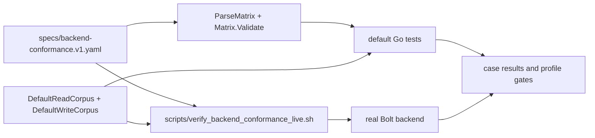

# Backend Conformance

`backendconformance` owns the reusable graph-backend proof harness for matrix
validation plus deterministic read/write corpora.

## Conformance flow

The default test path validates contracts without a live database. The live
script opts into the same corpora against Neo4j or NornicDB.

The package keeps two contracts together:

- the machine-readable backend matrix in `specs/backend-conformance.v1.yaml`
- the profile gates that track NornicDB promotion across local and production
  shapes
- the read and write corpora used to exercise `GraphQuery` and Cypher executor
  adapters, including atomic grouped writes and transaction-visibility cases

Default Go tests validate the matrix and harness without starting Neo4j or
NornicDB. `scripts/verify_backend_conformance_live.sh` turns on the opt-in live
test and runs the same corpora against a real Bolt endpoint for the NornicDB and
Neo4j Compose lanes.

The live write corpus includes the source-local shape that matters for canonical
projection parity: repository, directory, file, function, and
`File-[:CONTAINS]->Function`. The live test runs the write corpus twice before
readback so both official backends prove the relationship stays idempotent.
