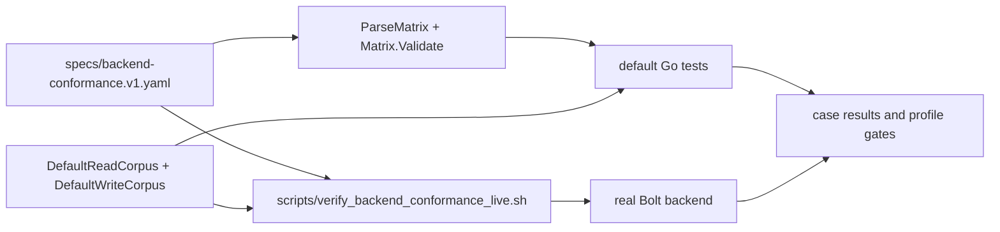

# Backend Conformance

`backendconformance` owns the reusable graph-backend proof harness for matrix
validation plus deterministic read/write corpora.

## Conformance flow

```mermaid
flowchart LR
    Matrix["specs/backend-conformance.v1.yaml"]
    Parser["ParseMatrix + Matrix.Validate"]
    DefaultTests["default Go tests"]
    Corpora["DefaultReadCorpus + DefaultWriteCorpus"]
    LiveScript["scripts/verify_backend_conformance_live.sh"]
    Bolt["real Bolt backend"]
    Report["case results and profile gates"]

    Matrix --> Parser
    Parser --> DefaultTests
    Corpora --> DefaultTests
    DefaultTests --> Report
    Matrix --> LiveScript
    Corpora --> LiveScript
    LiveScript --> Bolt
    Bolt --> Report
```

The default test path validates contracts without a live database. The live
script opts into the same corpora against Neo4j or NornicDB. Read cases assert a
minimum row count or, with `WantRows`, the exact rows; the exact-row cases pin
the reducer's value-flow cloud sink statements (#6690) and the aggregation and
optional-match shapes older NornicDB builds answered wrongly (#6689).

The package keeps two contracts together:

- the machine-readable backend matrix in `specs/backend-conformance.v1.yaml`
- the profile gates that track NornicDB promotion across local and production
  shapes
- the read and write corpora used to exercise `GraphQuery` and Cypher executor
  adapters, including atomic grouped writes and transaction-visibility cases

Default Go tests validate the matrix and harness without starting Neo4j or
NornicDB. `scripts/verify_backend_conformance_live.sh` turns on the opt-in live
test and runs the corpora against a real Bolt endpoint for the NornicDB and
Neo4j Compose lanes; the end-to-end workflow runs it on both backends.

The live write corpus includes the source-local shape that matters for canonical
projection parity: repository, directory, file, function, and
`File-[:CONTAINS]->Function`. The live test runs the write corpus twice before
readback so both official backends prove the relationship stays idempotent.

## Differential capture (issue #6782, slice 2)

`differential.go` records per-statement fingerprints and result digests at the
`GraphQuery` and sourcecypher executor seams for the NornicDB-vs-Neo4j
comparison. The wrappers return the inner seam unchanged unless
`ESHU_DIFFERENTIAL_CAPTURE=1`, so normal runs never allocate a record.

No-Regression Evidence: baseline has no capture code and no wrapped seam;
after this change production still runs unwrapped (no Go file references the
qualified constructors `backendconformance.WrapGraphQuery` or
`backendconformance.WrapExecutor` — the other `WrapExecutor` hits are the
unrelated `graphbackpressure.WrapExecutorWithGate`).
`go test ./internal/backendconformance/ -count=1` passes in 0.016s with no
live backend (unit statements plus fake seams, no Bolt, no NornicDB or Neo4j
version involved). No Cypher text, schema, queue, lease, or batching changed,
so there is no hot-path shape to bench before/after; the passthrough is
pinned by `TestWrappersPassThroughWhenCaptureDisabled`.

No-Observability-Change: no new metrics, spans, or log keys; the recorder is
process memory only with no operator surface, and existing telemetry signals
are untouched.

Follow-up (failure comparison plus capability stripping): `CompareRecordings`
also compares failed-execution counts per fingerprint, and `WrapExecutor`
returns an execute-only recorder when inner lacks `GroupExecutor`. Still no
hot-path change — production still runs unwrapped, and capture mode now
preserves the sequential fallback exactly.

No-Regression Evidence: `go test ./internal/backendconformance/ -count=1`
passes, 49 tests in 0.015s, backend-free; the strip is pinned by a test
asserting all three optional surfaces are absent on a non-grouping inner.

No-Observability-Change: unchanged from above — no new signals.

## Differential oracle (issue #6782, slice 3)

`CompareRecordings` diffs recordings group by group with a named kind per
divergence (`missing`, `results`, `executions`, `failures`, `rowcount`), so
the allowlist excuses scheduling noise without ever excusing a result
disagreement. UNWIND batches and single-use IN-list filters explode into
per-element groups (batch regrouping across runs pairs element-wise);
fingerprints normalize the run generation stamp wherever it propagates
(`generation_id` keys, `resolved_id` middles, `artifact_id` cells); digest
rows canonicalize backend serialization (graph-object identity, list order,
wall-clock columns, run-scoped lineage cells) while parameters stay strict.
See `differential.go`, `differential_unwind.go`, and
`differential_normalize.go`.

No-Regression Evidence: `go test ./internal/backendconformance/
./internal/graph/capture/ ./cmd/golden-corpus-gate/ -count=1` passes with no
live backend. No production Cypher text, schema, index, queue, lease, or
batching changed — the touched code runs only inside gate comparison and
opt-in capture; production replays run unwrapped. Capture-mode overhead is
one fingerprint plus one digest per statement as before, plus small map
walks; no hot-path shape exists to bench before/after.

No-Observability-Change: no new metrics, spans, or log keys; comparison
output keeps the existing `Detail` strings with a machine-readable `Kind`
alongside.
