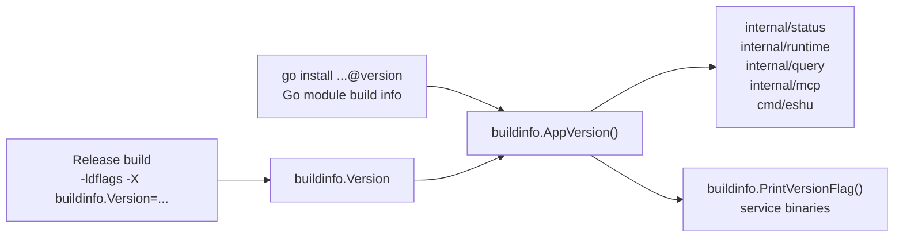

# Buildinfo

## Purpose

`buildinfo` is the single source for the application version string reported
by the API, MCP server, ingester, reducer, CLI root command, and admin
surfaces. All version-bearing code paths call `AppVersion()` from here rather
than keeping local version constants. Direct service binaries also use this
package for their `--version` and `-v` early-exit path.

## Where this fits

## Ownership boundary

Owns `Version`, `AppVersion`, and the small service-binary version flag helper.
Nothing else in the codebase may declare its own version constant. Release and
local installer builds set `Version` via `-ldflags`. Plain `go install
...@version` builds leave `Version` as `"dev"`, so `AppVersion` falls back to
the main module version embedded by Go.

## Exported surface

- `Version` — package-level `var` defaulting to `"dev"`. Overridden at build
  time via `-ldflags "-X .../buildinfo.Version=<value>"`.
- `AppVersion() string` — returns a non-`"dev"` linker-injected value first,
  then a non-`"(devel)"` Go main-module version, then `"dev"`.
- `PrintVersionFlag(args []string, stdout io.Writer, applicationName string) (bool, error)` —
  prints `<applicationName> <version>` for a single `--version` or `-v`
  argument and returns `handled=false` for normal runtime arguments.

See `doc.go` for the godoc contract.

## Dependencies

Standard library only (`fmt`, `io`, `runtime/debug`, `strings`). No internal
packages.

## Telemetry

None directly. Callers embed `AppVersion()` in their own structured log fields,
metric label sets, and status response payloads.

## Gotchas / invariants

- `Version` must only ever be written via `-ldflags`. Reassigning it in code
  causes the value to diverge from the build artifact and confuses operator
  dashboards.
- An empty or whitespace-only `-ldflags` override collapses to `"dev"`
  (`buildinfo.go:28`). Treat `"dev"` as a non-release source build in
  dashboards and alerts.
- The default `"dev"` value is also the signal to check Go build info. A binary
  installed with `go install ...@v1.2.3` can report `v1.2.3` even without
  `-ldflags`; a local source build has Go's `"(devel)"` module version and
  still reports `"dev"`.
- The `ldflags` path is `-X github.com/eshu-hq/eshu/go/internal/buildinfo.Version=<value>`.
  An incorrect module path prefix silently leaves `Version` at `"dev"`.
- `PrintVersionFlag` only handles exactly one argument. Service commands must
  call it at the top of `main` so version probes do not open Postgres, graph
  drivers, or telemetry providers.

## Related docs

- `docs/docs/reference/local-testing.md` — build commands
- Dockerfile — release builds inject the version value via `--build-arg`
  passed to `-ldflags`
