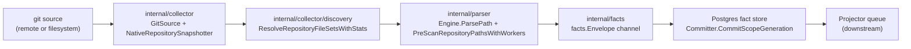
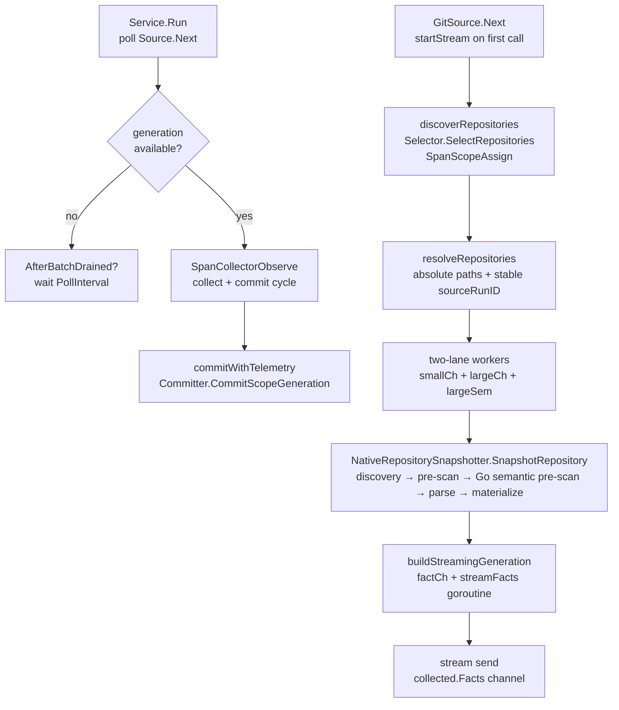

# Collector

## Purpose

`internal/collector` owns git collection, filesystem-direct collection,
repository discovery, snapshot capture, and parser input shaping for Eshu
indexing runs. It turns source repositories into the inputs required by fact
emission: cloned snapshots, native snapshots, discovery reports, file
selections, and entity metadata. It does not make graph projection or
query-time truth decisions — those belong to the projector, reducer, storage,
and query packages.

## Where this fits in the pipeline

## Internal flow

## Lifecycle / workflow

`Service.Run` is the poll-and-dispatch loop. Sources that implement
`ObservedSource` can start `SpanCollectorObserve` once they know the poll is a
real collection attempt, which keeps drained or idle polls out of trace export.
When a generation is available, the span covers source collection and durable
commit. When no generation is ready, the service calls `AfterBatchDrained` if
at least one generation was committed since the last drain, then waits
`PollInterval` (1 second in `cmd/ingester`). On receipt of a generation it
calls `Committer.CommitScopeGeneration` with the `facts.Envelope` channel and
records `CollectorObserveDuration`, `FactsEmitted`, `GenerationFactCount`, and
`FactsCommitted`.
If the durable commit returns an error and `DeadLetters` is wired, `Service`
records bounded scope/generation replay metadata without storing fact payloads
or local repository paths.

`GitSource.Next` manages a per-batch streaming lifecycle. On the first call per
batch it launches `startStream`, which:

1. Calls `Selector.SelectRepositories` to discover the current repository list
   (span: `SpanScopeAssign`).
2. Resolves all paths to absolute form and computes a stable `sourceRunID` via
   `facts.StableID`.
3. Classifies repositories into `smallCh` and `largeCh` by file count via
   `isLargeRepository` (skips `.git`, `node_modules`, `vendor`, `.venv`,
   `__pycache__`).
4. Launches `s.SnapshotWorkers` goroutines (default 8). Workers prefer small
   repos; large repos acquire a `largeSem` semaphore (capacity
   `LargeRepoMaxConcurrent`) before snapshotting so at most N large parses run
   concurrently.
5. A coordinator goroutine closes `s.stream` when all workers finish.

Subsequent `Next` calls read one generation from `s.stream`. When the stream
channel closes, `Next` returns `ok=false` and resets for the next discovery
cycle.

For filesystem sources, `NativeRepositorySelector.SelectRepositories` uses a
manifest under the managed repository cache to avoid reselecting unchanged
workspaces. The manifest hashes the files the collector can actually use:
`.gitignore` and `.eshuignore` rule files are included, while files excluded by
those rules are skipped. This keeps local watch mode from creating new
generations for ignored logs, build outputs, or editor scratch files.

`NativeRepositorySnapshotter.SnapshotRepository` runs five sequential stages
per repository:

1. **Discovery** — `resolveNativeSnapshotFileSet` calls
   `discovery.ResolveRepositoryFileSetsWithStats` with repo-local overrides from
   `.eshu/discovery.json`, `.eshu/vendor-roots.json`, `.gitignore`, and
   `.eshuignore` applied before parsing.
2. **Pre-scan** — `engine.PreScanRepositoryPathsWithWorkers` builds the import
   map concurrently.
3. **Go semantic pre-scan** — `engine.PreScanGoPackageSemanticRoots` builds
   package interface escapes, imported receiver method roots, chained receiver
   roots, generic constraint roots, and package import paths for parser options.
4. **Parse** — `buildParsedRepositoryFiles` parses each file through the
   `parser.Engine` worker pool; each parsed file becomes a `map[string]any`
   entry in `snapshot.FileData` and may carry semantic metadata such as
   dead-code root evidence. `snapshotParserOptions` keeps language-specific
   variable scope close to query needs: Java uses module-level variables so
   method locals do not flood canonical graph projection, while dynamic
   languages that rely on local-variable evidence still parse with
   `VariableScope=all`. Terraform parser buckets are mapped explicitly into
   content entities, including backends, imports, moved blocks, removed blocks,
   checks, and lockfile providers. Declared Grafana, Prometheus/Mimir, Loki,
   and Tempo observability parser buckets plus applied Argo CD/Kubernetes
   observability state buckets are emitted as versioned `observability.*`
   source facts during fact streaming, not as graph truth.
5. **Materialize** — `shape.Materialize` turns parsed files into
   `ContentFileMeta` records and `ContentEntitySnapshot` rows. Body strings are
   released after materialization; `streamFacts` re-reads them from disk at emit
   time so snapshot memory is `O(single_file)`.

`buildStreamingGeneration` launches a background goroutine that streams
`facts.Envelope` values through a buffered channel (`factStreamBuffer = 500`).
When the stream re-reads repo-hosted service-catalog descriptors
(`catalog-info.yaml`, `opslevel.yml`, or `cortex.yaml`), it delegates to the
`servicecatalog` normalizer and emits observed `service_catalog.*` facts under
the same scope and generation. A documentation-only lane normalizes repo-hosted Markdown, lightweight text, HTML, API contracts, notebooks, spreadsheets, DOCX/XLSX/PPTX summaries, bounded ZIP/TAR packets, and deterministic diagrams into source-neutral facts with repository target refs.
Office annotations and hidden content stay metadata-only while visible content still emits facts. External relationships, embedded objects, macro content, malformed containers, unsafe paths, resource limits, and compression hazards block Office extraction; legacy `.xls` cell bytes stay metadata-only. Archive packets preflight first, preserve member path/hash provenance, skip unsupported/nested/credential-like members, and block unsafe or resource-hazard archives from emitting contained sections.
Default-off helper packages may build OCR or media transcript documentation facts
from reviewed local engine output after preflight, but those helpers do not
enable repository media discovery, hosted runtime paths, or truth promotion.
These claims remain document evidence only; projector, reducer, and query stages
own correlation, drift, and truth decisions.
`AfterBatchDrained` runs only after the service has committed at least one
generation and then observes the source batch drain. Idle polls do not trigger
it.

No-Regression Evidence: `go test ./internal/collector ./internal/doctruth ./internal/query ./internal/mcp ./internal/storage/postgres -count=1` covers DOCX, CSV/TSV, XLSX, PPTX, ZIP packet summaries, deterministic diagrams, claim hints, repository fact readback, and MCP routing.

No-Observability-Change: documentation extraction stays inside existing `collector.observe`, body-free snapshot metadata, and stream-time re-reads. It adds no worker, queue, graph write, metric label, runtime knob, or deployment profile.

## Exported surface

- `Service` — poll-and-dispatch loop; wire `Source`, `Committer`,
  `PollInterval`, and optionally `DeadLetters`, `AfterBatchDrained`, `Tracer`,
  `Instruments`, `Logger`. `DeadLetters` records commit failures and clears
  replay state after later successful commits
- `Source` — interface: `Next(context.Context) (CollectedGeneration, bool, error)`
- `ObservedSource` — optional source interface that receives a
  `StartObserveFunc` and returns a `CollectorObservation` so real collection
  attempts, not idle polls, can share one `collector.observe` span with commit
- `Committer` — interface: `CommitScopeGeneration(ctx, scope, generation, <-chan facts.Envelope) error`
- `GenerationDeadLetterSink` / `GenerationDeadLetter` — optional
  commit-failure sink and bounded replay metadata for generations that fail
  before normal projector work items exist
- `GenerationDeadLetterReplayCompleter`, `GenerationDeadLetterReplayFilter`, and `GenerationDeadLetterReplayResult` — store-facing replay completion/request contracts
- `ClaimedCommitter` — optional fence-aware commit interface used by
  `ClaimedService` so claim ownership can be verified in the same transaction
  that persists facts; hosted claim mutations also carry the work item's tenant
  boundary so storage can re-check the active grant before fact writes
- `CollectedGeneration` — `Scope`, `Generation`, `Facts` channel, `FactCount`,
  optional `DiscoveryAdvisory`
- `GitSource` — implements `Source`; fields include `Selector`,
  `Snapshotter`, `SnapshotWorkers`, `LargeRepoThreshold`,
  `LargeRepoMaxConcurrent`, `StreamBuffer`
- `NativeRepositorySnapshotter` — implements `RepositorySnapshotter`; fields
  include `Engine`, `Registry`, `DiscoveryOptions`, `SCIP`, `ParseWorkers`
- `RepositorySelector` — interface: `SelectRepositories(context.Context) (SelectionBatch, error)`
- `PriorityRepositorySelector` — tries selectors in order and returns the
  first non-empty batch
- `WebhookTriggerRepositorySelector` — claims queued GitHub, GitLab, and
  Bitbucket webhook triggers, syncs only referenced repositories, fails
  unsupported providers, and returns successful syncs as a targeted batch
- `RepositorySnapshotter` — interface: `SnapshotRepository(context.Context, SelectedRepository) (RepositorySnapshot, error)`
- `SelectionBatch` — `ObservedAt` + `[]SelectedRepository`
- `SelectedRepository` — `RepoPath`, `RemoteURL`, `IsDependency`, `DisplayName`,
  `Language`, `FileTargets`
- `RepositorySnapshot` — `RepoPath`, `RemoteURL`, `FileCount`, `ImportsMap`,
  `FileData`, `ContentFileMetas`, `DocumentationFileMetas`, `ContentEntities`,
  `DiscoveryAdvisory`
- `ContentFileSnapshot`, `ContentFileMeta`, `ContentEntitySnapshot` — portable
  file and entity records; `ContentFileMeta` carries no body string. Declared
  PagerDuty module/tfvars rows materialize as `PagerDutyDeclaration` content
  entities from Terraform source evidence, not live PagerDuty incident or
  configuration truth. Declared Grafana folder, dashboard, datasource,
  alert-rule, Prometheus/Mimir scrape config, metric rule, metric route, Loki
  log route, Tempo trace route, and coverage-warning rows remain metadata-only
  `observability.*` facts with dashboard JSON, query bodies, scrape targets,
  remote-write URLs, Loki or Tempo route URLs, tenant header values, tenant
  IDs, datasource URLs, log label values, trace tag values, raw trace IDs,
  request attributes, and secret fields omitted.
- `RepoSyncConfig` — all env-driven sync configuration; populated by
  `LoadRepoSyncConfig`
- `LoadRepoSyncConfig(component, getenv)` — parses the repo-sync env contract
- `LoadWebhookTriggerHandoffConfig(defaultOwner, getenv)` — parses the shared
  webhook-trigger handoff env contract used by collector runtimes
- `LoadDiscoveryOptionsFromEnv(getenv)` — parses `ESHU_DISCOVERY_IGNORED_PATH_GLOBS`
  and `ESHU_DISCOVERY_PRESERVED_PATH_GLOBS`
- `LoadSnapshotSCIPConfig(getenv)` — parses the SCIP env contract
- `SnapshotSCIPConfig` — `Enabled`, `Languages`, `Indexer`, `Parser`
- `DiscoveryAdvisoryReport` — operator-facing JSON summary of discovery and
  materialization shape per snapshot run
- `RegistryFailure` — bounded registry collector error type that carries
  `FailureClass` and `FailureDetails` for workflow status without exposing
  private registry hosts, repositories, packages, tags, digests, accounts,
  paths, or credential references
- `RegistryHTTPFailure` and `RegistryTransportFailure` — helpers used by
  registry runtimes to classify auth denied, not found, rate limited,
  retryable, canceled, and terminal registry failures
- `ClaimedService` — wraps `Service` with a `ClaimControlStore` for workflow
  collection; `MaxAttempts` bounds per-work-item retries and escalates recurring
  retryable failures to `attempt_budget_exhausted` (issue #612; `0` is legacy).
  Hosted work items copy tenant identity into commit mutations. Retryable
  source errors exposing `RetryAfterDelay()` set retry `visible_at` to the
  larger of poll interval and provider guidance without changing fact output.
- `FailureClassAttemptBudgetExhausted` — exported failure-class label that
  `ClaimedService` writes to `workflow_claims.failure_class` and
  `workflow_work_items.last_failure_class` when the retry budget escalates a
  claim. Operators read this label to attribute terminal failures to the
  bounded-retry guard versus other terminal-classified causes.
- `FactsFromSlice` — test helper: builds a `CollectedGeneration` from a
  pre-built `[]facts.Envelope` slice
- `terraformstate` subpackage — exact Terraform-state source readers and
  streaming parser primitives that emit redacted Terraform-state facts
- `tfstateruntime` subpackage — claim-aware Terraform-state runtime adapter that
  resolves exact candidates, opens the matching state source, and emits a
  fenced collected generation for `ClaimedService`
- `packageregistry` subpackage — package-registry identity normalization,
  runtime target contracts, metadata parsing, claim runtime, and
  reported-confidence package fact-envelope construction for the
  `package_registry` collector family
- `ociregistry` subpackage — OCI registry identity, provider adapters,
  runtime scan orchestration, and reported-confidence container image facts
- `sbomruntime` subpackage — claim-aware hosted SBOM and attestation runtime
  that fetches configured documents or OCI referrer artifact blobs, delegates
  SBOM parsing to `sbomdocument`, and emits in-toto attestation facts without
  making reducer attachment truth decisions
- `sdk` subpackage — first-party shared helpers for bounded HTTP execution,
  safe provider failures, retry-after parsing, and common status classification
- `pagerduty` subpackage — PagerDuty incident, lifecycle, related change-event,
  and optional live configuration source facts for downstream correlation.
- `tempo` subpackage — live Tempo trace-signal metadata collection for source
  instances, tag names, bounded tag values, and coverage warnings.
- `cicdrun` subpackage — fixture-backed CI/CD provider normalization and
  reported-confidence run, job, step, artifact, trigger, environment, and
  warning fact-envelope construction for the `ci_cd_run` collector family
- `servicecatalog` subpackage — Backstage, OpsLevel, and Cortex manifest
  normalization for the `service_catalog` collector family. The Git collector
  calls it only for repo-hosted catalog descriptors and emits provenance-only
  facts that downstream projector/reducer code correlates.
- `grafana` subpackage — claim-driven live Grafana API metadata collection for
  the `grafana` collector family. It emits reported-confidence observed
  observability source facts for folders, dashboards, datasources, alert rules,
  and coverage warnings without retaining dashboard JSON, query models,
  datasource URLs, contacts, notification routes, credentials, or private URLs.
- `prometheusmimir` subpackage — claim-driven live Prometheus-compatible API
  metadata collection for the `prometheus_mimir` collector family. It emits
  reported-confidence observed observability source facts for active targets,
  rules, and coverage warnings without retaining metric samples, raw PromQL,
  scrape target URLs, target label values, annotations, tenant IDs, credentials,
  or private URLs.
- `loki` subpackage — claim-driven live Loki API metadata collection for the
  `loki` collector family. It emits reported-confidence observed observability
  source facts for log signals, rules, and coverage warnings without retaining
  log lines, raw LogQL, label values, tenant IDs, credentials, private URLs, or
  provider response bodies.
- `scannerworker` subpackage — scanner-worker claim processing, analyzer port,
  bounded target scope, resource limits, source-fact output validation, and
  retry/dead-letter payloads. Concrete heavy analyzers plug in behind this
  boundary.

## Dependencies

- `internal/collector/discovery` — `ResolveRepositoryFileSetsWithStats`,
  `Options`, `RepoFileSet`, `DiscoveryStats`
- `internal/parser` — `Engine`, `Registry`, `Options`, `DefaultEngine`,
  `DefaultRegistry`, `SCIPIndexer`, `SCIPIndexParser`, `SCIPParseResult`
- `internal/facts` — `facts.Envelope`, `facts.StableID`
- `internal/scope` — `scope.IngestionScope`, `scope.ScopeGeneration`
- `internal/content/shape` — `shape.Materialize`, `shape.Input`
- `internal/repositoryidentity` — `MetadataFor`
- `internal/telemetry` — spans, metrics, structured logging

## Telemetry

- Spans: `SpanCollectorObserve` (`collector.observe`) wraps each collect and
  commit cycle for sources that implement `ObservedSource`,
  `SpanCollectorStream` (`collector.stream`) wraps the full stream lifecycle;
  `SpanScopeAssign` (`scope.assign`) wraps repository discovery;
  `SpanFactEmit` (`fact.emit`) wraps per-repo snapshotting
- Metrics: `eshu_dp_collector_observe_duration_seconds`,
  `eshu_dp_scope_assign_duration_seconds`, `eshu_dp_fact_emit_duration_seconds`,
  `eshu_dp_repo_snapshot_duration_seconds`, `eshu_dp_file_parse_duration_seconds`,
  `eshu_dp_repos_snapshotted_total` (labeled `status=succeeded/failed`),
  `eshu_dp_facts_emitted_total`, `eshu_dp_facts_committed_total`,
  `eshu_dp_fact_batches_committed_total`, `eshu_dp_generation_fact_count`,
  `eshu_dp_discovery_files_skipped_total` (labeled `skip_reason`),
  `eshu_dp_large_repo_classifications_total` (labeled `repo_size_tier`),
  `eshu_dp_large_repo_semaphore_wait_seconds`
- Log events: `git repository sync started`,
  `git repository sync progress`, `git repository sync completed`,
  `git repository sync failed`, `collector stream started`,
  `collector snapshot stage completed`
  (stages: `discovery`, `pre_scan`, `go_package_semantic_prescan`, `parse`,
  `materialize`; the Go semantic pre-scan stage includes
  `go_package_target_count`, and the `parse` stage includes bounded
  `language_parse_summary` rows with file count and parse duration totals per
  language), `collector snapshot completed`,
  `collector commit succeeded / failed`, `collector stream completed / failed`,
  `large repository queued`, `large repo semaphore acquired / released`

## Operational notes

- `ESHU_SNAPSHOT_WORKERS` (default `min(NumCPU,8)`) controls concurrent
  per-repo snapshotting. Raising this value beyond CPU capacity increases
  context-switching without reducing wall time.
- `ESHU_LARGE_REPO_FILE_THRESHOLD` (default `1000`) classifies repositories for
  the large-repo semaphore. The classification is a fast pre-scan that exits
  early once the threshold is exceeded.
- Repo-local `.eshu/discovery.json` and `.eshu/vendor-roots.json` override default
  discovery options before the operator-level `ESHU_DISCOVERY_IGNORED_PATH_GLOBS`
  overlay is applied.
- Default discovery prunes generated dependency/cache directories by precise
  names such as `node_modules`, `vendor`, `.gradle`, and `.m2`, but it does not
  prune a generic `packages` directory. npm, pnpm, Yarn, and many polyglot
  monorepos use `packages/<workspace>` for authored source, manifests, and
  lockfiles. Generated package caches under that name need repo-local
  `.eshuignore`, `.eshu/discovery.json`, or operator ignored-path globs so the
  exclusion is visible in discovery stats.
- Filesystem manifest fingerprints include `.gitignore` and `.eshuignore` rule
  files but exclude paths filtered by those rules. Changing an ignore rule
  reselects the repository; changing only ignored output does not.
- Two-phase streaming: `ContentFileMeta` carries no body; `streamFacts`
  re-reads file bodies from disk at emit time. The OS page cache keeps re-reads
  fast. Do not change this design to in-memory bodies without accounting for
  `O(repo_size)` memory growth on large repositories.
- Repo-hosted service-catalog manifests are detected by exact descriptor
  filename (`catalog-info.yaml`/`.yml`, `opslevel.yml`/`.yaml`,
  `cortex.yaml`/`.yml`) during the same content streaming pass. Ordinary YAML
  files and Cortex scorecard descriptors stay ordinary content until a dedicated
  runtime slice opens that contract.
- No-Regression Evidence: service-catalog manifest emission adds only a bounded
  basename check per content file and parses matching descriptors with the
  existing pure normalizer. The focused gate is
  `go test ./internal/collector -run 'TestGitSourceEmitsRepoHostedBackstageCatalogFacts|TestGitSourceEmitsRepoHostedServiceCatalogFactsFromLegacyContentFiles|TestServiceCatalogProviderForPathIsNarrow|TestStreamFactsReReadsBodyFromDisk|TestStreamFactsSkipsMissingFile' -count=1`,
  which proves catalog facts emit from two-phase and legacy content paths while
  non-catalog files remain narrow.
- No-Observability-Change: repo-hosted service-catalog facts use the existing
  Git collector signals listed in this section: `collector.observe`,
  `collector.stream`, `fact.emit`, `eshu_dp_generation_fact_count`,
  `eshu_dp_facts_emitted_total`, and `eshu_dp_facts_committed_total`. No new
  runtime, worker, queue, graph write, span, metric label, or status field is
  introduced by this slice.
- No-Regression Evidence: nested npm workspace package manifests and lockfiles
  under `packages/<workspace>` remain discoverable by default. The focused gate
  is
  `go test ./internal/collector -run TestResolveNativeSnapshotFileSetKeepsNestedNPMWorkspaceManifests -count=1`,
  which proves root and nested `package.json` / `package-lock.json` files land
  in discovery while `packages` is not counted as a pruned directory.
- No-Observability-Change: keeping authored `packages/<workspace>` trees in
  discovery uses the existing discovery stats, `collector snapshot stage
  completed` logs, `collector.observe`, `collector.stream`,
  `eshu_dp_repos_snapshotted_total`, `eshu_dp_file_parse_duration_seconds`,
  and generation/fact counters. It adds no new runtime, worker, queue, graph
  write, span, metric label, or status field.
- Performance Evidence: On 2026-05-15, pprof from the remote full-corpus
  Compose run showed bootstrap startup CPU in filesystem repository copy and
  ignore matching before graph projection began. A focused local benchmark for
  literal ignore patterns improved from 2.35-2.44 us/op, 656 B/op, and 10
  allocs/op at `4d31617` to 1.11-1.13 us/op, 96 B/op, and 1 alloc/op after
  routing non-glob `.gitignore` and `.eshuignore` rules through literal
  matching.
- Observability Evidence: The existing `collector snapshot stage completed`
  logs, `SpanScopeAssign`, `SpanCollectorStream`, and pprof profiles expose the
  selector/copy window separately from per-repository discovery, pre-scan,
  parse, materialize, commit, and projection stages.
- No-Regression Evidence: Git clone/fetch progress logging does not change
  selection semantics, worker counts, repository ordering, clone depth, fact
  emission, or durable queue writes. The focused gate is
  `go test ./internal/collector ./cmd/collector-git ./cmd/ingester -count=1`,
  which covers sanitized git progress logging plus ingester and collector-git
  logger wiring into `NativeRepositorySelector`.
- Observability Evidence: Hosted git sync now emits structured start,
  throttled progress, completion, and failure logs for clone/fetch before
  snapshot workers start. The logs include bounded fields for operation,
  provider kind, repository id, repository ordinal/count, branch when known,
  elapsed seconds, and `failure_class=git_sync_failure` on failures while
  redacting credential-bearing URLs and avoiding full local paths.
- Collector Performance Evidence: declared Prometheus/Mimir, Loki, and Tempo source
  facts reuse the existing repository parse and fact-stream pass. The focused
  proof is
  `go test ./internal/parser/yaml ./internal/parser/hcl ./internal/collector ./internal/facts -count=1`;
  it covers bounded metadata rows for Prometheus Operator resources, Helm
  values, OTel metric and log routes, OTel Prometheus receiver scrape configs,
  Promtail client routes, Loki gateway values, Grafana Loki datasource
  references, OTel trace routes, Tempo gateway values, Grafana Tempo datasource
  links, and Git fact emission without adding provider calls, queue workers,
  graph writes, or reducer stages.
- Collector Observability Evidence: declared Prometheus/Mimir, Loki, and Tempo facts
  use the existing Git collector telemetry listed in this section:
  `collector.observe`, `collector.stream`, `fact.emit`,
  `eshu_dp_file_parse_duration_seconds`, `eshu_dp_generation_fact_count`,
  `eshu_dp_facts_emitted_total`, and `eshu_dp_facts_committed_total`.
- No-Observability-Change: this slice adds parser buckets and fact mappings
  only. It adds no metrics, spans, logs, status fields, or metric labels.
- Collector Deployment Evidence: no hosted Deployment, Service, ServiceMonitor,
  Helm values, or Docker Compose path changes. Declared
  Prometheus/Mimir/Loki/Tempo extraction runs inside the existing Git
  repository collector and remains separate from future live
  Prometheus/Mimir/Loki/Tempo provider collectors.
- Parser variable scope is part of performance and truth. Java defaults to
  module-level variables during native snapshots because dead-code candidates
  and Java call inference do not need every method-local declaration as a
  canonical `Variable` node. Keep JS/TS/Python local-variable coverage intact
  unless their query contracts change.
- Terraform-state ingestion currently uses explicit sources and Git-observed
  backend facts. The #140 target design adds repo-local `.tfstate` candidates
  as advisory metadata, but those candidates must not route raw state through
  Git content persistence or parse state as normal repository content.
- Terraform-state claim processing records `eshu_dp_tfstate_claim_wait_seconds`
  and uses `tfstate.collector.claim.process` around the claimed work boundary.
- `ClaimedService.MaxAttempts` is the bounded retry budget per work item. When
  the work item AttemptCount reaches this value, the next retryable failure
  escalates to `FailClaimTerminal` with class
  `FailureClassAttemptBudgetExhausted` (`attempt_budget_exhausted`). The guard
  prevents permanent retryable failures (orphaned stale fence, IAM gap,
  unsupported target) from driving `workflow_claims.failed_retryable` into the
  millions, as ops-qa saw before this guard landed (issue #612). Wire the
  per-collector cmd to `workflow.DefaultClaimMaxAttempts()` unless a
  deployment-specific override is required.
- No-Regression Evidence: `ClaimedService.MaxAttempts == 0` keeps the legacy
  unbounded behavior so callers that have not been wired keep the existing
  retryable path. Focused test
  `TestClaimedServiceAttemptBudgetIgnoredWhenUnset` pins this.
- Observability Evidence: `ClaimedService` emits
  `eshu_dp_workflow_claim_attempt_budget_exhausted_total` (labels
  `collector_kind`, `source_system`) when the guard fires and AWS-runtime
  emits `eshu_dp_aws_scan_status_stale_fence_total` (labels `service`,
  `account`, `region`, `operation`) on status-store stale-fence rejection.
  Pair both counters with `workflow_claims` and `workflow_work_items` state
  counts to confirm the runaway-loop block is in place.
- `AfterBatchDrained` is a batch boundary hook, not a timer callback. Use it for
  work that should follow committed collection, and keep idle-poll behavior in
  `Source.Next` or the coordinator layer.
- Unclaimed collector services should wire `DeadLetters` when their commit path
  can fail before projector work items exist. Replay is source-level after the
  operator fixes the commit failure; dead-letter metadata cannot reconstruct a
  consumed fact stream. Successful later commits mark unresolved rows
  `replayed`; claim-driven services still use workflow claims for requeue.
- No-Regression Evidence: collector generation dead-letter recording is covered by
  `go test ./internal/collector -run 'TestServiceRunRecordsGenerationDeadLetterWhenCommitFails|TestServiceRunPropagatesDurableCommitErrors' -count=1`.
- Observability Evidence: commit failures still surface through the existing
  collector commit error path and `collector.observe` span. The Postgres sink
  exposes `/admin/status`, hosted readiness, and
  `eshu_runtime_collector_generation_*` count/age gauges.

## Extension points

- `RepositorySelector` — replace `NativeRepositorySelector` with any
  implementation to change how repositories are discovered
- `PriorityRepositorySelector` — compose a high-priority selector, such as
  webhook-triggered refresh, ahead of scheduled polling
- `RepositorySnapshotter` — replace `NativeRepositorySnapshotter` with any
  implementation to change how repositories are snapshotted
- `Source` / `Committer` — both are interfaces; test implementations substitute
  recording or controlled-error variants
- `SnapshotSCIPConfig.Indexer` and `.Parser` — injectable seams for testing SCIP
  paths without external binaries

## Gotchas / invariants

- `GitSource.startStream` performs synchronous discovery before launching
  snapshot workers. A slow `Selector.SelectRepositories` (e.g. slow GitHub API
  response) blocks the entire stream start.
- Large-repo semaphore is acquired inside the worker select loop, not inside
  `processRepo`. This means a worker never blocks waiting for the semaphore while
  small repos are available (`git_source.go:419-431`).
- `streamErr` is written by the coordinator goroutine and read by `Next` only
  after the stream channel closes. The happens-before guarantee is that
  `close(s.stream)` happens-before the receive in `Next` that returns
  `ok=false`.
- Absolute paths: `resolveRepositories` calls `filepath.Abs` on every selected
  repo path before building the `sourceRunID` hash. Do not pass relative paths
  to `NativeRepositorySnapshotter.SnapshotRepository` — it calls
  `filepath.Abs` again but the fact IDs would differ.
- Filesystem manifests must stay aligned with copy/direct snapshot filtering.
  If `fingerprintTree` starts hashing ignored generated files, local watch mode
  can keep publishing newer generations and supersede projector work before the
  graph settles.
- Webhook trigger selection is a wake-up path only. It may prioritize a GitHub,
  GitLab, or Bitbucket repo sync, but the fetched default branch still decides
  freshness. Provider-scoped repository IDs select the right clone host; GitHub
  token and GitHub App auth remain GitHub-specific, while SSH is the
  provider-neutral private-repo path.

## Related docs

- `docs/public/architecture.md` — collector ownership
- `docs/public/deployment/service-runtimes.md` — concurrency tuning env vars
- `docs/public/reference/local-testing.md` — local verification gates
- `docs/public/reference/telemetry/index.md` — metric and span reference
- `go/internal/collector/discovery/README.md` — file enumeration detail
- `go/internal/parser/README.md` — language adapter and registry detail
