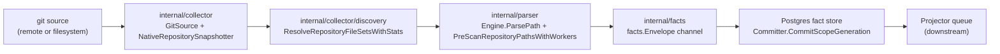
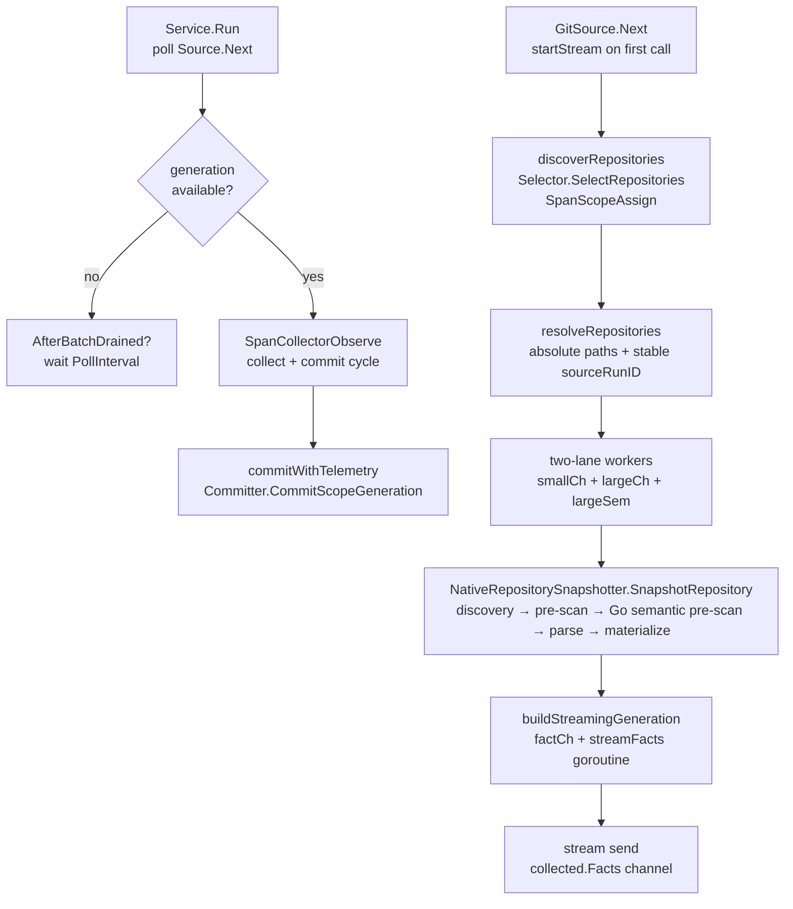

# Collector

## Purpose

`internal/collector` owns git collection, filesystem-direct collection,
repository discovery, snapshot capture, and parser input shaping for Eshu
indexing runs. It turns source repositories into the inputs required by fact
emission: cloned snapshots, native snapshots, discovery reports, file
selections, and entity metadata. It does not make graph projection or
query-time truth decisions — those belong to the projector, reducer, storage,
and query packages.

## Where this fits in the pipeline

## Internal flow

## Lifecycle / workflow

`Service.Run` is the poll-and-dispatch loop. Sources that implement
`ObservedSource` can start `SpanCollectorObserve` once they know the poll is a
real collection attempt, which keeps drained or idle polls out of trace export.
When a generation is available, the span covers source collection and durable
commit. When no generation is ready, the service calls `AfterBatchDrained` if
at least one generation was committed since the last drain, then waits
`PollInterval` (1 second in `cmd/ingester`). Runtimes that must include empty
source batches in a fleet barrier may set `AfterEmptyBatchDrained`; the default
keeps idle polls from running drain hooks, and the opt-in path suppresses
repeated idle-poll hooks until a later generation commit starts a new drain
window. On receipt of a generation it calls `Committer.CommitScopeGeneration`
with the `facts.Envelope` channel and records
`CollectorObserveDuration`, `FactsEmitted`, `GenerationFactCount`, and
`FactsCommitted`.
If the durable commit returns an error and `DeadLetters` is wired, `Service`
records bounded scope/generation replay metadata without storing fact payloads
or local repository paths.

`GitSource.Next` manages a per-batch streaming lifecycle. On the first call per
batch it launches `startStream`, which:

1. Calls `Selector.SelectRepositories` to discover the current repository list
   (span: `SpanScopeAssign`).
2. Resolves all paths to absolute form, orders repositories largest-first by
   file count (`countRepositoryFiles`), and computes a stable `sourceRunID` via
   `facts.StableID`. The `sourceRunID` is derived from the input-order paths, so
   the largest-first reorder never changes the run identity.
3. Classifies repositories into `smallCh` and `largeCh` by file count. The
   count is walked once during step 2 (`countRepositoryFiles`, skipping `.git`,
   `node_modules`, `vendor`, `.venv`, `__pycache__`) and reused here, so the
   tree is not re-walked. `isLargeRepository` exposes the same count to callers
   that need the exact number.
4. Launches `s.SnapshotWorkers` goroutines (default 8). Workers prefer small
   repos; large repos acquire a `largeSem` semaphore (capacity
   `LargeRepoMaxConcurrent`) before snapshotting so at most N large parses run
   concurrently.
5. A coordinator goroutine closes `s.stream` when all workers finish.

Subsequent `Next` calls read one generation from `s.stream`. When the stream
channel closes, `Next` returns `ok=false` and resets for the next discovery
cycle.

For filesystem sources, `NativeRepositorySelector.SelectRepositories` uses a
manifest under the managed repository cache to avoid reselecting unchanged
workspaces. The manifest hashes the files the collector can actually use:
`.gitignore` and `.eshuignore` rule files are included, while files excluded by
those rules are skipped. This keeps local watch mode from creating new
generations for ignored logs, build outputs, or editor scratch files.
For hosted Git sources, update sync lists remote branch heads with
`git ls-remote --symref` without fetching every branch, then update sync
computes a `git diff --name-status -z --find-renames` delta between the previous
checkout HEAD and the fetched remote ref before checkout. Changed and renamed
destination files become `SelectedRepository.FileTargets`; deleted and renamed
source files become repo-relative tombstone paths. Clones still produce a full
snapshot because no prior checkout exists.

`NativeRepositorySnapshotter.SnapshotRepository` runs five sequential stages
per repository:

1. **Discovery** — `resolveNativeSnapshotFileSet` calls
   `discovery.ResolveRepositoryFileSetsWithStats` with repo-local overrides from
   `.eshu/discovery.json`, `.eshu/vendor-roots.json`, `.gitignore`, and
   `.eshuignore` applied before parsing.
2. **Pre-scan** — `engine.PreScanRepositoryPathsWithWorkers` builds the import
   map concurrently.
3. **Go semantic pre-scan** — `engine.PreScanGoPackageSemanticRoots` builds
   package interface escapes, imported receiver method roots, chained receiver
   roots, generic constraint roots, and package import paths for parser options.
4. **Parse** — `buildParsedRepositoryFiles` parses each file through the
   `parser.Engine` worker pool; each parsed file becomes a `map[string]any`
   entry in `snapshot.FileData` and may carry semantic metadata such as
   dead-code root evidence. `snapshotParserOptions` keeps language-specific
   variable scope close to query needs: Java uses module-level variables so
   method locals do not flood canonical graph projection, while dynamic
   languages that rely on local-variable evidence still parse with
   `VariableScope=all`. Terraform parser buckets are mapped explicitly into
   content entities, including backends, imports, moved blocks, removed blocks,
   checks, and lockfile providers. Declared Grafana, Prometheus/Mimir, Loki,
   and Tempo observability parser buckets plus applied Argo CD/Kubernetes
   observability state buckets are emitted as versioned `observability.*`
   source facts during fact streaming, not as graph truth.
5. **Materialize** — `shape.Materialize` turns parsed files into
   `ContentFileMeta` records and `ContentEntitySnapshot` rows. Body strings are
   released after materialization; `streamFacts` re-reads them from disk at emit
   time so snapshot memory is `O(single_file)`.

`buildStreamingGeneration` launches a background goroutine that streams
`facts.Envelope` values through a buffered channel (`factStreamBuffer = 500`).
Delta snapshots add repository fact metadata (`delta_generation`,
`delta_relative_paths`, and `delta_deleted_relative_paths`), emit file and
content tombstones for deleted paths, and skip repo-wide reducer follow-up facts
until reducer-owned shared projection domains have their own file-scoped delta
contract. Full snapshots emit the shell-exec follow-up alongside SQL and
inheritance follow-ups so stale command-execution edges retract when command
calls disappear. Source-local projection and content writes still run for the
changed files in the generation. Delta parsing limits
parse/materialization/fact emission to changed file targets, but keeps pre-scan
over the full discovered parser file set plus explicit targets so imports and Go
package semantic context match a full snapshot.
When the stream re-reads repo-hosted service-catalog descriptors
(`catalog-info.yaml`, `opslevel.yml`, or `cortex.yaml`), it delegates to the
`servicecatalog` normalizer and emits observed `service_catalog.*` facts under
the same scope and generation. A documentation-only lane normalizes repo-hosted
Markdown, lightweight text, HTML, API contracts, notebooks, spreadsheets,
DOCX/XLSX/PPTX summaries, bounded ZIP/TAR packets, and deterministic diagrams
into source-neutral facts with repository target refs. Deterministic diagram
document and section facts carry `incident_media_source_class=diagram_label` so
later correlation work can preserve the media evidence boundary.
Office annotations and hidden content stay metadata-only while visible content still emits facts. External relationships, embedded objects, macro content, malformed containers, unsafe paths, resource limits, and compression hazards block Office extraction; legacy `.xls` cell bytes stay metadata-only. Archive packets preflight first, preserve member path/hash provenance, skip unsupported/nested/credential-like members, and block unsafe or resource-hazard archives from emitting contained sections.
Default-off helper packages may build OCR or media transcript documentation facts
from reviewed local engine output after preflight, but those helpers do not
enable repository media discovery, hosted runtime paths, or truth promotion.
These claims remain document evidence only; projector, reducer, and query stages
own correlation, drift, and truth decisions.
`AfterBatchDrained` runs only after the service has committed at least one
generation and then observes the source batch drain. Idle polls do not trigger
it unless `AfterEmptyBatchDrained` is set for a caller that needs configured
empty source batches to participate in a cross-process barrier. The empty path
is edge-triggered: it runs once for an empty drain window and does not repeat
until a later generation commit resets the window.

No-Regression Evidence: `go test ./internal/collector -run
'TestServiceRun(CallsAfterBatchDrainedOnceAfterCommittedBatch|SkipsAfterBatchDrainedOnEmptyBatchByDefault|CallsAfterBatchDrainedForConfiguredEmptyBatch|CallsEmptyBatchDrainHookOnceWhileIdle)'
-count=1` proves the default hook remains commit-gated and the empty-batch hook
is opt-in and not an idle timer.

No-Observability-Change: `AfterEmptyBatchDrained` only changes whether the
caller-supplied drain hook runs once for an exhausted empty batch. It adds no
metric, span, status field, worker, queue, graph write, or runtime label.

No-Regression Evidence: `go test ./internal/collector ./internal/doctruth ./internal/query ./internal/mcp ./internal/storage/postgres -count=1` covers DOCX, CSV/TSV, XLSX, PPTX, ZIP packet summaries, deterministic diagrams, claim hints, repository fact readback, and MCP routing.

No-Observability-Change: documentation extraction stays inside existing `collector.observe`, body-free snapshot metadata, and stream-time re-reads. It adds no worker, queue, graph write, metric label, runtime knob, or deployment profile.

No-Regression Evidence: `go test ./internal/collector -run
'Test(NativeRepositorySnapshotterCarriesDeletedOnlyDeltaMetadata|NativeRepositorySnapshotterDeltaTargetsKeepFullPreScanContext|NativeRepositorySnapshotterPreservesDeltaMetadataPathWhitespace|UpdateRepositoryReturnsChangedAndDeletedFileTargets|BuildSelectedRepositoriesCarriesGitDeltaFileTargets|BuildStreamingGenerationEmitsDeltaMetadataAndDeletedTombstones|BuildStreamingGenerationPreservesDeltaPathWhitespace|BuildStreamingGenerationDeltaChangedFileFactsMatchFullSnapshot|BuildStreamingGenerationSkipsRepoWideReducerFollowupsForDelta)'
-count=1` proves Git delta parsing, selector propagation, deleted-only
snapshot metadata, full-context pre-scan for targeted deltas, symlink-normalized
path metadata with legal whitespace preserved, tombstone emission, changed-file
fact payload parity against full snapshots, fact count agreement, and
suppression of unsafe repo-wide reducer follow-ups for delta generations.

Performance Evidence: `go test ./internal/collector -run '^$' -bench
'BenchmarkNativeRepositorySnapshotter(FullFixture|DeltaSingleFileFixture)$'
-benchtime=1x -count=1` on an Apple M4 Pro measured a generated 400-file
fixture full snapshot at `107796250 ns/op` and a one-file delta snapshot at
`34240667 ns/op`.

No-Observability-Change: delta parsing reuses hosted git sync logs, snapshot
stage logs, `collector.observe`, fact emission counts, and projector/reducer
queues. It adds no metric name or label and does not log file paths in sync
progress messages.

## Exported surface

- `Service` — poll-and-dispatch loop; wire `Source`, `Committer`,
  `PollInterval`, and optionally `DeadLetters`, `AfterBatchDrained`,
  `AfterEmptyBatchDrained`, `Tracer`, `Instruments`, `Logger`. `DeadLetters`
  records commit failures and clears replay state after later successful commits
- `Source` — interface: `Next(context.Context) (CollectedGeneration, bool, error)`
- `ObservedSource` — optional source interface that receives a
  `StartObserveFunc` and returns a `CollectorObservation` so real collection
  attempts, not idle polls, can share one `collector.observe` span with commit
- `Committer` — interface: `CommitScopeGeneration(ctx, scope, generation, <-chan facts.Envelope) error`
- `GenerationDeadLetterSink` / `GenerationDeadLetter` — optional
  commit-failure sink and bounded replay metadata for generations that fail
  before normal projector work items exist
- `GenerationDeadLetterReplayCompleter`, `GenerationDeadLetterReplayFilter`, and `GenerationDeadLetterReplayResult` — store-facing replay completion/request contracts
- `ClaimedCommitter` — optional fence-aware commit interface used by
  `ClaimedService` so claim ownership can be verified in the same transaction
  that persists facts; hosted claim mutations also carry the work item's tenant
  boundary so storage can re-check the active grant before fact writes
- `CollectedGeneration` — `Scope`, `Generation`, `Facts` channel, `FactCount`,
  optional `DiscoveryAdvisory`
- `GitSource` — implements `Source`; fields include `Selector`,
  `Snapshotter`, `SnapshotWorkers`, `LargeRepoThreshold`,
  `LargeRepoMaxConcurrent`, `StreamBuffer`
- `NativeRepositorySnapshotter` — implements `RepositorySnapshotter`; fields
  include `Engine`, `Registry`, `DiscoveryOptions`, `SCIP`, `ParseWorkers`
- `RepositorySelector` — interface: `SelectRepositories(context.Context) (SelectionBatch, error)`
- `PriorityRepositorySelector` — tries selectors in order and returns the
  first non-empty batch
- `WebhookTriggerRepositorySelector` — claims queued GitHub, GitLab, and
  Bitbucket webhook triggers, syncs only referenced repositories, fails
  unsupported providers, and returns successful syncs as a targeted batch
- `RepositorySnapshotter` — interface: `SnapshotRepository(context.Context, SelectedRepository) (RepositorySnapshot, error)`
- `SelectionBatch` — `ObservedAt` + `[]SelectedRepository`
- `SelectedRepository` — `RepoPath`, `RemoteURL`, `IsDependency`, `DisplayName`,
  `Language`, `FileTargets`, source-observed `GitRefs`, `Delta`, and
  `DeletedRelativePaths`
- `RepositorySnapshot` — `RepoPath`, `RemoteURL`, `FileCount`, `ImportsMap`,
  `FileData`, `ContentFileMetas`, `DocumentationFileMetas`, `ContentEntities`,
  source-observed `GitRefs`, `DiscoveryAdvisory`, optional delta metadata
  for file-scoped Git resyncs, `TaintEvidence`, and dataflow freshness metadata
- `TaintEvidenceSnapshot` — one intraprocedural value-flow taint finding resolved
  to its graph `Function` entity uid, carried as evidence (confidence +
  provenance). Populated only when the parser emits `taint_findings` (gated by
  `ESHU_EMIT_DATAFLOW`); `streamFacts` emits each as a `code_taint_evidence`
  fact. Empty (and byte-identical) when the gate is off
- `InterprocTaintEvidenceSnapshot` — one cross-function value-flow finding
  resolved to the source and sink `Function` entity uids it spans (resolved by
  function name within the file, since the parser `FunctionID` carries the name
  but not the uid; ambiguous or unresolved endpoints are dropped). Populated only
  when the parser emits `interproc_findings`; `streamFacts` emits each as a
  `code_interproc_evidence` fact. Empty (and byte-identical) when the gate is off
- `FunctionSummarySnapshot` — one function's raw value-flow `Effects` read from the
  parser's `dataflow_summaries` bucket, keyed by the durable `FunctionID` (which
  already carries the repository identity, so no entity-uid resolution is needed).
  Populated only when the parser emits `dataflow_summaries`; `streamFacts` emits
  each as a `code_function_summary` fact (on both delta and full generations,
  since each upserts by its `FunctionID`). The reducer reconstructs the `Effects`
  and persists them to the function-summary store for cross-repo composition.
  Empty (and byte-identical) when the gate is off.
- `FunctionSourceSnapshot` — one function's param-level value-flow taint source
  read from the parser's `dataflow_sources` bucket (the entry points the
  cross-repo fixpoint needs as source ports). Populated only when the parser
  emits `dataflow_sources`; `streamFacts` emits each as a `code_function_source`
  fact, keyed idempotently on `(FunctionID, param index)`. The reducer persists
  them to the function-source store. Empty (and byte-identical) when off.
- `DataflowCatalogVersionSnapshot` — one parser-emitted taint catalog content
  hash from `dataflow_catalog_versions`. It is folded into snapshot freshness so
  catalog-only source/sink matcher changes re-run the value-flow path for
  unchanged files. It does not stream as a fact and is empty when the dataflow
  gate is off.

No-Regression Evidence: `go test ./internal/collector -run 'FunctionSummary|FunctionSource' -count=1`,
`go test ./internal/storage/postgres -run 'FunctionSource' -count=1`, and
`go test ./internal/reducer -run 'CodeFunctionSummary' -count=1` prove
`buildFunctionSummaries`/`buildFunctionSources` read the `dataflow_summaries` and
`dataflow_sources` buckets into per-function snapshots; that `streamFacts` emits
one `code_function_summary` fact per function and one `code_function_source` fact
per source, counted in `FactCount`, keyed idempotently; that the function-summary
reducer handler persists the summaries (and, when wired, the sources) to the
durable Postgres stores; and that the new `function_sources` bootstrap schema is
ordered and mirrored on disk. It is one extra fact per summarized function/source
only when the off-by-default value-flow gate is on; no new Cypher, graph write,
worker, queue, or batch. The `contentFactEnvelope`/`contentEntityFactEnvelope`
move into `git_content_fact_envelopes.go` is a pure extraction (no behavior
change) to keep `git_fact_builder.go` under the file-size cap.

`buildFunctionSummaries` additionally resolves each function's graph `Function`
uid (carried on the `code_function_summary` fact as `graph_uid`) so the cross-repo
fixpoint can project findings as `TAINT_FLOWS_TO` edges by uid. The resolution
reuses the same `(relative path, receiver, name)` entity match the per-file
interproc-evidence path uses: `buildInterprocTaintEvidence`'s inline resolver was
extracted to the shared `newFunctionUIDResolver` (a pure refactor —
`TestBuildInterprocTaintEvidence*` is unchanged) and both call it, so both paths
resolve uids identically. An unresolved uid leaves `graph_uid` empty; the summary
still persists (only the graph projection needs it). This adds no fact, no graph
write, and no new instrument — it only populates a field on an existing fact.

No-Observability-Change: the summary facts flow through the existing `streamFacts`
channel and Postgres fact persistence; they add no metric instrument, metric
label, span, worker, queue domain, lease, runtime knob, or log key. Operators
diagnose the path through the existing fact-stream counters.

- `DataflowScanned` — true when the value-flow gate (`ESHU_EMIT_DATAFLOW`) ran for
  the snapshot, independent of whether any findings were produced. `streamFacts`
  emits one per-generation `code_dataflow_scanned` marker fact when it is set, only
  on full (non-delta) generations. The marker carries no findings; it is the
  reconciliation signal that lets the reducer retract stale value-flow evidence
  when a full generation's finding set goes empty (#2919). It is intentionally not
  emitted on deltas: a delta carries only changed-file findings while the evidence
  reducers retract the whole scope before writing, so a marker-triggered delta
  would wipe evidence for unchanged files. False — and no marker — when the gate is
  off, preserving the byte-identical-when-off guarantee.

No-Regression Evidence: `go test ./internal/collector -run 'DataflowScanned' -count=1`
and `go test ./internal/projector -run 'Marker|QueuesBoth' -count=1` prove the
marker is emitted (and counted in `FactCount`) only when `DataflowScanned` is set,
is absent when the gate is off, and that the projector queues both the
`code_taint_evidence` and `code_interproc_evidence` retraction intents from the
marker alone. The marker is one extra fact per generation only when the
off-by-default gate is on; no new Cypher, graph write, worker, queue, or batch.

No-Observability-Change: the marker flows through the existing `streamFacts`
channel and Postgres fact persistence; it adds no metric instrument, metric
label, span, worker, queue domain, lease, runtime knob, or log key. Operators
diagnose it through the existing fact-stream counters and the reducer
claim/execute spans for the value-flow evidence domains.
- `ContentFileSnapshot`, `ContentFileMeta`, `ContentEntitySnapshot` — portable
  file and entity records; `ContentFileMeta` carries no body string. Declared
  PagerDuty module/tfvars rows materialize as `PagerDutyDeclaration` content
  entities from Terraform source evidence, not live PagerDuty incident or
  configuration truth. Declared Grafana folder, dashboard, datasource,
  alert-rule, Prometheus/Mimir scrape config, metric rule, metric route, Loki
  log route, Tempo trace route, and coverage-warning rows remain metadata-only
  `observability.*` facts with dashboard JSON, query bodies, scrape targets,
  remote-write URLs, Loki or Tempo route URLs, tenant header values, tenant
  IDs, datasource URLs, log label values, trace tag values, raw trace IDs,
  request attributes, and secret fields omitted.
- `RepoSyncConfig` — all env-driven sync configuration; populated by
  `LoadRepoSyncConfig`
- `LoadRepoSyncConfig(component, getenv)` — parses the repo-sync env contract
- `LoadWebhookTriggerHandoffConfig(defaultOwner, getenv)` — parses the shared
  webhook-trigger handoff env contract used by collector runtimes
- `LoadDiscoveryOptionsFromEnv(getenv)` — parses `ESHU_DISCOVERY_IGNORED_PATH_GLOBS`
  and `ESHU_DISCOVERY_PRESERVED_PATH_GLOBS`
- `LoadSnapshotSCIPConfig(getenv)` — parses the SCIP env contract
- `SnapshotSCIPConfig` — `Enabled`, `Languages`, `Indexer`, `Parser`,
  `Workers`
- `DiscoveryAdvisoryReport` — operator-facing JSON summary of discovery and
  materialization shape per snapshot run
- `RegistryFailure` — bounded registry collector error type that carries
  `FailureClass` and `FailureDetails` for workflow status without exposing
  private registry hosts, repositories, packages, tags, digests, accounts,
  paths, or credential references
- `RegistryHTTPFailure` and `RegistryTransportFailure` — helpers used by
  registry runtimes to classify auth denied, not found, rate limited,
  retryable, canceled, and terminal registry failures
- `ClaimedService` — wraps `Service` with a `ClaimControlStore` for workflow
  collection; `MaxAttempts` bounds per-work-item retries and escalates recurring
  retryable failures to `attempt_budget_exhausted` (issue #612; `0` is legacy).
  Hosted work items copy tenant identity into commit mutations. Retryable
  source errors exposing `RetryAfterDelay()` set retry `visible_at` to the
  larger of poll interval and provider guidance without changing fact output.
  A configured `ClaimDispatcher` can choose the next claim target across
  collector families before the service enters the same heartbeat, commit,
  retry, terminal-failure, release, and completion path.
- `FairClaimDispatcher` — applies `workflow.FamilyFairnessScheduler` to a
  bounded candidate set and delegates each selected target to
  `ClaimControlStore.ClaimNextEligible`; empty target lanes are skipped during
  the same poll without changing Postgres FIFO ordering inside a selected
  collector instance.
- `FailureClassAttemptBudgetExhausted` — exported failure-class label that
  `ClaimedService` writes to `workflow_claims.failure_class` and
  `workflow_work_items.last_failure_class` when the retry budget escalates a
  claim. Operators read this label to attribute terminal failures to the
  bounded-retry guard versus other terminal-classified causes.
- `FactsFromSlice` — test helper: builds a `CollectedGeneration` from a
  pre-built `[]facts.Envelope` slice
- `terraformstate` subpackage — exact Terraform-state source readers and
  streaming parser primitives that emit redacted Terraform-state facts
- `tfstateruntime` subpackage — claim-aware Terraform-state runtime adapter that
  resolves exact candidates, opens the matching state source, and emits a
  fenced collected generation for `ClaimedService`
- `packageregistry` subpackage — package-registry identity normalization,
  runtime target contracts, metadata parsing, claim runtime, and
  reported-confidence package fact-envelope construction for the
  `package_registry` collector family
- `ociregistry` subpackage — OCI registry identity, provider adapters,
  runtime scan orchestration, and reported-confidence container image facts
- `sbomruntime` subpackage — claim-aware hosted SBOM and attestation runtime
  that fetches configured documents or OCI referrer artifact blobs, delegates
  SBOM parsing to `sbomdocument`, and emits in-toto attestation facts without
  making reducer attachment truth decisions
- `sdk` subpackage — first-party shared helpers for bounded HTTP execution,
  safe provider failures, retry-after parsing, and common status classification
- `pagerduty` subpackage — PagerDuty incident, lifecycle, related change-event,
  and optional live configuration source facts for downstream correlation.
- `tempo` subpackage — live Tempo trace-signal metadata collection for source
  instances, tag names, bounded tag values, and coverage warnings.
- `cicdrun` subpackage — fixture-backed CI/CD provider normalization and
  reported-confidence run, job, step, artifact, trigger, environment, and
  warning fact-envelope construction for the `ci_cd_run` collector family
- `servicecatalog` subpackage — Backstage, OpsLevel, and Cortex manifest
  normalization for the `service_catalog` collector family. The Git collector
  calls it only for repo-hosted catalog descriptors and emits provenance-only
  facts that downstream projector/reducer code correlates.
- `grafana` subpackage — claim-driven live Grafana API metadata collection for
  the `grafana` collector family. It emits reported-confidence observed
  observability source facts for folders, dashboards, datasources, alert rules,
  and coverage warnings without retaining dashboard JSON, query models,
  datasource URLs, contacts, notification routes, credentials, or private URLs.
- `prometheusmimir` subpackage — claim-driven live Prometheus-compatible API
  metadata collection for the `prometheus_mimir` collector family. It emits
  reported-confidence observed observability source facts for active targets,
  rules, and coverage warnings without retaining metric samples, raw PromQL,
  scrape target URLs, target label values, annotations, tenant IDs, credentials,
  or private URLs.
- `loki` subpackage — claim-driven live Loki API metadata collection for the
  `loki` collector family. It emits reported-confidence observed observability
  source facts for log signals, rules, and coverage warnings without retaining
  log lines, raw LogQL, label values, tenant IDs, credentials, private URLs, or
  provider response bodies.
- `scannerworker` subpackage — scanner-worker claim processing, analyzer port,
  bounded target scope, resource limits, source-fact output validation, and
  retry/dead-letter payloads. Concrete heavy analyzers plug in behind this
  boundary.

## Dependencies

- `internal/collector/discovery` — `ResolveRepositoryFileSetsWithStats`,
  `Options`, `RepoFileSet`, `DiscoveryStats`
- `internal/parser` — `Engine`, `Registry`, `Options`, `DefaultEngine`,
  `DefaultRegistry`, `SCIPIndexer`, `SCIPIndexParser`, `SCIPParseResult`
- `internal/facts` — `facts.Envelope`, `facts.StableID`
- `internal/scope` — `scope.IngestionScope`, `scope.ScopeGeneration`
- `internal/content/shape` — `shape.Materialize`, `shape.Input`
- `internal/repositoryidentity` — `MetadataFor`
- `internal/telemetry` — spans, metrics, structured logging

## Telemetry

- Spans: `SpanCollectorObserve` (`collector.observe`) wraps each collect and
  commit cycle for sources that implement `ObservedSource`,
  `SpanCollectorStream` (`collector.stream`) wraps the full stream lifecycle;
  `SpanScopeAssign` (`scope.assign`) wraps repository discovery;
  `SpanFactEmit` (`fact.emit`) wraps per-repo snapshotting
- Metrics: `eshu_dp_collector_observe_duration_seconds`,
  `eshu_dp_scope_assign_duration_seconds`, `eshu_dp_fact_emit_duration_seconds`,
  `eshu_dp_repo_snapshot_duration_seconds`, `eshu_dp_file_parse_duration_seconds`,
  `eshu_dp_repos_snapshotted_total` (labeled `status=succeeded/failed`),
  `eshu_dp_facts_emitted_total`, `eshu_dp_facts_committed_total`,
  `eshu_dp_fact_batches_committed_total`, `eshu_dp_generation_fact_count`,
  `eshu_dp_discovery_files_skipped_total` (labeled `skip_reason`),
  `eshu_dp_large_repo_classifications_total` (labeled `repo_size_tier`),
  `eshu_dp_large_repo_semaphore_wait_seconds`,
  `eshu_dp_scip_process_wait_seconds`
- Log events: `git repository sync started`,
  `git repository sync progress`, `git repository sync completed`,
  `git repository sync failed`, `collector stream started`,
  `collector snapshot stage completed`
  (stages: `discovery`, `pre_scan`, `go_package_semantic_prescan`, `parse`,
  `materialize`; the Go semantic pre-scan stage includes
  `go_package_target_count`, and the `parse` stage includes bounded
  `language_parse_summary` rows with file count and parse duration totals per
  language), `collector snapshot completed`,
  `collector commit succeeded / failed`, `collector stream completed / failed`,
  `large repository queued`, `large repo semaphore acquired / released`

## Operational notes

- `ESHU_SNAPSHOT_WORKERS` (default `min(NumCPU,8)`) controls concurrent
  per-repo snapshotting. Raising this value beyond CPU capacity increases
  context-switching without reducing wall time.
- `ESHU_PARSE_WORKERS` partitions parser-supported files by stable repository
  subtree before concurrent native parsing. Partitions are balanced by total
  on-disk bytes, not file count, so a subtree dominated by a few heavy files
  does not pin one parse worker. Subtrees heavier than one worker's byte target
  are split into deterministic byte-balanced chunks; lighter subtrees stay whole
  so a single large monorepo can keep multiple parse workers busy while the
  composed snapshot is sorted back to the original file order.
- `ESHU_REPO_SHARD_COUNT` and `ESHU_REPO_SHARD_INDEX` deterministically filter
  discovered repository IDs before filesystem or Git sync begins. The shard hash
  uses only the normalized repository ID; shard IDs are not part of repository,
  file, entity, or fact identity. The existing `sourceRunID` still reflects the
  selected batch for that process. Helm does not enable horizontal ingester
  replicas until the global deferred-maintenance hook has a fleet-wide drain
  barrier.
- `ESHU_LARGE_REPO_FILE_THRESHOLD` (default `1000`) classifies repositories for
  the large-repo semaphore. The classification is a fast pre-scan that exits
  early once the threshold is exceeded.
- Repo-local `.eshu/discovery.json` and `.eshu/vendor-roots.json` override default
  discovery options before the operator-level `ESHU_DISCOVERY_IGNORED_PATH_GLOBS`
  overlay is applied.
- Default discovery prunes generated dependency/cache directories by precise
  names such as `node_modules`, `vendor`, `.gradle`, and `.m2`, but it does not
  prune a generic `packages` directory. npm, pnpm, Yarn, and many polyglot
  monorepos use `packages/<workspace>` for authored source, manifests, and
  lockfiles. Generated package caches under that name need repo-local
  `.eshuignore`, `.eshu/discovery.json`, or operator ignored-path globs so the
  exclusion is visible in discovery stats.
- Filesystem manifest fingerprints include `.gitignore` and `.eshuignore` rule
  files but exclude paths filtered by those rules. Changing an ignore rule
  reselects the repository; changing only ignored output does not.
- Two-phase streaming: `ContentFileMeta` carries no body; `streamFacts`
  re-reads file bodies from disk at emit time. The OS page cache keeps re-reads
  fast. Do not change this design to in-memory bodies without accounting for
  `O(repo_size)` memory growth on large repositories.
- Repo-hosted service-catalog manifests are detected by exact descriptor
  filename (`catalog-info.yaml`/`.yml`, `opslevel.yml`/`.yaml`,
  `cortex.yaml`/`.yml`) during the same content streaming pass. Ordinary YAML
  files and Cortex scorecard descriptors stay ordinary content until a dedicated
  runtime slice opens that contract.
- No-Regression Evidence: nested npm workspace package manifests and lockfiles
  under `packages/<workspace>` remain discoverable by default. The focused gate
  is
  `go test ./internal/collector -run TestResolveNativeSnapshotFileSetKeepsNestedNPMWorkspaceManifests -count=1`,
  which proves root and nested `package.json` / `package-lock.json` files land
  in discovery while `packages` is not counted as a pruned directory.
- No-Observability-Change: keeping authored `packages/<workspace>` trees in
  discovery uses the existing discovery stats, `collector snapshot stage
  completed` logs, `collector.observe`, `collector.stream`,
  `eshu_dp_repos_snapshotted_total`, `eshu_dp_file_parse_duration_seconds`,
  and generation/fact counters. It adds no new runtime, worker, queue, graph
  write, span, metric label, or status field.
- No-Regression Evidence: native parse subtree partitioning preserves snapshot
  composition. `go test ./internal/collector -run
  'Test(BuildParseSubtreePartitionsSplitsStableSubtrees|PartitionedConcurrentParseMatchesSequentialComposition|NativeRepositorySnapshotterLogsSnapshotStageTimings)'
  -count=1` proves stable partition planning, deterministic sequential versus
  concurrent output, and parse-stage partition logging.
- Performance Evidence: focused local parse benchmark command:
  `go test ./internal/collector -run '^$' -bench BenchmarkPartitionedParseLargeMonorepo -benchtime=1x -benchmem -count=1`.
  On 2026-06-18 on Apple M4 Pro, the same 96-file synthetic large monorepo
  fixture measured `workers_1` at 12.884 ms/op, 2.32 MB/op, 37,181 allocs/op
  and `workers_4` at 7.232 ms/op, 2.39 MB/op, 37,463 allocs/op.
- Observability Evidence: the existing `collector snapshot stage completed`
  parse log now includes `parse_partition_count` alongside `parse_workers`,
  file counts, skipped counts, and `language_parse_summary`. Existing
  `eshu_dp_file_parse_duration_seconds` and `eshu_dp_files_parsed_total` metrics
  continue to report per-file parse timing and success/skipped counts without
  adding high-cardinality path or partition labels.
- Performance Evidence: On 2026-05-15, pprof from the remote full-corpus
  Compose run showed bootstrap startup CPU in filesystem repository copy and
  ignore matching before graph projection began. A focused local benchmark for
  literal ignore patterns improved from 2.35-2.44 us/op, 656 B/op, and 10
  allocs/op at `4d31617` to 1.11-1.13 us/op, 96 B/op, and 1 alloc/op after
  routing non-glob `.gitignore` and `.eshuignore` rules through literal
  matching.
- Observability Evidence: The existing `collector snapshot stage completed`
  logs, `SpanScopeAssign`, `SpanCollectorStream`, and pprof profiles expose the
  selector/copy window separately from per-repository discovery, pre-scan,
  parse, materialize, commit, and projection stages.
### Giant-repo collection scheduling (issue #3711)

Full-corpus measurement (896 repos, remote Compose run) showed collection
wall-time dominated by a giant-repo tail: per-stage totals were parse ~1586 s,
materialize ~449 s, and pre-scan ~350 s (parallel), with a single 16,659-file
repository's parse taking ~1012 s (~0.49 s/file, ~10x the normal per-file cost).
Parse is already 8-way parallel and count-balanced, yet repositories were
dispatched in discovery order, so the giants clustered at the end and serialized
the tail.

This change orders repositories largest-first in `resolveRepositories` so the
heaviest repos start before the small-repo bulk and overlap with it instead of
serializing at the end. The file count walked for ordering is reused for the
existing small/large lane classification, so no second tree walk is added.

- Performance Evidence (measured, full-corpus 895-repository run, PostgreSQL 18 +
  NornicDB): the giant repos are enqueued first (verified by the order of the
  `large repository queued` log) and parsed concurrently with the small-repo bulk
  rather than serializing at the tail. The ordering guarantees enqueue order, not
  start order: the worker loop prefers the small lane, so the largest-first
  *start* overlap is best-effort and scheduler/backpressure-dependent (in this run
  the large-repo semaphore waits were ~90-100 s, not the full small-bulk, so the
  overlap held). Making early giant start guaranteed regardless of classifier
  timing is tracked as a follow-up (issue #3839); the byte-balanced parse win
  below is independent of scheduling and already guaranteed. The clean, attributable
  metric is the parse stage (the collection work this change targets, unconfounded
  by the downstream projection consumer): the worst single-repository parse
  dropped from ~1012 s to ~238 s and the total parse stage from ~1586 s to ~675 s
  versus the pre-change run, combining this ordering change with the byte-balanced
  partitioning below. Two giant repositories parse at a time under the existing
  large-repo semaphore (`large_repo_max_concurrent`, default 2), so giants 3+ wait
  ~90-100 s for a slot — a pre-existing cap, not introduced here. Caveat: the
  end-to-end collector-stream wall-time is pipelined against projection
  backpressure and so is dominated by the projection consumer's wall-time (which
  varied ~17% run-to-run from NornicDB write timing, a phase this change does not
  touch); the per-stage parse durations above are the isolated collection metric.
  Focused proof of the ordering and the preserved repo set: `go test
  ./internal/collector -run
  'Test(ResolveRepositoriesSortsLargestFirst|ResolveRepositoriesStableForEqualCounts|IsLargeRepositoryReturnsExactCount)'
  -count=1`.
- Observability Evidence: the per-repo `eshu_dp_repo_snapshot_duration_seconds`
  histogram now carries the bounded `repo_size_tier` (`small`/`large`)
  dimension so an operator can slice giant-repo cost by size without the
  unbounded cardinality of a raw file-count label. The exact per-repo
  `file_count` remains on the existing `collector snapshot completed` structured
  log. No new instrument or pipeline stage is introduced; `repo_size_tier` is an
  already-registered telemetry dimension.

### Dedicated large-lane scheduler (issue #3839)

The #3711 largest-first ordering guaranteed enqueue order but not start order:
if the classifier fully drained smallCh before any worker ran, a small-preferring
worker could grab all small repos first and delay giant start by the full
small-repo bulk. Issue #3839 hardens this to a scheduling guarantee.

The first `min(LargeRepoMaxConcurrent, workers)` workers (minus one reserved
small-lane worker when the cap meets the worker count) run `runLargePreferring`:
each reserves a semaphore slot and then block-selects the large lane, so a giant
starts the instant it is enqueued regardless of how many smalls are buffered in
smallCh. The remaining workers run `runSmallPreferring` (the original loop),
ensuring small repos drain even when largeCh is empty or slow.

- Performance Evidence: the #3839 dedicated-large-lane scheduler makes the
  largest-first early-giant-start **guaranteed** rather than
  scheduler-timing-dependent. The first `min(LargeRepoMaxConcurrent, workers)`
  workers (minus one reserved small-lane worker when the cap meets the worker
  count) run a large-preferring loop that reserves a semaphore slot then
  block-prefers the large lane, so a giant starts the instant it is enqueued.
  No new wall-time claim beyond #3711's measured full-corpus giant-repo parse
  result (1012 s → 238 s); this change hardens the overlap. Proven
  deterministically by `TestSchedulerRolePrefersGiantOverFrontLoadedSmallLane`
  (giant-first vs small-first, scheduler-level, free of the startup race) and
  the cap/leak/error/small-reserve invariant tests in
  `git_source_scheduler_invariant_test.go`. Focused proof: `go test
  ./internal/collector -run
  'Test(SchedulerRolePrefersGiantOverFrontLoadedSmallLane|SchedulerSemaphoreCapNotExceeded|SchedulerNoSemaphoreLeakOnCtxCancel|SchedulerSemaphoreReleasedOnSnapshotError|SchedulerSmallWorkerReservedWhenCapEqualsWorkers)'
  -count=1 -race`.
- No-Observability-Change: no new metric or span is added. The existing
  `eshu_dp_large_repo_semaphore_wait_seconds` histogram and
  `eshu_dp_large_repo_classifications_total` counter (emitted via
  `git_source_stream.go` and `git_source_scheduler.go`) let an operator see
  giant start order and concurrency; the `large repo semaphore acquired` /
  `large repo semaphore released` structured logs record per-giant wait and hold
  duration. These existing signals cover the change surface without new
  instruments.

### Size-aware parse-partition balancing (issue #3711)

Within a single repository, parse work was partitioned by file *count*: a
subtree was split into chunks of `ceil(fileCount/workers)` files. That balances
file count, not parse cost, so a subtree with a few huge files pinned one parse
worker while others idled. In the measured full-corpus run a single
16,659-file repository's parse took ~1012 s (~0.49 s/file, ~10x normal),
consistent with a few heavy files/subtrees dominating its partitions.

This change balances partitions by total on-disk bytes (`os.Stat` size, summed)
instead of file count. Subtrees lighter than one worker's byte target stay
whole; heavier subtrees are split into byte-balanced chunks so their heavy files
spread across workers. Stat failures fall back to a default weight so no file is
dropped. The partitions cover the exact same file set (same indexes, no drop, no
duplicate), so the parse result is byte-identical — only the worker distribution
changes.

- Performance Evidence (measured, full-corpus 895-repository run): baseline is the
  count-based partitioning where one giant repository's parse ran ~1012 s with
  heavy files clustered in a few partitions; with byte-balanced partitioning the
  same repository's worst parse stage dropped to ~238 s and the total parse stage
  across the corpus fell from ~1586 s to ~675 s, within the fixed
  `ESHU_PARSE_WORKERS` budget. The ~238 s residual is the giant repository's
  irreducible parse — a partition cannot split below a single file, so one
  multi-megabyte authored file still parses on one worker (files already skipped
  as minified/generated/vendored under #3679 are excluded; these are kept,
  authored files). `materialize` (~458 s total, serial, untouched here) is now
  co-equal with the parse residual and is the next collection target. Correctness
  and balance proof:
  `go test ./internal/collector -run
  'Test(BuildParseSubtreePartitionsCoversExactFileSet|BuildParseSubtreePartitionsSpreadsHeavyFiles|BuildParseSubtreePartitionsEdgeCases|BuildParseSubtreePartitionsSplitsStableSubtrees|PartitionedConcurrentParseMatchesSequentialComposition)'
  -count=1` proves the union of partitions equals the input file set exactly,
  heavy files spread instead of clustering, the empty/single/all-same-size edge
  cases hold, and the concurrent parse output still matches the sequential
  composition byte-for-byte.
- No-Observability-Change: parse-partition balancing changes only how files are
  grouped across the existing parse workers. The existing
  `eshu_dp_file_parse_duration_seconds`, `eshu_dp_files_parsed_total`, and the
  `collector snapshot stage completed` parse log (`parse_workers`,
  `parse_partition_count`) continue to report parse timing and partition shape;
  no metric, span, log field, or label is added or removed.

- Collector Performance Evidence: declared Prometheus/Mimir, Loki, and Tempo source
  facts reuse the existing repository parse and fact-stream pass. The focused
  proof is
  `go test ./internal/parser/yaml ./internal/parser/hcl ./internal/collector ./internal/facts -count=1`;
  it covers bounded metadata rows for Prometheus Operator resources, Helm
  values, OTel metric and log routes, OTel Prometheus receiver scrape configs,
  Promtail client routes, Loki gateway values, Grafana Loki datasource
  references, OTel trace routes, Tempo gateway values, Grafana Tempo datasource
  links, and Git fact emission without adding provider calls, queue workers,
  graph writes, or reducer stages.
- Collector Observability Evidence: declared Prometheus/Mimir, Loki, and Tempo facts
  use the existing Git collector telemetry listed in this section:
  `collector.observe`, `collector.stream`, `fact.emit`,
  `eshu_dp_file_parse_duration_seconds`, `eshu_dp_generation_fact_count`,
  `eshu_dp_facts_emitted_total`, and `eshu_dp_facts_committed_total`.
- No-Observability-Change: this slice adds parser buckets and fact mappings
  only. It adds no metrics, spans, logs, status fields, or metric labels.
- Collector Deployment Evidence: no hosted Deployment, Service, ServiceMonitor,
  Helm values, or Docker Compose path changes. Declared
  Prometheus/Mimir/Loki/Tempo extraction runs inside the existing Git
  repository collector and remains separate from future live
  Prometheus/Mimir/Loki/Tempo provider collectors.
- Parser variable scope is part of performance and truth. Java defaults to
  module-level variables during native snapshots because dead-code candidates
  and Java call inference do not need every method-local declaration as a
  canonical `Variable` node. Keep JS/TS/Python local-variable coverage intact
  unless their query contracts change.
- SCIP indexing is opt-in for `python,typescript,javascript,go,rust,java,cpp,c`.
  Set `SCIP_INDEXER=1`, `true`, `yes`, or `on` to enable it when the matching
  `scip-*` binary is available. Unset, unrecognized, `false`, `0`, `no`, and
  `off` values keep native-only parsing. Set `SCIP_LANGUAGES` to narrow the SCIP
  language. Missing binaries, indexer/parser failures, or selected files absent
  from `index.scip` fall back to native parser output. No-Regression Evidence:
  `TestSCIPSnapshotKeepsSelectedFilesMissingFromIndex`.
  Performance Evidence: baseline unset `SCIP_INDEXER` could enter the shared
  SCIP process limiter and launch an external indexer when an allowed language
  and matching `scip-*` binary were present. After this slice, unset
  `SCIP_INDEXER` returns `Enabled=false`, records one
  `eshu_dp_scip_snapshot_attempts_total{language="unknown",result="disabled"}`
  attempt, and returns to native parser workers without binary lookup, process
  wait, indexer execution, protobuf parsing, queue work, graph writes, or extra
  rows. Backend/version: local Go test runtime with fixture Python and mixed
  Python/Go repositories, no Postgres/NornicDB/Neo4j/provider required. After
  measurement: `go test ./internal/collector -run
  'Test(LoadSnapshotSCIPConfig|SCIPSnapshot|SCIPLanguage|SCIPWorkers)'
  -count=1` passed and proves default-off, explicit-on, binary fallback,
  subtree fan-out, missing-index fallback, and worker-limit behavior.
  Observability Evidence: bounded SCIP fallback logs name language, reason, and
  failure class; `eshu_dp_scip_process_wait_seconds` exposes shared process
  limiter saturation by language; parse logs, metrics, and fact counters
  diagnose fallback. No-Observability-Change: no metric name, metric label,
  span, status field, log field, worker, queue, graph write, runtime endpoint,
  deployment profile, or provider configuration is added.
- Terraform-state ingestion currently uses explicit sources and Git-observed
  backend facts. The #140 target design adds repo-local `.tfstate` candidates
  as advisory metadata, but those candidates must not route raw state through
  Git content persistence or parse state as normal repository content.
- Terraform-state claim processing records `eshu_dp_tfstate_claim_wait_seconds`
  and uses `tfstate.collector.claim.process` around the claimed work boundary.
- `ClaimedService.MaxAttempts` is the bounded retry budget per work item. Wire
  per-collector commands to `workflow.DefaultClaimMaxAttempts()` unless a
  deployment-specific override is required.
- `AfterBatchDrained` is a batch boundary hook, not a timer callback. Use it for
  work that should follow committed collection, and keep idle-poll behavior in
  `Source.Next` or the coordinator layer.
- Unclaimed collector services should wire `DeadLetters` when their commit path
  can fail before projector work items exist. Replay is source-level after the
  operator fixes the commit failure; dead-letter metadata cannot reconstruct a
  consumed fact stream. Successful later commits mark unresolved rows
  `replayed`; claim-driven services still use workflow claims for requeue.
- No-Regression Evidence: collector generation dead-letter recording is covered by
  `go test ./internal/collector -run 'TestServiceRunRecordsGenerationDeadLetterWhenCommitFails|TestServiceRunPropagatesDurableCommitErrors' -count=1`.
- Observability Evidence: commit failures still surface through the existing
  collector commit error path and `collector.observe` span. The Postgres sink
  exposes `/admin/status`, hosted readiness, and
  `eshu_runtime_collector_generation_*` count/age gauges.

## Repository basename-collision diagnostic (issue #3677)

`NativeRepositorySelector` emits an observability signal after filesystem-mode
discovery when the same repository basename appears at more than one discovered
path. This is a HEURISTIC for likely accidental corpus nesting (e.g. the 4×
inflation caused by `repos/repos/repos/…` recursive copies), not a true
duplication check: distinct repositories can legitimately share a basename
(`org-a/utils` and `org-b/utils`, or monorepo `common/` directories). The signal
does not change which repos are indexed.

The report fires only on a changed batch: it runs after
`syncFilesystemRepositories`, which returns an empty path set for an unchanged
corpus (fixture-manifest match,
[`git_selection_filesystem.go`](git_selection_filesystem.go) lines 29-32). The
report is gated on a non-empty sync, so it fires on the first run and whenever
the on-disk corpus changes, and stays silent on steady-state re-polls under
`Service.Run` — no per-interval log or metric spam for an unchanged corpus.

Observability Evidence: `eshu_dp_repository_basename_collision_total` is a
plain counter (no path or basename labels; those are unbounded) that advances
by the number of surplus (non-first) colliding paths detected in one cycle. A
non-zero value is a LIKELY signal of accidental corpus nesting and warrants
inspecting the logged paths before concluding duplication. Read the accompanying
structured warning log (`"repository basename collision detected (possible
accidental corpus nesting)"`, with fields `identity`, `path_count`,
`surplus_count`, and `path_sample`) to see which basename collides and a bounded
sample (up to 5) of the offending paths. `surplus_count` (= `path_count` − 1)
reconciles the log with the metric delta. Together, the metric fires an alert
and the log provides the investigation anchor an operator needs to triage the
corpus without DB forensics.

No-Regression Evidence: `reportRepositoryBasenameCollisions` runs O(n) over the
already-discovered `repositoryIDs` slice (a single-pass `map[string][]string`
group, no filesystem I/O, no git exec, no extra directory walk beyond what
`discoverRepoRoots` already performed). It runs only on a changed batch in
filesystem mode (gated on a non-empty sync), adds negligible wall time, and does
not alter selection or indexing behaviour. The changed-batch gate is stateless
(it reads only the sync result), so it is safe under the single `Service.Run`
polling goroutine without added synchronisation.

The report has three correctness properties relevant to issue #3700:

- **Completeness (pre-shard set).** It inspects the full pre-shard
  `selection.RepositoryIDs`, not the post-shard subset passed to the sync
  function. With sharding active, colliding basenames (e.g. `worker` and
  `repos/worker`) may hash into shard buckets that no single shard's post-shard
  subset holds together via FNV32a, so a per-shard check is permanently silent
  even though the corpus is inflated. Using the pre-shard set means the global
  collision is always visible. This applies identically in copy mode and
  `ESHU_FILESYSTEM_DIRECT=true` mode (both share the same call site and gate); the
  diagnostic fires in direct mode on a nested corpus at the unsharded default
  exactly as it does in copy mode.
- **Single-emit (index-0 shard).** Because every shard instance inspects the same
  global pre-shard set, the report runs only on the index-0 shard
  (`RepoShardIndex == 0`). Letting all `N` shards report would inflate one real
  collision into `N` duplicate WARN lines and an `N×` metric reading, breaking any
  alert threshold tuned to the true surplus. Pinning to shard 0 fires the global
  signal exactly once per changed batch. Shard 0 exists for any shard count `>= 1`,
  and at the unsharded default the index is 0, so single-instance behaviour is
  unchanged.
- **Changed-batch anti-spam, decoupled from ownership.** The emit gate keys on
  `corpusChanged` — the full-corpus changed signal returned by
  `syncFilesystemRepositories` (the `FilesystemRoot` fingerprint vs the stored
  manifest) — NOT on `len(repoPaths)`. `repoPaths` is the index-0 shard's *own*
  materialized subset, which is empty whenever every colliding repo hashes to a
  non-zero shard. Gating the emitter on its own subset would silence the
  diagnostic exactly in the inflated-corpus case it targets (issue #3700 P2, Codex
  review on PR #3706). The fingerprint covers the whole root, so `corpusChanged`
  is identical on every shard: the designated emitter fires regardless of which
  repos it owns, and stays silent on an unchanged re-poll (`corpusChanged` is
  false). At the unsharded default this is equivalent to the old
  `len(repoPaths) > 0` gate, since shard 0 then owns the full set.

Verified by
`go test ./internal/collector -run 'TestReportRepositoryBasenameCollisions|TestNativeRepositorySelectorFilesystem_BasenameCollision|TestNativeRepositorySelectorFilesystemDirect' -count=1`
(10 tests): the five unit tests (collisions-fire, no-collisions-silent, nil-safe,
empty-silent, counter-matches-surplus-count); the end-to-end
`TestNativeRepositorySelectorFilesystem_BasenameCollisionWarning`;
`TestNativeRepositorySelectorFilesystem_BasenameCollisionOnlyOnChange` (fires on
first run, silent on unchanged re-poll, re-fires on change);
`TestNativeRepositorySelectorFilesystemDirect_NestedCorpusCollisionFires` (direct
mode at the unsharded production default — the #3700 regression);
`TestNativeRepositorySelectorFilesystemDirect_ShardedCollisionSingleEmit` (sharded
direct mode: the global collision fires from shard 0 only, aggregate metric
equals the true surplus rather than `N×`); and
`TestNativeRepositorySelectorFilesystemDirect_CollisionFiresWhenShardZeroEmpty`
(the colliding pair hashes entirely to a non-zero shard so shard 0 owns nothing;
the diagnostic still fires once from shard 0 via `corpusChanged`, and the re-poll
stays silent — the #3700 P2 regression).

## Extension points

- `RepositorySelector` — replace `NativeRepositorySelector` with any
  implementation to change how repositories are discovered
- `PriorityRepositorySelector` — compose a high-priority selector, such as
  webhook-triggered refresh, ahead of scheduled polling
- `RepositorySnapshotter` — replace `NativeRepositorySnapshotter` with any
  implementation to change how repositories are snapshotted
- `Source` / `Committer` — both are interfaces; test implementations substitute
  recording or controlled-error variants
- `SnapshotSCIPConfig.Indexer` and `.Parser` — injectable seams for testing SCIP
  paths without external binaries

## Gotchas / invariants

- `GitSource.startStream` performs synchronous discovery before launching
  snapshot workers. A slow `Selector.SelectRepositories` (e.g. slow GitHub API
  response) blocks the entire stream start.
- Large-repo semaphore is acquired inside the worker select loop, not inside
  `processRepo`. This means a worker never blocks waiting for the semaphore while
  small repos are available (`git_source.go:419-431`).
- `streamErr` is written by the coordinator goroutine and read by `Next` only
  after the stream channel closes. The happens-before guarantee is that
  `close(s.stream)` happens-before the receive in `Next` that returns
  `ok=false`.
- Absolute paths: `resolveRepositories` calls `filepath.Abs` on every selected
  repo path before building the `sourceRunID` hash. Do not pass relative paths
  to `NativeRepositorySnapshotter.SnapshotRepository` — it calls
  `filepath.Abs` again but the fact IDs would differ.
- Filesystem manifests must stay aligned with copy/direct snapshot filtering.
  If `fingerprintTree` starts hashing ignored generated files, local watch mode
  can keep publishing newer generations and supersede projector work before the
  graph settles.
- Webhook trigger selection is a wake-up path only. It may prioritize a GitHub,
  GitLab, or Bitbucket repo sync, but the fetched default branch still decides
  freshness. Provider-scoped repository IDs select the right clone host; GitHub
  token and GitHub App auth remain GitHub-specific, while SSH is the
  provider-neutral private-repo path.

### Dedicated large-lane scheduler (issue #3839)

The `### Giant-repo collection scheduling (issue #3711)` section above noted that
largest-first ordering guarantees enqueue order but not start order: when the
classifier fills the small lane before any worker runs, a worker loop that prefers
the small lane can drain all small repos before it sees the large lane, making the
giant-repo overlap scheduler-timing-dependent.

This change adds a dedicated large-lane scheduler in `git_source_scheduler.go`.
`min(LargeRepoMaxConcurrent, workers)` workers are flagged as large-preferring and
block on `largeCh` in the first select arm, so a giant repo starts the instant it
is enqueued regardless of how many small repos are queued ahead.

P2 fix (small-repo starvation when `ESHU_SNAPSHOT_WORKERS <= ESHU_LARGE_REPO_MAX_CONCURRENT`):
when `largePreferring >= workers && workers > 1`, all workers become large-preferring
and starve `smallCh` until `largeCh` closes. The fix in `git_source_stream.go` clamps
`largePreferring` to `workers - 1` so at least one small-preferring worker remains.
When `workers == 1` the lone worker takes the small-preferring path and still
opportunistically drains large repos via its select fallback.

- Performance Evidence: The #3839 dedicated-large-lane scheduler makes early giant
  start deterministic: a large-preferring worker holds a semaphore slot and blocks
  on `largeCh` before the discovery goroutine runs, so a giant repo starts the
  instant it is classified regardless of small-repo queue depth or classifier
  timing. The existing full-corpus measurement (895 repos, #3711 section above)
  showed the giant-repo semaphore wait was ~90-100 s under best-effort scheduling;
  with dedicated workers the wait is bounded to the time for the first giant to
  finish parsing (semaphore capacity = `LargeRepoMaxConcurrent`, default 2), not
  the entire small-repo bulk. No new full-corpus run was required: the correctness
  and determinism proof is the test suite — `TestGiantRepoStartsBeforeSmallRepos`
  (`git_source_giant_start_test.go`) proves a giant reaches `processRepo` before
  any small repo under -race with 5 repeated runs; `TestSchedulerSmallWorkerReservedWhenCapEqualsWorkers`
  proves the P2 fix: with workers=2 and semCap=2, the small repo completes without
  waiting for `largeCh` to close. The no-regression suite
  (`TestSchedulerWorkerExitsOnCancelNoLeak`, `TestSchedulerFirstErrorWins`) proves
  no goroutine leaks and correct error propagation under -race.
  Gate: `go test ./internal/collector/ -run
  'TestGiantRepoStartsBeforeSmallRepos|TestSchedulerSmallWorkerReservedWhenCapEqualsWorkers|TestSchedulerWorkerExitsOnCancelNoLeak|TestSchedulerFirstErrorWins'
  -count=5 -race -timeout 120s`.

- Observability Evidence: The existing `eshu_dp_large_repo_semaphore_wait_seconds`
  histogram (recorded in `git_source_scheduler.go` `processLargeRepo`) and
  `eshu_dp_large_repo_classifications_total` counter (recorded in the discovery
  goroutine in `git_source_stream.go`) let an operator observe giant start order
  and peak concurrency. The semaphore wait histogram shows how long each giant
  waited for a slot; the classification counter shows how many repos entered each
  size tier. No new metric, span, status field, or label was added by this change.

## Related docs

See `docs/public/architecture.md`, `docs/public/deployment/service-runtimes.md`,
`docs/public/reference/local-testing.md`, `docs/public/reference/telemetry/index.md`, `go/internal/collector/discovery/README.md`, and `go/internal/parser/README.md`.

## Per-collector run telemetry (issue #3680)

### Observability Evidence

`ClaimedService.processClaimed` in `claimed_service.go` is the single chokepoint
where every collector's claimed work begins and ends. Two new instruments are
recorded there:

**`eshu_dp_workflow_claim_run_duration_seconds`** (Float64Histogram)
- Labels: `collector_kind` (bounded `scope.CollectorKind` constant, e.g. `git`,
  `terraform_state`, `discovery`), `source_system` (e.g. `git`), `outcome`
  (bounded: `success`, `unchanged`, `released`, `fail_retryable`, `fail_terminal`).
- Recorded via `defer` at the top of `processClaimed` so every return path
  (success, unchanged, released, retryable fail, terminal fail) emits a data point.
- **To find the per-collector long pole:** `topk(5, sum by (collector_kind) of
  rate(eshu_dp_workflow_claim_run_duration_seconds_sum[5m]) / sum by
  (collector_kind) of
  rate(eshu_dp_workflow_claim_run_duration_seconds_count[5m]))` gives mean run
  duration per collector family. For a corpus run, `max_over_time` on the
  histogram p95 shows the worst single run.
- **Joins #3678's per-stage metrics:** both use `collector_kind` as the shared
  label so `eshu_dp_workflow_claim_run_duration_seconds` (per-collector wall
  time) and `eshu_dp_bootstrap_pipeline_phase_seconds` (per-phase wall time)
  compose cleanly.

**`eshu_dp_workflow_claim_facts_emitted_total`** (Int64Counter)
- Labels: `collector_kind`, `source_system`.
- Recorded only on the success path, using `CollectedGeneration.FactCount`
  already populated by every collector — no extra IO introduced.
- **To find volume per collector:** `sum by (collector_kind) of
  rate(eshu_dp_workflow_claim_facts_emitted_total[5m])` gives facts/second
  per collector. A collector with high run duration and low fact count is
  spending time on IO, not emission.
- Joins `eshu_dp_content_entity_emitted_total` (from #3678, labeled
  `source_file_kind`) for a per-collector AND per-file-kind volume breakdown.

Both metrics are surfaced on the existing metrics port (no new endpoint).

### No-Regression Evidence

- The timing wrapper (`runStartedAt := s.now()` + `defer recordClaimRunDuration`)
  wraps only existing work already performed by `processClaimed`. No extra IO,
  network, or storage operations are introduced.
- `CollectedGeneration.FactCount` is an integer already populated before the
  seam is reached; `recordClaimFactsEmitted` reads it with a single `int64()`
  cast.
- Concurrency safety: `metric.Float64Histogram.Record` and
  `metric.Int64Counter.Add` are safe for concurrent callers per the OTEL Go SDK
  specification. `runStartedAt` and `runOutcome` are stack-local to each
  `processClaimed` call frame; N concurrent workers never share them.
- No behavior changes: all existing claim, heartbeat, commit, complete, fail,
  and release paths are preserved. The `runOutcome` assignments shadow the
  pessimistic default (`fail_terminal`) with the correct outcome on each arm;
  if a future arm is added without an explicit assignment it falls back to
  `fail_terminal`, which is conservative rather than incorrect.
- Tests verify all five outcome values (success, unchanged, released,
  fail_retryable, fail_terminal) under race detection
  (`go test -race ./internal/collector -run 'ClaimedService|Service|Collector|Metric|Outcome|Released'`):
  81 tests passed, 0 races detected.
