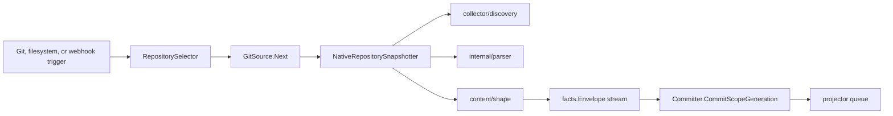

# internal/collector

`internal/collector` owns source observation, repository selection, snapshot
capture, parser input shaping, and fact streaming for Git-backed and
filesystem-backed indexing runs. It decides what source bytes and metadata enter
the fact pipeline; it does not decide graph truth or API/MCP query truth.

## Runtime Flow



`Service.Run` polls a `Source`, commits each returned generation, and calls
`AfterBatchDrained` only after at least one generation was committed and the
source batch is drained. Idle polls do not fire the drain hook.

## Core Responsibilities

- Select repositories for one collection cycle.
- Clone, fetch, or reuse repository snapshots.
- Apply discovery rules from repo-local `.eshu/*`, `.gitignore`,
  `.eshuignore`, and operator discovery overlays.
- Pre-scan repository imports before per-file parsing.
- Run Go semantic pre-scan so parser options include package-level root
  evidence.
- Parse files through `internal/parser` and materialize content entities through
  `internal/content/shape`.
- Emit fact envelopes through a bounded stream instead of retaining all file
  bodies in memory.
- Publish metadata-only Terraform-state candidates while keeping raw
  `.tfstate` bytes out of normal repository snapshots.

## Selection And Streaming

`GitSource` lazily starts one stream on the first `Next` call for a batch:

1. `RepositorySelector.SelectRepositories` returns a `SelectionBatch`.
2. Repository paths are normalized to absolute paths before source-run IDs are
   derived.
3. Repositories are split into small and large lanes by file-count threshold.
4. Snapshot workers prefer small repositories while large repositories acquire
   the large-repo semaphore.
5. Completed snapshots become `CollectedGeneration` values on a bounded stream.

This two-lane design keeps large repositories from starving small repository
work. The large-repo semaphore is a memory and fairness control, not a
correctness mechanism.

## Snapshot Stages

`NativeRepositorySnapshotter.SnapshotRepository` runs these stages in order:

| Stage | Purpose |
| --- | --- |
| Discovery | Builds the candidate file set with repo-local and operator ignore rules. |
| Pre-scan | Builds import and symbol maps needed by parser adapters. |
| Go semantic pre-scan | Captures Go package roots, receiver chains, interface escapes, generic constraints, and import paths. |
| Parse | Runs parser workers and stores per-file parser metadata. |
| Materialize | Converts parser buckets into body-free file metadata and content entity snapshots. |

File bodies are intentionally not retained after materialization.
`streamFacts` re-reads file bodies from disk while emitting facts, so memory is
bounded by worker concurrency and one file body at a time instead of total
repository size.

## Terraform-State Boundary

Repository discovery may identify local Terraform-state candidates, but raw
state bytes do not enter Git repository snapshots. Candidates are emitted as
metadata-only evidence and are consumed by the Terraform-state collector path
only when the configured resolver approves the source.

Use `go/internal/collector/terraformstate` and
`go/internal/collector/tfstateruntime` for state readers, redaction, parser
output, claim-aware source handling, and state-specific telemetry.

## Exported Surface

| API | Contract |
| --- | --- |
| `Service` | Poll-and-commit loop over `Source` and `Committer`. |
| `Source` | Produces collected generations. |
| `ObservedSource` | Defers `collector.observe` span creation until real work exists. |
| `Committer` | Persists one scope generation from a fact stream. |
| `ClaimedService` | Wraps collection in workflow-coordinator claim fencing. |
| `GitSource` | Streams repository snapshots from a `RepositorySelector` and `RepositorySnapshotter`. |
| `NativeRepositorySnapshotter` | Builds discovery, parser, and content snapshots for one selected repository. |
| `RepositorySelector` | Chooses repositories for a collection cycle. |
| `WebhookTriggerRepositorySelector` | Converts queued webhook triggers into targeted repository sync work. |
| `RepositorySnapshotter` | Captures one narrowed repository payload. |
| `LoadRepoSyncConfig` | Parses repository sync configuration from environment. |
| `LoadWebhookTriggerHandoffConfig` | Parses webhook-trigger handoff settings. |
| `LoadDiscoveryOptionsFromEnv` | Parses operator discovery overlays. |
| `LoadSnapshotSCIPConfig` | Parses optional SCIP snapshot settings. |

Collector subpackages own specific source families: Terraform state, AWS cloud,
OCI registries, package registries, CI/CD runs, Confluence, and repository
discovery helpers. Their README files should explain source-specific API,
credential, redaction, and claim behavior.

## Telemetry

Use collector telemetry to separate source wait time from parser cost and fact
commit cost:

- `collector.observe` wraps one real collect-and-commit cycle.
- `collector.stream` wraps one `GitSource` stream lifecycle.
- `scope.assign` wraps repository selection.
- `fact.emit` wraps per-repository snapshotting.
- `collector snapshot stage completed` logs discovery, pre-scan,
  `go_package_semantic_prescan`, parse, and materialize timings.
- Large-repo logs and metrics show queueing, semaphore wait, and release.
- Fact emitted, fact committed, generation fact count, and batch committed
  metrics show whether the collector or committer is the current bottleneck.

Keep repository identifiers and paths sanitized in hosted logs. Do not put raw
credentials, private registry objects, full local paths, or raw Terraform-state
locators in metrics.

## Gotchas

- `AfterBatchDrained` is a committed-batch boundary hook, not a timer callback.
- Relative repository paths can change fact identity; normalize before
  snapshotting.
- `.gitignore`, `.eshuignore`, `.eshu/discovery.json`, and
  `.eshu/vendor-roots.json` are part of the effective input shape.
- Changing ignore-rule fingerprinting can cause local watch mode to publish
  unnecessary generations.
- Do not move raw `.tfstate` bytes through Git content persistence.
- Do not store all file bodies in memory to avoid re-reading from disk.
- Parser variable scope is a truth and performance contract; Java uses narrower
  variable scope than dynamic languages because local variables are not needed
  for Java query truth.
- Webhook-trigger selection is a wake-up path. The fetched repository state
  still decides the snapshot truth.

## Change Checklist

- Add a repository source mode with a new `RepositorySelector`, config/env
  parsing, tests, and wiring outside `GitSource` branch logic.
- Add a snapshot stage by inserting it into
  `NativeRepositorySnapshotter.SnapshotRepository`, logging stage timing,
  recording metrics when measurable, and testing the stage output.
- Change large-repo concurrency defaults only with production data, telemetry
  guidance, and tests. The semaphore is a fairness and memory control, not a
  correctness workaround.
- Add discovery advisory fields in the advisory model and builder together with
  tests.
- Add a collector family with package-local `doc.go` and `README.md`; update
  parent docs only for cross-cutting workflow rules that do not belong in that
  package README.

## Verification

```bash
go test ./internal/collector -count=1
go test ./cmd/collector-git ./cmd/ingester -count=1
go run ./cmd/eshu docs verify ../go/internal/collector --limit 1000 \
  --fail-on contradicted,missing_evidence
```

Run the relevant collector-family package tests when changing a subpackage,
for example Terraform-state, AWS cloud, OCI registry, package registry, or
Confluence.

## Related Docs

- [Architecture](../../../docs/public/architecture.md)
- [Ingester Service](../../../docs/public/services/ingester.md)
- [Collector Authoring](../../../docs/public/guides/collector-authoring.md)
- [Environment Variables](../../../docs/public/reference/environment-variables.md)
- [Telemetry Reference](../../../docs/public/reference/telemetry/index.md)
- [Local Testing](../../../docs/public/reference/local-testing.md)
- [Discovery Package](discovery/README.md)
- [Parser Package](../parser/README.md)
