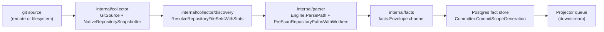
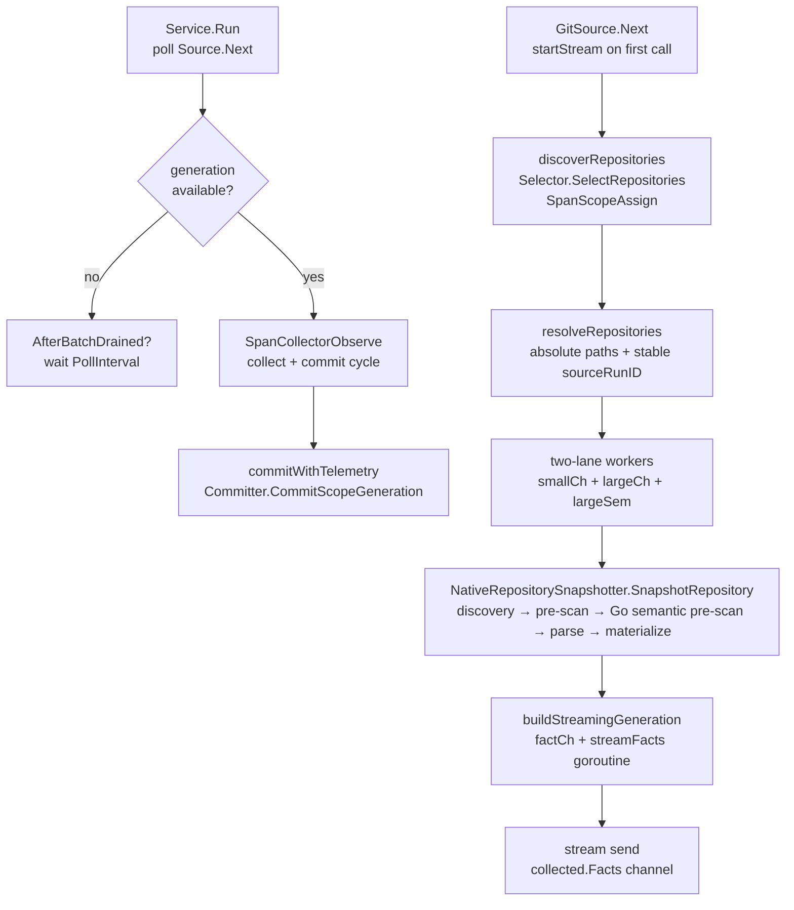

# Collector

## Purpose

`internal/collector` owns git collection, filesystem-direct collection,
repository discovery, snapshot capture, and parser input shaping for Eshu
indexing runs. It turns source repositories into the inputs required by fact
emission: cloned snapshots, native snapshots, discovery reports, file
selections, and entity metadata. It does not make graph projection or
query-time truth decisions — those belong to the projector, reducer, storage,
and query packages.

## Where this fits in the pipeline

```mermaid
flowchart LR
  A["git source\n(remote or filesystem)"] --> B["internal/collector\nGitSource + NativeRepositorySnapshotter"]
  B --> C["internal/collector/discovery\nResolveRepositoryFileSetsWithStats"]
  C --> D["internal/parser\nEngine.ParsePath + PreScanRepositoryPathsWithWorkers"]
  D --> E["internal/facts\nfacts.Envelope channel"]
  E --> F["Postgres fact store\nCommitter.CommitScopeGeneration"]
  F --> G["Projector queue\n(downstream)"]
```

## Internal flow

```mermaid
flowchart TB
  A["Service.Run\npoll Source.Next"] --> B{"generation\navailable?"}
  B -- no --> C["AfterBatchDrained?\nwait PollInterval"]
  B -- yes --> D["SpanCollectorObserve\ncollect + commit cycle"]
  D --> E["commitWithTelemetry\nCommitter.CommitScopeGeneration"]
  A2["GitSource.Next\nstartStream on first call"] --> F["discoverRepositories\nSelector.SelectRepositories\nSpanScopeAssign"]
  F --> G["resolveRepositories\nabsolute paths + stable sourceRunID"]
  G --> H["two-lane workers\nsmallCh + largeCh + largeSem"]
  H --> I["NativeRepositorySnapshotter.SnapshotRepository\ndiscovery → pre-scan → Go semantic pre-scan → parse → materialize"]
  I --> J["buildStreamingGeneration\nfactCh + streamFacts goroutine"]
  J --> K["stream send\ncollected.Facts channel"]
```
## Lifecycle / workflow

`Service.Run` is the poll-and-dispatch loop: a source yields a generation, the
service commits it durably, and drain hooks fire so a fleet barrier can observe
progress. The loop is fence-aware on commit and routes commit failures to a
bounded dead-letter replay path.

The full workflow narrative — drain-hook semantics including the
never-committed empty-batch escape, fence/claim behavior, dead-letter replay,
and the generation bookkeeping each run depends on — lives in `LIFECYCLE.md`.

## Exported surface

- `Service` — poll-and-dispatch loop; wire `Source`, `Committer`,
  `PollInterval`, and optionally `DeadLetters`, `AfterBatchDrained`,
  `AfterEmptyBatchDrained`, `Tracer`, `Instruments`, `Logger`. `DeadLetters`
  records commit failures and clears replay state after later successful commits
- `Source` — interface: `Next(context.Context) (CollectedGeneration, bool, error)`
- `ObservedSource` — optional source interface that receives a
  `StartObserveFunc` and returns a `CollectorObservation` so real collection
  attempts, not idle polls, can share one `collector.observe` span with commit
- `Committer` — interface: `CommitScopeGeneration(ctx, scope, generation, <-chan facts.Envelope) error`
- `GenerationDeadLetterSink` / `GenerationDeadLetter` — optional
  commit-failure sink and bounded replay metadata for generations that fail
  before normal projector work items exist
- `GenerationDeadLetterReplayCompleter`, `GenerationDeadLetterReplayFilter`, and `GenerationDeadLetterReplayResult` — store-facing replay completion/request contracts
- `ClaimedCommitter` — optional fence-aware commit interface used by
  `ClaimedService` so claim ownership can be verified in the same transaction
  that persists facts; hosted claim mutations also carry the work item's tenant
  boundary so storage can re-check the active grant before fact writes
- `CollectedGeneration` — `Scope`, `Generation`, `Facts` channel, `FactCount`,
  optional `DiscoveryAdvisory`
- `GitSource` — implements `Source`; fields include `Selector`,
  `Snapshotter`, `SnapshotWorkers`, `LargeRepoThreshold`,
  `LargeRepoMaxConcurrent`, `StreamBuffer`
- `NativeRepositorySnapshotter` — implements `RepositorySnapshotter`; fields
  include `Engine`, `Registry`, `DiscoveryOptions`, `SCIP`, `ParseWorkers`
- `RepositorySelector` — interface: `SelectRepositories(context.Context) (SelectionBatch, error)`
- `PriorityRepositorySelector` — tries selectors in order and returns the
  first non-empty batch
- `WebhookTriggerRepositorySelector` — claims queued GitHub, GitLab, and
  Bitbucket webhook triggers, syncs only referenced repositories, fails
  unsupported providers, and returns successful syncs as a targeted batch
- `RepositorySnapshotter` — interface: `SnapshotRepository(context.Context, SelectedRepository) (RepositorySnapshot, error)`
- `SelectionBatch` — `ObservedAt` + `[]SelectedRepository`
- `SelectedRepository` — `RepoPath`, optional source-checkout `GitTreePath`,
  `RemoteURL`, `IsDependency`, `DisplayName`, `Language`, `FileTargets`,
  source-observed `GitRefs`, `Delta`, and `DeletedRelativePaths`
- `RepositorySnapshot` — `RepoPath`, optional source-checkout `GitTreePath`,
  `RemoteURL`, `FileCount`, `ImportsMap`, `FileData`, `ContentFileMetas`,
  `DocumentationFileMetas`, `ContentEntities`, source-observed `GitRefs`,
  `DiscoveryAdvisory`, optional delta metadata for file-scoped Git resyncs,
  `TaintEvidence`, and dataflow freshness metadata
- `TaintEvidenceSnapshot` — one intraprocedural value-flow taint finding resolved
  to its graph `Function` entity uid, carried as evidence (confidence +
  provenance). Populated only when the parser emits `taint_findings` (gated by
  `ESHU_EMIT_DATAFLOW`); `streamFacts` emits each as a `code_taint_evidence`
  fact. Empty (and byte-identical) when the gate is off
- `InterprocTaintEvidenceSnapshot` — one cross-function value-flow finding
  resolved to the source and sink `Function` entity uids it spans (resolved by
  function name within the file, since the parser `FunctionID` carries the name
  but not the uid; ambiguous or unresolved endpoints are dropped). Populated only
  when the parser emits `interproc_findings`; `streamFacts` emits each as a
  `code_interproc_evidence` fact. Empty (and byte-identical) when the gate is off
- `FunctionSummarySnapshot` — one function's raw value-flow `Effects` read from the
  parser's `dataflow_summaries` bucket, keyed by the durable `FunctionID` (which
  already carries the repository identity, so no entity-uid resolution is needed).
  Populated only when the parser emits `dataflow_summaries`; `streamFacts` emits
  each as a `code_function_summary` fact (on both delta and full generations,
  since each upserts by its `FunctionID`). The reducer reconstructs the `Effects`
  and persists them to the function-summary store for cross-repo composition.
  Empty (and byte-identical) when the gate is off.
- `FunctionSourceSnapshot` — one function's param-level value-flow taint source
  read from the parser's `dataflow_sources` bucket (the entry points the
  cross-repo fixpoint needs as source ports). Populated only when the parser
  emits `dataflow_sources`; `streamFacts` emits each as a `code_function_source`
  fact, keyed idempotently on `(FunctionID, param index)`. The reducer persists
  them to the function-source store. Empty (and byte-identical) when off.
- `DataflowFunctionSnapshot` — one parser-emitted function-level CFG,
  reaching-definition, and control-dependence row read from `dataflow_functions`.
  Populated only when the value-flow gate emits that bucket; `streamFacts` emits
  each as a `code_dataflow_function` fact for bounded API/MCP code-flow
  readbacks. Empty (and byte-identical) when off.
- `DataflowCatalogVersionSnapshot` — one parser-emitted taint catalog content
  hash from `dataflow_catalog_versions`. It is folded into snapshot freshness so
  catalog-only source/sink matcher changes re-run the value-flow path for
  unchanged files. It does not stream as a fact and is empty when the dataflow
  gate is off.

`buildFunctionSummaries` additionally resolves each function's graph `Function`
uid (carried on the `code_function_summary` fact as `graph_uid`) so the cross-repo
fixpoint can project findings as `TAINT_FLOWS_TO` edges by uid. The resolution
reuses the same `(relative path, receiver, name)` entity match the per-file
interproc-evidence path uses: `buildInterprocTaintEvidence`'s inline resolver was
extracted to the shared `newFunctionUIDResolver` (a pure refactor —
`TestBuildInterprocTaintEvidence*` is unchanged) and both call it, so both paths
resolve uids identically. An unresolved uid leaves `graph_uid` empty; the summary
still persists (only the graph projection needs it). This adds no fact, no graph
write, and no new instrument — it only populates a field on an existing fact.

The dataflow-function, function-summary/source, and `DataflowScanned` marker
evidence (No-Regression and No-Observability-Change) for this section lives in
`OPERATIONS.md`.

- `DataflowScanned` — true when the value-flow gate (`ESHU_EMIT_DATAFLOW`) ran for
  the snapshot, independent of whether any findings were produced. `streamFacts`
  emits one per-generation `code_dataflow_scanned` marker fact when it is set, only
  on full (non-delta) generations. The marker carries no findings; it is the
  reconciliation signal that lets the reducer retract stale value-flow evidence
  when a full generation's finding set goes empty (#2919). It is intentionally not
  emitted on deltas: a delta carries only changed-file findings while the evidence
  reducers retract the whole scope before writing, so a marker-triggered delta
  would wipe evidence for unchanged files. False — and no marker — when the gate is
  off, preserving the byte-identical-when-off guarantee.
- `ContentFileSnapshot`, `ContentFileMeta`, `ContentEntitySnapshot` — portable
  file and entity records; `ContentFileMeta` carries no body string. Declared
  PagerDuty module/tfvars rows materialize as `PagerDutyDeclaration` content
  entities from Terraform source evidence, not live PagerDuty incident or
  configuration truth. Declared Grafana folder, dashboard, datasource,
  alert-rule, Prometheus/Mimir scrape config, metric rule, metric route, Loki
  log route, Tempo trace route, and coverage-warning rows remain metadata-only
  `observability.*` facts with dashboard JSON, query bodies, scrape targets,
  remote-write URLs, Loki or Tempo route URLs, tenant header values, tenant
  IDs, datasource URLs, log label values, trace tag values, raw trace IDs,
  request attributes, and secret fields omitted.
- `RepoSyncConfig` — all env-driven sync configuration; populated by
  `LoadRepoSyncConfig`
- `LoadRepoSyncConfig(component, getenv)` — parses the repo-sync env contract
- `LoadWebhookTriggerHandoffConfig(defaultOwner, getenv)` — parses the shared
  webhook-trigger handoff env contract used by collector runtimes
- `LoadDiscoveryOptionsFromEnv(getenv)` — parses `ESHU_DISCOVERY_IGNORED_PATH_GLOBS`
  and `ESHU_DISCOVERY_PRESERVED_PATH_GLOBS`
- `LoadSnapshotSCIPConfig(getenv)` — parses the SCIP env contract
- `SnapshotSCIPConfig` — `Enabled`, `Languages`, `Indexer`, `Parser`,
  `Workers`
- `DiscoveryAdvisoryReport` — operator-facing JSON summary of discovery and
  materialization shape per snapshot run
- `RegistryFailure` — bounded registry collector error type that carries
  `FailureClass` and `FailureDetails` for workflow status without exposing
  private registry hosts, repositories, packages, tags, digests, accounts,
  paths, or credential references
- `RegistryHTTPFailure` and `RegistryTransportFailure` — helpers used by
  registry runtimes to classify auth denied, not found, rate limited,
  retryable, canceled, and terminal registry failures
- `ClaimedService` — wraps `Service` with a `ClaimControlStore` for workflow
  collection; `MaxAttempts` bounds per-work-item retries and escalates recurring
  retryable failures to `attempt_budget_exhausted` (issue #612; `0` is legacy).
  Hosted work items copy tenant identity into commit mutations. Retryable
  source errors exposing `RetryAfterDelay()` set retry `visible_at` to the
  larger of poll interval and provider guidance without changing fact output.
  A configured `ClaimDispatcher` can choose the next claim target across
  collector families before the service enters the same heartbeat, commit,
  retry, terminal-failure, release, and completion path.
- `ClaimedGenerationCommitObserver` — optional post-commit hook (#5429): fires
  once a claim's commit succeeds, so a source's own progress marker advances only once landed.
- `FairClaimDispatcher` — applies `workflow.FamilyFairnessScheduler` to a
  bounded candidate set and delegates each selected target to
  `ClaimControlStore.ClaimNextEligible`; empty target lanes are skipped during
  the same poll without changing Postgres FIFO ordering inside a selected
  collector instance.
- `FailureClassAttemptBudgetExhausted` — exported failure-class label that
  `ClaimedService` writes to `workflow_claims.failure_class` and
  `workflow_work_items.last_failure_class` when the retry budget escalates a
  claim. Operators read this label to attribute terminal failures to the
  bounded-retry guard versus other terminal-classified causes.
- `FactsFromSlice` — test helper: builds a `CollectedGeneration` from a
  pre-built `[]facts.Envelope` slice
- `terraformstate` subpackage — exact Terraform-state source readers and
  streaming parser primitives that emit redacted Terraform-state facts
- `tfstateruntime` subpackage — claim-aware Terraform-state runtime adapter that
  resolves exact candidates, opens the matching state source, and emits a
  fenced collected generation for `ClaimedService`
- `packageregistry` subpackage — package-registry identity normalization,
  runtime target contracts, metadata parsing, claim runtime, and
  reported-confidence package fact-envelope construction for the
  `package_registry` collector family
- `ociregistry` subpackage — OCI registry identity, provider adapters,
  runtime scan orchestration, and reported-confidence container image facts
- `sbomruntime` subpackage — claim-aware hosted SBOM and attestation runtime
  that fetches configured documents or OCI referrer artifact blobs, delegates
  SBOM parsing to `sbomdocument`, and emits in-toto attestation facts without
  making reducer attachment truth decisions
- `sdk` subpackage — first-party shared helpers for bounded HTTP execution,
  safe provider failures, retry-after parsing, and common status classification
- `pagerduty` subpackage — PagerDuty incident, lifecycle, related change-event,
  and optional live configuration source facts for downstream correlation.
- `tempo` subpackage — live Tempo trace-signal metadata collection for source
  instances, tag names, bounded tag values, and coverage warnings.
- `cicdrun` subpackage — fixture-backed CI/CD provider normalization and
  reported-confidence run, job, step, artifact, trigger, environment, and
  warning fact-envelope construction for the `ci_cd_run` collector family
- `servicecatalog` subpackage — Backstage, OpsLevel, and Cortex manifest
  normalization for the `service_catalog` collector family. The Git collector
  calls it only for repo-hosted catalog descriptors and emits provenance-only
  facts that downstream projector/reducer code correlates.
- `grafana` subpackage — claim-driven live Grafana API metadata collection for
  the `grafana` collector family. It emits reported-confidence observed
  observability source facts for folders, dashboards, datasources, alert rules,
  and coverage warnings without retaining dashboard JSON, query models,
  datasource URLs, contacts, notification routes, credentials, or private URLs.
- `prometheusmimir` subpackage — claim-driven live Prometheus-compatible API
  metadata collection for the `prometheus_mimir` collector family. It emits
  reported-confidence observed observability source facts for active targets,
  rules, and coverage warnings without retaining metric samples, raw PromQL,
  scrape target URLs, target label values, annotations, tenant IDs, credentials,
  or private URLs.
- `loki` subpackage — claim-driven live Loki API metadata collection for the
  `loki` collector family. It emits reported-confidence observed observability
  source facts for log signals, rules, and coverage warnings without retaining
  log lines, raw LogQL, label values, tenant IDs, credentials, private URLs, or
  provider response bodies.
- `scannerworker` subpackage — scanner-worker claim processing, analyzer port,
  bounded target scope, resource limits, source-fact output validation, and
  retry/dead-letter payloads. Concrete heavy analyzers plug in behind this
  boundary.

## Dependencies

- `internal/collector/discovery` — `ResolveRepositoryFileSetsWithStats`,
  `Options`, `RepoFileSet`, `DiscoveryStats`
- `internal/parser` — `Engine`, `Registry`, `Options`, `DefaultEngine`,
  `DefaultRegistry`, `SCIPIndexer`, `SCIPIndexParser`, `SCIPParseResult`
- `internal/facts` — `facts.Envelope`, `facts.StableID`
- `internal/scope` — `scope.IngestionScope`, `scope.ScopeGeneration`
- `internal/content/shape` — `shape.Materialize`, `shape.Input`
- `internal/repositoryidentity` — `MetadataFor`
- `internal/telemetry` — spans, metrics, structured logging

## Telemetry

- Spans: `SpanCollectorObserve` (`collector.observe`) wraps each collect and
  commit cycle for sources that implement `ObservedSource`,
  `SpanCollectorStream` (`collector.stream`) wraps the full stream lifecycle;
  `SpanScopeAssign` (`scope.assign`) wraps repository discovery;
  `SpanFactEmit` (`fact.emit`) wraps per-repo snapshotting
- Metrics: `eshu_dp_collector_observe_duration_seconds`,
  `eshu_dp_scope_assign_duration_seconds`, `eshu_dp_fact_emit_duration_seconds`,
  `eshu_dp_repo_snapshot_duration_seconds`, `eshu_dp_file_parse_duration_seconds`,
  `eshu_dp_repos_snapshotted_total` (labeled `status=succeeded/failed`),
  `eshu_dp_facts_emitted_total`, `eshu_dp_facts_committed_total`,
  `eshu_dp_fact_batches_committed_total`, `eshu_dp_generation_fact_count`,
  `eshu_dp_discovery_files_skipped_total` (labeled `skip_reason`),
  `eshu_dp_large_repo_classifications_total` (labeled `repo_size_tier`),
  `eshu_dp_large_repo_semaphore_wait_seconds`,
  `eshu_dp_scip_process_wait_seconds`
- Log events: `git repository sync started`,
  `git repository sync progress`, `git repository sync completed`,
  `git repository sync failed`, `collector stream started`,
  `collector snapshot stage completed`
  (stages: `discovery`, `pre_scan`, `go_package_semantic_prescan`, `parse`,
  `materialize`; the Go semantic pre-scan stage includes
  `go_package_target_count`, and the `parse` stage includes bounded
  `language_parse_summary` rows with file count and parse duration totals per
  language), `collector snapshot completed`,
  `collector commit succeeded / failed`, `collector stream completed / failed`,
  `large repository queued`, `large repo semaphore acquired / released`

## Operational notes

- `ESHU_SNAPSHOT_WORKERS` (default `min(NumCPU,8)`) controls concurrent
  per-repo snapshotting. Raising this value beyond CPU capacity increases
  context-switching without reducing wall time.
- `ESHU_LARGE_REPO_FILE_THRESHOLD` (default `1000`) classifies repositories for
  the large-repo semaphore, and `ESHU_PARSE_WORKERS` / `ESHU_REPO_SHARD_COUNT`
  / `ESHU_REPO_SHARD_INDEX` bound parse concurrency and repository sharding.
- Repo-local `.eshu/discovery.json` and `.eshu/vendor-roots.json` override
  default discovery options before the operator-level
  `ESHU_DISCOVERY_IGNORED_PATH_GLOBS` overlay is applied.
- Two-phase streaming: `ContentFileMeta` carries no body; `streamFacts`
  re-reads file bodies from disk at emit time. Do not change this design to
  in-memory bodies without accounting for `O(repo_size)` memory growth on
  large repositories.

The full runtime-knob reference, discovery/streaming notes, and the
accumulated performance/observability evidence trail (including the
per-collector run telemetry added for issue #3680) live in `OPERATIONS.md`.
The giant-repo collection scheduler, the dedicated large-lane scheduler, and
byte-balanced parse-partitioning (issues #3711 and #3839) live in
`SCHEDULING.md`.

The repository basename-collision diagnostic (issue #3677) lives in
`DIAGNOSTICS.md`.

## Extension points

- `RepositorySelector` — replace `NativeRepositorySelector` with any
  implementation to change how repositories are discovered
- `PriorityRepositorySelector` — compose a high-priority selector, such as
  webhook-triggered refresh, ahead of scheduled polling
- `RepositorySnapshotter` — replace `NativeRepositorySnapshotter` with any
  implementation to change how repositories are snapshotted
- `Source` / `Committer` — both are interfaces; test implementations substitute
  recording or controlled-error variants
- `SnapshotSCIPConfig.Indexer` and `.Parser` — injectable seams for testing SCIP
  paths without external binaries

## Gotchas / invariants

- `GitSource.startStream` performs synchronous discovery before launching
  snapshot workers. A slow `Selector.SelectRepositories` (e.g. slow GitHub API
  response) blocks the entire stream start.
- Large-repo semaphore is acquired inside the worker select loop, not inside
  `processRepo`. This means a worker never blocks waiting for the semaphore while
  small repos are available (`git_source.go:419-431`).
- `streamErr` is written by the coordinator goroutine and read by `Next` only
  after the stream channel closes. The happens-before guarantee is that
  `close(s.stream)` happens-before the receive in `Next` that returns
  `ok=false`.
- Absolute paths: `resolveRepositories` calls `filepath.Abs` on every selected
  repo path before building the `sourceRunID` hash. Do not pass relative paths
  to `NativeRepositorySnapshotter.SnapshotRepository` — it calls
  `filepath.Abs` again but the fact IDs would differ.
- Filesystem manifests must stay aligned with copy/direct snapshot filtering.
  If `fingerprintTree` starts hashing ignored generated files, local watch mode
  can keep publishing newer generations and supersede projector work before the
  graph settles.
- Webhook trigger selection is a wake-up path only. It may prioritize a GitHub,
  GitLab, or Bitbucket repo sync, but the fetched default branch still decides
  freshness. Provider-scoped repository IDs select the right clone host; GitHub
  token and GitHub App auth remain GitHub-specific, while SSH is the
  provider-neutral private-repo path.
- Dedicated large-lane scheduler details, the #3839 small-repo starvation fix,
  and their evidence live in `SCHEDULING.md`.

## Related docs

See `docs/public/architecture.md`, `docs/public/deployment/service-runtimes.md`,
`docs/public/reference/local-testing.md`, `docs/public/reference/telemetry/index.md`, `go/internal/collector/discovery/README.md`, and `go/internal/parser/README.md`.

This README is the entry point only. Detailed operational, scheduling, and
diagnostic content lives in package-local docs:

- `OPERATIONS.md` — runtime knobs, discovery/streaming notes, per-collector
  run telemetry (issue #3680), and the accumulated performance/observability
  evidence trail.
- `LIFECYCLE.md` — the `Service.Run` poll-and-dispatch workflow: drain-hook
  semantics, fence-aware commit, dead-letter replay, and generation
  bookkeeping (issue #5959).
- `SCHEDULING.md` — giant-repo collection scheduling, the dedicated
  large-lane scheduler, and byte-balanced parse-partitioning (issues #3711,
  #3839).
- `DIAGNOSTICS.md` — the repository basename-collision signal (issue #3677).
- `AGENTS.md` — agent-facing invariants, common changes, and failure modes.
