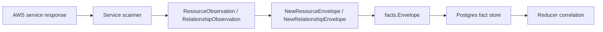

# AWS Cloud Collector Contracts

## Purpose

`internal/collector/awscloud` owns AWS cloud source identity and fact-envelope
construction for the `aws` collector family. It turns account, region, service,
resource, relationship, and warning observations into reported-confidence
facts that the shared fact store can persist.

This package implements the runtime-neutral contract slice from
`docs/docs/adrs/2026-04-20-aws-cloud-scanner-collector.md`.

## Ownership boundary

This package owns AWS observation boundaries, resource identity constants, and
fact-envelope construction only. AWS SDK clients, credential loading, workflow
claim scheduling, graph writes, reducer correlation, and query surfaces live in
runtime, provider, storage, reducer, and query packages.

## Exported surface

See `doc.go` for the godoc contract.

- `CollectorKind` - durable collector kind for AWS cloud facts.
- `ServiceIAM` - IAM service-kind value for global IAM scans.
- `ServiceECR` - ECR service-kind value for regional image scans.
- `ServiceECS` - ECS service-kind value for regional workload placement scans.
- `ServiceEC2` - EC2 service-kind value for regional network topology scans.
- `ServiceELBv2` - ELBv2 service-kind value for regional routing topology
  scans.
- `ServiceRoute53` - Route 53 service-kind value for global DNS scans.
- `ServiceLambda` - Lambda service-kind value for regional function scans.
- `ServiceEKS` - EKS service-kind value for regional Kubernetes control-plane
  scans.
- `ServiceSQS` - SQS service-kind value for regional queue metadata scans.
- `ServiceSNS` - SNS service-kind value for regional topic metadata scans.
- `ServiceEventBridge` - EventBridge service-kind value for regional event bus
  and rule metadata scans.
- `ServiceS3` - S3 service-kind value for regional bucket metadata scans.
- `ServiceRDS` - RDS service-kind value for regional database metadata scans.
- `ServiceDynamoDB` - DynamoDB service-kind value for regional table metadata
  scans.
- `ServiceCloudWatchLogs` - CloudWatch Logs service-kind value for regional log
  group metadata scans.
- `ServiceCloudFront` - CloudFront service-kind value for global distribution
  metadata scans.
- `ServiceAPIGateway` - API Gateway service-kind value for regional REST,
  HTTP, WebSocket, stage, custom-domain, mapping, and integration metadata
  scans.
- `ServiceSecretsManager` - Secrets Manager service-kind value for regional
  secret metadata scans.
- `ServiceSSM` - SSM service-kind value for regional Parameter Store metadata
  scans.
- `Boundary` - account, region, service, generation, collector instance, and
  fencing token shared by one claimed AWS scan.
- `ResourceObservation` - one AWS resource ready for envelope emission.
- `RelationshipObservation` - one AWS relationship ready for envelope
  emission.
- `ImageReferenceObservation` - one ECR image digest and tag reference.
- `DNSRecordObservation` - one Route 53 DNS record observation.
- `WarningObservation` - one non-fatal AWS scan condition.
- `APICallEvent` - one bounded AWS SDK call observation used for per-claim
  status accounting.
- `APICallStatsRecorder` - in-memory per-claim API/throttle accumulator used
  before a single durable scan-status update.
- `ScanStatusStart`, `ScanStatusObservation`, and `ScanStatusCommit` -
  scanner-side and commit-side status records for admin visibility.
- `RedactionPolicyVersion` - AWS launch sensitive-key/provider policy version
  attached to redacted fact values.
- `RedactString` - shared AWS scalar redaction helper backed by
  `internal/redact`.
- `NewResourceEnvelope` - builds an `aws_resource` fact.
- `NewRelationshipEnvelope` - builds an `aws_relationship` fact.
- `NewImageReferenceEnvelope` - builds an `aws_image_reference` fact.
- `NewDNSRecordEnvelope` - builds an `aws_dns_record` fact.
- `NewWarningEnvelope` - builds an `aws_warning` fact.

Envelope builders validate account, region, service kind, scope, generation,
collector instance, and fencing token boundaries before emitting facts.
`FactID` includes scope and generation so repeated scans preserve history, and
`StableFactKey` remains the source-stable identity inside a generation.

## Dependencies

- `internal/facts` for durable AWS fact constants, `Envelope`, `Ref`,
  reported source confidence, and stable ID generation.
- `internal/redact` for HMAC-backed scalar markers and versioned
  sensitive-key classification.

## Telemetry

This package emits no metrics, spans, or logs directly. Runtime adapters that
claim AWS work and call AWS APIs must emit collector spans, API call counters,
scan duration histograms, and warning/failure counters at that boundary.
Service SDK adapters call `RecordAPICall` so the runtime can persist bounded
per-claim API and throttle counts without writing one Postgres row per AWS
request.

## Gotchas / invariants

- AWS observations are reported source evidence. Do not claim canonical
  workload, deployment, or graph truth here.
- IAM and Route 53 are global AWS services, but the boundary still carries a
  region label so claims stay shaped like `(collector_instance_id, account_id,
  region, service_kind)`.
- `FencingToken` is copied onto each fact envelope so stale workers cannot
  silently overwrite a newer generation.
- Credential material, bearer tokens, session tokens, and presigned query
  parameters must not enter payloads, source references, logs, spans, or
  metric labels.
- Account IDs, regions, and service kinds are acceptable claim dimensions.
  Resource ARNs, names, tags, URLs, and policy JSON are not metric labels.
- API-call status events carry only account, region, service, operation,
  result, and a throttle flag. Do not add resource names, page tokens, ARNs, or
  raw AWS error text to `APICallEvent`.
- EC2 instance inventory stays out of EC2 network-topology facts. ENI
  attachment target ARNs are reported metadata, not instance resource facts.
- Lambda function environment values must be redacted before persistence with
  `RedactString`; the payload keeps the redaction marker, reason, source, and
  `RedactionPolicyVersion`.
  Container image URIs, alias routing, event-source ARNs, execution roles, and
  VPC subnet/security-group IDs are reported join evidence only.
- EKS OIDC provider, node group, add-on, IAM role, subnet, and security group
  facts are reported join evidence only. They do not prove Kubernetes workload
  or deployment ownership truth.
- SQS queue facts are metadata only. Queue messages and queue policy JSON stay
  outside the AWS collector fact contract. Redrive policy values may emit
  reported dead-letter queue relationship evidence when AWS provides both
  queue ARNs.
- SNS topic facts are metadata only. Message payloads, topic policy JSON,
  delivery-policy JSON, data-protection-policy JSON, and raw non-ARN
  subscription endpoints stay outside the AWS collector fact contract. ARN
  subscription endpoints may emit reported delivery relationship evidence.
- EventBridge facts are metadata only. PutEvents, resource mutations, event bus
  policy JSON, target payload fields, target input transformers, HTTP target
  parameters, and raw non-ARN targets stay outside the AWS collector fact
  contract. ARN target endpoints may emit reported relationship evidence.
- S3 bucket facts are metadata only. Object inventory, bucket policy JSON, ACL
  grants, replication rules, lifecycle rules, notification configuration,
  inventory configuration, analytics configuration, and metrics configuration
  stay outside the AWS collector fact contract. Server-access-log target
  buckets may emit reported relationship evidence.
- RDS facts are metadata only. Database connections, database names, master
  usernames, passwords, snapshots, log contents, Performance Insights samples,
  schemas, tables, and row data stay outside the AWS collector fact contract.
  DB instances, DB clusters, DB subnet groups, and directly reported dependency
  relationships are reported evidence only.
- DynamoDB facts are metadata only. Item values, table scans, table queries,
  stream records, backup/export payloads, resource policies, PartiQL output, and
  mutations stay outside the AWS collector fact contract. Table metadata, tags,
  indexes, TTL status, backup status, stream settings, replicas, and directly
  reported KMS key relationships are reported evidence only.
- CloudWatch Logs facts are metadata only. Log events, log stream payloads,
  Insights query results, export payloads, resource policies, subscription
  payloads, and mutations stay outside the AWS collector fact contract. Log
  group metadata, tags, data protection status, inherited properties, deletion
  protection, bearer-token authentication state, and directly reported KMS key
  relationships are reported evidence only.
- CloudFront facts are metadata only. Object contents, origin payloads,
  distribution config payloads, policy documents, certificate bodies, private
  keys, origin custom header values, and mutations stay outside the AWS
  collector fact contract. Distribution metadata, aliases, origins, cache
  behavior selectors, viewer certificate selectors, tags, and directly reported
  ACM certificate and WAF web ACL relationships are reported evidence only.
- API Gateway facts are metadata only. API execution, exports, API keys,
  authorizer secrets, policy JSON, integration credentials, stage variable
  values, request templates, response templates, payloads, and mutations stay
  outside the AWS collector fact contract. API identities, stages, custom
  domains, mappings, access-log destinations, ACM certificate dependencies, and
  ARN-addressable integration targets are reported evidence only.
- Secrets Manager facts are metadata only. Secret values, version payloads,
  resource policy JSON, external rotation partner metadata, external rotation
  role ARNs, and mutations stay outside the AWS collector fact contract. Secret
  metadata, tags, KMS key dependencies, and rotation Lambda dependencies are
  reported evidence only.
- ECS task-definition environment values must be redacted before persistence
  with `RedactString`. Secret `value_from` references are preserved as
  references, not resolved secret values.
- SSM facts are metadata only. Parameter values, history values, raw
  descriptions, raw allowed patterns, raw policy JSON, decrypted content, and
  mutations stay outside the AWS collector fact contract. Parameter metadata,
  tags, safe policy type/status metadata, and KMS key dependencies are reported
  evidence only.

## Related docs

- `docs/docs/adrs/2026-04-20-aws-cloud-scanner-collector.md`
- `docs/docs/guides/collector-authoring.md`
- `docs/docs/reference/telemetry/index.md`
