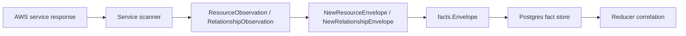

# AWS Cloud Collector Contracts

## Purpose

`internal/collector/awscloud` owns AWS cloud source identity and fact-envelope
construction for the `aws` collector family. It turns account, region, service,
resource, relationship, and warning observations into reported-confidence
facts that the shared fact store can persist.

This package implements the runtime-neutral contract slice from
`docs/docs/adrs/2026-04-20-aws-cloud-scanner-collector.md`.

## Ownership boundary

This package owns AWS observation boundaries, resource identity constants, and
fact-envelope construction only. AWS SDK clients, credential loading, workflow
claim scheduling, graph writes, reducer correlation, and query surfaces live in
runtime, provider, storage, reducer, and query packages.

## Exported surface

See `doc.go` for the godoc contract.

- `CollectorKind` - durable collector kind for AWS cloud facts.
- `ServiceIAM` - IAM service-kind value for global IAM scans.
- `ServiceECR` - ECR service-kind value for regional image scans.
- `Boundary` - account, region, service, generation, collector instance, and
  fencing token shared by one claimed AWS scan.
- `ResourceObservation` - one AWS resource ready for envelope emission.
- `RelationshipObservation` - one AWS relationship ready for envelope
  emission.
- `ImageReferenceObservation` - one ECR image digest and tag reference.
- `WarningObservation` - one non-fatal AWS scan condition.
- `NewResourceEnvelope` - builds an `aws_resource` fact.
- `NewRelationshipEnvelope` - builds an `aws_relationship` fact.
- `NewImageReferenceEnvelope` - builds an `aws_image_reference` fact.
- `NewWarningEnvelope` - builds an `aws_warning` fact.

Envelope builders validate account, region, service kind, scope, generation,
collector instance, and fencing token boundaries before emitting facts.
`FactID` includes scope and generation so repeated scans preserve history, and
`StableFactKey` remains the source-stable identity inside a generation.

## Dependencies

- `internal/facts` for durable AWS fact constants, `Envelope`, `Ref`,
  reported source confidence, and stable ID generation.

## Telemetry

This package emits no metrics, spans, or logs directly. Runtime adapters that
claim AWS work and call AWS APIs must emit collector spans, API call counters,
scan duration histograms, and warning/failure counters at that boundary.

## Gotchas / invariants

- AWS observations are reported source evidence. Do not claim canonical
  workload, deployment, or graph truth here.
- IAM is a global AWS service, but the boundary still carries a region label so
  claims stay shaped like `(collector_instance_id, account_id, region,
  service_kind)`.
- `FencingToken` is copied onto each fact envelope so stale workers cannot
  silently overwrite a newer generation.
- Credential material, bearer tokens, session tokens, and presigned query
  parameters must not enter payloads, source references, logs, spans, or
  metric labels.
- Account IDs, regions, and service kinds are acceptable claim dimensions.
  Resource ARNs, names, tags, URLs, and policy JSON are not metric labels.

## Related docs

- `docs/docs/adrs/2026-04-20-aws-cloud-scanner-collector.md`
- `docs/docs/guides/collector-authoring.md`
- `docs/docs/reference/telemetry/index.md`
