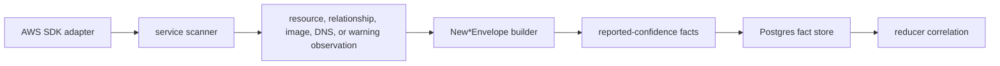

# internal/collector/awscloud

`internal/collector/awscloud` owns the runtime-neutral AWS cloud fact contract.
It turns scanner observations into reported-confidence facts for the `aws`
collector family.

This package does not call AWS APIs, schedule workflow claims, choose
credentials, write graph rows, or decide workload/deployment truth.

## Runtime Flow



## Core Responsibilities

- Define AWS service-kind constants and collector fact boundaries.
- Define shared claim boundary metadata: account, region, service, scope,
  generation, collector instance, and fencing token.
- Build fact envelopes for resources, relationships, ECR image references,
  Route 53 DNS records, and non-fatal warnings.
- Validate required boundary fields before fact emission.
- Keep `FactID` generation-specific while keeping `StableFactKey`
  source-stable inside a generation.
- Provide redaction helpers for sensitive AWS scalar values.
- Provide API-call status accounting types so runtime adapters can persist
  bounded per-claim API and throttle summaries.

## Evidence Types

| Evidence | Meaning |
| --- | --- |
| `aws_resource` | Source-reported AWS resource metadata. |
| `aws_relationship` | Source-reported relationship between AWS resources or external references. |
| `aws_image_reference` | ECR image digest and tag reference evidence. |
| `aws_dns_record` | Route 53 DNS record evidence. |
| `aws_warning` | Non-fatal scan condition, such as partial throttling or credential failure. |

All AWS collector facts are evidence. Reducers must corroborate them before
promoting canonical graph, workload, deployment, ownership, or drift truth.

## Service Boundaries

Service packages under `services/*` own source-specific mapping rules. The
shared invariant is:

- Metadata-only services must not read payloads, secrets, policies, object
  bodies, queue messages, log events, database rows, or mutation APIs.
- Relationship facts are reported join evidence only.
- ECS and Lambda environment values must be redacted before persistence.
- IAM and Route 53 are global services, but claim shape still includes a region
  label so all AWS claims use `(collector_instance_id, account_id, region,
  service_kind)`.
- EC2 currently emits network topology evidence, not EC2 instance inventory.

When adding or widening a service scanner, update that service package README
with exact source API boundaries, forbidden data classes, evidence emitted, and
verification.

## Telemetry Boundary

This package emits no spans or metrics directly. Runtime and SDK adapter
packages own telemetry:

- claim, credential, and service-scan spans
- AWS API call counters
- throttle counters
- scan duration histograms
- resources, relationships, tags, warnings, and partial-run status

`APICallEvent` must stay bounded to account, region, service, operation, result,
and throttle flag. Do not add ARNs, resource names, page tokens, raw AWS error
text, policy JSON, or secret material to metric labels or API-call status rows.

## Safety Rules

- Do not emit canonical graph truth from collectors.
- Do not persist credential material, bearer tokens, session tokens, presigned
  query parameters, secret values, policy JSON, payload bodies, or mutation
  results.
- Do not put ARNs, URLs, names, tags, or policy text in metric labels.
- Copy `FencingToken` into every fact envelope so stale workers cannot silently
  overwrite a newer generation.
- Keep service-specific redaction and metadata-only exclusions close to the
  owning service scanner.
- Keep new service kinds aligned with `awsruntime.SupportedServiceKinds` and
  command-side target validation.

## Change Checklist

- Add an AWS service by adding the shared service constants, a scanner package
  under `services/`, scanner tests, an `awssdk` adapter, service package docs,
  and a branch in `awsruntime.DefaultScannerFactory`.
- Give each new service package a `doc.go` and README before merge. The README
  must name source APIs, forbidden data classes, emitted evidence, and tests.
- Run the performance evidence gate when a service adds pagination fanout,
  claim concurrency, batch sizing, queue pressure, or downstream graph or
  materialization pressure.
- Add a fact envelope only after `internal/facts` exposes the fact kind and
  schema version.
- Keep credential and redaction rules at the runtime boundary unless the value
  is part of the durable fact-envelope contract.

## Verification

```bash
go test ./internal/collector/awscloud -count=1
go test ./internal/collector/awscloud/awsruntime -count=1
go test ./cmd/collector-aws-cloud -count=1
go run ./cmd/eshu docs verify ../go/internal/collector/awscloud --limit 1000 \
  --fail-on contradicted,missing_evidence
```

Run the service package tests when a service scanner or SDK adapter changes.

## Related Docs

- [AWS Cloud Collector Service](../../../../docs/public/services/collector-aws-cloud.md)
- [Collector Authoring](../../../../docs/public/guides/collector-authoring.md)
- [Environment Variables](../../../../docs/public/reference/environment-variables.md)
- [Telemetry Reference](../../../../docs/public/reference/telemetry/index.md)
- [AWS Runtime](awsruntime/README.md)
