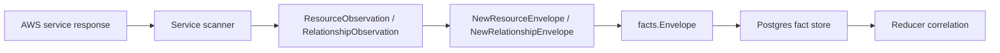

# AWS Cloud Collector Contracts

## Purpose

`internal/collector/awscloud` owns AWS cloud source identity and fact-envelope
construction for the `aws` collector family. It turns account, region, service,
resource, relationship, and warning observations into reported-confidence
facts that the shared fact store can persist.

This package implements the runtime-neutral contract slice from
`docs/public/services/collector-aws-cloud.md`.

## Ownership boundary

This package owns AWS observation boundaries, resource identity constants, and
fact-envelope construction only. AWS SDK clients, credential loading, workflow
claim scheduling, graph writes, reducer correlation, and query surfaces live in
runtime, provider, storage, reducer, and query packages.

## Exported surface

See `doc.go` for the godoc contract.

- `CollectorKind` - durable collector kind for AWS cloud facts.
- `ServiceIAM` - IAM service-kind value for global IAM scans.
- `ServiceECR` - ECR service-kind value for regional image scans.
- `ServiceECS` - ECS service-kind value for regional workload placement scans.
- `ServiceEC2` - EC2 service-kind value for regional network topology scans.
- `ServiceELBv2` - ELBv2 service-kind value for regional routing topology
  scans.
- `ServiceRoute53` - Route 53 service-kind value for global DNS scans.
- `ServiceLambda` - Lambda service-kind value for regional function scans.
- `ServiceEKS` - EKS service-kind value for regional Kubernetes control-plane
  scans.
- `ServiceSQS` - SQS service-kind value for regional queue metadata scans.
- `ServiceSNS` - SNS service-kind value for regional topic metadata scans.
- `ServiceEventBridge` - EventBridge service-kind value for regional event bus
  and rule metadata scans.
- `ServiceGuardDuty` - GuardDuty service-kind value for regional detector and
  security-intelligence metadata scans.
- `ServiceS3` - S3 service-kind value for regional bucket metadata scans.
- `ServiceRDS` - RDS service-kind value for regional database metadata scans.
- `ServiceDocDB` - DocumentDB service-kind value for regional DocumentDB cluster,
  instance, parameter group, snapshot, subnet group, global cluster, and event
  subscription metadata scans.
- `ServiceDynamoDB` - DynamoDB service-kind value for regional table metadata
  scans.
- `ServiceCloudWatchLogs` - CloudWatch Logs service-kind value for regional log
  group metadata scans.
- `ServiceCloudFront` - CloudFront service-kind value for global distribution
  metadata scans.
- `ServiceAPIGateway` - API Gateway service-kind value for regional REST,
  HTTP, WebSocket, stage, custom-domain, mapping, and integration metadata
  scans.
- `ServiceSecretsManager` - Secrets Manager service-kind value for regional
  secret metadata scans.
- `ServiceSSM` - SSM service-kind value for regional Parameter Store metadata
  scans.
- `ServiceOrganizations` - AWS Organizations service-kind value for
  organization, OU, account, policy-summary, target-binding, and
  delegated-administrator metadata scans.
- `ServiceAthena` - Athena service-kind value for regional workgroup, data
  catalog, prepared-statement, and named-query metadata scans.
- `ServiceSecurityHub` - Security Hub service-kind value for regional security
  posture metadata scans.
- `ServiceRedshift` - Redshift service-kind value for regional Redshift
  control-plane scans. Covers both provisioned Redshift and Redshift Serverless;
  provisioned and Serverless surfaces are distinguished through the emitted
  `resource_type`, not the service kind.
- `ServiceGlue` - Glue service-kind value for regional Data Catalog database,
  table, crawler, job, trigger, workflow, and connection metadata scans.
- `ServiceMSK` - MSK service-kind value for regional Amazon Managed Streaming
  for Apache Kafka metadata scans.
- `ServiceAccessAnalyzer` - IAM Access Analyzer service-kind value for regional
  analyzer, archive-rule, aggregate finding-count, and unused-access summary
  metadata scans.
- `ServiceKMS` - KMS service-kind value for regional Key Management Service
  metadata scans of customer master keys, aliases, and grants. The scanner
  invokes no cryptographic operation and persists no key policy Statement
  bodies, grant encryption contexts, or key material.
- `ServiceSSOAdmin` - IAM Identity Center service-kind value for org-scoped
  scans of instances, permission sets, account assignments, applications,
  trusted token issuers, and resolved principals. The scanner persists no
  permission set inline policy bodies, permissions boundary bodies,
  customer-managed policy bodies, or application access-scope filters, and
  redacts principal display names.
- `Boundary` - account, region, service, generation, collector instance, and
  fencing token shared by one claimed AWS scan.
- `ResourceObservation` - one AWS resource ready for envelope emission.
- `RelationshipObservation` - one AWS relationship ready for envelope
  emission.
- `ImageReferenceObservation` - one ECR image digest and tag reference.
- `DNSRecordObservation` - one Route 53 DNS record observation.
- `WarningObservation` - one non-fatal AWS scan condition.
- `APICallEvent` - one bounded AWS SDK call observation used for per-claim
  status accounting.
- `APICallStatsRecorder` - in-memory per-claim API/throttle accumulator used
  before a single durable scan-status update.
- `ScanStatusStart`, `ScanStatusObservation`, and `ScanStatusCommit` -
  scanner-side and commit-side status records for admin visibility.
- `ErrScanStatusStaleFence` - sentinel error returned by storage adapters when
  an AWS scan-status mutation is rejected by row count. Runtime classifiers
  use `errors.Is(err, awscloud.ErrScanStatusStaleFence)` to route the failed
  claim to terminal so an orphaned `aws_scan_status` row cannot block every
  future generation for the same `(collector_instance_id, account_id, region,
  service_kind)` tuple (issue #612).
- `RedactionPolicyVersion` - AWS launch sensitive-key/provider policy version
  attached to redacted fact values.
- `RedactString` - shared AWS scalar redaction helper backed by
  `internal/redact`.
- `NewResourceEnvelope` - builds an `aws_resource` fact.
- `NewRelationshipEnvelope` - builds an `aws_relationship` fact.
- `NewImageReferenceEnvelope` - builds an `aws_image_reference` fact.
- `NewDNSRecordEnvelope` - builds an `aws_dns_record` fact.
- `NewSecurityGroupRuleEnvelope` - builds an `aws_security_group_rule` derived
  posture fact from a `SecurityGroupRuleObservation`, normalizing the rule
  source to one of the `SecurityGroupRuleSource*` kinds and deriving the
  `is_internet`, `is_all_protocols`, and `is_all_ports` booleans.
- `NewIAMPermissionEnvelope` - builds an `aws_iam_permission` fact (derived,
  metadata-only IAM policy statement; no raw policy JSON or condition values).
- `NewWarningEnvelope` - builds an `aws_warning` fact.
- `NewS3BucketPostureEnvelope` - builds a derived metadata-only
  `s3_bucket_posture` fact from `S3BucketPostureObservation` (block-public-access
  flags, default-encryption detail, versioning/MFA-delete, object-ownership /
  ACL-disabled, access-logging target, replication presence, and policy-derived
  public/cross-account booleans). It never carries the raw bucket policy.
- `NewS3ExternalPrincipalGrantEnvelope` - builds a metadata-only
  `s3_external_principal_grant` fact from `S3ExternalPrincipalGrantObservation`
  for public, cross-account, AWS service, or unsupported-principal bucket-policy
  evidence. It carries bounded principal identity metadata only; raw policy
  JSON, statement bodies, actions, resources, conditions, ACL grants, object
  keys, and object data stay outside the payload.
- `NewRDSInstancePostureEnvelope` - builds a derived metadata-only
  `rds_instance_posture` fact from `RDSPostureObservation` for one DB instance
  or Aurora cluster. It never carries database contents or secrets.
- `NewEC2InstancePostureEnvelope` - builds a derived metadata-only
  `ec2_instance_posture` fact from `EC2InstancePostureObservation` (IMDS
  settings, user-data PRESENCE as a boolean only, detailed monitoring, EBS
  optimization, public-IP association, instance-profile ARN, per-volume
  block-device metadata, and tenancy / Nitro-enclave state). It never carries
  the user-data content, console output, or any other instance payload.

Envelope builders validate account, region, service kind, scope, generation,
collector instance, and fencing token boundaries before emitting facts.
`FactID` includes scope and generation so repeated scans preserve history, and
`StableFactKey` remains the source-stable identity inside a generation.
Conditioned IAM and resource-policy permission statements include normalized
condition key/operator names in that stable identity; unconditioned statements
keep the historical identity.

## Dependencies

- `internal/facts` for durable AWS fact constants, `Envelope`, `Ref`,
  reported source confidence, and stable ID generation.
- `internal/redact` for HMAC-backed scalar markers and versioned
  sensitive-key classification.

## Telemetry

This package emits no metrics, spans, or logs directly. Runtime adapters that
claim AWS work and call AWS APIs must emit collector spans, API call counters,
scan duration histograms, and warning/failure counters at that boundary.
Service SDK adapters call `RecordAPICall` so the runtime can persist bounded
per-claim API and throttle counts without writing one Postgres row per AWS
request.

## Contract Direct-Map Evidence

Issue #4787 rewrites the shared AWS envelope builders to call the typed
factschema `Encode` methods directly instead of rebuilding equivalent untyped
maps at the collector seam. The collector output contract stays the same:
`facts.Envelope.Payload` remains a `map[string]any`, `FactID` /
`StableFactKey` construction remains in this package, and reducers still read
the same wire keys through the existing fact-kind registry.

Benchmark Evidence: `cd sdk/go/factschema && go test -run '^$' -bench
'BenchmarkEmitStrategy/(small_dns_record|medium_aws_resource)' -benchmem
-count=5` on darwin/arm64 Apple M5 Max compared inline maps with the shipped
direct-map `Encode` path. For `small_dns_record`, inline maps measured
782.6-927.8 ns/op, 2352 B/op, 20 allocs/op; `encode_existing` measured
472.4-872.7 ns/op, 1456 B/op, 17 allocs/op. For `medium_aws_resource`,
inline maps measured 507.4-1152 ns/op, 1104 B/op, 14 allocs/op;
`encode_existing` measured 507.8-549.2 ns/op, 1104 B/op, 14 allocs/op.
The input shapes are the benchmark fixtures for one small Route 53 DNS record
payload and one medium AWS resource payload. No graph backend, queue, or
Postgres row-count dimension applies to this measurement because the changed
path is in-process payload map construction before fact commit.

No-Regression Evidence: `cd sdk/go/factschema && go test ./... -count=1`
passes for the typed payloads, schemas, and encode/decode contracts. The
rebased `make pre-pr` run passed gofumpt, golangci-lint, build, vet, changed
package tests, file cap, package docs, factschema diff, registry drift,
payload-usage manifest, scorecard conformance, accuracy, replay coverage,
code-coverage generation, and race lanes before stopping on the missing tracked
evidence markers this note supplies.

No-Observability-Change: `go/internal/collector/awscloud/factschema_helpers.go`
contains pure in-process conversion helpers and emits no metric, span, or log
of its own. The AWS runtime remains covered by
`eshu_dp_aws_api_calls_total`, `eshu_dp_aws_throttle_total`,
`eshu_dp_aws_scan_duration_seconds`, `eshu_dp_aws_resources_emitted_total`,
`eshu_dp_aws_relationships_emitted_total`, scan-status counters, and claim
concurrency telemetry at `awsruntime/source.go`; downstream graph writes remain
covered by the reducer AWS/IAM/EC2/S3/security-group telemetry rows.

## Gotchas / invariants

- AWS observations are reported source evidence. Do not claim canonical
  workload, deployment, or graph truth here.
- IAM and Route 53 are global AWS services, but the boundary still carries a
  region label so claims stay shaped like `(collector_instance_id, account_id,
  region, service_kind)`.
- `FencingToken` is copied onto each fact envelope so stale workers cannot
  silently overwrite a newer generation.
- Credential material, bearer tokens, session tokens, and presigned query
  parameters must not enter payloads, source references, logs, spans, or
  metric labels.
- Account IDs, regions, and service kinds are acceptable claim dimensions.
  Resource ARNs, names, tags, URLs, and policy JSON are not metric labels.
- API-call status events carry only account, region, service, operation,
  result, and a throttle flag. Do not add resource names, page tokens, ARNs, or
  raw AWS error text to `APICallEvent`.
- EC2 instance inventory stays out of EC2 network-topology facts. ENI
  attachment target ARNs are reported metadata, not instance resource facts.
- EC2 EBS volume facts are metadata only. The EC2 scanner may report
  `aws_ec2_volume` resources and volume-to-KMS relationship evidence from
  `DescribeVolumes`, but reducers own block-device/KMS posture decisions.
- Lambda function environment values must be redacted before persistence with
  `RedactString`; the payload keeps the redaction marker, reason, source, and
  `RedactionPolicyVersion`.
  Container image URIs, alias routing, event-source ARNs, execution roles, and
  VPC subnet/security-group IDs are reported join evidence only.
- EKS OIDC provider, node group, add-on, IAM role, subnet, and security group
  facts are reported join evidence only. They do not prove Kubernetes workload
  or deployment ownership truth.
- SQS queue facts are metadata only. Queue messages and queue policy JSON stay
  outside the AWS collector fact contract. Redrive policy values may emit
  reported dead-letter queue relationship evidence when AWS provides both
  queue ARNs.
- SNS topic facts are metadata only. Message payloads, topic policy JSON,
  delivery-policy JSON, data-protection-policy JSON, and raw non-ARN
  subscription endpoints stay outside the AWS collector fact contract. ARN
  subscription endpoints may emit reported delivery relationship evidence.
- EventBridge facts are metadata only. PutEvents, resource mutations, event bus
  policy JSON, target payload fields, target input transformers, HTTP target
  parameters, and raw non-ARN targets stay outside the AWS collector fact
  contract. ARN target endpoints may emit reported relationship evidence.
- GuardDuty facts are metadata only. Finding bodies, filter criteria
  expressions, threat intel set list contents, IP set list contents, and
  GuardDuty mutations stay outside the AWS collector fact contract. Detectors,
  member accounts, filter names, publishing destinations, set summaries, and
  aggregate finding counts may emit reported evidence.
- S3 bucket facts are metadata only. Object inventory, bucket policy JSON,
  policy statement bodies, actions, resources, conditions, ACL grants,
  replication rules, lifecycle rules, notification configuration, inventory
  configuration, analytics configuration, and metrics configuration stay
  outside the AWS collector fact contract. Server-access-log target buckets may
  emit reported relationship evidence. Bucket-policy external-principal facts
  may emit bounded public, cross-account, AWS service, or unsupported-principal
  metadata derived from a transient policy parse.
- RDS facts are metadata only. Database connections, database names, master
  usernames, passwords, snapshots, log contents, Performance Insights samples,
  schemas, tables, and row data stay outside the AWS collector fact contract.
  DB instances, DB clusters, DB subnet groups, and directly reported dependency
  relationships are reported evidence only.
- DynamoDB facts are metadata only. Item values, table scans, table queries,
  stream records, backup/export payloads, resource policies, PartiQL output, and
  mutations stay outside the AWS collector fact contract. Table metadata, tags,
  indexes, TTL status, backup status, stream settings, replicas, and directly
  reported KMS key relationships are reported evidence only. Sustained
  throttling on optional DescribeTimeToLive calls emits an `aws_warning` with
  `warning_kind=throttle_sustained`, leaves table resources present, and omits
  TTL metadata for that partial scan rather than failing the whole DynamoDB
  claim.
- CloudWatch Logs facts are metadata only. Log events, log stream payloads,
  Insights query results, export payloads, resource policies, subscription
  payloads, and mutations stay outside the AWS collector fact contract. Log
  group metadata, tags, data protection status, inherited properties, deletion
  protection, bearer-token authentication state, and directly reported KMS key
  relationships are reported evidence only.
- CloudFront facts are metadata only. Object contents, origin payloads,
  distribution config payloads, policy documents, certificate bodies, private
  keys, origin custom header values, and mutations stay outside the AWS
  collector fact contract. Distribution metadata, aliases, origins, cache
  behavior selectors, viewer certificate selectors, tags, and directly reported
  ACM certificate and WAF web ACL relationships are reported evidence only.
- API Gateway facts are metadata only. API execution, exports, API keys,
  authorizer secrets, policy JSON, integration credentials, stage variable
  values, request templates, response templates, payloads, and mutations stay
  outside the AWS collector fact contract. API identities, stages, custom
  domains, mappings, access-log destinations, ACM certificate dependencies, and
  ARN-addressable integration targets are reported evidence only.
  Sustained throttling on optional API Gateway REST resource pages emits an
  `aws_warning` with `warning_kind=throttle_sustained` and leaves integration
  relationships absent for that partial scan rather than fabricating stale
  dependency truth.
- Secrets Manager facts are metadata only. Secret values, version payloads,
  resource policy JSON, external rotation partner metadata, external rotation
  role ARNs, and mutations stay outside the AWS collector fact contract. Secret
  metadata, tags, KMS key dependencies, and rotation Lambda dependencies are
  reported evidence only.
- ECS task-definition environment values must be redacted before persistence
  with `RedactString`. Secret `value_from` references are preserved as
  references, not resolved secret values.
- SSM facts are metadata only. Parameter values, history values, raw
  descriptions, raw allowed patterns, raw policy JSON, decrypted content, and
  mutations stay outside the AWS collector fact contract. Parameter metadata,
  tags, safe policy type/status metadata, and KMS key dependencies are reported
  evidence only.
- Athena facts are metadata only. StartQueryExecution, StopQueryExecution,
  query result rows, query execution result location object contents,
  named-query SQL bodies, prepared-statement query bodies, query history
  strings, and mutation APIs stay outside the AWS collector fact contract.
  Workgroup, data catalog, prepared-statement, and named-query identities,
  workgroup-to-S3-result-bucket relationships when AWS reports an
  ARN-shaped bucket, workgroup-to-KMS-key relationships, and
  prepared-statement / named-query workgroup membership relationships are
  reported evidence only.
- Security Hub facts are metadata only. Finding bodies, finding resource IDs,
  resource details, remediation text, notes, product fields, user-defined
  fields, network details, process details, insight filters, and mutations stay
  outside the AWS collector fact contract. Hub configuration, enabled standards,
  controls, member accounts, action targets, insight summaries, and aggregate
  finding counts are reported evidence only.
- Glue facts are metadata only. Job script bodies, job default-argument values,
  secret-shaped argument keys, connection passwords, connection JDBC credential
  URLs, connection property values, table column statistics with sample values,
  classifier custom patterns, workflow graph payloads, workflow run state, and
  mutations stay outside the AWS collector fact contract. Database, table,
  crawler, job, trigger, workflow, and connection metadata plus reported
  table-in-database, table-to-S3-location, crawler-to-database,
  crawler-to-IAM-role, job-to-IAM-role, and trigger-to-job relationships are
  reported evidence only. The Glue SDK adapter calls GetConnections with
  HidePassword=true and GetWorkflow with IncludeGraph=false so passwords
  and graph payloads never leave AWS.
- ElastiCache facts are metadata only. AUTH tokens, user passwords, user
  access strings, cache keys, cache values, snapshot data, and mutations stay
  outside the AWS collector fact contract. Cache cluster, replication group,
  parameter group, subnet group, user, user group metadata, snapshot
  name/source/status, and directly reported VPC, subnet, KMS,
  replication-group-cluster, and user-group-user relationships are reported
  evidence only.
- MSK facts are metadata only. Broker `server.properties` bodies, configuration
  revision bodies, broker log contents, bootstrap broker endpoints, SCRAM
  secret material, cluster resource policy JSON, Kafka topic data, Kafka
  message contents, and mutations stay outside the AWS collector fact contract.
  Cluster, configuration, and replicator metadata, tags, broker placement
  identifiers, encryption settings, client-authentication enablement flags,
  configuration identity and revision summary, replicator service-execution
  role and Kafka cluster ARNs, replication target compression, and replication
  topic and consumer-group include/exclude pattern counts are reported evidence
  only.
- Access Analyzer facts are metadata only. External finding bodies, archive-rule
  filter criteria, policy-generation output, and per-action unused-access
  details stay outside the AWS collector fact contract. Analyzer metadata,
  archive-rule names, aggregate finding counts, analyzer relationships, and
  per-resource unused-access last-accessed summaries are reported evidence only.
- Organizations facts are metadata only. Organization roots, OUs, accounts,
  policy summaries, policy target bindings, and delegated administrators are in
  scope. Policy document bodies, statements, conditions, action lists, account
  lifecycle mutations, policy mutations, delegated-admin mutations, and service
  access mutations stay outside the AWS collector fact contract. Account email
  and account name values must pass through `RedactString` before persistence.
  Non-org-aware credentials emit an `organizations_org_access_skipped` warning
  instead of fabricating partial organization truth.

## Refactor Evidence (types.go Constants Split)

The PR that splits the per-service `Service<X>`, `ResourceType<X>...`, and
`Relationship<X>...` constants out of `awscloud/types.go` into one
`constants_<service>.go` sibling per AWS service is a pure file-organization
refactor. It moves identifier declarations across files inside the same Go
package; values are byte-identical, type signatures are unchanged, and the
exported API surface (`awscloud.ServiceXxx`, `awscloud.ResourceTypeXxx...`,
`awscloud.RelationshipXxx...`) keeps the same identifiers and string values.
`types.go` continues to own the shared observation contracts (`Boundary`,
`ResourceObservation`, `RelationshipObservation`, `ImageReferenceObservation`,
`DNSRecordObservation`, `DNSAliasTarget`, `DNSRoutingPolicy`,
`DNSGeoLocation`, `WarningObservation`) plus `CollectorKind`, which is why
it stays under the 500-line cap after the split.

No-Regression Evidence: `cd go && go test ./internal/collector/awscloud/... -count=1 -race`
covers every existing scanner builder and the per-service constants used as
fact-envelope identifiers, telemetry label values, and graph-resource-type
strings. Tests pass without any test-source change because constant
identifiers and string values are preserved across the move. `golangci-lint
run ./internal/collector/awscloud/... ./cmd/collector-aws-cloud/...` reports
zero issues after the split, confirming the package still type-checks with
no orphaned imports or unused identifiers.

No-Observability-Change: AWS collector metrics use the per-service constants
as the `service` label value (`eshu_dp_aws_resources_emitted_total{service=...}`,
`eshu_dp_aws_api_calls_total{service=...}`,
`eshu_dp_aws_pagination_checkpoint_events_total{service=...}`,
`aws.service.scan` span attributes, status keys). Because every
`Service<X>` constant keeps its identifier and string value, label
cardinality, span shape, and status keys are byte-identical before and
after the split.

## Evidence (canonical service_kind on every emitted fact)

Every service scanner gates its work behind
`switch strings.TrimSpace(boundary.ServiceKind)`. The switch trims only for the
comparison, so a padded input such as `" sns "` matched the canonical
`case awscloud.ServiceSNS` arm yet, because that arm was empty, kept its padding
in `boundary.ServiceKind`. `envelope.go` copies `boundary.ServiceKind` verbatim
into every emitted fact's `service_kind`, so the padded string leaked into the
graph and broke joins/filters that key on the canonical value. The fix merges
the empty and canonical cases (`case "", awscloud.Service<X>:`) so the canonical
constant is written back on the matched path. It covers the 91 scanners that
carried the defect; the MWAA scanner that introduced the canonicalizing pattern
was already correct.

No-Regression Evidence: `cd go && go test ./internal/collector/awscloud/... -count=1`
covers the per-scanner `TestScannerCanonicalizesPaddedServiceKind` regression in
all 91 changed service packages (each feeds a whitespace-padded `service_kind`
through `Scan` and asserts every emitted fact carries the canonical value) plus
the by-construction `TestScannerServiceKindSwitchesCanonicalize` AST guard, which
walks all 92 scanners and fails if any service_kind switch regresses to an
empty-bodied non-default case. Reverting the source fix turns all 91 regression
tests and the guard red, confirming they catch the defect. The fix performs one
string write
per `Scan` invocation (not per resource): it adds no fact-hot-path allocations
and leaves the emitted fact count unchanged, so there is no throughput impact.

No-Observability-Change: the change only corrects the `service_kind` string
`envelope.go` stamps into emitted fact payloads. AWS collector telemetry already
labels spans/metrics with the per-service canonical `Service<X>` constant
(`aws.service.scan` attributes, `eshu_dp_aws_resources_emitted_total{service=...}`,
`aws_scan_status`), so span shape, metric label cardinality, and status keys are
unchanged.

## Related docs

- `docs/public/services/collector-aws-cloud.md`
- `docs/public/guides/collector-authoring.md`
- `docs/public/reference/telemetry/index.md`
