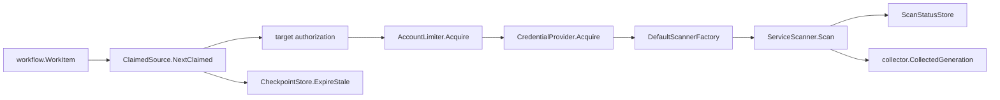

# internal/collector/awscloud/awsruntime

`internal/collector/awscloud/awsruntime` adapts AWS service scanners to the
workflow-claimed collector runtime. It parses AWS work claims, authorizes them
against configured target scopes, acquires claim-scoped credentials, runs one
service scanner, records scanner-side status, and returns a
`collector.CollectedGeneration`.

This package does not map AWS service responses into facts, persist workflow
rows, commit facts, write graph rows, or decide reducer/query truth.

## Runtime Flow



## Core Responsibilities

- Decode `AcceptanceUnitID` as JSON with `account_id`, `region`, and
  `service_kind`.
- Authorize claims against configured target scopes before credential access.
- Limit concurrent claims per account.
- Acquire and release claim-scoped AWS credentials.
- Expire stale pagination checkpoints for the current workflow generation.
- Select production scanners through `DefaultScannerFactory`.
- Start and observe scanner-side status for API counts, throttles, warnings,
  partial scans, and scan results.
- Expose `SupportedServiceKinds` and `SupportsServiceKind` so command startup
  validation matches the production scanner registry.

## Credential Rules

- Unauthorized claims never receive credentials.
- Central AssumeRole scopes require a same-account role ARN and external ID.
- Local workload-identity scopes must not carry AssumeRole routing fields.
- SDK config uses adaptive retry behavior.
- `CredentialLease.Release` must clear temporary credential material after scan
  attempts.
- STS or workload-identity failures emit an `assumerole_failed` warning fact and
  record `credential_failed` scan status.

## Scanner Registry Rules

`DefaultScannerFactory` is the production scanner registry. Add full-scan
services there and update `SupportedServiceKinds`; do not branch scanner
selection in the command.

ECS and Lambda scanners require a non-empty redaction key because environment
values are sensitive even when variable names look harmless. Metadata-only
service scanners must not broaden into data-plane reads, secret-value reads,
policy persistence, payload capture, or mutation APIs.

## Telemetry

This package starts claim, credential, and service-scan spans. Service SDK
adapters emit per-API call counters, throttle counters, and pagination spans.

Key signals:

- `aws.collector.claim.process`
- `aws.credentials.assume_role`
- `aws.service.scan`
- `aws.service.pagination.page`
- `eshu_dp_aws_api_calls_total`
- `eshu_dp_aws_throttle_total`
- `eshu_dp_aws_claim_concurrency`
- `eshu_dp_aws_assumerole_failed_total`
- `eshu_dp_aws_budget_exhausted_total`
- `eshu_dp_aws_pagination_checkpoint_events_total`
- `eshu_dp_aws_resources_emitted_total`
- `eshu_dp_aws_relationships_emitted_total`
- `eshu_dp_aws_tag_observations_emitted_total`
- `eshu_dp_aws_scan_duration_seconds`

Do not add resource names, ARNs, policy text, page tokens, credential material,
or raw AWS error text to metric labels.

## Safety Rules

- Claim parsing uses structured JSON only; do not infer claim scope from ARNs or
  free-form strings.
- Scanner-side status records API and throttle counts before fact commit.
- Commit-side status belongs to the command commit wrapper.
- This package does not decide AWS service retryability; claim failure and retry
  policy stay with `collector.ClaimedService` and workflow handling.
- Route 53, Lambda, EKS, ECS, and other service relationships are reported join
  evidence only. Do not infer workload or deployable-unit truth here.
- Keep stale checkpoint expiry scoped to the current workflow generation.

## Verification

```bash
go test ./internal/collector/awscloud/awsruntime -count=1
go test ./cmd/collector-aws-cloud -count=1
go run ./cmd/eshu docs verify ../go/internal/collector/awscloud/awsruntime \
  --limit 1000 --fail-on contradicted,missing_evidence
```

Run the touched service and SDK adapter package tests when scanner registration
or source mapping changes.

## Related Docs

- [AWS Cloud Fact Contracts](../README.md)
- [AWS Cloud Collector Service](../../../../../docs/public/services/collector-aws-cloud.md)
- [Collector Authoring](../../../../../docs/public/guides/collector-authoring.md)
- [Service Runtimes](../../../../../docs/public/deployment/service-runtimes.md)
