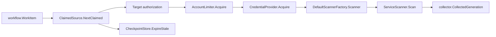

# AWS Cloud Runtime

## Purpose

`internal/collector/awscloud/awsruntime` adapts AWS service scanners to the
workflow-claimed collector runtime. It parses `(account_id, region,
service_kind)` claim targets, authorizes them against configured target scopes,
acquires claim-scoped credentials, records durable scanner-side status, and
returns collected generations for the shared collector commit path.

## Ownership boundary

This package owns claim parsing, target authorization, credential lease
coordination, per-account concurrency, production scanner selection, AWS
pagination checkpoint invalidation, and scanner-side scan-status updates. It
does not own AWS service response mapping, fact-envelope identity, workflow row
persistence, commit-side status updates, graph writes, reducer admission, or
query behavior.

## Exported surface

See `doc.go` for the godoc contract.

- `Config` - collector instance and target-scope authorization configuration.
- `TargetScope` - account, allowed regions, allowed services, and credential
  routing.
- `AccountLimiter` - in-process per-account claim limiter and concurrency
  observer.
- `CredentialConfig` - non-secret credential mode, role ARN, and external ID.
  Command config validation requires central AssumeRole scopes to carry both a
  same-account role ARN and an external ID; local workload identity scopes must
  not carry AssumeRole routing fields.
- `Target` - one authorized AWS claim target.
- `CredentialProvider` - acquires a claim-scoped credential lease.
- `CredentialLease` - releases temporary credential material after a scan.
- `AWSConfigLease` - exposes claim-scoped AWS SDK configuration to service
  adapters.
- `SDKCredentialProvider` - production credential provider using workload
  identity or STS AssumeRole.
- `DefaultScannerFactory` - production scanner dispatcher. It holds the
  runtime-wide tracer, instruments, checkpoint store, and redaction key and
  dispatches every claim through the init-time scanner registry. It has no
  compile-time dependency on individual service packages.
- `Register`, `LookupBuilder`, `RegisteredServiceKinds` - the scanner
  registry primitive. Service `runtimebind` sub-packages call `Register` from
  `init()` so new scanners stay pure-additive.
- `ScannerDeps`, `ScannerRegistration`, `ScannerBuilder` - the registry
  contract. Builders consume `ScannerDeps`; bindings install
  `ScannerRegistration` records.
- `SupportedServiceKinds` and `SupportsServiceKind` - registry-backed
  service-kind introspection used by command-side target-scope validation so
  startup checks cannot drift from scanner availability.
- `ScannerFactory` - creates a service scanner for one target and lease.
- `ServiceScanner` - scans one service claim into fact envelopes.
- `CheckpointStore` - durable pagination checkpoint store used by long service
  scans.
- `ScanStatusStore` - durable scanner-side status store for start, API count,
  throttle count, warning, and partial-run evidence.
- `ClaimedSource` - implements the collector claimed-source contract.

## Dependencies

- `internal/collector` for `CollectedGeneration` and `FactsFromSlice`.
- `internal/collector/awscloud` for claim boundaries and warning envelopes.
- `internal/collector/awscloud/checkpoint` for durable pagination checkpoint
  scope and store contracts.
- `internal/facts` for warning fact types.
- `internal/redact` for the runtime-shared redaction key carried in
  `ScannerDeps`.
- `internal/scope` for AWS scope and collector identity.
- `internal/telemetry` for shared instruments carried in `ScannerDeps`.
- `internal/workflow` for durable work item claims.
- AWS SDK for Go v2 `config`, `sts`, and credential cache support.

This package no longer imports individual `services/<svc>` or `awssdk`
packages directly. Each scanner registers itself from
`services/<svc>/runtimebind/init()`, and the command pulls every binding
through `awsruntime/bindings`. That keeps adding a new AWS scanner additive:
no file in this package changes.

## Telemetry

This package starts claim, credential, and scan spans through `ClaimedSource`.
Service `awssdk` adapters emit per-API call counters, throttle counters, and
pagination spans. The command registers the instruments:

- `eshu_dp_aws_api_calls_total`
- `eshu_dp_aws_throttle_total`
- `eshu_dp_aws_claim_concurrency`
- `eshu_dp_aws_assumerole_failed_total`
- `eshu_dp_aws_budget_exhausted_total`
- `eshu_dp_aws_pagination_checkpoint_events_total`
- `eshu_dp_aws_resources_emitted_total`
- `eshu_dp_aws_relationships_emitted_total`
- `eshu_dp_aws_tag_observations_emitted_total`
- `eshu_dp_aws_org_access_skipped_total`
- `eshu_dp_aws_scan_duration_seconds`
- `aws.collector.claim.process`
- `aws.credentials.assume_role`
- `aws.service.scan`
- `aws.service.pagination.page`

## Gotchas / invariants

- `AcceptanceUnitID` is JSON with `account_id`, `region`, and `service_kind`.
  The runtime does not parse ARNs or free-form strings to discover claim scope.
- Credential acquisition happens after target authorization. An unauthorized
  claim never receives credentials.
- `CredentialLease.Release` runs after scanner construction and scan attempts.
  Implementations must clear temporary credential material there.
- `SDKCredentialProvider` loads AWS SDK config with adaptive retries and passes
  required STS external IDs for central AssumeRole scopes.
- `DefaultScannerFactory` is the only production registry for service scanners;
  add full-scan services there and update `supportedServiceKinds` instead of
  branching in the command.
- ECS, Lambda, Security Hub, and Organizations service scans require a
  non-empty redaction key because environment values, Security Hub action target
  descriptions, and Organizations account email/name values are treated as
  sensitive even when source labels look harmless.
- EC2 service scans collect network topology only. They do not emit EC2
  instance inventory facts.
- Target scopes default to one active claim per account when
  `max_concurrent_claims` is unset.
- STS or workload-identity failures emit an `assumerole_failed` warning fact for
  the claimed generation and record `credential_failed` scan status.
- Stale pagination checkpoints are expired at claim start for the current
  workflow generation before credentials are acquired.
- Scanner-side status records API call counts and throttle counts before fact
  commit. The command's commit wrapper records whether the fenced fact
  transaction later committed or failed.
- Route 53 alias targets are reported DNS evidence only; do not infer workload
  or deployable-unit truth in the runtime.
- Lambda aliases, event-source mappings, image URIs, execution roles, subnets,
  and security groups are reported join evidence only; do not infer workload or
  deployable-unit truth in the runtime.
- EKS clusters, OIDC providers, node groups, add-ons, IAM roles, subnets, and
  security groups are reported join evidence only; do not infer Kubernetes
  workload or deployable-unit truth in the runtime.
- SQS scanners must stay metadata-only. The runtime registry wires the SQS SDK
  adapter, but it must not broaden the service contract to message reads,
  message mutations, or queue policy persistence.
- SNS scanners must stay metadata-only. The runtime registry wires the SNS SDK
  adapter, but it must not broaden the service contract to publishing,
  subscription mutations, policy persistence, data-protection-policy
  persistence, or raw non-ARN endpoint persistence.
- EventBridge scanners must stay metadata-only. The runtime registry wires the
  EventBridge SDK adapter, but it must not broaden the service contract to
  PutEvents, rule/target mutations, event bus policy persistence, target input
  payload persistence, input-transformer persistence, HTTP-parameter
  persistence, or raw non-ARN target persistence.
- GuardDuty scanners must stay metadata-only. The runtime registry wires the
  GuardDuty SDK adapter, but it must not broaden the service contract to
  finding-body reads, filter criteria reads, threat intel/IP list content
  fetches, invitation/member mutations, publishing destination mutations, set
  mutations, or finding feedback mutations.
- S3 scanners must stay metadata-only. The runtime registry wires the S3 SDK
  adapter, but it must not broaden the service contract to object inventory,
  bucket policy persistence, ACL grant persistence, replication persistence,
  lifecycle persistence, notification persistence, or mutation APIs.
- RDS scanners must stay metadata-only. The runtime registry wires the RDS SDK
  adapter, but it must not broaden the service contract to database
  connections, database names, master usernames, secrets, snapshots, log
  contents, Performance Insights samples, schemas, tables, row data, or
  mutation APIs.
- DynamoDB scanners must stay metadata-only. The runtime registry wires the
  DynamoDB SDK adapter, but it must not broaden the service contract to item
  reads, table scans, table queries, stream record reads, backup/export payload
  reads, resource-policy persistence, PartiQL calls, or mutation APIs.
- CloudWatch Logs scanners must stay metadata-only. The runtime registry wires
  the CloudWatch Logs SDK adapter, but it must not broaden the service contract
  to log event reads, log stream payload reads, Insights query calls, export
  payload reads, resource-policy persistence, subscription payload reads, or
  mutation APIs.
- CloudFront scanners must stay metadata-only. The runtime registry wires the
  CloudFront SDK adapter, but it must not broaden the service contract to
  object reads, origin payload reads, distribution config payload persistence,
  policy-document persistence, certificate body reads, private-key handling,
  origin custom header value persistence, or mutation APIs.
- API Gateway scanners must stay metadata-only. The runtime registry wires the
  API Gateway SDK adapter, but it must not broaden the service contract to API
  execution, export, API key, authorizer secret, policy JSON, integration
  credential, stage variable, template body, payload, or mutation APIs.
- Secrets Manager scanners must stay metadata-only. The runtime registry wires
  the Secrets Manager SDK adapter, but it must not broaden the service contract
  to secret value reads, version payload reads, resource-policy persistence,
  external rotation partner metadata persistence, or mutation APIs.
- SSM scanners must stay metadata-only. The runtime registry wires the SSM SDK
  adapter, but it must not broaden the service contract to parameter value
  reads, history value reads, raw description persistence, raw allowed-pattern
  persistence, raw policy JSON persistence, decryption, or mutation APIs.
- Athena scanners must stay metadata-only. The runtime registry wires the
  Athena SDK adapter, but it must not broaden the service contract to
  StartQueryExecution, StopQueryExecution, GetQueryResults, GetQueryExecution,
  ListQueryExecutions, named-query SQL body reads, prepared-statement query
  body reads, query history persistence, or mutation APIs.
- Glue scanners must stay metadata-only. The runtime registry wires the Glue
  SDK adapter, but it must not broaden the service contract to StartCrawler,
  StartJobRun, BatchStopJobRun, Create*/Update*/Delete* APIs, job script body
  reads, job default-argument value persistence, secret-shaped argument key
  persistence, connection password reads, JDBC credential URL persistence,
  connection property value persistence, table column statistics with sample
  values, classifier custom-pattern reads, workflow graph payload reads, or
  workflow run state reads. The SDK adapter must call GetConnections with
  HidePassword=true and GetWorkflow with IncludeGraph=false.
- Step Functions scanners must stay metadata-only. The runtime registry wires
  the Step Functions SDK adapter, but it must not broaden the service contract
  to StartExecution, StopExecution, CreateStateMachine, UpdateStateMachine,
  DeleteStateMachine, SendTaskSuccess, SendTaskFailure, or any other mutation
  or execution-payload API. It must not persist execution input, execution
  output, execution history events, activity task tokens, or literal
  Parameters/ResultPath/ResultSelector/InputPath/OutputPath/Result contents
  from a state machine definition; only state names, state types, transitions,
  and Task Resource ARNs are persisted.
- Access Analyzer scanners must stay metadata-only. The runtime registry wires
  the Access Analyzer SDK adapter, but it must not broaden the service contract
  to external finding-body persistence, archive-rule filter persistence,
  policy-generation output, per-action unused-access detail persistence,
  GetFinding, or mutation APIs.
- Organizations scanners must stay metadata-only. The runtime registry wires
  the Organizations SDK adapter, forces API calls to the `us-east-1` control
  plane, and requires management-account or delegated-administrator
  credentials. It must not broaden the service contract to policy body reads,
  account lifecycle mutations, policy mutations, service-access mutations, or
  delegated-admin mutations. Non-org-aware credentials must surface an
  `organizations_org_access_skipped` warning and
  `eshu_dp_aws_org_access_skipped_total` rather than failed or fabricated
  organization truth.
- This package does not decide retryability for AWS service errors. The caller
  owns claim failure and retry policy through `collector.ClaimedService`.

## Related docs

- `docs/public/services/collector-aws-cloud.md`
- `docs/public/guides/collector-authoring.md`
