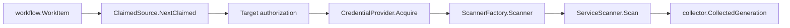

# AWS Cloud Runtime

## Purpose

`internal/collector/awscloud/awsruntime` adapts AWS service scanners to the
workflow-claimed collector runtime. It parses `(account_id, region,
service_kind)` claim targets, authorizes them against configured target scopes,
acquires claim-scoped credentials, and returns collected generations for the
shared collector commit path.

## Ownership boundary

This package owns claim parsing, target authorization, credential lease
coordination, and AWS collected-generation construction. It does not own AWS
service response mapping, fact-envelope identity, workflow row persistence,
graph writes, reducer admission, or query behavior.

## Exported surface

See `doc.go` for the godoc contract.

- `Config` - collector instance and target-scope authorization configuration.
- `TargetScope` - account, allowed regions, allowed services, and credential
  routing.
- `AccountLimiter` - in-process per-account claim limiter and concurrency
  observer.
- `CredentialConfig` - non-secret credential mode, role ARN, and external ID.
- `Target` - one authorized AWS claim target.
- `CredentialProvider` - acquires a claim-scoped credential lease.
- `CredentialLease` - releases temporary credential material after a scan.
- `ScannerFactory` - creates a service scanner for one target and lease.
- `ServiceScanner` - scans one service claim into fact envelopes.
- `ClaimedSource` - implements the collector claimed-source contract.

## Dependencies

- `internal/collector` for `CollectedGeneration` and `FactsFromSlice`.
- `internal/collector/awscloud` for claim boundaries and warning envelopes.
- `internal/facts` for warning fact types.
- `internal/scope` for AWS scope and collector identity.
- `internal/workflow` for durable work item claims.

## Telemetry

This package has no direct telemetry yet. The command/runtime wiring that wraps
`CredentialProvider` and `ServiceScanner` must emit the AWS collector telemetry
contract:

- `eshu_dp_aws_api_calls_total`
- `eshu_dp_aws_throttle_total`
- `eshu_dp_aws_claim_concurrency`
- `eshu_dp_aws_assumerole_failed_total`
- `eshu_dp_aws_scan_duration_seconds`
- `aws.collector.claim.process`
- `aws.credentials.assume_role`
- `aws.service.scan`
- `aws.service.pagination.page`

## Gotchas / invariants

- `AcceptanceUnitID` is JSON with `account_id`, `region`, and `service_kind`.
  The runtime does not parse ARNs or free-form strings to discover claim scope.
- Credential acquisition happens after target authorization. An unauthorized
  claim never receives credentials.
- `CredentialLease.Release` runs after scanner construction and scan attempts.
  Implementations must clear temporary credential material there.
- Target scopes default to one active claim per account when
  `max_concurrent_claims` is unset.
- STS or workload-identity failures emit an `assumerole_failed` warning fact for
  the claimed generation.
- This package does not decide retryability for AWS service errors. The caller
  owns claim failure and retry policy through `collector.ClaimedService`.

## Related docs

- `docs/docs/adrs/2026-04-20-aws-cloud-scanner-collector.md`
- `docs/docs/guides/collector-authoring.md`
