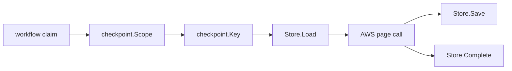

# AWS Pagination Checkpoints

## Purpose

`internal/collector/awscloud/checkpoint` defines the durable resume contract for
long AWS service scans. The package is storage-neutral: AWS service adapters use
the `Store` interface, while the Postgres implementation owns persistence and
telemetry.

## Flow

## Contract

- `Scope` is the claim boundary: collector instance, account, region, service,
  generation, and fencing token.
- `Key` adds a service operation and optional resource parent. ECR image scans
  use the repository ARN as the parent and the DescribeImages operation name.
- `Checkpoint.PageToken` is the token that is safe to retry next. Scanners save
  the token before reading that page so a crash can re-read the last page rather
  than skip facts whose transaction may not have committed.
- `Store.ExpireStale` deletes checkpoints for the same claim boundary when the
  workflow generation changes.

## Telemetry

The Postgres store records checkpoint load, save, resume, expiry, and failure
events with low-cardinality AWS labels. Resource parents and raw page tokens
must stay out of metric labels.

## Gotchas

- Do not persist next-page tokens after a page returns unless the facts for the
  page are already durable. The shared collector commit path currently commits a
  whole generation transaction after the scanner returns.
- Duplicate page delivery is allowed at the API layer. Service adapters must
  keep emitted facts deterministic and should dedupe repeated page records
  within one scan where the API can repeat a page.
