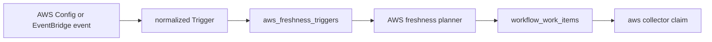

# AWS Freshness Triggers

## Purpose

`internal/collector/awscloud/freshness` defines the normalized AWS freshness
trigger contract for EventBridge and AWS Config wake-up signals. It maps an
event to an existing AWS collector claim target: account, region, and
service-kind.

Freshness triggers do not make graph truth fresh. They only ask the normal AWS
collector to rescan a bounded slice. Scheduled scans remain authoritative.

## Flow

## Exported Surface

- `Trigger` - normalized AWS event input with account, region, and service kind.
- `StoredTrigger` - durable trigger row with delivery and coalescing keys.
- `Target` - AWS collector claim target derived from a trigger.
- `NewStoredTrigger` - validates and builds stable durable keys.
- `NormalizeEventBridge` - normalizes AWS Config and EventBridge CloudTrail
  events into bounded triggers without AWS SDK calls.
- `EventKindConfigChange` and `EventKindCloudTrailAPI` - bounded trigger kinds.
- `TriggerStatusQueued`, `TriggerStatusClaimed`, `TriggerStatusHandedOff`, and
  `TriggerStatusFailed` - durable handoff states.

## Invariants

- A trigger must name one concrete account, region, and supported service kind.
- Wildcard regions or services are rejected before workflow work can be planned.
- `FreshnessKey` coalesces by `(account_id, region, service_kind)` because AWS
  collectors scan service tuples, not individual resource IDs.
- Resource IDs are provenance for logs or spans only; they are not metric labels
  and do not change the scan boundary.
- IAM, Route 53, and CloudFront events normalize to `aws-global` so the trigger
  target matches the collector claim shape for global scanner families.

## Telemetry

The runtime that receives or hands off triggers records
`eshu_dp_aws_freshness_events_total{kind,action}`. The trigger contract keeps
the label set bounded: kind is one of `config_change` or `cloudtrail_api`, and
action is a closed intake or handoff action.
