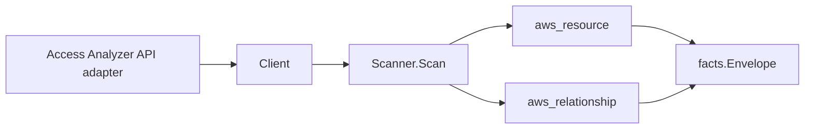

# AWS IAM Access Analyzer Scanner

## Purpose

`internal/collector/awscloud/services/accessanalyzer` owns the IAM Access
Analyzer scanner contract for the AWS cloud collector. It converts analyzer
metadata, archive-rule bindings, aggregate finding counts, and unused-access
last-accessed summaries into `awscloud` observations.

## Ownership boundary

This package owns scanner-level Access Analyzer fact selection and relationship
mapping. It does not own AWS SDK pagination, STS credentials, workflow claims,
fact persistence, graph writes, reducer admission, or query behavior.

## Exported surface

See `doc.go` for the godoc contract.

- `Client` - minimal Access Analyzer metadata read surface consumed by
  `Scanner`.
- `Scanner` - emits analyzer, archive-rule, finding-count, unused-access
  summary, and relationship facts for one boundary.
- `Analyzer` - scanner-owned analyzer metadata with safe child observations.
- `ArchiveRule` - archive-rule name and analyzer binding only.
- `FindingCount` - aggregate finding count keyed by status and resource type.
- `UnusedAccessSummary` - per-resource unused-access last-accessed summary.

## Dependencies

- `internal/collector/awscloud` for boundaries, resource constants,
  relationship constants, and envelope builders.
- `internal/facts` for emitted fact envelope kinds.

The package depends on a small `Client` interface rather than the AWS SDK for Go
v2 so tests can use fakes and runtime adapters can own SDK behavior.

## Telemetry

This scanner emits no spans or logs directly. `awsruntime.ClaimedSource`
records scan duration and emitted resource counts after `Scanner.Scan` returns.
The `awssdk` adapter records Access Analyzer API call counts, throttles, and
pagination spans.

## Gotchas / invariants

- Access Analyzer facts are metadata only. The scanner must not create, update,
  delete, archive, scan, or generate policies in AWS.
- Analyzer resources carry raw AWS analyzer type, derived scope, derived
  analysis type, status, tags, and last-resource-analyzed timestamps.
- Archive-rule resources carry rule name and analyzer ARN only. Filter criteria
  are not represented because they encode security-team triage rules.
- Finding-count resources are aggregate buckets by finding status and resource
  type. They do not carry principal, action, condition, resource-policy, source,
  or finding-body details.
- Unused-access summary resources carry one per-resource last-accessed
  timestamp. Per-action unused-access details stay out of facts.
- Organization-scope analyzers emit analyzer-to-account relationship evidence
  only when the analyzer ARN contains a parseable AWS account ID.
- Tags are raw AWS tag evidence. Do not infer environment, owner, workload, or
  deployable-unit truth from tags in this package.

## Evidence

Collector Performance Evidence: `go test ./internal/collector/awscloud/services/accessanalyzer/... -count=1`
covers one ListAnalyzers stream, ListArchiveRules reads, ListFindings aggregate
counting for external-access analyzers, ListFindingsV2 plus GetFindingV2
unused-access summary reads, no GetFinding external finding-body reads, no
policy-generation reads, no mutation APIs, and no graph writes in the
collector.

No-Regression Evidence: `go test ./cmd/collector-aws-cloud ./internal/collector/awscloud/... -count=1`
covers Access Analyzer resource fact emission, archive-rule filter omission,
finding-body redaction, unused-action omission, organization-account
relationship emission, archive-rule relationship emission, runtime
registration, command configuration, and the SDK adapter's safe metadata
mapping.

Collector Observability Evidence: Access Analyzer uses the existing AWS
collector `aws.service.pagination.page` span plus
`eshu_dp_aws_api_calls_total`, `eshu_dp_aws_throttle_total`,
`eshu_dp_aws_resources_emitted_total`,
`eshu_dp_aws_relationships_emitted_total`, and `aws_scan_status` rows. Metric
labels stay bounded to service, account, region, operation, result, and
resource type.

No-Observability-Change: the existing AWS collector telemetry contract already
diagnoses Access Analyzer scans through `aws.service.scan`,
`aws.service.pagination.page`, API/throttle counters, resource/relationship
counters, and `aws_scan_status`.

Collector Deployment Evidence: Access Analyzer runs inside the existing hosted
`collector-aws-cloud` runtime, so `/healthz`, `/readyz`, `/metrics`, and
`/admin/status` stay covered by the command wiring and Helm collector runtime.

## Related docs

- `docs/public/services/collector-aws-cloud.md`
- `docs/public/services/collector-aws-cloud-scanners.md`
- `docs/public/guides/collector-authoring.md`
