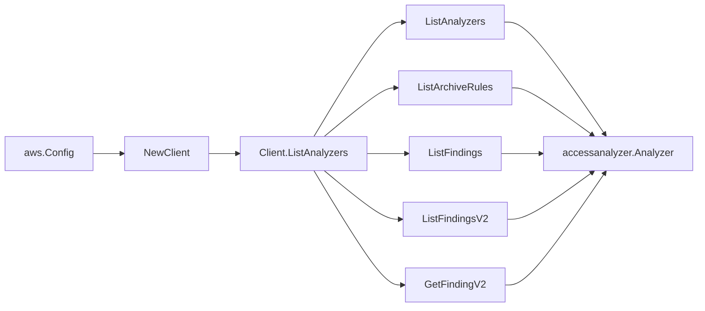

# AWS IAM Access Analyzer SDK Adapter

## Purpose

`internal/collector/awscloud/services/accessanalyzer/awssdk` adapts AWS SDK for
Go v2 Access Analyzer responses to the scanner-owned `Client` contract. It owns
analyzer pagination, archive-rule pagination, finding-list pagination,
unused-access detail reads, throttle classification, and per-call AWS API
telemetry.

## Ownership boundary

This package owns SDK calls for IAM Access Analyzer. It does not own workflow
claims, credential acquisition, Access Analyzer fact selection, graph writes,
reducer admission, or query behavior.

## Exported surface

See `doc.go` for the godoc contract.

- `Client` - AWS SDK-backed implementation of `accessanalyzer.Client`.
- `NewClient` - builds a `Client` for one claimed AWS boundary.

## Dependencies

- `internal/collector/awscloud` for account, region, and service boundary
  labels.
- `internal/collector/awscloud/services/accessanalyzer` for scanner-owned
  result types.
- `internal/telemetry` for AWS API call and throttle instruments.
- AWS SDK for Go v2 `accessanalyzer` and Smithy error contracts.

## Telemetry

Access Analyzer pages and point reads are wrapped with:

- `aws.service.pagination.page`
- `eshu_dp_aws_api_calls_total`
- `eshu_dp_aws_throttle_total`

Metric labels stay bounded to service, account, region, operation, and result.
Analyzer ARNs, finding IDs, tags, archive filters, principal maps, action
lists, conditions, resources, sources, and raw AWS error payloads stay out of
metric labels.

## Gotchas / invariants

- `ListAnalyzers` discovers account and organization analyzers for external and
  unused access. Internal-access analyzers are outside this scanner contract.
- `ListArchiveRules` returns filter criteria; the adapter discards them and
  returns only rule name, analyzer ARN, and timestamps.
- `ListFindings` is used only for external-access aggregate counts. The adapter
  discards action, principal, condition, resource, and source fields.
- `ListFindingsV2` and `GetFindingV2` are used for unused-access summaries.
  The adapter keeps the per-resource last-accessed timestamp and discards
  per-action unused-access details. `GetFindingV2` detail reads are bounded per
  analyzer; after the cap, aggregate counts continue and the adapter returns a
  `budget_exhausted` warning for the partial unused-access summaries.
- Supported analyzers without an ARN do not trigger child reads. Child facts
  depend on the analyzer ARN for source-stable identities.
- The adapter must not call `GetFinding`, policy-generation APIs, archive-rule
  mutation APIs, finding mutation APIs, analyzer mutation APIs, or resource-scan
  mutation APIs.
- SDK adapters translate AWS records into scanner-owned types; scanner tests
  should not mock AWS SDK pagination.

## Related docs

- `docs/public/services/collector-aws-cloud.md`
- `docs/public/services/collector-aws-cloud-scanners.md`
- `docs/public/guides/collector-authoring.md`
