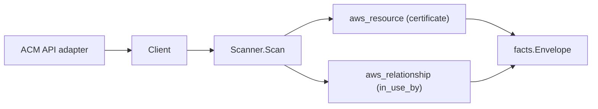

# AWS ACM Scanner

## Purpose

`internal/collector/awscloud/services/acm` owns the ACM scanner contract for the
AWS cloud collector. It converts AWS Certificate Manager certificate metadata
into `aws_resource` facts and emits ACM-reported in-use-by evidence as
`certificate-to-using-resource` relationships.

The scanner is metadata-only. It NEVER reads certificate body PEM, NEVER reads
private key material, and NEVER calls any ACM mutation API.

## Ownership boundary

This package owns scanner-level ACM fact selection and identity mapping. It does
not own AWS SDK pagination, STS credentials, workflow claims, fact persistence,
graph writes, reducer admission, or query behavior.

## Exported surface

See `doc.go` for the godoc contract.

- `Client` - minimal ACM metadata read surface consumed by `Scanner`. It
  intentionally exposes only `ListCertificates`. `GetCertificate` and
  `ExportCertificate` are excluded by design.
- `Scanner` - emits certificate metadata facts for one boundary.
- `Certificate` - scanner-owned representation of one ACM certificate.

## Dependencies

- `internal/collector/awscloud` for boundaries, resource constants,
  relationship constants, and envelope builders.
- `internal/facts` for emitted fact envelope kinds.

The package depends on a small `Client` interface rather than the AWS SDK for Go
v2 so tests can use fake clients and runtime adapters can own SDK behavior.

## Telemetry

This scanner emits no spans or logs directly. `awsruntime.ClaimedSource` records
scan duration and emitted resource counts after `Scanner.Scan` returns. The
`awssdk` adapter records ACM API call counts, throttles, and pagination spans.

## Gotchas / invariants

- Certificate facts are metadata only. NEVER call `GetCertificate` (returns the
  PEM body for public certs) or `ExportCertificate` (returns the private key
  for ACM-issued certs).
- NEVER call any ACM mutation API: `ImportCertificate`, `DeleteCertificate`,
  `RenewCertificate`, `RequestCertificate`, `UpdateCertificateOptions`,
  `ResendValidationEmail`, `RemoveTagsFromCertificate`.
- ACM Private CA (acm-pca) is out of scope; only the public ACM API is read.
- In-use-by relationships are emitted only when both the certificate ARN and
  the in-use-by entry are non-empty ARN-shaped strings.
- Tags are raw AWS tag evidence. Do not infer environment, owner, workload, or
  deployable-unit truth from tags here.

## Evidence

Collector Performance Evidence: `go test ./internal/collector/awscloud/services/acm/...`
covers the bounded ACM metadata path: one paginated certificate listing, one
DescribeCertificate per certificate, one ListTagsForCertificate per certificate,
no GetCertificate calls, and no ExportCertificate calls.

No-Regression Evidence: `go test ./cmd/collector-aws-cloud ./internal/collector/awscloud/...`
covers ACM metadata fact emission, in-use-by relationship emission, runtime
registration, command configuration, and the SDK adapter's exclusion of the
forbidden body/export APIs.

Collector Observability Evidence: ACM uses the existing AWS collector
`aws.service.pagination.page` span plus `eshu_dp_aws_api_calls_total`,
`eshu_dp_aws_throttle_total`, `eshu_dp_aws_resources_emitted_total`,
`eshu_dp_aws_relationships_emitted_total`, and `aws_scan_status` rows. Metric
labels stay bounded to service, account, region, operation, result, and status.

No-Observability-Change: the existing AWS collector telemetry contract already
diagnoses ACM scans through `aws.service.scan`,
`aws.service.pagination.page`, API/throttle counters, resource/relationship
counters, and `aws_scan_status`.

Collector Deployment Evidence: ACM runs inside the existing hosted
`collector-aws-cloud` runtime, so `/healthz`, `/readyz`, `/metrics`, and
`/admin/status` stay covered by the command wiring and Helm collector runtime.

## Related docs

- `docs/public/services/collector-aws-cloud.md`
- `docs/public/services/collector-aws-cloud-scanners.md`
- `docs/public/guides/collector-authoring.md`
