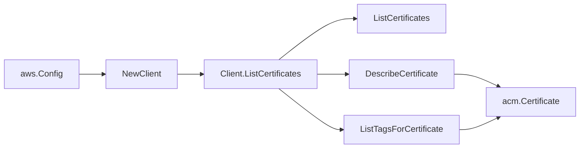

# AWS ACM SDK Adapter

## Purpose

`internal/collector/awscloud/services/acm/awssdk` adapts AWS SDK for Go v2 ACM
responses to the scanner-owned `acm.Client` contract. It owns ACM certificate
pagination, certificate metadata reads, certificate tag reads, throttle
classification, and per-call AWS API telemetry.

## Ownership boundary

This package owns SDK calls for ACM. It does not own workflow claims, credential
acquisition, ACM fact selection, graph writes, reducer admission, or query
behavior.

## Exported surface

See `doc.go` for the godoc contract.

- `Client` - AWS SDK-backed implementation of `acm.Client`.
- `NewClient` - builds a `Client` for one claimed AWS boundary.

## Dependencies

- `internal/collector/awscloud` for account, region, and service boundary
  labels.
- `internal/collector/awscloud/services/acm` for scanner-owned result types.
- `internal/telemetry` for AWS API call and throttle instruments.
- AWS SDK for Go v2 `acm` and Smithy error contracts.

## Telemetry

ACM paginator pages and point reads are wrapped with:

- `aws.service.pagination.page`
- `eshu_dp_aws_api_calls_total`
- `eshu_dp_aws_throttle_total`

Metric labels stay bounded to service, account, region, operation, and result.
Certificate ARNs, domain names, tags, and in-use-by ARNs stay out of metric
labels.

## Gotchas / invariants

- The adapter calls only `ListCertificates`, `DescribeCertificate`, and
  `ListTagsForCertificate`.
- The internal `apiClient` interface deliberately excludes `GetCertificate` and
  `ExportCertificate`. A reflection-based test asserts the exclusion and FAILS
  if either method ever appears.
- The adapter MUST NOT call any ACM mutation API: `ImportCertificate`,
  `DeleteCertificate`, `RenewCertificate`, `RequestCertificate`,
  `UpdateCertificateOptions`, `ResendValidationEmail`,
  `RemoveTagsFromCertificate`.
- ACM Private CA (acm-pca) APIs are out of scope.
- SDK adapters translate AWS records into scanner-owned types; scanner tests
  should not mock AWS SDK paginators.

## Related docs

- `docs/public/services/collector-aws-cloud.md`
- `docs/public/services/collector-aws-cloud-scanners.md`
- `docs/public/guides/collector-authoring.md`
