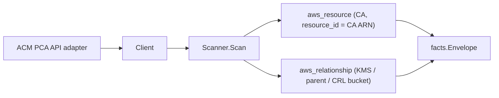

# AWS ACM Private CA Scanner

## Purpose

`internal/collector/awscloud/services/acmpca` owns the ACM Private CA
(acm-pca) scanner contract for the AWS cloud collector. It converts certificate
authority metadata into `aws_resource` facts keyed by the CA ARN and emits
ARN-driven relationship evidence. The CA resource_id is the CA ARN, which is the
join key App Mesh virtual-node client TLS trust edges target
(`aws_acmpca_certificate_authority`); this scanner closes that dangling edge.

## Ownership boundary

This package owns scanner-level certificate authority fact selection and
identity mapping. It does not own AWS SDK pagination, STS credentials, workflow
claims, fact persistence, graph writes, reducer admission, or query behavior.

## Exported surface

See `doc.go` for the godoc contract.

- `Client` - minimal ACM Private CA metadata read surface consumed by `Scanner`.
  Excludes IssueCertificate, GetCertificate, GetCertificateAuthorityCsr,
  GetCertificateAuthorityCertificate, and every CA lifecycle mutation.
- `Scanner` - emits certificate authority metadata facts for one boundary.
- `CertificateAuthority` - scanner-owned CA representation. The certificate
  chain body, CSR, and private key material are intentionally outside the
  contract.

## Dependencies

- `internal/collector/awscloud` for boundaries, the
  `ResourceTypeACMPCACertificateAuthority` resource constant, relationship
  constants, and envelope builders.
- `internal/facts` for emitted fact envelope kinds.

The package depends on a small `Client` interface rather than the AWS SDK for Go
v2 so tests can use fake clients and runtime adapters can own SDK behavior.

## Telemetry

This scanner emits no spans or logs directly. `awsruntime.ClaimedSource` records
scan duration and emitted resource counts after `Scanner.Scan` returns. The
`awssdk` adapter records ACM Private CA API call counts, throttles, and
pagination spans through the shared `aws.service.pagination.page` span and
`eshu_dp_aws_api_calls_total` / `eshu_dp_aws_throttle_total` counters.

## Gotchas / invariants

- Certificate authority facts are metadata only. The scanner must never issue or
  export certificates, read the CSR body, read the certificate chain body, or
  read private key material.
- The CA `resource_id` is the CA ARN. This is load-bearing: the App Mesh
  virtual-node client TLS trust edge targets `aws_acmpca_certificate_authority`
  keyed by the same CA ARN, so changing the resource_id format reopens that
  dangling edge.
- Relationships are ARN-driven and conditional. The scanner emits a CA-to-KMS
  edge only when AWS reports an ARN-shaped KMS key, a subordinate-to-parent edge
  only for a SUBORDINATE CA reporting an ARN-shaped parent, and a CA-to-S3
  CRL-bucket edge only when CRL publishing names a bucket. The scanner never
  synthesizes a KMS, parent, or bucket identity. `DescribeCertificateAuthority`
  does not currently report a KMS key or parent ARN, so those edges stay
  unemitted for the standard metadata response; the fields exist so the edge
  keys on a real reported value if AWS ever surfaces one.
- Tags are raw AWS tag evidence. Do not infer environment, owner, workload, or
  deployable-unit truth from tags in this package.

## Evidence

Collector Performance Evidence: `go test ./internal/collector/awscloud/services/acmpca/...`
covers the bounded ACM Private CA metadata path: one paginated CA listing, one
DescribeCertificateAuthority per CA, one paginated tag read per CA, no
certificate issuance, no chain/CSR/key reads, and no CA mutations.

No-Regression Evidence: `go test ./cmd/collector-aws-cloud ./internal/collector/awscloud/...`
covers CA metadata fact emission keyed by the CA ARN, ARN-gated KMS/parent/CRL
relationship emission, omission of sensitive bodies, runtime registration,
command configuration, and the SDK adapter's reflective exclusion of forbidden
operations. The scanner introduces no Cypher, graph writes, worker claims,
leases, batching, or queue behavior; the only new SDK call paths are bounded,
read-only control-plane reads.

Collector Observability Evidence: acm-pca uses the existing AWS collector
`aws.service.pagination.page` span plus `eshu_dp_aws_api_calls_total`,
`eshu_dp_aws_throttle_total`, `eshu_dp_aws_resources_emitted_total`,
`eshu_dp_aws_relationships_emitted_total`, and `aws_scan_status` rows. Metric
labels stay bounded to service, account, region, operation, result, and status.

No-Observability-Change: the existing AWS collector telemetry contract already
diagnoses acm-pca scans through `aws.service.scan`,
`aws.service.pagination.page`, API/throttle counters, resource/relationship
counters, and `aws_scan_status`. This scanner adds no new instruments.

Collector Deployment Evidence: acm-pca runs inside the existing hosted
`collector-aws-cloud` runtime, so `/healthz`, `/readyz`, `/metrics`, and
`/admin/status` stay covered by the command wiring and Helm collector runtime.

## Related docs

- `docs/public/services/collector-aws-cloud-scanners.md`
- `docs/public/guides/collector-authoring.md`
