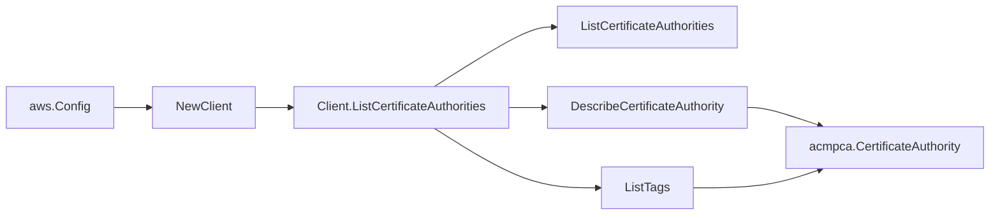

# AWS ACM Private CA SDK Adapter

## Purpose

`internal/collector/awscloud/services/acmpca/awssdk` adapts AWS SDK for Go v2
ACM Private CA (acm-pca) responses to the scanner-owned `acmpca.Client`
contract. It owns certificate authority pagination, CA metadata reads, CA tag
reads, throttle classification, and per-call AWS API telemetry.

## Ownership boundary

This package owns SDK calls for ACM Private CA. It does not own workflow claims,
credential acquisition, CA fact selection, graph writes, reducer admission, or
query behavior.

## Exported surface

See `doc.go` for the godoc contract.

- `Client` - AWS SDK-backed implementation of `acmpca.Client`.
- `NewClient` - builds a `Client` for one claimed AWS boundary.

## Dependencies

- `internal/collector/awscloud` for account, region, and service boundary
  labels.
- `internal/collector/awscloud/services/acmpca` for scanner-owned result types.
- `internal/telemetry` for AWS API call and throttle instruments.
- AWS SDK for Go v2 `acmpca` and Smithy error contracts.

## Telemetry

ACM Private CA paginator pages and point reads are wrapped with:

- `aws.service.pagination.page`
- `eshu_dp_aws_api_calls_total`
- `eshu_dp_aws_throttle_total`

Metric labels stay bounded to service, account, region, operation, and result.
Certificate authority ARNs, serials, subject names, and tags stay out of metric
labels.

## Gotchas / invariants

- The adapter calls only `ListCertificateAuthorities`,
  `DescribeCertificateAuthority`, and `ListTags`.
- The internal `apiClient` interface deliberately excludes `IssueCertificate`,
  `GetCertificate`, `GetCertificateAuthorityCsr`,
  `GetCertificateAuthorityCertificate`, `RevokeCertificate`, and every CA
  lifecycle mutation. A reflection-based test asserts the exclusion and FAILS if
  any forbidden method ever appears.
- `ListCertificateAuthorities` and `ListTags` page with `NextToken`; the loop
  stops when the token is empty so there is no same-token loop.
- The adapter maps only the non-secret CRL bucket name from the revocation
  configuration; custom CNAME, custom path, and object ACL are not carried.
- `DescribeCertificateAuthority` reports no KMS key ARN and no parent CA ARN, so
  `CertificateAuthority.KMSKeyARN` and `ParentCAARN` stay empty for that
  response. The adapter never synthesizes them.
- SDK adapters translate AWS records into scanner-owned types; scanner tests
  should not mock AWS SDK paginators.

## Related docs

- `docs/public/services/collector-aws-cloud-scanners.md`
- `docs/public/guides/collector-authoring.md`
