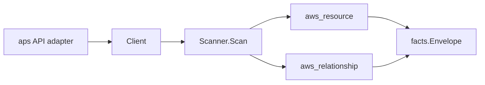

# Amazon Managed Service for Prometheus Scanner

## Purpose

`internal/collector/awscloud/services/amp` owns the Amazon Managed Service for
Prometheus (AMP) scanner contract for the AWS cloud collector. It converts AMP
workspace, rule-groups namespace (names only), and managed-collector (scraper)
metadata into `aws_resource` facts and emits relationship evidence for the
workspace KMS encryption key, namespace-in-workspace membership, and the
scraper's EKS source cluster, destination workspace, and EKS VPC configuration
subnets and security groups.

## Ownership boundary

This package owns scanner-level AMP fact selection and identity mapping. It does
not own AWS SDK pagination, STS credentials, workflow claims, fact persistence,
graph writes, reducer admission, or query behavior.

## Exported surface

See `doc.go` for the godoc contract.

- `Client` - minimal AMP metadata read surface consumed by `Scanner`.
- `Scanner` - emits workspace, rule-groups namespace, and scraper resources plus
  their relationships for one boundary.
- `Snapshot`, `Workspace`, `RuleGroupsNamespace`, `Scraper` - scanner-owned
  views with rule-definition, scrape-configuration, alert-manager, and ingested
  sample fields intentionally absent.

## Dependencies

- `internal/collector/awscloud` for boundaries, resource constants,
  relationship constants, partition helpers, and envelope builders.
- `internal/facts` for emitted fact envelope kinds.

The package depends on a small `Client` interface rather than the AWS SDK for
Go v2 so tests can use fake clients and the runtime adapter can own SDK
behavior.

## Telemetry

This scanner emits no spans or logs directly. `awsruntime.ClaimedSource`
records scan duration and emitted resource counts after `Scanner.Scan` returns.
The `awssdk` adapter records AMP API call counts, throttles, and pagination
spans.

## Gotchas / invariants

- AMP facts are metadata only. The scanner must never read ingested time-series
  samples, query results, alert-manager definitions, rule-group definition
  bodies, or scrape-configuration bodies, and must never call any mutation API.
- The workspace node publishes its resource_id as the workspace ARN (falling
  back to the workspace id). The namespace-in-workspace and
  scraper-sends-to-workspace edges are keyed by that same workspace ARN so they
  join the workspace node instead of dangling.
- A rule-groups namespace publishes its resource_id as the namespace ARN
  (falling back to the namespace name) and carries the namespace NAME only - the
  recording-rule and alerting-rule definition body is never read.
- The workspace-to-KMS-key edge is emitted only when AWS reports a
  customer-managed key. AWS reports a key ARN, which matches the KMS scanner's
  published key resource_id; `target_arn` is set only for ARN-shaped
  identifiers.
- Scrapers are an account-level list, not nested under a workspace, so they
  reference their destination workspace by ARN. The scraper-to-EKS-cluster edge
  keys on the EKS cluster ARN the EKS scanner publishes (`aws_eks_cluster`); the
  scraper-to-subnet and scraper-to-security-group edges key on the bare
  `subnet-` and `sg-` ids the EC2 scanner publishes (`aws_ec2_subnet` and
  `aws_ec2_security_group`). A non-EKS (MSK/VPC) scraper source carries no EKS
  cluster, so it emits no EKS, subnet, or security-group edge.
- Emit reported evidence only. Do not infer deployment, workload, repository
  ownership, environment, or deployable-unit truth from workspace, namespace, or
  scraper names, aliases, or AWS tags.

## Evidence

Collector Performance Evidence:
`go test ./internal/collector/awscloud/services/amp/...` covers the bounded AMP
metadata path: one paginated ListWorkspaces stream, one paginated
ListRuleGroupsNamespaces stream per workspace, one paginated ListScrapers
stream, no rule-definition body reads, no scrape-configuration reads, no
queries, and no graph writes in the collector.

No-Regression Evidence: metadata-only control-plane scanner; new read path, no
change to existing hot paths. `go test ./internal/collector/awscloud/services/amp/...` green.

No-Observability-Change: reuses shared AWS pagination span + API-call/throttle counters; no telemetry contract change.

Collector Deployment Evidence: AMP runs inside the existing hosted
`collector-aws-cloud` runtime, so `/healthz`, `/readyz`, `/metrics`, and
`/admin/status` stay covered by the command wiring and Helm collector runtime.

## Related docs

- `docs/public/services/collector-aws-cloud.md`
- `docs/public/services/collector-aws-cloud-scanners.md`
- `docs/public/services/collector-aws-cloud-security.md`
