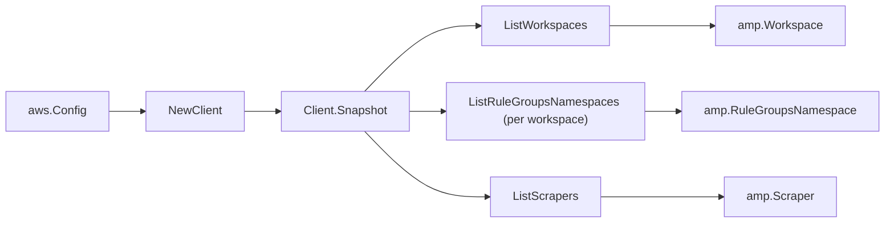

# Amazon Managed Service for Prometheus SDK Adapter

## Purpose

`internal/collector/awscloud/services/amp/awssdk` adapts AWS SDK for Go v2
Amazon Managed Service for Prometheus (aps) responses to the scanner-owned
`Client` contract. It owns workspace pagination, per-workspace rule-groups
namespace pagination, scraper pagination, scraper source/destination union
decoding, throttle classification, and per-call AWS API telemetry.

## Ownership boundary

This package owns SDK calls for AMP. It does not own workflow claims, credential
acquisition, AMP fact selection, graph writes, reducer admission, or query
behavior.

## Exported surface

See `doc.go` for the godoc contract.

- `Client` - AWS SDK-backed implementation of `amp.Client`.
- `NewClient` - builds a `Client` for one claimed AWS boundary.

## Dependencies

- `internal/collector/awscloud` for account, region, and service boundary
  labels.
- `internal/collector/awscloud/services/amp` for scanner-owned result types.
- `internal/telemetry` for AWS API call and throttle instruments.
- AWS SDK for Go v2 `amp` and Smithy error contracts.

## Telemetry

AMP paginator pages are wrapped with:

- `aws.service.pagination.page`
- `eshu_dp_aws_api_calls_total`
- `eshu_dp_aws_throttle_total`

Metric labels stay bounded to service, account, region, operation, and result.
AMP resource ARNs, names, aliases, tags, and raw AWS error payloads stay out of
metric labels.

## Gotchas / invariants

- The adapter reads metadata only. It must never call
  `DescribeRuleGroupsNamespace` (the rule definition body),
  `DescribeWorkspaceConfiguration`, `GetDefaultScraperConfiguration`, or any
  `Create*`, `Put*`, `Update*`, `Delete*` mutation API. `ListRuleGroupsNamespaces`
  returns namespace NAMES only and is the only namespace read.
- `ListScrapers` is account-level: scrapers are not nested under a workspace, so
  each scraper reports its destination workspace ARN. The adapter decodes the
  `Source` union, taking the EKS cluster ARN, subnet ids, and security-group ids
  only from the EKS configuration variant; a non-EKS (MSK/VPC) source yields no
  EKS cluster or EKS VPC ids. It decodes the `Destination` union for the AMP
  workspace ARN.
- `ScraperSummary` and `WorkspaceSummary` carry every metadata field the scanner
  needs, so the adapter never calls `DescribeScraper` or `DescribeWorkspace`.
- SDK adapters translate AWS records into scanner-owned types; scanner tests
  should not mock AWS SDK pagination.

## Related docs

- `docs/public/services/collector-aws-cloud-scanners.md`
- `docs/public/services/collector-aws-cloud-security.md`
