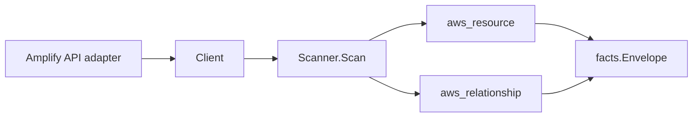

# AWS Amplify Scanner

## Purpose

`internal/collector/awscloud/services/amplify` owns the Amplify scanner contract
for the AWS cloud collector. It converts Amplify app and branch metadata, plus
custom-domain associations, into `aws_resource` facts and emits relationship
evidence for app-to-source-repository (an external `git_repository` join anchor),
app-to-IAM-role (service role and SSR compute role), app-to-custom-domain
(Route 53 hosted zone and CloudFront distribution where resolvable), and
branch-to-app.

## Ownership boundary

This package owns scanner-level Amplify fact selection and identity mapping. It
does not own AWS SDK pagination, STS credentials, workflow claims, fact
persistence, graph writes, reducer admission, or query behavior.

## Exported surface

See `doc.go` for the godoc contract.

- `Client` - minimal Amplify metadata read surface consumed by `Scanner`.
- `Scanner` - emits app and branch resources plus app/branch relationships for
  one boundary.
- `App`, `Branch`, `DomainAssociation`, `SubDomain` - scanner-owned views with
  secret-bearing fields intentionally omitted.
- `SanitizeRepositoryURL` - reduces a repository URL to scheme, host, and path so
  an embedded access token never reaches a scanner-owned record.

## Dependencies

- `internal/collector/awscloud` for boundaries, resource constants,
  relationship constants, and envelope builders.
- `internal/facts` for emitted fact envelope kinds.

The package depends on a small `Client` interface rather than the AWS SDK for
Go v2 so tests can use fake clients and the runtime adapter can own SDK behavior.

## Telemetry

This scanner emits no spans or logs directly. `awsruntime.ClaimedSource` records
scan duration and emitted resource counts after `Scanner.Scan` returns. The
`awssdk` adapter records Amplify API call counts, throttles, and pagination
spans.

## Gotchas / invariants

- Amplify facts are metadata only. The scanner must never create, update,
  delete, start a job, start a deployment, or mutate any Amplify resource, and
  must never persist Amplify environment variables, build-spec bodies, basic-auth
  credentials, or repository access tokens.
- Repository URLs are host and path only. `SanitizeRepositoryURL` strips any
  userinfo (`x-access-token:TOKEN@`) and any query or fragment at the boundary,
  so a token never reaches a fact payload or a graph join key.
- The app node's `resource_id` is the app ARN (API-reported, or partition-aware
  synthesized when absent). Every one of the app's own outgoing edges sources on
  that same id, and the branch-to-app edge targets it, so the edges join the app
  node.
- The app-to-IAM-role edges target the role ARN, which is the IAM scanner's
  `resource_id`. Both the service role and the SSR compute role are emitted when
  present.
- The app-to-Route 53 edge keys on the normalized custom-domain root (lowercased,
  trailing dot trimmed), which matches the route53 scanner's `normalized_name`
  correlation anchor; it carries no target ARN because Amplify reports no zone
  ARN. The app-to-CloudFront edge keys on the `*.cloudfront.net` distribution
  domain extracted from a subdomain DNS record, which matches the cloudfront
  scanner's domain-name anchor; duplicate CloudFront domains across subdomains
  collapse to one edge.
- Synthesized ARNs derive their partition from the scan boundary via
  `awscloud.PartitionForBoundary`, never a hardcoded `arn:aws:`, so GovCloud and
  China apps resolve to ARNs in their own partition instead of dangling.
- Emit reported evidence only. Do not infer deployment, workload, repository
  ownership, environment, or deployable-unit truth from app, branch, or domain
  names or AWS tags.

## Evidence

Collector Performance Evidence:
`go test ./internal/collector/awscloud/services/amplify/...` covers the bounded
Amplify metadata path: one paginated ListApps stream, one paginated ListBranches
stream per app, and one paginated ListDomainAssociations stream per app, with no
GetApp/GetBranch point reads (their structs carry the same secret-bearing fields
and are unnecessary), no Create/Update/Delete/Start-job/Start-deployment calls,
no token reads, no mutations, and no graph writes in the collector.

No-Regression Evidence:
`go test ./cmd/collector-aws-cloud ./internal/collector/awscloud/...` covers
Amplify app and branch metadata fact emission, app-to-repository (`git_repository`
anchor), app-to-IAM-role (service + compute role), app-to-Route 53 hosted zone
(normalized domain join key), app-to-CloudFront distribution (`*.cloudfront.net`
subdomain join key, deduped), and branch-to-app relationship emission, the
no-env-vars/no-tokens payload assertion, the SDK-adapter mutation/token-read
exclusion reflection test, the GovCloud/China synthesized-ARN partition cases,
runtime registration, and the SDK adapter's safe metadata mapping.

Collector Observability Evidence: Amplify uses the existing AWS collector
`aws.service.pagination.page` span plus `eshu_dp_aws_api_calls_total`,
`eshu_dp_aws_throttle_total`, `eshu_dp_aws_resources_emitted_total`,
`eshu_dp_aws_relationships_emitted_total`, and `aws_scan_status` rows. Metric
labels stay bounded to service, account, region, operation, result, and status.

No-Observability-Change: the existing AWS collector telemetry contract already
diagnoses Amplify scans through `aws.service.scan`,
`aws.service.pagination.page`, API/throttle counters, resource/relationship
counters, and `aws_scan_status`. This scanner adds no new instrument, span,
metric label, or status row.

Collector Deployment Evidence: Amplify runs inside the existing hosted
`collector-aws-cloud` runtime, so `/healthz`, `/readyz`, `/metrics`, and
`/admin/status` stay covered by the command wiring and Helm collector runtime.

## Related docs

- `docs/public/services/collector-aws-cloud.md`
- `docs/public/services/collector-aws-cloud-scanners.md`
- `docs/public/services/collector-aws-cloud-security.md`
