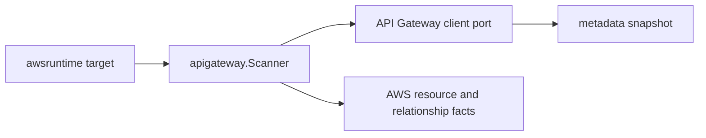

# API Gateway AWS Collector Service

## Purpose

`apigateway` owns metadata-only API Gateway fact emission for the AWS
collector. It turns scanner-owned REST, HTTP, WebSocket, stage, custom-domain,
mapping, and integration projections into AWS resource and relationship
envelopes.

## Ownership boundary

This package owns API Gateway identity, safe metadata projection, and directly
reported relationship evidence for stages, custom-domain mappings, ACM
certificates, access-log destinations, and ARN-addressable integration targets.
It does not call AWS APIs, schedule claims, load credentials, write facts, read
request or response payloads, or infer workload, environment, repository, or
deployable-unit truth.



The scanner emits `aws_apigateway_rest_api`, `aws_apigatewayv2_api`,
`aws_apigateway_stage`, and `aws_apigateway_domain_name` resources. Policy JSON,
API keys, authorizer secrets, integration credentials, stage variable values,
mapping templates, and API payloads are outside the package contract.

## Exported surface

See `doc.go` for the godoc-rendered package contract.

- `Scanner` validates the `apigateway` service boundary and emits fact
  envelopes.
- `Client` is the scanner-owned metadata port implemented by the AWS SDK
  adapter.
- `Snapshot`, `RESTAPI`, `V2API`, `Stage`, `DomainName`, `Mapping`, and
  `Integration` are safe control-plane projections used by adapters and tests.

## Dependencies

- `internal/collector/awscloud` for boundaries, service constants, resource
  observation contracts, and relationship observation contracts.
- `internal/facts` for the fact envelopes returned by `Scanner`.

## Telemetry

The scanner itself emits no new metrics. The AWS SDK adapter records API calls
with the shared AWS collector API-call events, spans, throttle counters, and
operation labels.

## Gotchas / invariants

- The scanner boundary must remain `awscloud.ServiceAPIGateway`.
- The collector may record that an API has a Lambda, listener, Cloud Map,
  certificate, or log destination dependency. Reducers own later canonical
  ownership or workload inference.
- REST integration URIs can wrap a target ARN inside an API Gateway URI. The
  scanner extracts the backend ARN only when the shape is explicit.
- `GetResources` owns REST integration visibility. If AWS keeps throttling it
  after SDK retries, the scanner emits a throttle warning and omits REST
  integration relationships for that scan instead of failing the whole regional
  API Gateway claim.
- Stage variables, policy JSON, API keys, authorizer secrets, integration
  credentials, request templates, and response templates stay out of facts.

## Verification

```bash
go test ./internal/collector/awscloud/services/apigateway/... -count=1
go test ./cmd/collector-aws-cloud ./internal/collector/awscloud/... -count=1
go run ./cmd/eshu docs verify ../go/internal/collector/awscloud/services/apigateway --limit 1000 \
  --fail-on contradicted,missing_evidence
```

Run the AWS runtime tests when scan warnings or partial-status behavior changes.

## Related docs

- `docs/public/services/collector-aws-cloud.md`
- `docs/public/guides/collector-authoring.md`
