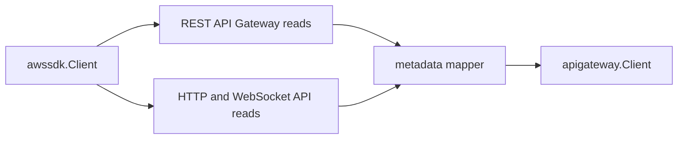

# API Gateway AWS SDK Adapter

## Purpose

`awssdk` owns the AWS SDK for Go v2 adapter for API Gateway metadata. It
implements the scanner-owned `Client` port in the parent package.

## Ownership boundary

This package owns API Gateway REST and v2 SDK pagination, API-call telemetry,
and mapping from AWS SDK response shapes into safe scanner projections. It does
not emit fact envelopes, schedule claims, load credentials, write facts, call
API execution paths, or infer workload, environment, repository, or
deployable-unit truth.



The adapter pages `GetRestApis`, `GetResources` with `embed=methods`,
`GetDomainNames`, `GetBasePathMappings`, `GetApis`, `GetStages`,
`GetIntegrations`, and `GetApiMappings` with bounded page sizes. It maps only
control-plane metadata and drops policy JSON, credentials, template bodies, and
stage variable values.

## Exported surface

See `doc.go` for the godoc-rendered package contract.

- `Client` implements the parent package client port with AWS SDK calls.
- `NewClient` builds the production adapter from an AWS SDK config and
  collector boundary.

## Dependencies

- AWS SDK for Go v2 API Gateway REST and API Gateway v2 clients.
- `internal/collector/awscloud` for boundaries and API-call status events.
- `internal/collector/awscloud/services/apigateway` for scanner-owned models.
- `internal/telemetry` for shared AWS collector API-call metrics and spans.

## Telemetry

Each AWS API call records the shared AWS collector call event and, when
available, the shared API-call metric, throttle counter, and pagination span
using the service, account, region, operation, and result labels.

## Gotchas / invariants

- Do not add API execution, API export, API key, authorizer, or mutation calls.
- `GetResources` must keep `Embed: []string{"methods"}` so REST integrations
  come from the same bounded resource page rather than unbounded per-method
  calls.
- `GetResources` throttling after SDK retries is partial metadata loss, not a
  reason to discard API, stage, v2, and domain observations already available
  in the same claim.
- Do not map policy JSON, management policy JSON, credentials, credential
  ARNs, request templates, response templates, variables, or stage variables
  into scanner models.
- Keep `recordAPICall` wrapped around every AWS operation so scan status and
  throttle counters stay useful.

## Verification

```bash
go test ./internal/collector/awscloud/services/apigateway/awssdk -count=1
go test ./internal/collector/awscloud/services/apigateway/... -count=1
go run ./cmd/eshu docs verify ../go/internal/collector/awscloud/services/apigateway/awssdk --limit 1000 \
  --fail-on contradicted,missing_evidence
```

Run the AWS runtime tests when API-call status or partial-status behavior changes.

## Related docs

- `docs/public/services/collector-aws-cloud.md`
- `docs/public/reference/telemetry/index.md`
