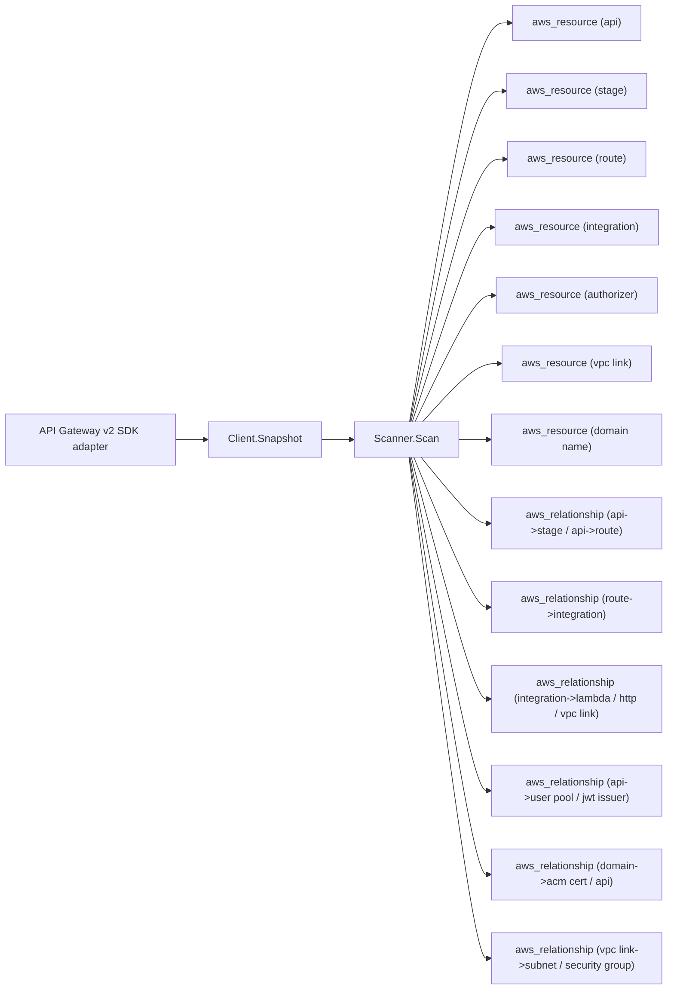

# AWS API Gateway v2 Scanner

## Purpose

`internal/collector/awscloud/services/apigatewayv2` owns the API Gateway v2
scanner contract for the AWS cloud collector. It converts HTTP and WebSocket
APIs, their stages, routes, integrations, authorizers, custom domains, and VPC
links into reported AWS facts and relationship evidence for one claimed account
and region. The classic REST (v1) surface is owned by the separate `apigateway`
scanner.

## Ownership boundary

This package owns scanner-level API Gateway v2 fact selection, resource
identity, and relationship shaping. It does not own AWS SDK pagination,
credential acquisition, workflow claims, fact persistence, graph writes, reducer
admission, or query behavior. SDK translation lives in the sibling `awssdk`
package; registration lives in the sibling `runtimebind` package.

## Exported surface

See `doc.go` for the godoc contract.

- `Client` - minimal API Gateway v2 metadata read surface consumed by `Scanner`.
  It exposes a single `Snapshot` method; a reflection test in the `awssdk`
  adapter asserts no accepted SDK method reaches the OpenAPI export, an
  integration/route response reader, a model/template reader, or a mutation.
- `Scanner` - emits API Gateway v2 metadata and relationship facts for one
  boundary.
- `Snapshot` - the scanner-owned metadata view returned by the adapter.
- `API`, `Stage`, `Route`, `Integration`, `Authorizer`, `DomainName`, `Mapping`,
  `VPCLink` - scanner-owned metadata types. None carries a request/response
  mapping template, request model, authorizer invocation URI, or credential ARN.

## Dependencies

- `internal/collector/awscloud` for boundaries, resource and relationship
  constants, and envelope builders.
- `internal/facts` for emitted fact envelope kinds.

The package depends on a small `Client` interface rather than the AWS SDK for
Go v2 so tests use fake clients and the runtime adapter owns SDK behavior.

## Telemetry

This scanner emits no spans or logs directly. `awsruntime.ClaimedSource`
records scan duration and emitted resource counts after `Scanner.Scan` returns.
The `awssdk` adapter records API Gateway v2 API call counts, throttles, and
pagination spans. The required resource signal is
`eshu_dp_aws_resources_emitted_total{service="apigatewayv2"}` with the existing
bounded AWS collector labels.

## Gotchas / invariants

- The scanner is metadata-only. It must never persist request/response mapping
  templates, route request models, authorizer Lambda invocation URIs or
  credential ARNs, JWT secrets, or stage variable values. The scanner-owned
  types have no field for any of them; a struct-reflection test asserts no field
  name can carry one.
- Every relationship sets a non-empty `target_type`. The API-to-user-pool edge
  targets the bare Cognito user pool id parsed from the JWT issuer URL
  (`https://cognito-idp.<region>.amazonaws.com/<poolId>`), matching the
  resource_id the Cognito scanner publishes for the user pool node; targeting
  the full issuer URL would dangle, the same defect fixed in the Cognito and
  AppSync scanners. A JWT issuer that is not a Cognito user pool is recorded as a
  `jwt_issuer` edge instead.
- The route-to-integration edge is derived from the route target reference
  `integrations/<id>`; routes never carry request transformation behavior.
- Integration targets join to the publishing scanner's resource_id: Lambda by
  function ARN (`aws_lambda_function`), VPC link by link id
  (`aws_apigatewayv2_vpc_link`). An external HTTP_PROXY endpoint carries the URL
  as join evidence under `http_endpoint`.
- VPC-link-to-subnet and VPC-link-to-security-group edges join by the bare
  subnet id and group id the EC2 scanner publishes.
- The domain-to-ACM-certificate edge joins by the certificate ARN the ACM
  scanner publishes; only ARN-shaped certificate values become edges.
- The API node reuses `aws_apigatewayv2_api` (shared with the `apigateway`
  scanner's basic v2 view) keyed by the bare API id, so the two scanners write
  the same idempotent node identity.

## Evidence

Collector Performance Evidence: `go test ./internal/collector/awscloud/services/apigatewayv2/...`
covers the bounded API Gateway v2 metadata path: paginated GetApis discovery,
per-API GetStages, GetRoutes, GetIntegrations, and GetAuthorizers, plus
GetVpcLinks, GetDomainNames, and GetApiMappings, with no export, integration/
route response, model/template, or mutation calls.

No-Regression Evidence: `go test ./cmd/collector-aws-cloud ./internal/collector/awscloud/...`
covers API Gateway v2 resource and relationship fact emission, the Cognito user
pool join key parsed from the JWT issuer, omission of mapping template, request
model, authorizer URI, and credential payloads, runtime registration, and
command configuration.

Collector Observability Evidence: API Gateway v2 uses the existing AWS collector
`aws.service.pagination.page` span plus `eshu_dp_aws_api_calls_total`,
`eshu_dp_aws_throttle_total`, `eshu_dp_aws_resources_emitted_total`,
`eshu_dp_aws_relationships_emitted_total`, and `aws_scan_status` rows.

No-Observability-Change: the existing AWS collector telemetry contract already
diagnoses API Gateway v2 scans through the bounded shared instruments.

Collector Deployment Evidence: API Gateway v2 runs inside the existing hosted
`collector-aws-cloud` runtime, so `/healthz`, `/readyz`, `/metrics`, and
`/admin/status` stay covered by the command wiring and Helm collector runtime.

## Related docs

- `docs/public/services/collector-aws-cloud.md`
- `docs/public/services/collector-aws-cloud-scanners.md`
- `docs/public/guides/collector-authoring.md`
