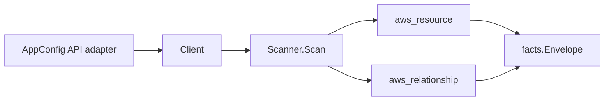

# AWS AppConfig Scanner

## Purpose

`internal/collector/awscloud/services/appconfig` owns the AWS AppConfig scanner
contract for the AWS cloud collector. It converts AppConfig application,
environment, configuration profile, and deployment strategy metadata into
`aws_resource` facts and emits relationship evidence for
environment-in-application and profile-in-application membership, the
environment CloudWatch alarm deployment monitors, and the IAM role AppConfig
assumes to read a monitored alarm.

## Ownership boundary

This package owns scanner-level AppConfig fact selection and identity mapping.
It does not own AWS SDK pagination, STS credentials, workflow claims, fact
persistence, graph writes, reducer admission, or query behavior.

## Exported surface

See `doc.go` for the godoc contract.

- `Client` - minimal AppConfig metadata read surface consumed by `Scanner`.
- `Scanner` - emits application, environment, configuration profile, and
  deployment strategy resources plus their relationships for one boundary.
- `Snapshot`, `Application`, `Environment`, `Monitor`, `ConfigurationProfile`,
  `DeploymentStrategy` - scanner-owned views with configuration content,
  hosted configuration version bodies, and freeform/feature-flag values
  intentionally absent.

## Dependencies

- `internal/collector/awscloud` for boundaries, resource constants,
  relationship constants, partition helpers, and envelope builders.
- `internal/facts` for emitted fact envelope kinds.

The package depends on a small `Client` interface rather than the AWS SDK for
Go v2 so tests can use fake clients and the runtime adapter can own SDK
behavior.

## Telemetry

This scanner emits no spans or logs directly. `awsruntime.ClaimedSource`
records scan duration and emitted resource counts after `Scanner.Scan` returns.
The `awssdk` adapter records AppConfig API call counts, throttles, and
pagination spans.

## Gotchas / invariants

- AppConfig facts are metadata only. The scanner must never read configuration
  content, hosted configuration version bodies, or freeform/feature-flag
  values, and must never start a deployment or call any mutation API.
- AppConfig list responses carry no ARN, so the scanner synthesizes the
  partition-aware application, environment, configuration profile, and
  deployment strategy ARNs (`arn:<partition>:appconfig:<region>:<account>:...`)
  via `awscloud.PartitionForBoundary` and never hardcodes `arn:aws:` - GovCloud
  and China must resolve to the real node. Each node publishes its synthesized
  ARN as its resource_id, and the environment/profile edges are sourced on that
  same ARN.
- The environment-in-application and profile-in-application edges are keyed by
  the application ARN the application node publishes so they join the
  application node instead of dangling.
- The environment-to-CloudWatch-alarm edge is emitted only when AppConfig
  reports an alarm ARN. AppConfig reports the CloudWatch alarm ARN, which
  matches the CloudWatch scanner's published alarm resource_id, so the edge
  resolves.
- The environment-to-IAM-role edge (the monitor alarm role) is emitted only
  when AppConfig reports an ARN-shaped role identifier, matching the IAM
  scanner's published role resource_id.
- Emit reported evidence only. Do not infer deployment, workload, repository
  ownership, environment, or deployable-unit truth from application,
  environment, profile, or strategy names, or AWS tags.

## Evidence

Collector Performance Evidence:
`go test ./internal/collector/awscloud/services/appconfig/...` covers the
bounded AppConfig metadata path: one paginated ListApplications stream, one
paginated ListEnvironments and one paginated ListConfigurationProfiles stream
per application, and one paginated ListDeploymentStrategies stream, with no
configuration-content reads, no GetHostedConfigurationVersion, no
GetConfiguration/GetLatestConfiguration (the appconfigdata module is never
imported), no deployment starts, no mutations, and no graph writes in the
collector.

No-Regression Evidence: metadata-only control-plane scanner; new read path, no change to existing hot paths. `go test ./internal/collector/awscloud/services/appconfig/...` green.

Collector Observability Evidence: AppConfig uses the existing AWS collector
`aws.service.pagination.page` span plus `eshu_dp_aws_api_calls_total`,
`eshu_dp_aws_throttle_total`, `eshu_dp_aws_resources_emitted_total`,
`eshu_dp_aws_relationships_emitted_total`, and `aws_scan_status` rows. Metric
labels stay bounded to service, account, region, operation, result, and status.

No-Observability-Change: reuses shared AWS pagination span + API-call/throttle counters; no telemetry contract change.

Collector Deployment Evidence: AppConfig runs inside the existing hosted
`collector-aws-cloud` runtime, so `/healthz`, `/readyz`, `/metrics`, and
`/admin/status` stay covered by the command wiring and Helm collector runtime.

## Related docs

- `docs/public/services/collector-aws-cloud.md`
- `docs/public/services/collector-aws-cloud-scanners.md`
- `docs/public/services/collector-aws-cloud-security.md`
