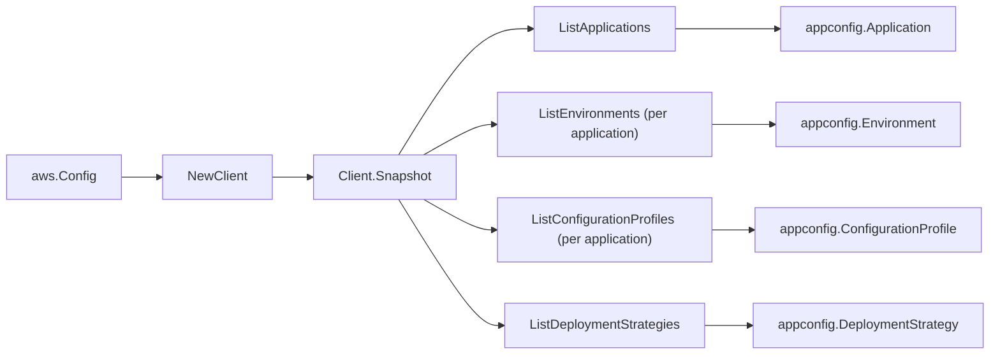

# AWS AppConfig SDK Adapter

## Purpose

`internal/collector/awscloud/services/appconfig/awssdk` adapts AWS SDK for Go
v2 AppConfig responses to the scanner-owned `Client` contract. It owns
application pagination, per-application environment and configuration-profile
pagination, account-level deployment-strategy pagination, throttle
classification, and per-call AWS API telemetry.

## Ownership boundary

This package owns SDK calls for AppConfig. It does not own workflow claims,
credential acquisition, AppConfig fact selection, graph writes, reducer
admission, or query behavior.

## Exported surface

See `doc.go` for the godoc contract.

- `Client` - AWS SDK-backed implementation of `appconfig.Client`.
- `NewClient` - builds a `Client` for one claimed AWS boundary.

## Dependencies

- `internal/collector/awscloud` for account, region, and service boundary
  labels.
- `internal/collector/awscloud/services/appconfig` for scanner-owned result
  types.
- `internal/telemetry` for AWS API call and throttle instruments.
- AWS SDK for Go v2 `appconfig` and Smithy error contracts.

## Telemetry

AppConfig paginator pages are wrapped with:

- `aws.service.pagination.page`
- `eshu_dp_aws_api_calls_total`
- `eshu_dp_aws_throttle_total`

Metric labels stay bounded to service, account, region, operation, and result.
AppConfig ARNs, names, and raw AWS error payloads stay out of metric labels.

## Gotchas / invariants

- The adapter reads metadata only. It must never call `GetConfiguration` or
  `GetLatestConfiguration` (the appconfigdata data-plane module is never
  imported), `GetHostedConfigurationVersion`, `StartDeployment`,
  `StopDeployment`, or any `Create*`/`Update*`/`Delete*` mutation API.
- The `apiClient` interface is `List*`-only by construction. `exclusion_test.go`
  reflects over it and fails the build if any method is not a `List` read or
  matches a content/mutation name; do not loosen it.
- AppConfig list responses carry no ARN; the adapter returns ids only and the
  scanner synthesizes the partition-aware ARNs.
- A deployment-strategy `GrowthFactor` is an optional float pointer; the adapter
  reads it through `aws.ToFloat32` so an unset value maps to zero, not a panic.
- SDK adapters translate AWS records into scanner-owned types; scanner tests
  should not mock AWS SDK pagination.

## Related docs

- `docs/public/services/collector-aws-cloud-scanners.md`
- `docs/public/services/collector-aws-cloud-security.md`
