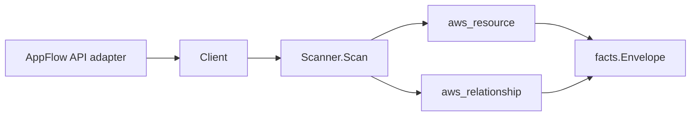

# Amazon AppFlow Scanner

## Purpose

`internal/collector/awscloud/services/appflow` owns the Amazon AppFlow scanner
contract for the AWS cloud collector. It converts flow metadata and connector
profile metadata into `aws_resource` facts and emits relationship evidence for
flow-to-S3-source-bucket, flow-to-S3-destination-bucket, flow-to-connector-profile,
flow-to-KMS-key, and connector-profile-to-Secrets-Manager-secret edges.

## Ownership boundary

This package owns scanner-level AppFlow fact selection and identity mapping. It
does not own AWS SDK pagination, STS credentials, workflow claims, fact
persistence, graph writes, reducer admission, or query behavior.

## Exported surface

See `doc.go` for the godoc contract.

- `Client` - minimal AppFlow metadata read surface consumed by `Scanner`.
- `Scanner` - emits flow and connector profile resources plus their
  relationships for one boundary.
- `Flow`, `ConnectorProfile` - scanner-owned views with field-mapping and
  credential-bearing fields intentionally omitted.

## Dependencies

- `internal/collector/awscloud` for boundaries, resource constants,
  relationship constants, partition helpers, and envelope builders.
- `internal/facts` for emitted fact envelope kinds.

The package depends on a small `Client` interface rather than the AWS SDK for
Go v2 so tests can use fake clients and runtime adapters can own SDK behavior.

## Telemetry

This scanner emits no spans or logs directly. `awsruntime.ClaimedSource` records
scan duration and emitted resource counts after `Scanner.Scan` returns. The
`awssdk` adapter records AppFlow API call counts, throttles, and pagination
spans.

## Gotchas / invariants

- AppFlow facts are metadata only. The scanner must never start, stop, or run
  flows, never read flow run records (`DescribeFlowExecutionRecords`), and never
  read field mappings (the flow's task transforms, which can encode literal
  transferred data values), connector credentials, or OAuth tokens.
- The only credential reference recorded is the connector profile's Secrets
  Manager credentials ARN. The credential values themselves are never read; the
  ARN exists only to drive the connector-profile-to-secret edge.
- The flow node is keyed by its ARN (falling back to its name when AWS omits the
  ARN). Every flow outgoing edge is sourced on that same identity so the edge
  attaches to the flow node instead of dangling.
- The connector profile node is keyed by its name, because flows reference
  connector profiles by name. The flow-to-connector-profile edge targets that
  name, so the two join.
- Flow-to-S3 relationships are emitted only when the source or destination
  connector is Amazon S3 and AWS reports the bucket name. The synthesized bucket
  ARN derives its partition from the flow ARN (or the boundary region when the
  flow ARN is absent), matching the `arn:<partition>:s3:::<bucket>` identity the
  S3 scanner publishes, so GovCloud and China joins resolve instead of dangling.
- Flow-to-KMS-key relationships are emitted only when AWS reports a customer
  KMS key ARN. The AppFlow-managed key produces no edge.
- Connector-profile-to-secret relationships are emitted only when the reported
  credentials ARN parses as a Secrets Manager ARN by exact service-segment
  match, never by substring containment, so an unrelated ARN never produces a
  dangling edge.
- Emit reported evidence only. Do not infer deployment, workload, repository
  ownership, environment, or deployable-unit truth from flow or connector
  profile names or AWS tags.

## Evidence

Collector Performance Evidence:
`go test ./internal/collector/awscloud/services/appflow/...` covers the bounded
AppFlow metadata path: one paginated ListFlows stream, one DescribeFlow point
read per flow (Tasks/field-mappings and run records never read), one paginated
DescribeConnectorProfiles stream, no StartFlow or StopFlow calls, no mutations,
and no graph writes in the collector.

No-Regression Evidence:
`go test ./cmd/collector-aws-cloud ./internal/collector/awscloud/...` covers
AppFlow flow and connector profile metadata fact emission, flow-to-S3-source,
flow-to-S3-destination, flow-to-connector-profile, flow-to-KMS-key, and
connector-profile-to-secret relationship emission, the no-field-mappings and
no-credentials assertions, the metadata-only Client exclusion reflection guard,
the GovCloud/China partition derivation for the synthesized S3 bucket ARN, the
exact Secrets Manager ARN service-segment match, runtime registration, and the
SDK adapter's safe metadata mapping.

Collector Observability Evidence: AppFlow uses the existing AWS collector
`aws.service.pagination.page` span plus `eshu_dp_aws_api_calls_total`,
`eshu_dp_aws_throttle_total`, `eshu_dp_aws_resources_emitted_total`,
`eshu_dp_aws_relationships_emitted_total`, and `aws_scan_status` rows. Metric
labels stay bounded to service, account, region, operation, result, and status.

No-Observability-Change: the new scanner reuses the existing AWS collector
telemetry contract (`aws.service.scan`, `aws.service.pagination.page`,
API/throttle counters, resource/relationship counters, and `aws_scan_status`);
it adds no new instrument, span, metric label, or status row.

Collector Deployment Evidence: AppFlow runs inside the existing hosted
`collector-aws-cloud` runtime, so `/healthz`, `/readyz`, `/metrics`, and
`/admin/status` stay covered by the command wiring and Helm collector runtime.

## Related docs

- `docs/public/services/collector-aws-cloud.md`
- `docs/public/services/collector-aws-cloud-scanners.md`
- `docs/public/services/collector-aws-cloud-security.md`
