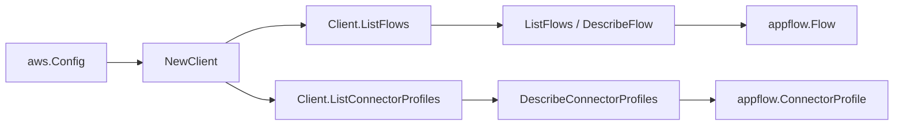

# Amazon AppFlow SDK Adapter

## Purpose

`internal/collector/awscloud/services/appflow/awssdk` adapts AWS SDK for Go v2
AppFlow responses to the scanner-owned `Client` contract. It owns flow
pagination, per-flow describe point reads, connector profile pagination,
throttle classification, and per-call AWS API telemetry.

## Ownership boundary

This package owns SDK calls for AppFlow. It does not own workflow claims,
credential acquisition, AppFlow fact selection, graph writes, reducer
admission, or query behavior.

## Exported surface

See `doc.go` for the godoc contract.

- `Client` - AWS SDK-backed implementation of `appflow.Client`.
- `NewClient` - builds a `Client` for one claimed AWS boundary.

## Dependencies

- `internal/collector/awscloud` for account, region, and service boundary
  labels.
- `internal/collector/awscloud/services/appflow` for scanner-owned result
  types.
- `internal/telemetry` for AWS API call and throttle instruments.
- AWS SDK for Go v2 `appflow` and Smithy error contracts.

## Telemetry

AppFlow paginator pages and point reads are wrapped with:

- `aws.service.pagination.page`
- `eshu_dp_aws_api_calls_total`
- `eshu_dp_aws_throttle_total`

Metric labels stay bounded to service, account, region, operation, and result.
AppFlow resource ARNs, names, and raw AWS error payloads stay out of metric
labels.

## Gotchas / invariants

- The accepted SDK surface (`apiClient`) is exactly `ListFlows`, `DescribeFlow`,
  and `DescribeConnectorProfiles`. It excludes `StartFlow`, `StopFlow`,
  `DescribeFlowExecutionRecords`, and every Create/Update/Delete operation by
  construction, proving the metadata-only and no-data-pull contract at the type
  level.
- `DescribeFlow` Tasks (field mappings, which can encode literal transferred
  data values) are never read. The adapter copies only the connector types,
  connector profile names, S3 bucket references, customer KMS key ARN, trigger
  type, and timestamps.
- `DescribeConnectorProfiles` returns the Secrets Manager credentials ARN but
  never the credential values; the adapter forwards only that ARN.
- SDK adapters translate AWS records into scanner-owned types; scanner tests
  should not mock AWS SDK pagination.

## Related docs

- `docs/public/services/collector-aws-cloud-scanners.md`
- `docs/public/services/collector-aws-cloud-security.md`
