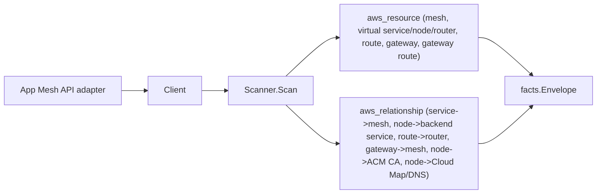

# AWS App Mesh Scanner

## Purpose

`internal/collector/awscloud/services/appmesh` owns the App Mesh scanner
contract for the AWS cloud collector. It converts mesh, virtual service,
virtual node, virtual router, route, virtual gateway, and gateway route metadata
into `aws_resource` facts and emits `aws_relationship` facts for the edges App
Mesh reports directly.

## Ownership boundary

This package owns scanner-level App Mesh fact selection and identity mapping. It
does not own AWS SDK pagination, STS credentials, workflow claims, fact
persistence, graph writes, reducer admission, or query behavior.

## Exported surface

See `doc.go` for the godoc contract.

- `Client` - metadata-only App Mesh read surface consumed by `Scanner`. One
  method, `ListMeshInventory`, returns the full resolved inventory.
- `Scanner` - emits App Mesh metadata facts for one boundary; requires a
  redaction key.
- `Mesh`, `VirtualService`, `VirtualNode`, `VirtualRouter`, `Route`,
  `VirtualGateway`, `GatewayRoute` - scanner-owned App Mesh records.
- `Listener`, `HeaderMatch` - supporting metadata records. There is no client
  TLS certificate body field; `VirtualNode.ClientTLSCertificateAuthorityARNs`
  carries ACM Private CA (acm-pca) certificate authority ARN references only.

## Dependencies

- `internal/collector/awscloud` for boundaries, resource constants,
  relationship constants, envelope builders, and the shared `RedactString` and
  `ClassifyStackOutput` redaction helpers.
- `internal/facts` for emitted fact envelope kinds.
- `internal/redact` for the redaction key the scanner requires.

The package depends on a small `Client` interface rather than the AWS SDK for
Go v2 so tests can use fake clients and runtime adapters can own SDK behavior.

## Telemetry

This scanner emits no spans or logs directly. `awsruntime.ClaimedSource`
records scan duration and emitted resource counts after `Scanner.Scan` returns
(`eshu_dp_aws_resources_emitted_total{service="appmesh"}`). The `awssdk` adapter
records App Mesh API call counts, throttles, and pagination spans.

## Gotchas / invariants

- App Mesh facts are metadata only. The scanner must never read or persist a
  client TLS validation certificate body. Client TLS validation is reduced to
  ACM Private CA certificate authority ARN references, which are safe metadata
  and the join key for the trust relationship.
- Sensitive HTTP header match values (Authorization, Cookie, X-Api-Key shaped,
  or values whose header name matches the shared sensitive-key policy) are
  redacted through the shared redact library. The header NAME and match type
  are always preserved. `Scanner.Scan` fails closed when the redaction key is
  zero.
- Relationships always set a non-empty `target_type`. App Mesh-internal edges
  key on App Mesh ARNs so the graph join lands on the matching App Mesh
  resource. The virtual-node client TLS trust edge keys on the ACM Private CA
  (acm-pca) certificate authority ARN App Mesh reports and targets
  `aws_acmpca_certificate_authority`, not the public ACM scanner's
  `aws_acm_certificate`. The `acm-pca` scanner publishes certificate authority
  resources keyed by that same CA ARN, so the edge resolves.
- Backend virtual service ARNs are synthesized from the virtual node's own ARN
  so the partition (`aws`, `aws-us-gov`, `aws-cn`) is never hardcoded.
- Tags are raw AWS tag evidence. Do not infer environment, owner, workload, or
  deployable-unit truth from tags in this package.

## Evidence

Collector Performance Evidence:
`go test ./internal/collector/awscloud/services/appmesh/... -count=1 -race`
covers the bounded App Mesh metadata path: one paginated `ListMeshes`, then per
mesh one paginated list and one Describe per virtual service, virtual node,
virtual router, virtual gateway, route, and gateway route; one tag read per
resource; no certificate-body reads; no mutations. Cardinality is bounded by
the resource counts App Mesh returns for the claimed account and region.

No-Regression Evidence:
`go test ./cmd/collector-aws-cloud/... ./internal/collector/awscloud/awsruntime/... -count=1`
covers App Mesh resource and relationship emission, ACM Private CA certificate
authority join keys, Cloud Map and DNS service-discovery edges, sensitive header value
redaction, certificate-body exclusion, runtime registration through the derived
service guard, and command configuration requiring a redaction key.

Collector Observability Evidence: App Mesh uses the existing AWS collector
`aws.service.pagination.page` span plus `eshu_dp_aws_api_calls_total`,
`eshu_dp_aws_throttle_total`, `eshu_dp_aws_resources_emitted_total`,
`eshu_dp_aws_relationships_emitted_total`, and `aws_scan_status` rows. Metric
labels stay bounded to service, account, region, operation, result, and status.

No-Observability-Change: App Mesh adds no new telemetry contract. The existing
AWS collector signals already diagnose App Mesh scans through the
`aws.service.scan` and `aws.service.pagination.page` spans,
`eshu_dp_aws_api_calls_total`, `eshu_dp_aws_throttle_total`,
`eshu_dp_aws_resources_emitted_total{service="appmesh"}`,
`eshu_dp_aws_relationships_emitted_total{service="appmesh"}`, and
`aws_scan_status` rows. App Mesh only adds the bounded `service="appmesh"` label
value to those existing instruments.

Collector Deployment Evidence: App Mesh runs inside the existing hosted
`collector-aws-cloud` runtime, so `/healthz`, `/readyz`, `/metrics`, and
`/admin/status` stay covered by the command wiring and Helm collector runtime.

## Related docs

- `docs/public/services/collector-aws-cloud.md`
- `docs/public/guides/collector-authoring.md`
