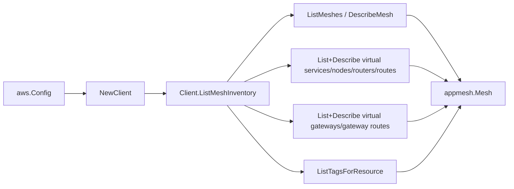

# AWS App Mesh SDK Adapter

## Purpose

`internal/collector/awscloud/services/appmesh/awssdk` adapts AWS SDK for Go v2
App Mesh responses to the scanner-owned `appmesh.Client` contract. It owns App
Mesh list pagination, per-resource Describe fan-out, resource tag reads,
throttle classification, and per-call AWS API telemetry.

## Ownership boundary

This package owns SDK calls for App Mesh. It does not own workflow claims,
credential acquisition, App Mesh fact selection, redaction policy, graph writes,
reducer admission, or query behavior.

## Exported surface

See `doc.go` for the godoc contract.

- `Client` - AWS SDK-backed implementation of `appmesh.Client`.
- `NewClient` - builds a `Client` for one claimed AWS boundary.

## Dependencies

- `internal/collector/awscloud` for account, region, and service boundary
  labels.
- `internal/collector/awscloud/services/appmesh` for scanner-owned result types.
- `internal/telemetry` for AWS API call and throttle instruments.
- AWS SDK for Go v2 `appmesh` and Smithy error contracts.

## Telemetry

App Mesh paginator pages and point reads are wrapped with:

- `aws.service.pagination.page`
- `eshu_dp_aws_api_calls_total`
- `eshu_dp_aws_throttle_total`

Metric labels stay bounded to service, account, region, operation, and result.
Resource ARNs, names, tags, and header values stay out of metric labels.

## Gotchas / invariants

- The adapter calls only List, Describe, and `ListTagsForResource` operations.
- The internal `apiClient` interface deliberately excludes every App Mesh
  Create/Update/Delete mutation API. A reflection-based test asserts the
  exclusion and FAILS if any mutation method ever appears.
- Client TLS validation is reduced to ACM Private CA certificate authority ARN
  references in `mappers.go`. The adapter never reads file or SDS trust
  certificate chains or secret names, and never returns a literal certificate
  body.
- HTTP header match values are returned verbatim. Redaction is the scanner's
  responsibility because it holds the redaction key; the adapter must not drop
  the value or the scanner cannot make the redaction decision.
- Parent ARNs for routes and gateway routes are derived from the child ARN App
  Mesh reports, not synthesized, so partition/region/account stay consistent.
- SDK adapters translate AWS records into scanner-owned types; scanner tests
  should not mock AWS SDK paginators.

## Related docs

- `docs/public/services/collector-aws-cloud.md`
- `docs/public/services/collector-aws-cloud-scanners.md`
- `docs/public/guides/collector-authoring.md`
