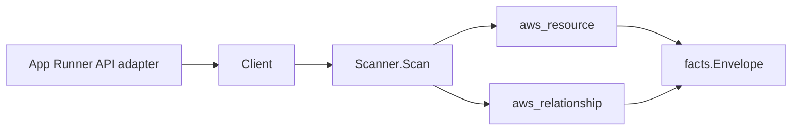

# AWS App Runner Scanner

## Purpose

`internal/collector/awscloud/services/apprunner` owns the AWS App Runner scanner
contract for the AWS cloud collector. It converts services, connections,
automatic scaling configurations, observability configurations, VPC connectors,
and VPC ingress connections into `aws_resource` facts and emits relationship
evidence for service-to-image, service-to-connection, service-to-IAM-role
(instance and ECR access role), service-to-KMS-key, service-to-VPC-connector,
service-to-autoscaling-configuration, service-to-observability-configuration,
service-to-secret-reference, vpc-connector-to-subnet/security-group, and
vpc-ingress-connection-to-service dependencies.

The App Runner service `resource_id` is the service ARN. This is the
dangling-edge join key: the ACM (`acm_certificate_used_by_resource`) and WAFv2
scanners emit edges that target `aws_apprunner_service` by the service ARN, so
keeping the service `resource_id` equal to the service ARN lets those edges
resolve to this resource.

## Ownership boundary

This package owns scanner-level App Runner fact selection and identity mapping.
It does not own AWS SDK pagination, STS credentials, workflow claims, fact
persistence, graph writes, reducer admission, or query behavior.

## Exported surface

See `doc.go` for the godoc contract.

- `Client` - metadata-only App Runner read surface consumed by `Scanner`. It
  exposes no CreateService, DeleteService, UpdateService, PauseService,
  ResumeService, StartDeployment, DeleteConnection, Associate/Disassociate, or
  any Create/Update/Delete operation.
- `Scanner` - emits service, connection, autoscaling-configuration,
  observability-configuration, VPC-connector, VPC-ingress-connection, and
  relationship facts for one boundary.
- `Service`, `HealthCheck`, `SecretReference`, `Connection`,
  `AutoScalingConfiguration`, `ObservabilityConfiguration`, `VpcConnector`, and
  `VpcIngressConnection` - scanner-owned metadata representations. Source
  repository credentials and runtime environment-variable values are absent by
  design.

## Dependencies

- `internal/collector/awscloud` for boundaries, resource constants,
  relationship constants, and envelope builders.
- `internal/facts` for emitted fact envelope kinds.

The package depends on a small `Client` interface rather than the AWS SDK for
Go v2 so tests can use fake clients and runtime adapters can own SDK behavior.

## Telemetry

This scanner emits no spans or logs directly. `awsruntime.ClaimedSource`
records scan duration and emitted resource/relationship counts after
`Scanner.Scan` returns. Resource counts surface through
`eshu_dp_aws_resources_emitted_total{service="apprunner"}` with the existing
per-resource `resource_type` label. The `awssdk` adapter records App Runner API
call counts, throttles, and pagination spans.

## Gotchas / invariants

- The App Runner service `resource_id` is the service ARN so the ACM and WAFv2
  scanner edges that target `aws_apprunner_service` by service ARN resolve. Do
  not change the service `resource_id` form.
- Runtime environment-variable values are never read or persisted. The
  scanner-owned `Service` type carries `EnvironmentVariableNames` (names only)
  and never a value field, so a value leak does not compile. Secret references
  are preserved as Secrets Manager / SSM ARN reference edges
  (`apprunner_service_references_secret`); the resolved value is never read.
- Source repository credentials (connection tokens, repository access secrets)
  are never read. Only the connection ARN and access role ARN are recorded.
- App Runner needs no redaction key. Because environment-variable values are
  dropped rather than HMAC-mapped, the runtimebind registration leaves
  `RequiresRedactionKey` unset.
- Every relationship sets a non-empty `target_type` matching the target
  scanner's `resource_id` form: container images target `container_image`,
  connections target `aws_apprunner_connection` (connection ARN), IAM roles
  target `aws_iam_role` (role ARN), KMS keys target `aws_kms_key`, VPC
  connectors target `aws_apprunner_vpc_connector` (connector ARN), autoscaling
  and observability configurations target their respective App Runner config
  resource types (config ARN), subnets target `aws_ec2_subnet` (bare subnet
  ID), security groups target `aws_ec2_security_group` (bare SG ID), and secret
  references target `aws_secretsmanager_secret` or `aws_ssm_parameter` by ARN
  service segment.
- The scanner stops on client errors and wraps them with `%w`. Runtime adapters
  decide whether an AWS service error is retryable, terminal, or a warning fact.

## Evidence

Collector Performance Evidence: `go test ./internal/collector/awscloud/services/apprunner/...`
covers the bounded App Runner metadata path: one paginated ListServices stream
with a DescribeService and ListTagsForResource enrichment per service, one
paginated ListConnections stream, one paginated ListAutoScalingConfigurations
stream with a DescribeAutoScalingConfiguration enrichment per revision, one
paginated ListObservabilityConfigurations stream with a
DescribeObservabilityConfiguration enrichment per revision, one paginated
ListVpcConnectors stream, and one paginated ListVpcIngressConnections stream
with a DescribeVpcIngressConnection enrichment per connection. No mutation or
lifecycle API is reachable, and the collector performs no graph writes.

Benchmark Evidence: not applicable. This collector slice adds no hot-path
Cypher, graph write, reducer, queue, or runtime-stage change; it emits reported
facts the existing reducer admits. The read path is bounded paginated
List/Describe calls per claimed account and region.

No-Regression Evidence: `go test ./cmd/collector-aws-cloud ./internal/collector/awscloud/...`
covers service, connection, autoscaling, observability, VPC-connector, and
VPC-ingress fact emission, every relationship's non-empty target type and join
key, the service-ARN dangling-edge join key, structural exclusion of
environment-variable values and source credentials, runtime registration, and
command configuration. The SDK adapter reflection contract test proves the
mutation and lifecycle APIs are unreachable.

Collector Observability Evidence: App Runner uses the existing AWS collector
`aws.service.pagination.page` span plus `eshu_dp_aws_api_calls_total`,
`eshu_dp_aws_throttle_total`,
`eshu_dp_aws_resources_emitted_total{service="apprunner"}`,
`eshu_dp_aws_relationships_emitted_total`, and `aws_scan_status` rows. Metric
labels stay bounded to service, account, region, operation, result, and
resource type.

No-Observability-Change: the existing AWS collector telemetry contract already
diagnoses App Runner scans through `aws.service.scan`,
`aws.service.pagination.page`, API/throttle counters, resource/relationship
counters, and `aws_scan_status`. No new instrument or label was added.

Collector Deployment Evidence: App Runner runs inside the existing hosted
`collector-aws-cloud` runtime, so `/healthz`, `/readyz`, `/metrics`, and
`/admin/status` stay covered by the command wiring and Helm collector runtime.

## Related docs

- `docs/public/services/collector-aws-cloud.md`
- `docs/public/services/collector-aws-cloud-scanners.md`
- `docs/public/guides/collector-authoring.md`
