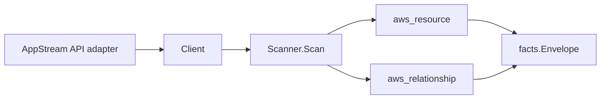

# Amazon AppStream 2.0 Scanner

## Purpose

`internal/collector/awscloud/services/appstream` owns the Amazon AppStream 2.0
scanner contract for the AWS cloud collector. It converts fleet, stack, image
builder, and image control-plane metadata into `aws_resource` facts and emits
relationship evidence for fleet and image-builder VPC, IAM, and image
dependencies, fleet-to-stack associations, and stack S3 bucket dependencies.

## Ownership boundary

This package owns scanner-level AppStream fact selection and identity mapping.
It does not own AWS SDK pagination, STS credentials, workflow claims, fact
persistence, graph writes, reducer admission, or query behavior.

## Exported surface

See `doc.go` for the godoc contract.

- `Client` - minimal AppStream metadata read surface consumed by `Scanner`.
- `Scanner` - emits fleet, stack, image builder, and image resources plus their
  relationships for one boundary.
- `Snapshot`, `Fleet`, `Stack`, `ImageBuilder`, `Image`, `FleetStackAssociation`
  - scanner-owned views with session, user, and session-script fields
  intentionally absent.

## Resources and relationships

- Fleets: identity, fleet type, instance type, state, platform, stream view,
  internet access, capacity limits, and the IAM role and image ARNs.
- Stacks: identity, display name, persistent application-settings enablement,
  and the S3 bucket names reported for application settings and storage
  connectors.
- Image builders: identity, instance type, state, platform, and base image ARN.
- Images: identity, state, visibility, image type, platform, and base image ARN
  only (PRIVATE and SHARED visibility; the AWS-managed PUBLIC catalog is not
  scanned).

Edges:

- `appstream_fleet_uses_subnet` / `appstream_image_builder_uses_subnet` -
  targets `aws_ec2_subnet` keyed by the bare subnet id (the EC2 scanner's id).
- `appstream_fleet_uses_security_group` /
  `appstream_image_builder_uses_security_group` - targets
  `aws_ec2_security_group` keyed by the bare security group id.
- `appstream_fleet_uses_iam_role` / `appstream_image_builder_uses_iam_role` -
  targets `aws_iam_role` keyed by the reported role ARN.
- `appstream_fleet_uses_image` / `appstream_image_builder_uses_image` - targets
  `aws_appstream_image` keyed by the reported image ARN (the image node id).
- `appstream_fleet_associated_with_stack` - targets `aws_appstream_stack` keyed
  by the stack node resource_id resolved from the stack name the association API
  reports.
- `appstream_stack_uses_s3_bucket` - targets `aws_s3_bucket` keyed by the
  synthesized partition-aware bucket ARN (`arn:<partition>:s3:::<bucket>`) for
  the application-settings bucket and HOMEFOLDERS storage-connector buckets.

## Dependencies

- `internal/collector/awscloud` for boundaries, resource constants,
  relationship constants, partition helpers, and envelope builders.
- `internal/facts` for emitted fact envelope kinds.

The package depends on a small `Client` interface rather than the AWS SDK for
Go v2 so tests can use fake clients and the runtime adapter can own SDK
behavior.

## Telemetry

This scanner emits no spans or logs directly. `awsruntime.ClaimedSource`
records scan duration and emitted resource counts after `Scanner.Scan` returns.
The `awssdk` adapter records AppStream API call counts, throttles, and
pagination spans.

## Gotchas / invariants

- AppStream facts are metadata only. The scanner must never read streaming
  sessions, user data, session scripts, or mint a streaming URL, and must never
  call any mutation API.
- Every node publishes its resource_id as its ARN (falling back to its name).
  Fleet, image-builder, and stack edges key on those same values so they join
  the node instead of dangling.
- The fleet-to-stack association API reports the stack by NAME; the scanner
  resolves it to the stack node resource_id (its ARN) before keying the edge.
- VPC subnet and security group edges key on the bare AWS ids the EC2 scanner
  publishes (`subnet-...`, `sg-...`), not ARNs.
- The IAM role and image edges key on the ARNs AppStream reports, matching the
  IAM scanner's role resource_id and this scanner's image node resource_id.
- The stack S3 edges synthesize the partition-aware bucket ARN via
  `awscloud.PartitionForBoundary` so the target matches the S3 scanner's
  published bucket node identity in GovCloud and China, not just commercial.
- Emit reported evidence only. Do not infer deployment, workload, repository
  ownership, environment, or deployable-unit truth from fleet, stack, image, or
  bucket names, or AWS tags.

## Evidence

Collector Performance Evidence:
`go test ./internal/collector/awscloud/services/appstream/...` covers the
bounded AppStream metadata path: one paginated DescribeFleets stream, one
paginated DescribeStacks stream, one paginated DescribeImageBuilders stream, two
paginated DescribeImages streams (PRIVATE and SHARED), one paginated
ListAssociatedStacks stream per fleet, and one ListTagsForResource point read
per resource, with no session reads, no user reads, no streaming-URL minting,
and no graph writes in the collector.

No-Regression Evidence: metadata-only control-plane scanner; new read path, no
change to existing hot paths. `go test ./internal/collector/awscloud/services/appstream/...` green.

No-Observability-Change: reuses shared AWS pagination span + API-call/throttle counters; no telemetry contract change.

Collector Deployment Evidence: AppStream runs inside the existing hosted
`collector-aws-cloud` runtime, so `/healthz`, `/readyz`, `/metrics`, and
`/admin/status` stay covered by the command wiring and Helm collector runtime.

## Related docs

- `docs/public/services/collector-aws-cloud.md`
- `docs/public/services/collector-aws-cloud-scanners.md`
- `docs/public/services/collector-aws-cloud-security.md`
