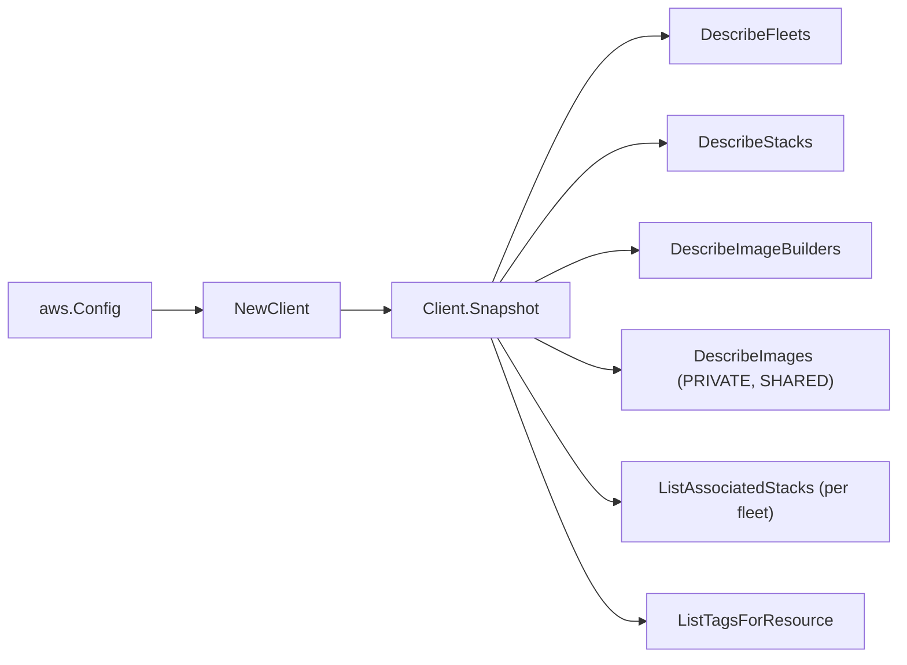

# Amazon AppStream 2.0 SDK Adapter

## Purpose

`internal/collector/awscloud/services/appstream/awssdk` adapts AWS SDK for Go
v2 AppStream 2.0 responses to the scanner-owned `Client` contract. It owns fleet,
stack, image builder, and image pagination, per-fleet fleet-to-stack association
reads, resource-tag reads, throttle classification, and per-call AWS API
telemetry.

## Ownership boundary

This package owns SDK calls for AppStream. It does not own workflow claims,
credential acquisition, AppStream fact selection, graph writes, reducer
admission, or query behavior.

## Exported surface

See `doc.go` for the godoc contract.

- `Client` - AWS SDK-backed implementation of `appstream.Client`.
- `NewClient` - builds a `Client` for one claimed AWS boundary.

## Dependencies

- `internal/collector/awscloud` for account, region, and service boundary
  labels.
- `internal/collector/awscloud/services/appstream` for scanner-owned result
  types.
- `internal/telemetry` for AWS API call and throttle instruments.
- AWS SDK for Go v2 `appstream` and Smithy error contracts.

## Telemetry

AppStream paginator pages and point reads are wrapped with:

- `aws.service.pagination.page`
- `eshu_dp_aws_api_calls_total`
- `eshu_dp_aws_throttle_total`

Metric labels stay bounded to service, account, region, operation, and result.
AppStream resource ARNs, names, tags, and raw AWS error payloads stay out of
metric labels.

## Gotchas / invariants

- The adapter reads metadata only. It must never call `CreateStreamingURL`
  (which mints a session credential), `DescribeSessions`, `DescribeUsers`,
  `DescribeUserStackAssociations`, or any `Create*`, `Update*`, `Delete*`,
  `Start*`, `Stop*`, `Associate*`, `Disassociate*` mutation API.
- `DescribeImages` is scoped to PRIVATE and SHARED visibility. The PUBLIC
  visibility space is the AWS-managed base-image catalog the account does not
  own; scanning it would emit catalog noise and never correspond to a customer
  resource.
- Fleet-to-stack associations are read once per fleet via `ListAssociatedStacks`.
  Every association is a (fleet, stack) pair, so the single direction captures
  the full set without the redundant reverse `ListAssociatedFleets` pass.
- Only the HOMEFOLDERS storage connector's `ResourceIdentifier` is an S3 bucket
  name; Google Drive and OneDrive connectors carry domain identifiers and are
  skipped.
- `ListTagsForResource` is a metadata read; AppStream tags carry no session or
  credential content.
- SDK adapters translate AWS records into scanner-owned types; scanner tests
  should not mock AWS SDK pagination.

## Related docs

- `docs/public/services/collector-aws-cloud-scanners.md`
- `docs/public/services/collector-aws-cloud-security.md`
