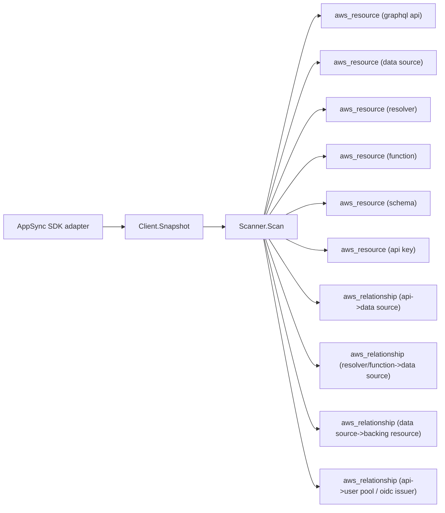

# AWS AppSync Scanner

## Purpose

`internal/collector/awscloud/services/appsync` owns the AppSync scanner
contract for the AWS cloud collector. It converts GraphQL APIs, data sources,
resolvers, pipeline functions, schema metadata, and API key metadata into
reported AWS facts and relationship evidence for one claimed account and
region.

## Ownership boundary

This package owns scanner-level AppSync fact selection, resource identity, and
relationship shaping. It does not own AWS SDK pagination, credential
acquisition, workflow claims, fact persistence, graph writes, reducer
admission, or query behavior. SDK translation lives in the sibling `awssdk`
package; registration lives in the sibling `runtimebind` package.

## Exported surface

See `doc.go` for the godoc contract.

- `Client` - minimal AppSync metadata read surface consumed by `Scanner`. It
  exposes a single `Snapshot` method; a package test asserts no method name
  matches a mapping-template evaluation, code evaluation, schema-body read, or
  mutation operation.
- `Scanner` - emits AppSync metadata and relationship facts for one boundary.
- `Snapshot` - the scanner-owned metadata view returned by the adapter.
- `GraphQLAPI`, `DataSource`, `Resolver`, `Function`, `SchemaMetadata`,
  `APIKey`, `LogConfig`, `UserPoolRef` - scanner-owned metadata types. None
  carries the schema SDL, mapping templates, function code, or API key value.

## Dependencies

- `internal/collector/awscloud` for boundaries, resource and relationship
  constants, and envelope builders.
- `internal/facts` for emitted fact envelope kinds.

The package depends on a small `Client` interface rather than the AWS SDK for
Go v2 so tests use fake clients and the runtime adapter owns SDK behavior.

## Telemetry

This scanner emits no spans or logs directly. `awsruntime.ClaimedSource`
records scan duration and emitted resource counts after `Scanner.Scan` returns.
The `awssdk` adapter records AppSync API call counts, throttles, and pagination
spans. The required resource signal is
`eshu_dp_aws_resources_emitted_total{service="appsync"}` with the existing
bounded AWS collector labels.

## Gotchas / invariants

- The scanner is metadata-only. It must never persist the schema SDL body
  (exposes the data model and PII field names), resolver request/response
  mapping templates (VTL or JS, often containing inline authorization
  conditions), pipeline function code bodies, or API key values. The
  scanner-owned types have no field for any of them; a struct-reflection test
  asserts no string-bearing field can carry one.
- Every relationship sets a non-empty `target_type`. The API-to-user-pool edge
  targets the bare Cognito user pool ID, matching the resource_id the Cognito
  scanner publishes for the user pool node; targeting the compound
  `cognito-idp.<region>.amazonaws.com/<poolId>` provider string would dangle.
- The DynamoDB data-source target ARN is synthesized from the data-source
  region and table name with a partition and account derived from a source ARN,
  never a hardcoded `arn:aws:`. When no source ARN is available the edge carries
  the bare table name as the join key rather than dangling.
- Data-source targets join to the publishing scanner's resource_id: Lambda by
  function ARN (`aws_lambda_function`), DynamoDB by table ARN or name
  (`aws_dynamodb_table`), RDS by cluster ARN (`aws_rds_db_cluster`). OpenSearch
  and HTTP targets carry the endpoint URL as join evidence under
  `aws_opensearch_domain` and `http_endpoint`.
- Resolvers are uniquely keyed by API ID, type name, and field name; data
  sources by API ID and name; functions by API ID and function ID.

## Evidence

Collector Performance Evidence: `go test ./internal/collector/awscloud/services/appsync/...`
covers the bounded AppSync metadata path: paginated ListGraphqlApis discovery,
per-API ListDataSources, ListTypes (names only) feeding ListResolvers per type,
ListFunctions, GetSchemaCreationStatus for schema status and type count, and
ListApiKeys, with no mapping-template, code, schema-body, or mutation calls.

No-Regression Evidence: `go test ./cmd/collector-aws-cloud ./internal/collector/awscloud/...`
covers AppSync resource and relationship fact emission, the partition-derived
DynamoDB target ARN, the Cognito user pool join key, omission of SDL, mapping
template, function code, and API key value payloads, runtime registration, and
command configuration.

Collector Observability Evidence: AppSync uses the existing AWS collector
`aws.service.pagination.page` span plus `eshu_dp_aws_api_calls_total`,
`eshu_dp_aws_throttle_total`, `eshu_dp_aws_resources_emitted_total`,
`eshu_dp_aws_relationships_emitted_total`, and `aws_scan_status` rows.

No-Observability-Change: the existing AWS collector telemetry contract already
diagnoses AppSync scans through the bounded shared instruments.

Collector Deployment Evidence: AppSync runs inside the existing hosted
`collector-aws-cloud` runtime, so `/healthz`, `/readyz`, `/metrics`, and
`/admin/status` stay covered by the command wiring and Helm collector runtime.

## Related docs

- `docs/public/services/collector-aws-cloud.md`
- `docs/public/services/collector-aws-cloud-scanners.md`
- `docs/public/guides/collector-authoring.md`
