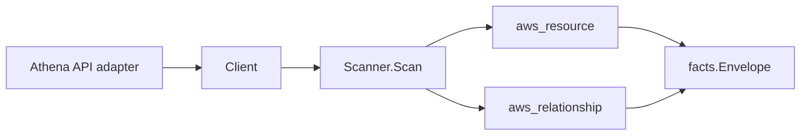

# AWS Athena Scanner

## Purpose

`internal/collector/awscloud/services/athena` owns the Athena scanner contract
for the AWS cloud collector. It converts workgroup, data catalog,
prepared-statement, and named-query metadata into `aws_resource` facts and
emits relationship evidence for workgroup result buckets, workgroup KMS keys,
prepared-statement workgroup membership, and named-query workgroup membership.

The scanner is metadata only. It never starts, stops, or mutates Athena
queries, never reads query result rows, query result location object contents,
or query history strings, and never persists named-query SQL bodies or
prepared-statement query statements. The scope supports the code-to-cloud
correlation story: downstream reducers can answer "this Terraform
`aws_athena_named_query` corresponds to this live query" or "this live named
query is not declared in any IaC" using the emitted name/database/workgroup
identity without ever materializing the SQL body.

## Ownership boundary

This package owns scanner-level Athena fact selection and identity mapping. It
does not own AWS SDK pagination, STS credentials, workflow claims, fact
persistence, graph writes, reducer admission, or query behavior.

## Exported surface

See `doc.go` for the godoc contract.

- `Client` - minimal Athena metadata read surface consumed by `Scanner`.
- `Scanner` - emits workgroup, data catalog, prepared-statement, named-query,
  and workgroup relationship facts for one boundary.
- `WorkGroup` - scanner-owned workgroup metadata.
- `DataCatalog` - scanner-owned data catalog metadata.
- `PreparedStatement` - scanner-owned prepared-statement name and last-modified
  time. The SQL body returned by `GetPreparedStatement` is intentionally
  omitted from the type.
- `NamedQuery` - scanner-owned named-query identity (id, name, database,
  workgroup, description). The SQL body returned by `BatchGetNamedQuery` is
  intentionally omitted from the type.

## Dependencies

- `internal/collector/awscloud` for boundaries, resource constants,
  relationship constants, and envelope builders.
- `internal/facts` for emitted fact envelope kinds.

The package depends on a small `Client` interface rather than the AWS SDK for
Go v2 so tests can use fake clients and runtime adapters can own SDK behavior.

## Telemetry

This scanner emits no spans or logs directly. `awsruntime.ClaimedSource`
records scan duration and emitted resource counts after `Scanner.Scan` returns
through `eshu_dp_aws_resources_emitted_total{service="athena"}` and
`eshu_dp_aws_relationships_emitted_total{service="athena"}`. The `awssdk`
adapter records Athena API call counts, throttles, and pagination spans.

## Gotchas / invariants

- Athena facts are metadata only. The scanner must not start, stop, or mutate
  queries, must not call `StartQueryExecution`, `StopQueryExecution`,
  `CreateNamedQuery`, `DeleteNamedQuery`, `UpdateNamedQuery`,
  `CreatePreparedStatement`, `UpdatePreparedStatement`,
  `DeletePreparedStatement`, or any other Athena mutation API.
- Named-query SQL bodies (`QueryString`) and prepared-statement query
  statements (`QueryStatement`) must never be persisted. The SDK adapter
  drops `QueryString` before returning a `NamedQuery` and never calls
  `GetPreparedStatement`.
- Query result rows, query execution result location object contents, query
  execution history, and per-query metadata stay outside the scanner contract.
- Workgroup result-bucket relationships are emitted only when the workgroup
  `OutputLocation` resolves to an `arn:aws:s3:::bucket` ARN. The bucket name
  alone is reported metadata; the relationship payload never includes a result
  object key or prefix.
- Workgroup KMS relationships are emitted whenever the workgroup reports a KMS
  key identifier; `target_arn` is populated only when the identifier is
  ARN-shaped.
- Named-query and prepared-statement relationships only flow when the AWS
  response reports a workgroup name, matching the rest of the AWS collector
  ARN-only edge invariant.
- Tags are raw AWS tag evidence. Do not infer environment, owner, workload, or
  deployable-unit truth from tags in this package.

## Evidence

Collector Performance Evidence: `go test ./internal/collector/awscloud/services/athena/...`
covers the bounded Athena metadata path: one paginated ListWorkGroups stream,
one GetWorkGroup + one ListTagsForResource per workgroup, one paginated
ListDataCatalogs stream, one GetDataCatalog + one ListTagsForResource per
catalog, one paginated ListPreparedStatements stream per workgroup, one
paginated ListNamedQueries stream per workgroup, one chunked BatchGetNamedQuery
per up-to-50 named-query IDs, no StartQueryExecution / StopQueryExecution /
GetQueryResults / GetQueryExecution / ListQueryExecutions / GetNamedQuery /
GetPreparedStatement calls, no mutation calls, and no graph writes in the
collector.

No-Regression Evidence: `go test ./cmd/collector-aws-cloud ./internal/collector/awscloud/...`
covers Athena workgroup, data catalog, prepared-statement, and named-query
metadata fact emission, workgroup-to-result-bucket relationship emission,
workgroup-to-KMS-key relationship emission with ARN/alias differentiation,
prepared-statement workgroup membership emission, named-query workgroup
membership emission, omission of all SQL body fields, runtime registration,
and command configuration.

Collector Observability Evidence: Athena uses the existing AWS collector
`aws.service.pagination.page` span plus `eshu_dp_aws_api_calls_total`,
`eshu_dp_aws_throttle_total`, `eshu_dp_aws_resources_emitted_total`,
`eshu_dp_aws_relationships_emitted_total`, and `aws_scan_status` rows. Metric
labels stay bounded to service, account, region, operation, result, and
status. `eshu_dp_aws_resources_emitted_total{service="athena"}` is populated
by `ClaimedSource.recordEmissionCounts` for every emitted workgroup, data
catalog, prepared-statement, and named-query fact.

No-Observability-Change: the existing AWS collector telemetry contract already
diagnoses Athena scans through `aws.service.scan`,
`aws.service.pagination.page`, API/throttle counters, resource/relationship
counters, and `aws_scan_status`.

Collector Deployment Evidence: Athena runs inside the existing hosted
`collector-aws-cloud` runtime, so `/healthz`, `/readyz`, `/metrics`, and
`/admin/status` stay covered by the command wiring and Helm collector runtime.

## Related docs

- `docs/public/services/collector-aws-cloud.md`
- `docs/public/services/collector-aws-cloud-scanners.md`
- `docs/public/guides/collector-authoring.md`
