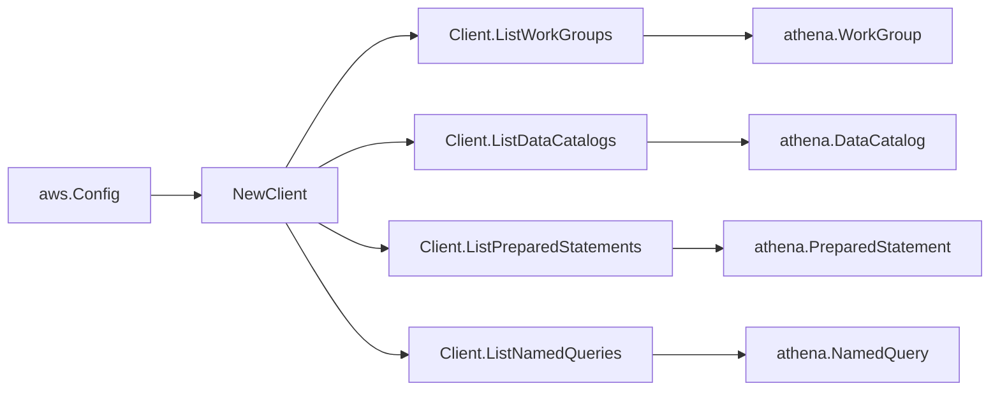

# AWS Athena SDK Adapter

## Purpose

`internal/collector/awscloud/services/athena/awssdk` adapts AWS SDK for Go v2
Athena responses to the scanner-owned `Client` contract. It owns workgroup
pagination, workgroup detail reads, data catalog pagination, data catalog
detail reads, prepared-statement pagination, named-query pagination,
named-query batched detail reads with `QueryString` removal, tag reads,
throttle classification, and per-call AWS API telemetry.

## Ownership boundary

This package owns SDK calls for Athena. It does not own workflow claims,
credential acquisition, Athena fact selection, graph writes, reducer admission,
or query behavior.

## Exported surface

See `doc.go` for the godoc contract.

- `Client` - AWS SDK-backed implementation of `athena.Client`.
- `NewClient` - builds a `Client` for one claimed AWS boundary.

## Dependencies

- `internal/collector/awscloud` for account, region, and service boundary
  labels.
- `internal/collector/awscloud/services/athena` for scanner-owned result
  types.
- `internal/telemetry` for AWS API call and throttle instruments.
- AWS SDK for Go v2 `athena` and Smithy error contracts.

## Telemetry

Athena paginator pages and point reads are wrapped with:

- `aws.service.pagination.page`
- `eshu_dp_aws_api_calls_total`
- `eshu_dp_aws_throttle_total`

Metric labels stay bounded to service, account, region, operation, and result.
Workgroup ARNs, data catalog ARNs, prepared-statement names, named-query IDs,
named-query names, database names, tags, engine version strings, and raw AWS
error payloads stay out of metric labels.

## Gotchas / invariants

- The adapter's `apiClient` interface intentionally omits StartQueryExecution,
  StopQueryExecution, GetQueryExecution, GetQueryResults, ListQueryExecutions,
  GetNamedQuery, CreateNamedQuery, DeleteNamedQuery, UpdateNamedQuery,
  CreatePreparedStatement, UpdatePreparedStatement, DeletePreparedStatement,
  and GetPreparedStatement so the adapter cannot accidentally read SQL bodies
  or query result rows.
- `ListNamedQueries` followed by `BatchGetNamedQuery` returns named-query
  identity fields. The mapper drops `QueryString` before returning to the
  scanner. The test
  `TestClientListNamedQueriesStripsSQLBodyBeforeReturningToScanner` enforces
  the invariant by inspecting every returned string field for SQL markers.
- `ListPreparedStatements` returns only the statement name and last-modified
  time. The adapter never calls `GetPreparedStatement`, so the
  `QueryStatement` body is never read into memory; the test
  `TestClientListPreparedStatementsReadsNamesAndNeverCallsGetPreparedStatement`
  asserts the zero call count.
- Workgroup configuration is read through `GetWorkGroup` for fields not in
  the summary (result location, encryption configuration, engine version,
  enforce-workgroup-configuration). Per-query result fields stay outside.
- `ListTagsForResource` reads workgroup and data catalog tags as raw evidence.
- SDK adapters translate AWS records into scanner-owned types; scanner tests
  should not mock the AWS SDK directly.

## Related docs

- `docs/public/services/collector-aws-cloud.md`
- `docs/public/services/collector-aws-cloud-scanners.md`
- `docs/public/guides/collector-authoring.md`
